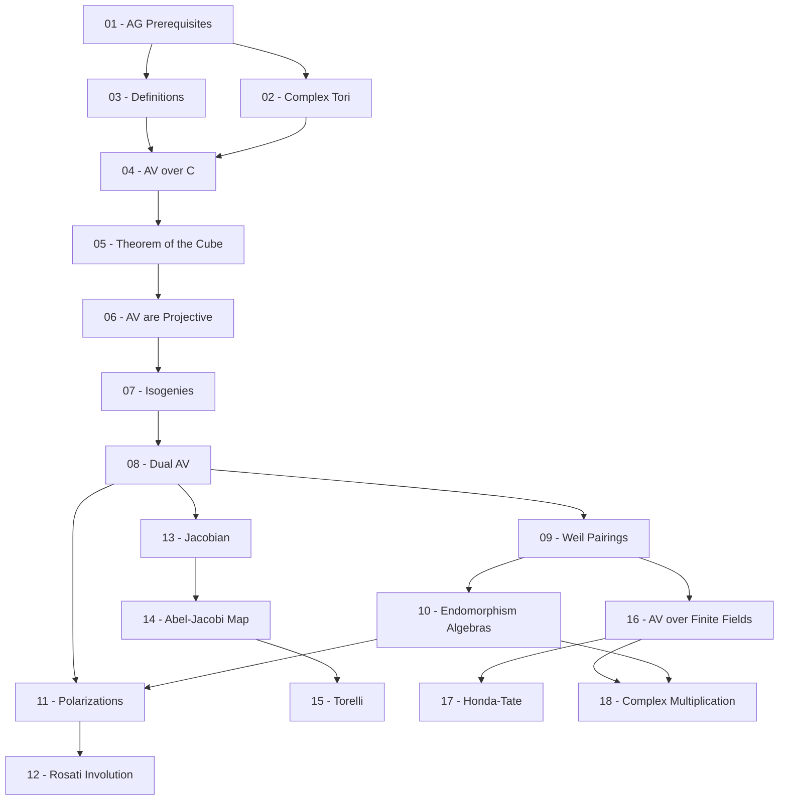

> **Level**: Graduate (Year 2–3)
> **Background**: Abstract Algebra (groups, rings, fields), Number Theory & Elliptic Curves
> **SageMath**: Có
> **Sources chính**:
> - Milne, J.S. — *Abelian Varieties* (v2.0, 2008), jmilne.org
> - Lange, H. — *Abelian Varieties over the Complex Numbers* (Springer, 2023)
> - Mumford, D. — *Abelian Varieties* (Tata Lectures on Mathematics, 1970)

---

## Module 0 — Prerequisites Bridge

| # | Title | Key Concepts | Prerequisites | Difficulty |
|---|-------|-------------|---------------|------------|
| 01 | Algebraic Geometry Prerequisites | Sheaves, line bundles, divisors, invertible sheaves, cohomology cơ bản | Abstract Algebra | ★★★☆☆ |
| 02 | Complex Tori và Lattices | Lattice $\Lambda \subset \mathbb{C}^g$, quotient $\mathbb{C}^g/\Lambda$, cấu trúc topo và nhóm, motivation từ elliptic curves | 01 | ★★☆☆☆ |

## Module I — Foundations

| # | Title | Key Concepts | Prerequisites | Difficulty |
|---|-------|-------------|---------------|------------|
| 03 | Definitions & Basic Properties | Group variety, abelian variety, Rigidity Theorem, commutativity bắt buộc | 01 | ★★★☆☆ |
| 04 | Abelian Varieties over ℂ | Riemann form, polarization, điều kiện để complex torus là abelian variety | 02, 03 | ★★★☆☆ |
| 05 | Theorem of the Cube & Square | Seesaw theorem, theorem of the cube, hệ quả về invertible sheaves trên AV | 03, 04 | ★★★★☆ |
| 06 | Abelian Varieties are Projective | Định lý Lefschetz, xây dựng ample line bundle, embedding vào projective space | 05 | ★★★★☆ |

## Module II — Core Structure

| # | Title | Key Concepts | Prerequisites | Difficulty |
|---|-------|-------------|---------------|------------|
| 07 | Isogenies | Homomorphisms giữa AV, degree, kernel, torsion points $A[n]$, isogeny category | 06 | ★★★☆☆ |
| 08 | The Dual Abelian Variety | $\operatorname{Pic}^0(A)$, construction of dual $A^\vee$, biduality $(A^\vee)^\vee \cong A$ | 07 | ★★★★☆ |
| 09 | Weil Pairings & Tate Modules | $e_n$-pairing, Tate module $T_\ell(A)$, $\ell$-adic Galois representation | 08 | ★★★★☆ |
| 10 | Endomorphism Algebras | $\operatorname{End}(A)$ và $\operatorname{End}^0(A) = \operatorname{End}(A) \otimes \mathbb{Q}$, Albert classification | 09 | ★★★★☆ |
| 11 | Polarizations & Invertible Sheaves | Polarized abelian variety, Riemann–Roch trên AV, cohomology của line bundles | 08, 10 | ★★★★☆ |
| 12 | The Rosati Involution | Involution $\dagger$ trên $\operatorname{End}^0(A)$ từ polarization, positive definiteness | 11 | ★★★☆☆ |

## Module III — Jacobian Varieties

| # | Title | Key Concepts | Prerequisites | Difficulty |
|---|-------|-------------|---------------|------------|
| 13 | Abel's Theorem & Construction of Jacobian | $\operatorname{Pic}^0(C)$, universal property của Jacobian, period lattice | 08 | ★★★★☆ |
| 14 | The Abel–Jacobi Map | Abel–Jacobi map $C \to J(C)$, injectivity, Jacobian như moduli của degree-0 divisors | 13 | ★★★★☆ |
| 15 | Torelli's Theorem | Phục hồi curve $C$ từ dữ liệu $(J(C), \Theta)$, uniqueness | 14 | ★★★★☆ |

## Module IV — Arithmetic

| # | Title | Key Concepts | Prerequisites | Difficulty |
|---|-------|-------------|---------------|------------|
| 16 | Abelian Varieties over Finite Fields | Frobenius endomorphism, Weil conjectures, zeta function của AV trên $\mathbb{F}_q$ | 09 | ★★★★☆ |
| 17 | Honda–Tate Theory | Weil $q$-numbers, phân loại AV trên $\mathbb{F}_q$ qua Honda–Tate theorem | 16 | ★★★★★ |
| 18 | Complex Multiplication | CM-type, reflex field, main theorem of CM, ứng dụng vào class field theory | 10, 16 | ★★★★★ |

---

## Appendix Candidates

| ID | Theorem | Related Lesson | Notes |
|----|---------|----------------|-------|
| A0 | Proof of the Theorem of the Cube | 05 | Chứng minh đầy đủ từ Seesaw Lemma |
| A1 | Proof of the Lefschetz Embedding Theorem | 06 | Xây dựng ample line bundle từ Riemann form |
| A2 | Construction of the Dual Abelian Variety | 08 | Chi tiết kỹ thuật Picard scheme |

---

## Dependency Graph

---

## Progress Tracker

- [ ] [[00-roadmap|00. Roadmap]]
- [ ] [[01-algebraic-geometry-prerequisites|01. Algebraic Geometry Prerequisites]]
- [ ] [[02-complex-tori-and-lattices|02. Complex Tori và Lattices]]
- [ ] [[03-definitions-and-basic-properties|03. Definitions & Basic Properties]]
- [ ] [[04-abelian-varieties-over-c|04. Abelian Varieties over ℂ]]
- [ ] [[05-theorem-of-the-cube|05. Theorem of the Cube & Square]]
- [ ] [[06-abelian-varieties-are-projective|06. Abelian Varieties are Projective]]
- [ ] [[07-isogenies|07. Isogenies]]
- [ ] [[08-dual-abelian-variety|08. The Dual Abelian Variety]]
- [ ] [[09-weil-pairings-and-tate-modules|09. Weil Pairings & Tate Modules]]
- [ ] [[10-endomorphism-algebras|10. Endomorphism Algebras]]
- [ ] [[11-polarizations-and-invertible-sheaves|11. Polarizations & Invertible Sheaves]]
- [ ] [[12-rosati-involution|12. The Rosati Involution]]
- [ ] [[13-jacobian-varieties|13. Abel's Theorem & Construction of Jacobian]]
- [ ] [[14-abel-jacobi-map|14. The Abel–Jacobi Map]]
- [ ] [[15-torelli-theorem|15. Torelli's Theorem]]
- [ ] [[16-abelian-varieties-over-finite-fields|16. Abelian Varieties over Finite Fields]]
- [ ] [[17-honda-tate-theory|17. Honda–Tate Theory]]
- [ ] [[18-complex-multiplication|18. Complex Multiplication]]
- [ ] [[a0-proof-of-theorem-of-the-cube|A0. Proof of the Theorem of the Cube]]
- [ ] [[a1-proof-of-lefschetz-embedding|A1. Proof of the Lefschetz Embedding Theorem]]
- [ ] [[a2-construction-of-dual-abelian-variety|A2. Construction of the Dual Abelian Variety]]
