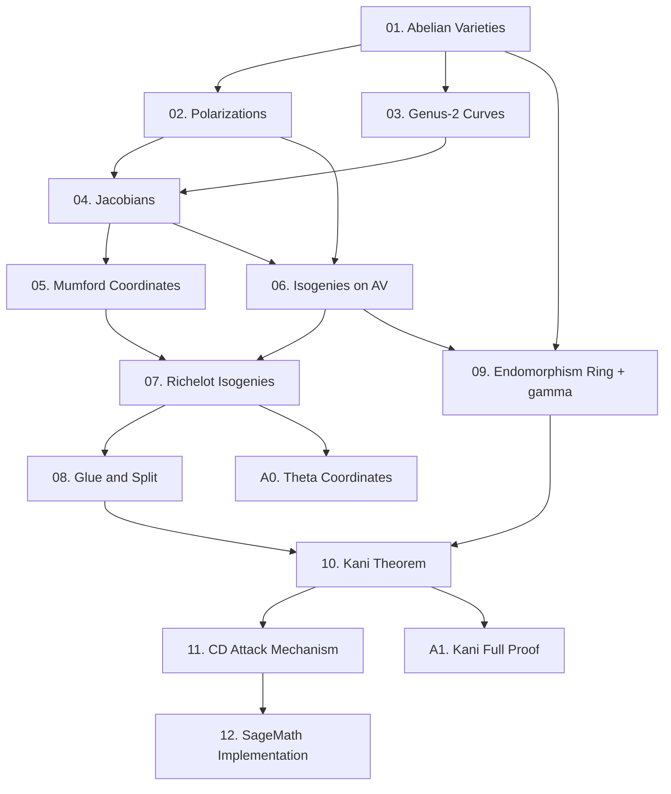

Series này xây dựng toàn bộ nền tảng toán học cho **Castryck-Decru Attack** (2022) — cuộc tấn công phá vỡ SIDH/SIKE hoàn toàn. Xuất phát điểm là người đã nắm vững elliptic curves, isogenies, SIDH protocol, và Weil pairing; series dẫn thẳng vào Abelian varieties, Jacobians của genus-2 curves, Richelot (2,2)-isogenies, Kani's theorem, và cuối cùng là toàn bộ cơ chế của attack + implementation trong SageMath.

**Kiến thức nền tảng yêu cầu**: Elliptic curves over finite fields (torsion subgroups, Frobenius, j-invariant), isogenies (Vélu formulas, dual isogeny, degree), SIDH protocol (setup, torsion point images, isogeny diamond), Weil pairing (Miller loop, bilinearity, compatibility with isogenies).

**Tài liệu tham khảo chính**:
- Castryck & Decru, *An efficient key recovery attack on SIDH*, IACR ePrint 2022/975
- Galbraith, *Kani for beginners* (blog post, ellipticnews.wordpress.com, 2022)
- Cosset & Robert, *Computing (ℓ,ℓ)-isogenies on Jacobians of genus-2 curves*, Math. Comp. 84 (2015)
- Oudompheng & Pope, *A note on reimplementing the Castryck-Decru attack*, IACR ePrint 2022/1283
- Milne, *Abelian Varieties* (lecture notes, jmilne.org)
- Cassels & Flynn, *Prolegomena to a Middlebrow Arithmetic of Curves of Genus 2* (Cambridge, 1996)

---

## Lesson Overview

| # | Title | Type | File | Dependencies |
|---|-------|------|------|-------------|
| 01 | Abelian Varieties — Foundations | Math Component | [[01-abelian-varieties-foundations\|01. Abelian Varieties — Foundations]] | — |
| 02 | Polarizations and Principal Polarization | Math Component | [[02-polarizations\|02. Polarizations and Principal Polarization]] | 01 |
| 03 | Genus-2 Curves and Divisors | Math Component | [[03-genus2-curves-divisors\|03. Genus-2 Curves and Divisors]] | 01 |
| 04 | Jacobians of Genus-2 Curves | Math Component | [[04-jacobians-genus2\|04. Jacobians of Genus-2 Curves]] | 02, 03 |
| 05 | Mumford Coordinates and the Group Law | Deep Dive | [[05-mumford-coordinates\|05. Mumford Coordinates and the Group Law]] | 04 |
| 06 | Isogenies between Abelian Varieties | Math Component | [[06-isogenies-abelian-varieties\|06. Isogenies between Abelian Varieties]] | 02, 04 |
| 07 | Richelot Isogenies — the (2,2)-Construction | Math Component | [[07-richelot-isogenies\|07. Richelot Isogenies — the (2,2)-Construction]] | 05, 06 |
| 08 | Glue and Split | Deep Dive | [[08-glue-and-split\|08. Glue and Split]] | 07 |
| 09 | Supersingular Endomorphism Rings and the γ Endomorphism | Math Component | [[09-endomorphism-ring-gamma\|09. Supersingular Endomorphism Rings and the γ Endomorphism]] | 01, 06 |
| 10 | Kani's Theorem | Foundation | [[10-kani-theorem\|10. Kani's Theorem]] | 08, 09 |
| 11 | Castryck-Decru Attack — Mechanism | Attack | [[11-castryck-decru-attack\|11. Castryck-Decru Attack — Mechanism]] | 10 |
| 12 | Castryck-Decru Attack — SageMath Implementation | Deep Dive | [[12-implementation-sagemath\|12. Castryck-Decru Attack — SageMath Implementation]] | 11 |
| A0 | Theta Coordinates for (2,2)-Isogenies | — | [[a0-theta-coordinates\|A0. Theta Coordinates for (2,2)-Isogenies]] | 07 |
| A1 | Kani's Theorem — Full Proof | — | [[a1-kani-proof\|A1. Kani's Theorem — Full Proof]] | 10 |

**Lesson types**: Foundation · Math Component · Scheme · Attack · Protocol · Deep Dive

---

## Dependency Graph

---

## Progress

- [ ] [[01-abelian-varieties-foundations\|01. Abelian Varieties — Foundations]]
- [ ] [[02-polarizations\|02. Polarizations and Principal Polarization]]
- [ ] [[03-genus2-curves-divisors\|03. Genus-2 Curves and Divisors]]
- [ ] [[04-jacobians-genus2\|04. Jacobians of Genus-2 Curves]]
- [ ] [[05-mumford-coordinates\|05. Mumford Coordinates and the Group Law]]
- [ ] [[06-isogenies-abelian-varieties\|06. Isogenies between Abelian Varieties]]
- [ ] [[07-richelot-isogenies\|07. Richelot Isogenies — the (2,2)-Construction]]
- [ ] [[08-glue-and-split\|08. Glue and Split]]
- [ ] [[09-endomorphism-ring-gamma\|09. Supersingular Endomorphism Rings and the γ Endomorphism]]
- [ ] [[10-kani-theorem\|10. Kani's Theorem]]
- [ ] [[11-castryck-decru-attack\|11. Castryck-Decru Attack — Mechanism]]
- [ ] [[12-implementation-sagemath\|12. Castryck-Decru Attack — SageMath Implementation]]
- [ ] [[a0-theta-coordinates\|A0. Theta Coordinates for (2,2)-Isogenies]]
- [ ] [[a1-kani-proof\|A1. Kani's Theorem — Full Proof]]

---

## Notes

**Thứ tự học quan trọng**: Lessons 01–05 xây dựng ngôn ngữ (Abelian varieties, Jacobians, Mumford). Lessons 06–08 xây dựng công cụ tấn công (isogenies trên AV, Richelot, glue-and-split). Lesson 09 là cầu nối đặc thù với SIDH (endomorphism γ). Lessons 10–12 là attack và implementation.

**Lessons cốt lõi không thể bỏ**: 04, 07, 08, 10, 11. Tất cả các lesson khác hỗ trợ 5 lesson này.

**Appendix A0** (Theta coordinates): optional nếu chỉ muốn hiểu cơ chế; **bắt buộc** nếu muốn hiểu implementation chi tiết. Đọc sau lesson 07.

**Appendix A1** (Kani full proof): dành cho ai muốn nắm chứng minh đầy đủ thay vì proof sketch. Đọc sau lesson 10.

**Implementation target**: Lesson 12 dùng SageMath với baby parameters (SIKEp64: $p = 2^{33} \cdot 3^{19} - 1$) để chạy được trong vài giây, sau đó scale lên SIKEp434.

---

## Diagram Assets Plan

| Lesson | File | Mô tả |
|--------|------|--------|
| 01 | `assets/img-01-abelian-variety-examples.html` | So sánh EC × EC vs. Jacobian — hai loại PPAS dimension 2 |
| 02 | `assets/img-02-polarization-map.html` | Sơ đồ polarization: AV → dual AV, principal vs. non-principal |
| 04 | `assets/img-04-jacobian-construction.html` | Divisor class group → Jacobian, kèm ví dụ cụ thể |
| 07 | `assets/img-07-richelot-diagram.html` | (2,2)-isogeny: kernel structure, gluing vs. splitting |
| 08 | `assets/img-08-glue-split-cases.html` | Ba trường hợp: glue → Jacobian / split → EC×EC / reducible |
| 10 | `assets/img-10-kani-diamond.html` | Kani diamond = SIDH square, với annotation các isogenies |
| 11 | `assets/img-11-attack-flow.html` | Toàn bộ flow của Castryck-Decru: digit recovery loop |

> Mermaid diagram không cần liệt kê ở đây — chỉ liệt kê các HTML/CSS diagram phức tạp.
