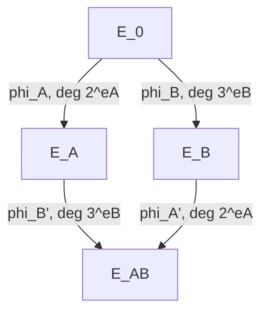

> **Prerequisites**: [[08-glue-and-split|08. Glue and Split]], [[09-endomorphism-ring-gamma|09. Supersingular Endomorphism Rings and the γ Endomorphism]]
> **Lesson type**: Foundation
>
> **Notation** (ký hiệu dùng mà không định nghĩa trong bài này):
> | Ký hiệu | Ý nghĩa |
> |---------|---------|
> | $E, E_1, E_2$ | Elliptic curves |
> | $\phi: E \to E_1$ | Isogeny degree $n_1$ |
> | $\psi: E \to E_2$ | Isogeny degree $n_2$ |
> | $\hat{\phi}: E_1 \to E$ | Dual isogeny của $\phi$ |
> | $N$ | $N^2 = n_1 + n_2$ |
> | $A = E_1 \times E_2$ | Abelian surface split |
> | $\Phi: A \to A'$ | $(N,N)$-isogeny từ $A$ |
> | $\text{Hom}(E_1, E_2)$ | Group of isogenies $E_1 \to E_2$ |

---

## Kani's Theorem là Gì?

Kani's theorem (1997) là **trái tim toán học** của Castryck-Decru attack. Nó cung cấp một **điều kiện tương đương** để một isogeny từ tích $E_1 \times E_2$ có thể factor thành product — tức là để PPAS $A/K$ split. Không có Kani's theorem, attack không tồn tại.

---

## Bối Cảnh: SIDH Diamond và Kani Diamond

Trước khi phát biểu theorem, hãy xem tại sao Galbraith gọi nó là "SIDH squares are Kani diamonds".

**SIDH square**: Trong SIDH, Alice và Bob tạo ra một "isogeny diamond":

Shared secret: $E_{AB} = E_A / \phi_A(\ker \phi_B) = E_B / \phi_B(\ker \phi_A)$.

**Kani diamond**: Kani's theorem nói rằng isogeny diamond này tương đương với một isogeny từ $E_0 \times E_0$ có kernel đặc biệt.

---

## Phát Biểu Kani's Theorem

> [!abstract] Theorem 10.1 — Kani's Theorem (Reducibility Criterion)
> Cho $E$ là elliptic curve và $\phi: E \to E_1$, $\psi: E \to E_2$ là các isogenies sao cho:
>
> $$
> \deg \phi + \deg \psi = N^2
> $$
>
> cho một số nguyên dương $N$. Xét isogeny:
>
> $$
> \Phi = (\phi, \psi): E \to E_1 \times E_2
> $$
>
> (image của một điểm $P \in E$ là $(\phi(P), \psi(P)) \in E_1 \times E_2$).
>
> Xét $(N,N)$-isogeny $\Psi: E_1 \times E_2 \to A'$ với kernel:
>
> $$
> K = \{(\phi(P), \psi(P)) : P \in E[N]\} \subset (E_1 \times E_2)[N]
> $$
>
> (tức là $K = \text{image}(\Phi|_{E[N]})$).
>
> **Kani's criterion**: $A'$ là **reducible** (split thành $E_1' \times E_2'$) nếu và chỉ nếu isogeny $\Phi: E \to E_1 \times E_2$ có thể "complete" thành một commutative diagram:
>
> $$
> \begin{aligned}
> &E_1 \xrightarrow{\alpha} E_1' \\
> &E_2 \xrightarrow{\beta} E_2'
> \end{aligned}
> $$
>
> sao cho $\deg \alpha + \deg \beta$ thỏa mãn điều kiện nhất định (liên quan đến $N$).

*(Proof đầy đủ trong [[a1-kani-proof|A1. Kani's Theorem — Full Proof]])*

---

## Kani's Theorem trong Ngôn Ngữ Thực Tế của Attack

Phát biểu trên hơi trừu tượng. Đây là phiên bản cụ thể cho attack:

> [!note] Theorem 10.2 — Kani Criterion (Attack Version)
> Trong SIDH setup: $E_0$, $\phi_A: E_0 \to E_A$ (Alice, degree $2^{e_A}$), $\psi_B: E_0 \to E_B$ (Bob, degree $3^{e_B}$).
>
> Chọn endomorphism $\gamma: E_0 \to E_0$ degree $c$ sao cho $2^{e_A} + c = N^2$, với $\gamma$ không phải scalar.
>
> Xây dựng isogeny:
>
> $$
> \Phi_0 = (\phi_A, \gamma): E_0 \to E_A \times E_0
> $$
>
> Kernel $K_0 = \{(\phi_A(P), \gamma(P)) : P \in E_0[N]\}$ sinh ra $(N,N)$-isogeny:
>
> $$
> \Psi: E_A \times E_0 \to A'
> $$
>
> Khi đó: $A'$ **split** (kết quả là $E_B \times E_0'$ hoặc variant) khi và chỉ khi Bob's secret $\psi_B$ thỏa mãn một điều kiện cụ thể liên quan đến $\gamma$.

---

## Kani Diamond = SIDH Square

Galbraith's insight: "SIDH squares are Kani diamonds":

Mỗi SIDH diamond (với Alice và Bob's isogenies) tương ứng với một Kani diamond — một cách xây dựng kernel của $(2,2)$-isogeny từ $E_A \times E_0$ sao cho image split.

Cụ thể: nếu Bob's secret $\psi_B$ và Alice's $\phi_A$ tạo SIDH square, thì Kani diamond với $\gamma = \hat{\psi}_B \circ \psi_B'$ (nào đó) cho split result.

> [!info] Tóm Tắt Intuition
> Kani's theorem nói rằng: isogeny "diamond shape" (từ $E_0$, đi theo hai đường, gặp nhau) tương đương với một $(2,2)$-isogeny từ tích $E_1 \times E_2$ có kernel đặc biệt split thành tích. Attack lợi dụng điều này để **test** từng bước xem diamond có close hay không, tức là Bob's secret có khớp không.

---

## Từ Theorem đến Algorithm

Kani's theorem cho ta một **test**: với $\gamma$ được xây dựng từ $3^{e_B}$ (Lesson 09), tại mỗi bước $i$ của chain:

1. Xây dựng $(2,2)$-isogeny $\Psi_i$ với kernel $K_i$ phụ thuộc vào "guess" digit $b_i \in \{0, 1, 2\}$ của Bob's secret.
2. Tính $A_i = \Psi_i(\text{domain}_i)$.
3. **Split test**: Kiểm tra $A_i$ có split không.
4. Nếu split → $b_i$ đúng, recover $b_i$ và tiếp tục.
5. Nếu không split → $b_i$ sai, thử $b_i$ khác.

Toàn bộ Bob's secret được recover digit-by-digit.

---

## Điều Kiện Đủ Đơn Giản

> [!abstract] Corollary 10.3 — Sufficient Condition (Simplified)
> Trong SIDH với $\ell_A = 2$, $\ell_B = 3$: nếu $E_0$ có non-scalar endomorphism $\iota$ degree 2 (như $E_0: y^2 = x^3 + 6x^2 + x$), thì $\gamma = [u] + [2v] \circ \iota$ với $u^2 + 4v^2 = 3^{e_B}$ thỏa mãn điều kiện của Kani's theorem.

Đây là lý do tại sao attack **đặc biệt dễ** với SIKE parameters: $E_0$ được chọn có non-scalar endomorphism nhỏ.

---

## Proof Sketch

*(Proof đầy đủ trong [[a1-kani-proof|A1. Kani's Theorem — Full Proof]])*

**Sketch của chiều $\Rightarrow$** (split $\Rightarrow$ diagram commutes): Nếu $A' = E_1' \times E_2'$, ta có projections $\pi_i: A' \to E_i'$. Compose với $\Psi$: $\pi_i \circ \Psi: E_1 \times E_2 \to E_i'$ cho isogenies $\alpha: E_1 \to E_1'$ và $\beta: E_2 \to E_2'$.

**Sketch của chiều $\Leftarrow$** (diagram commutes $\Rightarrow$ split): Nếu có $\alpha, \beta$ như trên, xây dựng isomorphism $A' \cong E_1' \times E_2'$ bằng cách chứng minh kernel của projections có cấu trúc split.

Điều kiện degree $\deg \phi + \deg \psi = N^2$ đảm bảo counts khớp (tính degrees cả hai chiều bằng nhau). $\blacksquare$

---

## Summary

- **Kani's theorem**: $(N,N)$-isogeny từ $E_1 \times E_2$ có kernel $K = \text{image}(\phi, \psi)$ split $\Leftrightarrow$ isogeny diamond commutes.
- "SIDH squares = Kani diamonds": mỗi SIDH diamond tương đương Kani diamond.
- Trong attack: build chain $(2,2)$-isogenies, test split ở mỗi bước để recover Bob's digits.
- $E_0$ có $\iota$ degree 2 → $\gamma = [u] + [2v] \cdot \iota$ với $u^2 + 4v^2 = 3^{e_B}$ đủ điều kiện.
- Proof đầy đủ: [[a1-kani-proof|A1. Kani's Theorem — Full Proof]].

---

## References

- Kani, E. — *The Number of Curves of Genus Two with Elliptic Differentials*, J. Reine Angew. Math. 485 (1997)
- Galbraith, S. — *Kani for beginners* (blog post, 2022)
- Castryck & Decru — ePrint 2022/975, §2–3 (theorem statement và application)
- Wesolowski, B. — *Understanding and improving the Castryck-Decru attack* (2022)
