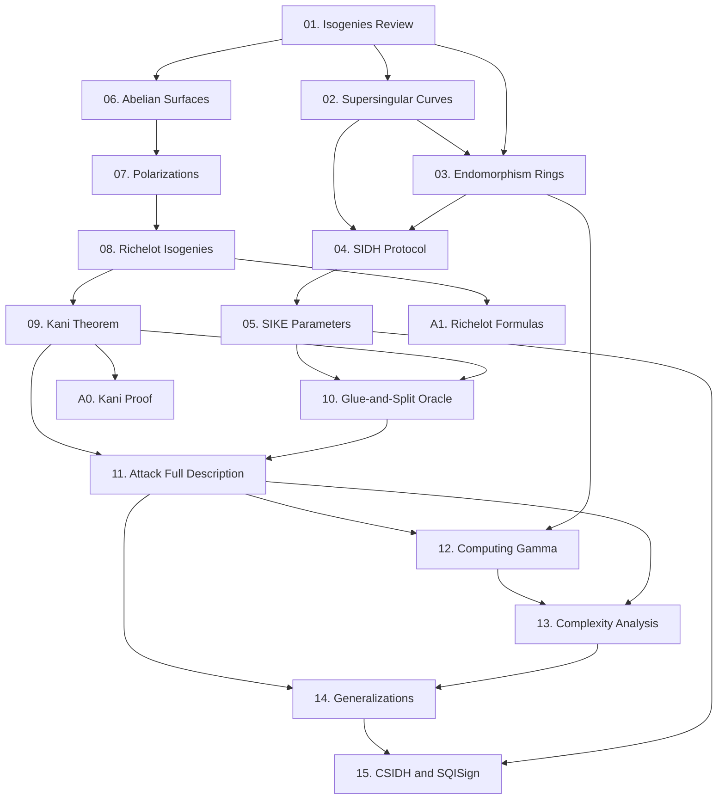

Course này xây dựng hiểu biết đầy đủ về Castryck-Decru attack (2022) — một trong những cryptanalysis breakthroughs lớn nhất trong lịch sử post-quantum cryptography, phá hoàn toàn SIDH/SIKE trong thời gian polynomial. Course cover từ nền tảng isogeny và SIDH protocol, qua abelian surfaces và Kani's theorem, đến formal attack description và generalizations.

**Kiến thức nền tảng yêu cầu**: Elliptic curves sơ bộ (group law, finite fields), group theory cơ bản, basic Python/SageMath

**Tài liệu tham khảo chính**: Castryck & Decru, ePrint 2022/975; Kani, J. reine angew. Math. 485 (1997); De Feo, arXiv:1711.04062

---

## Lesson Overview

| # | Title | Type | File | Dependencies |
|---|-------|------|------|-------------|
| 01 | Isogenies — Review & Attack-Relevant Tools | Math Component | [[01-isogenies-review\|01. Isogenies Review]] | — |
| 02 | Supersingular Elliptic Curves & the Isogeny Graph | Math Component | [[02-supersingular-curves\|02. Supersingular Curves]] | 01 |
| 03 | Endomorphism Rings of Supersingular Curves | Math Component | [[03-endomorphism-rings\|03. Endomorphism Rings]] | 01, 02 |
| 04 | SIDH Protocol — Construction & Torsion Point Leakage | Scheme | [[04-sidh-protocol\|04. SIDH Protocol]] | 01, 02, 03 |
| 05 | SIKE: Parameters, Auxiliary Points, and What They Reveal | Deep Dive | [[05-sike-parameters\|05. SIKE Parameters]] | 04 |
| 06 | Abelian Surfaces: Jacobians of Genus-2 Curves | Math Component | [[06-abelian-surfaces\|06. Abelian Surfaces]] | 01 |
| 07 | Principal Polarizations & the Weil Pairing | Math Component | [[07-polarizations-weil-pairing\|07. Polarizations]] | 06 |
| 08 | Richelot (2,2)-Isogenies: Formulas & Splitting Criterion | Math Component | [[08-richelot-isogenies\|08. Richelot Isogenies]] | 06, 07 |
| 09 | Kani's Theorem — Reducibility Criterion | Foundation | [[09-kani-theorem\|09. Kani's Theorem]] | 07, 08 |
| 10 | Attack Intuition: The Glue-and-Split Oracle | Deep Dive | [[10-glue-and-split-oracle\|10. Glue-and-Split Oracle]] | 05, 08, 09 |
| 11 | Castryck-Decru Attack — Full Formal Description | Attack | [[11-castryck-decru-attack\|11. Castryck-Decru Attack]] | 09, 10 |
| 12 | Computing the Endomorphism γ on E₀ | Deep Dive | [[12-computing-gamma\|12. Computing Gamma]] | 03, 11 |
| 13 | Complexity Analysis & Heuristics | Deep Dive | [[13-complexity-analysis\|13. Complexity Analysis]] | 11, 12 |
| 14 | Maino-Martindale & Robert: Generalizations | Attack | [[14-generalizations\|14. Generalizations]] | 11, 13 |
| 15 | Why CSIDH and SQISign Are Not Broken | Foundation | [[15-csidh-sqisign-safety\|15. CSIDH & SQISign Safety]] | 05, 14 |
| A0 | Full Proof of Kani's Theorem | Appendix | [[a0-kani-proof\|A0. Kani Proof]] | 09 |
| A1 | Richelot Isogeny Formulas — Explicit Derivation | Appendix | [[a1-richelot-formulas\|A1. Richelot Formulas]] | 08 |

**Lesson types**: Foundation · Math Component · Scheme · Attack · Deep Dive · Appendix

---

## Dependency Graph

---

## Progress

- [ ] [[01-isogenies-review\|01. Isogenies Review]]
- [ ] [[02-supersingular-curves\|02. Supersingular Curves]]
- [ ] [[03-endomorphism-rings\|03. Endomorphism Rings]]
- [ ] [[04-sidh-protocol\|04. SIDH Protocol]]
- [ ] [[05-sike-parameters\|05. SIKE Parameters]]
- [ ] [[06-abelian-surfaces\|06. Abelian Surfaces]]
- [ ] [[07-polarizations-weil-pairing\|07. Polarizations]]
- [ ] [[08-richelot-isogenies\|08. Richelot Isogenies]]
- [ ] [[09-kani-theorem\|09. Kani's Theorem]]
- [ ] [[10-glue-and-split-oracle\|10. Glue-and-Split Oracle]]
- [ ] [[11-castryck-decru-attack\|11. Attack Full Description]]
- [ ] [[12-computing-gamma\|12. Computing Gamma]]
- [ ] [[13-complexity-analysis\|13. Complexity Analysis]]
- [ ] [[14-generalizations\|14. Generalizations]]
- [ ] [[15-csidh-sqisign-safety\|15. CSIDH & SQISign Safety]]
- [ ] [[a0-kani-proof\|A0. Kani Proof]]
- [ ] [[a1-richelot-formulas\|A1. Richelot Formulas]]

---

## Notes

Thứ tự học được recommend: đọc theo số thứ tự 01 → 15. Nếu đã biết SIDH, có thể bỏ qua 04-05 và quay lại khi cần. Bài 06-09 là math core nặng nhất — dành nhiều thời gian ở đây, đặc biệt bài 09 (Kani). Bài 10 là "aha moment" — đọc sau khi đã hiểu 06-09. Appendix A0 và A1 là optional nhưng highly recommended nếu muốn hiểu đầy đủ.

---

## Diagram Assets Plan

Mermaid diagrams được nhúng trực tiếp trong các lesson. Không có HTML/CSS diagram nặng riêng biệt trong course này — tất cả diagrams đều là Mermaid (flowchart, sequenceDiagram, graph TD) embedded trong lesson files.

> Mermaid diagrams không cần liệt kê ở đây — chỉ liệt kê các HTML/CSS diagram phức tạp.
