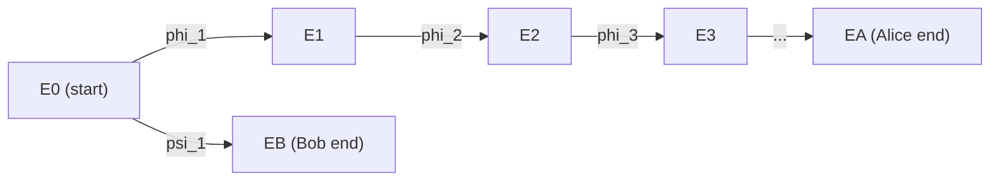

> **Prerequisites**: [[01-isogenies-review|01. Isogenies Review]], j-invariant, Frobenius endomorphism
> **Lesson type**: Math Component
>
> **Notation**:
> | Ký hiệu | Ý nghĩa |
> |---------|---------|
> | $j(E)$ | j-invariant của elliptic curve $E$ |
> | $\pi_p$ | Frobenius endomorphism $P \mapsto P^p$ |
> | $t$ | Trace of Frobenius: $t = p + 1 - \#E(\mathbb{F}_p)$ |
> | $\mathcal{G}_\ell(p)$ | Supersingular $\ell$-isogeny graph trên $\mathbb{F}_{p^2}$ |
> | $B_{p,\infty}$ | Quaternion algebra ramified tại $p$ và $\infty$ |
> | $h$ | Số lượng supersingular j-invariants (class number) |

---

## Motivation

SIDH được xây dựng trên **supersingular elliptic curves** — một lớp đặc biệt với những tính chất cấu trúc rất khác với ordinary curves. Hai tính chất then chốt là: (1) tất cả supersingular j-invariants đều sống trong $\mathbb{F}_{p^2}$, và (2) endomorphism ring là một **maximal order trong quaternion algebra** thay vì chỉ là order trong imaginary quadratic field. Chính cấu trúc phong phú này là thứ Castryck-Decru exploit.

Bài này xây dựng hai nền tảng: định nghĩa và đặc trưng của supersingular curves, và cấu trúc của isogeny graph trên $\mathbb{F}_{p^2}$ — đồ thị mà cả SIDH protocol lẫn attack đều "đi bộ" trên đó.

---

## 1. Ordinary vs Supersingular — Định nghĩa

> [!note] Định nghĩa 2.1 — Supersingular Elliptic Curve
> Cho $E$ là elliptic curve trên trường $\mathbb{F}_q$ với $q = p^r$. Gọi $\pi_p$ là Frobenius endomorphism $P \mapsto P^{(p)}$. Curve $E$ được gọi là **supersingular** nếu một trong các điều kiện tương đương sau đây thỏa mãn:
>
> 1. $E[p](\bar{\mathbb{F}}_p) = \{\mathcal{O}\}$ — nhóm $p$-torsion chỉ gồm điểm vô cực
> 2. $\text{End}(E) \otimes \mathbb{Q}$ là một **quaternion algebra** (dimension 4 over $\mathbb{Q}$)
> 3. Trace of Frobenius $t \equiv 0 \pmod{p}$
> 4. Hasse invariant của $E$ bằng 0

Ngược lại, curve được gọi là **ordinary** khi $E[p] \cong \mathbb{Z}/p\mathbb{Z}$.

**So sánh torsion structure**:
- Ordinary: $E[p^r](\bar{\mathbb{F}}_p) \cong \mathbb{Z}/p^r\mathbb{Z}$ — torsion có rank 1
- Supersingular: $E[p^r](\bar{\mathbb{F}}_p) = \{0\}$ — torsion $p$-power hoàn toàn trivial

Với $\ell \neq p$ nguyên tố, cả hai trường hợp đều có $E[\ell^r] \cong (\mathbb{Z}/\ell^r\mathbb{Z})^2$ — đây là lý do SIDH dùng $\ell \in \{2, 3\}$.

---

## 2. Tất Cả Supersingular Curves Sống Trên $\mathbb{F}_{p^2}$

> [!abstract] Theorem 2.2 — Field of Definition
> Mọi supersingular elliptic curve $E$ đều có $j(E) \in \mathbb{F}_{p^2}$. Cụ thể hơn, mọi supersingular curve đều isomorphic (trên $\bar{\mathbb{F}}_p$) đến một curve định nghĩa trên $\mathbb{F}_{p^2}$.

**Proof sketch.** Với $E$ supersingular, $\pi_p^2 = [-p]$ trong $\text{End}(E)$ (do trace $t \equiv 0$). Điều này nói rằng $\text{Frob}_{p^2}$ tác động như $[-p]$ trên mọi torsion point — tức là $P^{p^2} = [-p]P$. Với $\ell \nmid p$, nếu $P \in E[\ell]$ thì $\langle P^{p^2}\rangle = \langle [-p]P\rangle = \langle P\rangle$ (vì $\gcd(p, \ell) = 1$). Suy ra tất cả $\ell$-torsion points định nghĩa trên $\mathbb{F}_{p^2}$, và từ đó j-invariant sống trên $\mathbb{F}_{p^2}$. $\blacksquare$

**Hệ quả quan trọng cho SIDH**: Ta luôn làm việc trên $\mathbb{F}_{p^2}$, và toàn bộ torsion basis $\{P_A, Q_A\} \subset E_0[2^a]$ được chọn trong $E_0(\mathbb{F}_{p^2})$. Đây là một trong những điều kiện làm cho key exchange hoạt động được.

---

## 3. Số Lượng Supersingular j-Invariants

> [!abstract] Theorem 2.3 — Số Lượng Supersingular Curves (Deuring 1941)
> Số lượng j-invariants supersingular trong $\bar{\mathbb{F}}_p$ là:
>
> $$
> h = \left\lfloor \frac{p}{12} \right\rfloor + \varepsilon
> $$
>
> trong đó $\varepsilon \in \{0, 1, 2\}$ phụ thuộc vào $p \bmod 12$. Cụ thể $h \approx p/12$.

Với $p = 431$ (ví dụ hay dùng trong tài liệu), $h = 37$ — nghĩa là chỉ có 37 supersingular j-invariants, tất cả trong $\mathbb{F}_{431^2}$.

**Đây là lý do SIDH an toàn về mặt không gian**: với $p \approx 2^{434}$ (SIKE-p434), không gian chỉ có khoảng $2^{431}$ vertices — đủ lớn để brute force là không khả thi, nhưng đủ có cấu trúc để Castryck-Decru exploit.

---

## 4. Supersingular $\ell$-Isogeny Graph

> [!note] Định nghĩa 2.4 — Supersingular $\ell$-Isogeny Graph
> Cho $p$ nguyên tố và $\ell \neq p$ nguyên tố. **Supersingular $\ell$-isogeny graph** $\mathcal{G}_\ell(p)$ là đồ thị có hướng:
>
> - **Vertices**: Tập các j-invariants supersingular trong $\mathbb{F}_{p^2}$ (có $\approx p/12$ đỉnh)
> - **Edges**: Một cạnh có hướng từ $j_1$ đến $j_2$ với mỗi $\ell$-isogeny $\phi : E_1 \to E_2$ (modulo isomorphism tại codomain)
>
> Mỗi vertex có **in-degree = out-degree = $\ell + 1$**.

Tại sao $\ell + 1$ edges? Từ $E$ với $E[\ell] \cong (\mathbb{Z}/\ell\mathbb{Z})^2$, số cyclic subgroups order $\ell$ là số điểm trong $\mathbb{P}^1(\mathbb{F}_\ell) = \ell + 1$. Mỗi subgroup cho một $\ell$-isogeny.

> [!abstract] Theorem 2.5 — Expander Graph (Pizer 1990)
> $\mathcal{G}_\ell(p)$ là một **Ramanujan graph** — một $(\ell+1)$-regular expander graph. Nói cách khác, spectral gap của nó là lớn: eigenvalue thứ hai $\lambda_2 \leq 2\sqrt{\ell}$.

**Hệ quả mật mã học**: Random walk độ dài $O(\log p)$ trên $\mathcal{G}_\ell(p)$ đạt distribution gần uniform trên các vertices. Đây là cơ sở security của SIDH: với path dài $\approx a \log 2$ bước (với $2^a \approx p$), điểm đích phân phối gần đều — không thể brute force.

*Alice đi bộ theo chain $2$-isogenies, Bob đi theo chain $3$-isogenies, xuất phát từ cùng $E_0$.*

---

## 5. Tại Sao Dùng Hai Đồ Thị Riêng?

SIDH dùng **cả hai graph** $\mathcal{G}_2(p)$ và $\mathcal{G}_3(p)$ đồng thời:

- **Alice** đi bộ trên $\mathcal{G}_2(p)$: chain của $a$ isogenies degree 2, tổng degree $2^a$
- **Bob** đi bộ trên $\mathcal{G}_3(p)$: chain của $b$ isogenies degree 3, tổng degree $3^b$
- Prime $p$ được chọn sao cho $p = 2^a \cdot 3^b \cdot f - 1$ với $f$ nhỏ

Điều kiện $p \equiv 3 \pmod{4}$ hoặc tương tự đảm bảo rằng tất cả torsion subgroups cần thiết tồn tại trên $\mathbb{F}_{p^2}$.

> [!info] SIKE-p434 Parameters
> $p_{434} = 2^{216} \cdot 3^{137} \cdot f - 1$, với $f = 1$ (prime)
>
> Nghĩa là $a = 216$, $b = 137$, và $2^a \approx 3^b \approx \sqrt{p}$.
>
> Alice: secret key là một cyclic subgroup order $2^{216}$ của $E_0[2^{216}]$
> Bob: secret key là một cyclic subgroup order $3^{137}$ của $E_0[3^{137}]$

---

## 6. Starting Curve $E_0$ và Endomorphism

> [!note] Định nghĩa 2.6 — Starting Curve của SIKE
> SIKE dùng starting curve $E_0 : y^2 = x^3 + 6x^2 + x$ (Montgomery form), có $j(E_0) = 1728$. Đây là supersingular curve trên $\mathbb{F}_p$ (với $p \equiv 3 \pmod{4}$).

Tại sao chọn $j = 1728$? Vì curve này có **endomorphism ring đặc biệt** — nó chứa endomorphism $\iota : (x,y) \mapsto (-x, iy)$ với $i^2 = -1$, tức là một phần tử bậc 4. Điều này cho phép compute endomorphism $\gamma$ trên $E_0$ một cách hiệu quả — đây là bước then chốt trong Castryck-Decru attack (Lesson 12).

---

## 7. Vấn Đề Bảo Mật: Supersingular Isogeny Problem

> [!note] Định nghĩa 2.7 — Computational Supersingular Isogeny Problem (CSSI)
> **Input**: Hai supersingular elliptic curves $E, E'$ trên $\mathbb{F}_{p^2}$
>
> **Goal**: Tìm một isogeny $\phi : E \to E'$

> [!abstract] Theorem 2.8 — Độ Khó của CSSI
> Thuật toán classical tốt nhất để giải CSSI chạy trong thời gian $\tilde{O}(p^{1/4})$ (meet-in-the-middle). Thuật toán lượng tử tốt nhất (Biasse-Jao-Sankar 2014) chạy trong $\tilde{O}(p^{1/6})$ (quantum claw-finding).
>
> Với $p \approx 2^{434}$, cả hai đều không khả thi.

> [!warning] SIDH leak thêm information
> SIDH không chỉ cho adversary biết $E_A$ — mà còn cho biết **images của torsion basis của Bob qua $\phi_A$**: $\phi_A(P_B)$ và $\phi_A(Q_B)$. Đây là thông tin phụ mà Castryck-Decru exploit.
>
> CSSI có thể vẫn khó, nhưng **augmented CSSI với torsion point images** thì không — đây là điểm mấu chốt.

---

## 8. Tóm Tắt Cấu Trúc

Để chuẩn bị cho Lesson 3 và 4, đây là bức tranh tổng thể:

| Tính chất | Ordinary curve | Supersingular curve |
|-----------|---------------|-------------------|
| $E[p]$ | $\cong \mathbb{Z}/p\mathbb{Z}$ | $= \{0\}$ |
| $\text{End}(E) \otimes \mathbb{Q}$ | Imaginary quadratic field | Quaternion algebra $B_{p,\infty}$ |
| $j(E)$ | Có thể trên $\mathbb{F}_{p^n}$ với $n$ lớn | Luôn trong $\mathbb{F}_{p^2}$ |
| Số lượng | $\sim p$ | $\sim p/12$ |
| Isogeny graph | Isogeny "volcano" structure | $(\ell+1)$-regular expander |
| Ứng dụng | ECDLP protocols | SIDH, CSIDH, SQISign |

---

## References

- Silverman, J.H. — *The Arithmetic of Elliptic Curves*, Ch. V: Elliptic curves over finite fields
- Costello, C. — *Supersingular Isogeny Key Exchange for Beginners* (ePrint 2019/1321)
- Pizer, A.K. — *Ramanujan graphs and Hecke operators*, Bull. AMS 23 (1990)
- De Feo, L. — *Mathematics of Isogeny Based Cryptography* (arXiv:1711.04062), Section 4
- Deuring, M. — *Die Typen der Multiplikatorenringe elliptischer Funktionenkörper*, 1941
