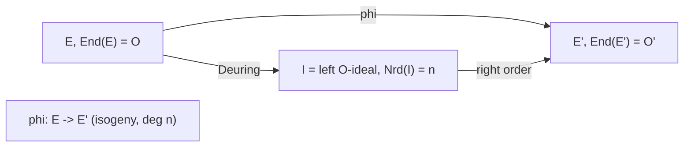

> **Prerequisites**: [[01-isogenies-review|01. Isogenies Review]], [[02-supersingular-curves|02. Supersingular Curves]], basic ring theory
> **Lesson type**: Math Component
>
> **Notation**:
> | Ký hiệu | Ý nghĩa |
> |---------|---------|
> | $\text{End}(E)$ | Vành endomorphism của $E$ (mọi isogeny $E \to E$ cộng zero map) |
> | $\text{End}^0(E)$ | $\text{End}(E) \otimes_\mathbb{Z} \mathbb{Q}$ — algebra endomorphism |
> | $B_{p,\infty}$ | Quaternion algebra ramified tại $p$ và $\infty$ duy nhất (up to isomorphism) |
> | $\mathcal{O}$ | Maximal order trong $B_{p,\infty}$ |
> | $\text{Nrd}(\alpha)$ | Reduced norm của $\alpha \in B_{p,\infty}$ |
> | $[\alpha]$ | Isogeny tương ứng với phần tử $\alpha \in \text{End}(E)$ |

---

## Motivation

Castryck-Decru attack đòi hỏi **biết endomorphism ring** của starting curve $E_0$. Cụ thể, để construct endomorphism phụ $\gamma$ dùng trong attack, attacker cần một phần tử cụ thể của $\text{End}(E_0)$ mà họ có thể compute và evaluate trên các torsion points. Bài này giải thích tại sao endomorphism ring của supersingular curve là **quaternion algebra** — phong phú hơn nhiều so với ordinary curve — và cách Deuring correspondence nối liền cấu trúc algebraic với cấu trúc isogeny.

---

## 1. Vành Endomorphism — Định Nghĩa

> [!note] Định nghĩa 3.1 — Endomorphism Ring
> Với $E / k$ elliptic curve, **vành endomorphism** là:
>
> $$
> \text{End}(E) = \{ \text{isogenies } \phi : E \to E \} \cup \{0\}
> $$
>
> với phép cộng: $(\phi + \psi)(P) = \phi(P) + \psi(P)$, và phép nhân: $(\phi \cdot \psi) = \phi \circ \psi$.
>
> Phép cộng tương ứng với phép cộng điểm trên $E$, phép nhân là composition.

$\text{End}(E)$ luôn chứa $\mathbb{Z}$ — qua phép nhân vô hướng $[n] : P \mapsto nP$. Đây là "phần scalar".

**$\text{End}^0(E) = \text{End}(E) \otimes_\mathbb{Z} \mathbb{Q}$** là algebra nhận được bằng cách cho phép hệ số hữu tỉ. Cấu trúc của nó phân loại curve:

| Loại curve | $\text{End}^0(E)$ | Rank |
|-----------|------------------|------|
| Ordinary (generic) | $\mathbb{Q}$ | 1 |
| Ordinary (CM) | Imaginary quadratic field $\mathbb{Q}(\sqrt{-d})$ | 2 |
| **Supersingular** | **Quaternion algebra $B_{p,\infty}$** | **4** |

---

## 2. Quaternion Algebra $B_{p,\infty}$

> [!note] Định nghĩa 3.2 — Quaternion Algebra
> Một **quaternion algebra** over $\mathbb{Q}$ là $\mathbb{Q}$-algebra dimension 4 có dạng:
>
> $$
> B = \mathbb{Q} + \mathbb{Q} i + \mathbb{Q} j + \mathbb{Q} k, \quad \text{với } i^2 = a,\; j^2 = b,\; k = ij = -ji
> $$
>
> cho các $a, b \in \mathbb{Q}^*$. **Reduced norm**: $\text{Nrd}(\alpha_0 + \alpha_1 i + \alpha_2 j + \alpha_3 k) = \alpha_0^2 - a\alpha_1^2 - b\alpha_2^2 + ab\alpha_3^2$.
>
> **$B_{p,\infty}$** là quaternion algebra duy nhất (up to isomorphism) over $\mathbb{Q}$ ramified chính xác tại $p$ và $\infty$ (tức là definite over $\mathbb{R}$).

Ví dụ với $p \equiv 3 \pmod{4}$: $B_{p,\infty} = \mathbb{Q}(-1, -p) = \mathbb{Q}[i,j]/(i^2 = -1, j^2 = -p, ij = -ji)$.

> [!note] Định nghĩa 3.3 — Maximal Order
> Một **order** trong $B_{p,\infty}$ là subring $\mathcal{O} \subset B_{p,\infty}$ finite-rank over $\mathbb{Z}$ với $\mathcal{O} \otimes \mathbb{Q} = B_{p,\infty}$. Một order được gọi là **maximal** nếu nó không chứa trong order nào lớn hơn.

---

## 3. Deuring Correspondence — Nền Tảng Của Mọi Thứ

> [!abstract] Theorem 3.4 — Deuring Correspondence (1941)
> Tồn tại một **bijection** (up to isomorphism):
>
> $$
> \left\{ \begin{array}{c} \text{Supersingular } j\text{-invariants} \\ \text{trong } \bar{\mathbb{F}}_p \end{array} \right\} \longleftrightarrow \left\{ \begin{array}{c} \text{Type classes của} \\ \text{maximal orders trong } B_{p,\infty} \end{array} \right\}
> $$
>
> Cụ thể: với mỗi $E$ supersingular, $\text{End}(E) \cong \mathcal{O}$ với $\mathcal{O}$ là một maximal order trong $B_{p,\infty}$; và ngược lại, mỗi maximal order tương ứng với (ít nhất) một supersingular j-invariant.

**Proof sketch.** Ta cần chỉ ra $\text{End}^0(E)$ là quaternion algebra khi $E$ supersingular. Vì $E[p] = 0$ (supersingular), Frobenius $\pi_p$ là purely inseparable và không nằm trong $\mathbb{Z}$. Bởi vì $\text{End}(E)$ chứa cả $\pi_p$ (order 2 over $\mathbb{Z}[\pi_p]$) và multiplication-by-$\ell$ maps, ta có rank $\geq 4$. Vì $B_{p,\infty}$ là duy nhất quaternion algebra definite over $\mathbb{R}$ ramified tại $p$, và Frobenius thỏa mãn characteristic polynomial $X^2 - t X + p$ với $p | t$, kết quả theo từ classification quaternion algebras. $\blacksquare$

**Hệ quả quan trọng**: Hai supersingular curves **isomorphic** khi và chỉ khi chúng có cùng maximal order (lên đến conjugacy). Hai curves **isogenous** khi và chỉ khi maximal orders của chúng ở cùng genus (cùng $B_{p,\infty}$). Vì mọi supersingular curve đều thuộc $B_{p,\infty}$, **mọi hai supersingular curves đều isogenous**.

---

## 4. Isogeny ↔ Ideal Trong Deuring Correspondence

Deuring correspondence không chỉ ánh xạ curves lên orders — nó còn ánh xạ **isogenies** lên **ideals**.

> [!note] Theorem 3.5 — Isogeny = Left Ideal
> Cho $E$ supersingular với $\text{End}(E) = \mathcal{O}$. Với mỗi isogeny $\phi : E \to E'$:
>
> $$
> I_\phi = \{ \alpha \in \mathcal{O} : \alpha \text{ factors through } \phi \} = \{ \alpha \in \mathcal{O} : \ker \phi \subseteq \ker \alpha \}
> $$
>
> là một **left ideal** của $\mathcal{O}$ với $\text{Nrd}(I_\phi) = \deg \phi$. Và $\text{End}(E') \cong \mathcal{O}_R(I_\phi)$ — right order của ideal.

Ngược lại: với mỗi left $\mathcal{O}$-ideal $I$ có norm $n$, tồn tại một isogeny $\phi_I : E \to E/E[I]$ có degree $n$, trong đó $E[I] = \bigcap_{\alpha \in I} \ker \alpha$.

*Deuring correspondence: isogeny $\leftrightarrow$ left ideal; codomain curve $\leftrightarrow$ right order.*

---

## 5. Endomorphism Ring của $E_0$ và Vai Trò Trong Attack

Trong SIKE, starting curve là $E_0 : y^2 = x^3 + 6x^2 + x$ với $j(E_0) = 1728$.

> [!info] Endomorphisms Đặc Biệt của $E_0$ (j = 1728)
> Với $p \equiv 3 \pmod{4}$, curve $E_0 : y^2 = x^3 + x$ có hai endomorphisms đặc biệt:
>
> - **Frobenius**: $\pi_p : (x,y) \mapsto (x^p, y^p)$, thỏa mãn $\pi_p^2 = [-p]$
> - **Multiplication by $i$**: $\iota : (x,y) \mapsto (-x, iy)$ với $i^2 \equiv -1 \pmod{p}$, thỏa mãn $\iota^2 = [-1]$
>
> Ba phần tử $\{1, \iota, \pi_p, \iota \circ \pi_p\}$ tạo thành một $\mathbb{Z}$-basis của $\text{End}(E_0) \cong \mathcal{O}_0 \subset B_{p,\infty}$.

> [!warning] Tại sao điều này giúp attacker?
> Castryck-Decru cần construct một endomorphism $\gamma \in \text{End}(E_0)$ với degree $c = \text{Nrd}(\gamma)$ thỏa mãn $c \cdot 2^a = \deg \phi_A \cdot 3^b$ (điều kiện để apply Kani's theorem).
>
> Vì $\text{End}(E_0)$ **được biết hoàn toàn** (do $j = 1728$ và $p \equiv 3 \pmod 4$), ta có thể viết:
>
> $$
> \gamma = [u] + 2i[v] \quad \text{với } [u], [v] \in \text{End}(E_0), \quad \text{Nrd}(\gamma) = u^2 + 4v^2
> $$
>
> Việc compute $\gamma(P)$ tại bất kỳ điểm $P$ là **hiệu quả** vì $\iota$ và $\pi_p$ đều có công thức tường minh.

---

## 6. Hardness Của EndRing Problem

> [!note] Định nghĩa 3.6 — EndRing Problem
> **Input**: Supersingular curve $E / \mathbb{F}_{p^2}$ (được cho bởi equation)
>
> **Goal**: Tìm một $\mathbb{Z}$-basis của $\text{End}(E)$ cùng với cách evaluate mỗi generator tại các torsion points

> [!abstract] Theorem 3.7 — Equivalence (Wesolowski 2022, rigorously)
> Bài toán **path finding** trong isogeny graph (tìm isogeny giữa hai curves) và bài toán **EndRing** (tính endomorphism ring của một curve) là computationally equivalent: một oracle cho bài toán này giải được bài toán kia trong polynomial time.

**Hệ quả mật mã học**: Vì CSSI (path finding) được tin là khó, EndRing cũng khó. Nếu attacker biết $\text{End}(E_A)$ thì họ có thể tìm $\phi_A$, và ngược lại. Điều này giải thích tại sao **SIDH phải bảo mật việc tiết lộ thông tin về $\text{End}(E_A)$**.

Nhưng Castryck-Decru không cần biết $\text{End}(E_A)$ — họ chỉ cần biết $\text{End}(E_0)$, vốn là **public information** (do $E_0$ là public starting curve).

---

## 7. Tóm Tắt

- $\text{End}(E)$ của supersingular curve là một **maximal order trong quaternion algebra** $B_{p,\infty}$ — có rank 4 over $\mathbb{Z}$
- **Deuring correspondence**: bijection giữa supersingular j-invariants và maximal orders; isogenies tương ứng với left ideals
- **EndRing problem** tương đương với path finding — cả hai đều được tin là khó
- **Starting curve $E_0$** của SIKE có $\text{End}(E_0)$ **được biết hoàn toàn** — attacker khai thác điều này để compute endomorphism $\gamma$ cần thiết trong attack

---

## References

- Deuring, M. — *Die Typen der Multiplikatorenringe elliptischer Funktionenkörper*, 1941
- Silverman, J.H. — *The Arithmetic of Elliptic Curves*, Ch. III §9–10
- Wesolowski, B. — *The supersingular isogeny path and endomorphism ring problems are equivalent*, FOCS 2021
- Eriksen, Panny, Sotáková, Veroni — *Deuring for the People* (ePrint 2023/106)
- De Feo, L. — *Mathematics of Isogeny Based Cryptography*, Section 4.4
