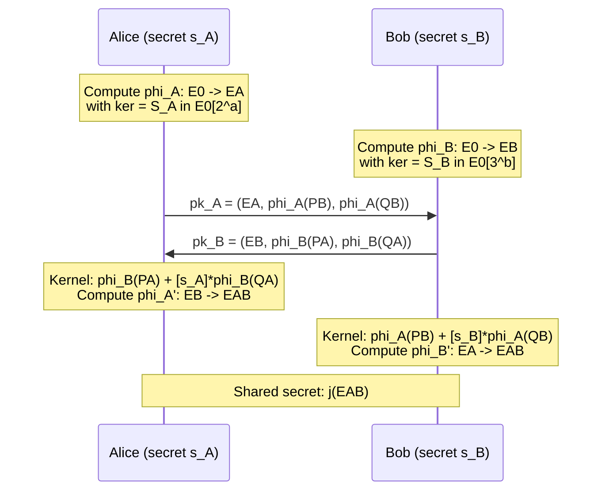
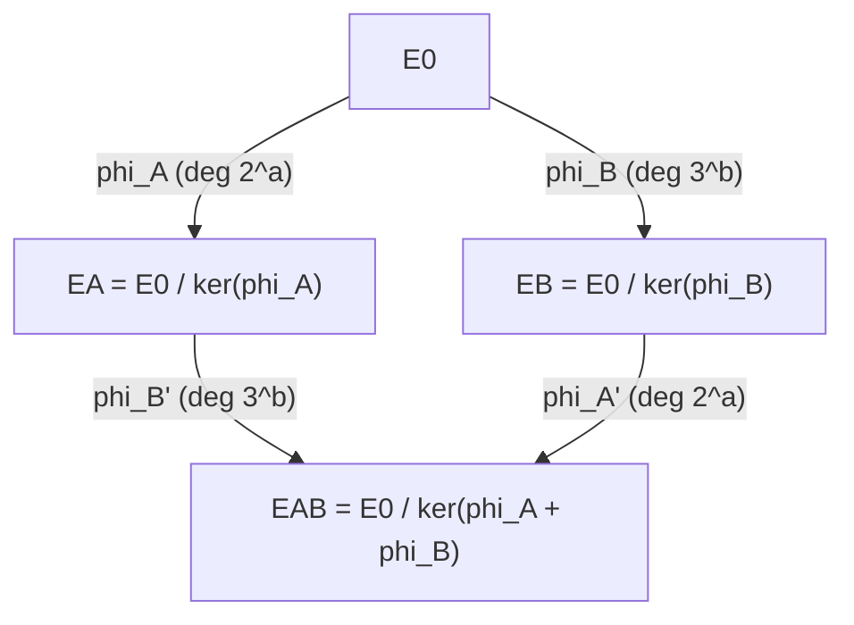

> **Prerequisites**: [[01-isogenies-review|01. Isogenies Review]], [[02-supersingular-curves|02. Supersingular Curves]], [[03-endomorphism-rings|03. Endomorphism Rings]]
> **Lesson type**: Scheme
>
> **Notation**:
> | Ký hiệu | Ý nghĩa |
> |---------|---------|
> | $E_0$ | Starting (public) supersingular curve |
> | $P_A, Q_A$ | Basis công khai của $E_0[2^a]$ |
> | $P_B, Q_B$ | Basis công khai của $E_0[3^b]$ |
> | $\phi_A : E_0 \to E_A$ | Secret isogeny của Alice, degree $2^a$ |
> | $\phi_B : E_0 \to E_B$ | Secret isogeny của Bob, degree $3^b$ |
> | $s_A$ | Secret scalar của Alice, $\ker \phi_A = \langle P_A + [s_A]Q_A \rangle$ |
> | $E_{AB}$ | Shared secret curve |

---

## Motivation

SIDH (Supersingular Isogeny Diffie-Hellman) được Jao và De Feo đề xuất năm 2011 như một key exchange protocol chống lượng tử. Cấu trúc của nó lấy cảm hứng từ Diffie-Hellman: hai bên đi bộ song song trên các isogeny graph khác nhau, và nhờ một **commutative square** đặc biệt, họ gặp nhau tại cùng một curve. Bài này trình bày protocol đầy đủ và phân tích **chính xác những gì public key tiết lộ** — thứ là nguồn gốc của mọi attack.

---

## 1. Public Parameters

> [!note] Scheme 4.1 — SIDH Public Parameters
> **Setting**: Prime $p = 2^a \cdot 3^b \cdot f \pm 1$ với $2^a \approx 3^b$ và $f$ nhỏ; supersingular curve $E_0 / \mathbb{F}_{p^2}$ với $j(E_0)$ được chọn cẩn thận
>
> **Torsion bases**:
> - $(P_A, Q_A)$: basis của $E_0[2^a] \cong (\mathbb{Z}/2^a\mathbb{Z})^2$ — mọi điểm trong $E_0(\mathbb{F}_{p^2})$
> - $(P_B, Q_B)$: basis của $E_0[3^b] \cong (\mathbb{Z}/3^b\mathbb{Z})^2$ — mọi điểm trong $E_0(\mathbb{F}_{p^2})$
>
> Weil pairing check: $e_{2^a}(P_A, Q_A)$ là primitive $2^a$-th root of unity; tương tự cho Bob

**Tại sao chọn $p = 2^a \cdot 3^b \cdot f \pm 1$?** Smooth order này đảm bảo $E_0[2^a]$ và $E_0[3^b]$ đều sống hoàn toàn trong $E_0(\mathbb{F}_{p^2})$, nhờ đó mọi tính toán torsion point đều hiệu quả. Đây là điều kiện thiết kế cốt lõi.

---

## 2. Key Generation và Key Exchange

> [!note] Scheme 4.2 — SIDH Key Exchange
> **Alice — KeyGen**:
> - Chọn secret $s_A \xleftarrow{R} \mathbb{Z}/2^a\mathbb{Z}$
> - Tính $S_A = P_A + [s_A]Q_A \in E_0[2^a]$ (generator của kernel)
> - Compute chain: $E_0 \xrightarrow{\phi_1} E_1 \xrightarrow{\phi_2} \cdots \xrightarrow{\phi_a} E_A$, với mỗi $\phi_i$ là 2-isogeny có kernel $\langle [2^{a-i}]S_A \rangle$
> - Public key: $(E_A,\; \phi_A(P_B),\; \phi_A(Q_B))$
>
> **Bob — KeyGen** (tương tự với 3-isogenies):
> - Chọn $s_B \xleftarrow{R} \mathbb{Z}/3^b\mathbb{Z}$
> - Tính $S_B = P_B + [s_B]Q_B \in E_0[3^b]$
> - Compute chain degree $3^b$: $E_0 \xrightarrow{\psi_1} \cdots \xrightarrow{\psi_b} E_B$
> - Public key: $(E_B,\; \phi_B(P_A),\; \phi_B(Q_A))$

> [!note] Scheme 4.3 — Shared Secret Computation
> **Alice** (nhận pk của Bob):
> - Dùng $(\phi_B(P_A), \phi_B(Q_A))$ để xác định kernel $S'_A = \phi_B(P_A) + [s_A]\phi_B(Q_A) \in E_B[2^a]$
> - Compute isogeny $\phi'_A : E_B \to E_{AB}$ với $\ker \phi'_A = \langle S'_A \rangle$
> - Output: $j(E_{AB})$
>
> **Bob** (nhận pk của Alice): tương tự tính $\phi'_B : E_A \to E_{AB}$, output $j(E_{AB})$

---

## 3. Correctness — Commutative Square

> [!abstract] Theorem 4.4 — Correctness của SIDH
> Hai bên thu được cùng shared secret: $j(E_{AB}) = j(E_{BA})$.

**Proof.** Cần chứng minh $E_{AB} \cong E_{BA}$, tức là hai cách đi trên đồ thị dẫn đến cùng j-invariant. Vì $\ker \phi_A = \langle S_A \rangle \subset E_0[2^a]$ và $\ker \phi_B = \langle S_B \rangle \subset E_0[3^b]$, và hai kernel này có bậc coprime ($2^a$ và $3^b$), chúng "hoán đổi được":

$$
E_0 / \langle S_A, S_B \rangle \cong E_A / \langle \phi_A(S_B) \rangle \cong E_B / \langle \phi_B(S_A) \rangle
$$

Đẳng thức này đến từ tính chất của quotient group: thứ tự chia quotient không ảnh hưởng đến kết quả cuối khi kernels coprime. Alice compute $\phi'_A(S'_A) = \phi'_A(\phi_B(S_A))$, Bob compute $\phi'_B(\phi_A(S_B))$, và cả hai đều cho curve $E_0 / \langle S_A, S_B \rangle$ (up to isomorphism). $\blacksquare$

Commutative square được visualize như sau:

*Commutative square của SIDH: đường đi Alice-trước-Bob và Bob-trước-Alice đều đến $E_{AB}$.*

---

## 4. Security — Cơ Sở Tính Toán

> [!note] Định nghĩa 4.5 — SSCDH Assumption
> **Supersingular Computational Diffie-Hellman (SSCDH)**: Cho public parameters và public keys $(E_A, \phi_A(P_B), \phi_A(Q_B))$, $(E_B, \phi_B(P_A), \phi_B(Q_A))$, tính $j(E_{AB})$ là khó.

> [!note] Định nghĩa 4.6 — SSDDH Assumption
> **Supersingular Decisional Diffie-Hellman (SSDDH)**: Phân biệt $(E_A, E_B, E_{AB})$ thật với $(E_A, E_B, E_{\text{rand}})$ là khó, với $E_{\text{rand}}$ là random supersingular curve.

Với best-known attacks trước tháng 8/2022: classical $\tilde{O}(p^{1/4})$, quantum $\tilde{O}(p^{1/6})$ — đủ để chọn $p \approx 2^{434}$ đạt security level 1.

---

## 5. Cấu Trúc Public Key — Cái Gì Được Tiết Lộ?

Đây là phần then chốt cần hiểu trước Lesson 10.

Public key của Alice gồm **ba thành phần**:
1. $E_A$: j-invariant của curve đích — tức là **endpoint** của isogeny walk của Alice
2. $\phi_A(P_B)$: image của basis point $P_B \in E_0[3^b]$ qua $\phi_A$
3. $\phi_A(Q_B)$: image của basis point $Q_B \in E_0[3^b]$ qua $\phi_A$

> [!warning] Torsion Point Images Tiết Lộ Gì?
> Hai điểm $(\phi_A(P_B), \phi_A(Q_B))$ mô tả **hành động của $\phi_A$ trên $E_0[3^b]$** — tức là hành động của isogeny bí mật trên một torsion group độc lập với kernel của nó.
>
> Formally: $\phi_A|_{E_0[3^b]} : E_0[3^b] \to E_A[3^b]$ được xác định hoàn toàn bởi hai giá trị $\phi_A(P_B)$ và $\phi_A(Q_B)$ (vì $\{P_B, Q_B\}$ là basis).
>
> Điều này tương đương với biết **ma trận $2\times 2$ của $\phi_A$ trên $\mathbb{Z}/3^b\mathbb{Z}$-module $E_0[3^b]$**.

> [!danger] Tại Sao Torsion Images Nguy Hiểm?
> Các nhà thiết kế SIDH đã biết torsion images là potential weakness từ năm 2011. Petit (2017) đã exploit được chúng trong một số variant không chuẩn.
>
> Castryck-Decru (2022) tìm ra cách exploit chúng trong **tất cả các instance của SIDH**, kể cả tham số chuẩn của SIKE. Kỹ thuật: dùng các images này để construct một **glue-and-split oracle** trong dimension 2 via Kani's theorem — chi tiết trong Lesson 9 và 10.

---

## 6. Tại Sao Phải Tiết Lộ Torsion Images?

Không phải ngẫu hứng — đây là **bắt buộc về mặt thiết kế**:

Alice cần biết cách tính $S'_A = \phi_B(P_A) + [s_A] \phi_B(Q_A)$ trên curve $E_B$ của Bob, mà không cần biết secret $s_B$ của Bob. Để làm điều này, Bob phải gửi $(\phi_B(P_A), \phi_B(Q_A))$.

Nếu bỏ torsion images, hai bên không thể reconstruct cùng shared secret. Đây là lý do tại sao không có cách "đơn giản" vá SIDH — và vì sao **SIDH/SIKE bị loại hoàn toàn** sau tháng 8/2022.

---

## 7. Tóm Tắt

- SIDH: hai bên chọn isogeny secret $\phi_A$ (degree $2^a$) và $\phi_B$ (degree $3^b$), xuất phát từ cùng $E_0$
- Shared secret: $j(E_{AB}) = j(E_0 / \langle S_A, S_B \rangle)$, đúng nhờ commutative square
- Public key gồm: **curve endpoint + torsion point images của phía kia**
- Torsion images = **ma trận action của secret isogeny trên torsion group độc lập** — chứa information về secret
- Castryck-Decru (2022) khai thác torsion images + known degree + specific starting curve $\to$ full key recovery

---

## References

- Jao, D. & De Feo, L. — *Towards quantum-resistant cryptosystems from supersingular elliptic curve isogenies*, PQCrypto 2011
- De Feo, L. — *Mathematics of Isogeny Based Cryptography* (arXiv:1711.04062), Sections 5–6
- Costello, C. — *Supersingular Isogeny Key Exchange for Beginners* (ePrint 2019/1321)
- SIKE team — *SIKE: Supersingular Isogeny Key Encapsulation*, NIST submission spec (sike.org)
