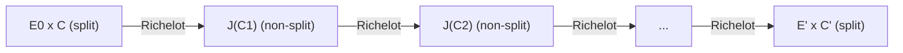

> **Prerequisites**: [[06-abelian-surfaces|06. Abelian Surfaces]], [[07-polarizations-weil-pairing|07. Polarizations]]
> **Lesson type**: Math Component
>
> **Notation**:
> | Ký hiệu | Ý nghĩa |
> |---------|---------|
> | $J(C)$ | Jacobian của genus-2 curve $C$ |
> | $(2,2)$-isogeny | Isogeny $J(C) \to A'$ với maximal isotropic kernel $G \subset J(C)[2]$ |
> | $\Delta$ | Discriminant (splitting criterion) trong Richelot formulas |
> | $\delta$ | Discriminant của $(G_1, G_2, G_3)$ partition |
> | $E_1 \times E_2$ | Split codomain khi $\Delta = 0$ |

---

## Motivation

**Richelot isogenies** là $(2,2)$-isogenies giữa principally polarized abelian surfaces. Chúng là công cụ tính toán chính trong Castryck-Decru: attack xây dựng một chain gồm $b$ Richelot isogenies, và tại mỗi bước, kiểm tra xem codomain có **split** hay không (tức là $\Delta = 0$). Đây là "glue-and-split oracle" trong attack.

Bài này trình bày: cách compute Richelot isogeny từ partition của 2-torsion, công thức tường minh cho codomain, và điều kiện splitting.

---

## 1. 2-Torsion của Jacobian và (2,2)-Kernels

Với $C : y^2 = \prod_{i=1}^6 (x - r_i)$ genus-2 curve (degree 6), nhóm 2-torsion của $J(C)$ có cấu trúc:

$$
J(C)[2] \cong (\mathbb{Z}/2\mathbb{Z})^4
$$

với 15 subgroups order 2, và 15 maximal isotropic subgroups order 4.

**Richelot partition**: Mỗi phân hoạch của 6 roots $\{r_1, \ldots, r_6\}$ thành 3 cặp tương ứng với một $(2,2)$-subgroup:

> [!note] Định nghĩa 8.1 — Richelot Partition
> Một **Richelot partition** là phân hoạch $\{r_1,\ldots,r_6\} = \{r_1,r_2\} \cup \{r_3,r_4\} \cup \{r_5,r_6\}$.
>
> Tương ứng với mỗi phân hoạch, ta định nghĩa 3 quadratic polynomials:
>
> $$
> G_1(x) = (x - r_1)(x - r_2), \quad G_2(x) = (x - r_3)(x - r_4), \quad G_3(x) = (x - r_5)(x - r_6)
> $$
>
> Kernel của Richelot isogeny tương ứng là subgroup $G = \langle D_1, D_2 \rangle \subset J(C)[2]$ được sinh bởi:
>
> $$
> D_i = [(r_{2i-1}, 0) + (r_{2i}, 0) - 2\infty] \in J(C)[2]
> $$

Có $\binom{6}{2}\binom{4}{2}/3! = 15$ phân hoạch — tương ứng với 15 maximal isotropic subgroups, tức là 15 Richelot isogenies xuất phát từ $J(C)$.

---

## 2. Richelot Formulas — Tính Codomain

> [!note] Theorem 8.2 — Richelot Isogeny (Classical, Richelot 1837)
> Cho $C : y^2 = G_1(x) G_2(x) G_3(x)$ với $G_i$ quadratic polynomials. Định nghĩa:
>
> $$
> G'_i(x) = \frac{f'(x)}{G_i(x) \cdot \prod_{j \neq i} (\text{leading coeff of } G_j)}, \quad \delta = \det \begin{pmatrix} G_1 & G_2 & G_3 \\ G_1' & G_2' & G_3' \end{pmatrix}
> $$
>
> **Discriminant** $\Delta = \text{Res}(G_1', G_2') \cdot \text{Res}(G_1', G_3') \cdot \text{Res}(G_2', G_3')$ (up to scalar).
>
> Nếu $\Delta \neq 0$: Richelot isogeny $J(C) \to J(C')$ với $C'$ là genus-2 curve $y^2 = G_1'(x) G_2'(x) G_3'(x)$.
>
> Nếu $\Delta = 0$: Codomain **splits** — $J(C)/G \cong E_1 \times E_2$ (product of elliptic curves).

**Proof sketch.** Richelot formulas là explicit form của Vélu-type computation trong dimension 2. Kernel $G = \langle D_1, D_2 \rangle$ là maximal isotropic, nên quotient $J(C)/G$ có natural principal polarization. Equation của codomain được tính từ tác động của kernel trên divisors của $C$. Splitting xảy ra khi discriminant $\Delta = 0$ vì lúc đó polynomial $G_1'(x)G_2'(x)G_3'(x)$ có roots bị ghép — codomain Jacobian có "extra" endomorphism và degenerate. $\blacksquare$

---

## 3. Splitting Criterion — Oracle Của Attack

> [!note] Định nghĩa 8.3 — Splitting Criterion
> Richelot isogeny $\phi : J(C) \to A'$ được gọi là **split** (hay **decomposed**) nếu codomain $A' \cong E_1 \times E_2$ là product của hai elliptic curves.
>
> Điều kiện tương đương:
> - $\Delta = 0$ trong Richelot formulas
> - Hai trong ba polynomials $G_i'$ có roots chung
> - Curve $C'$ degenerate (không genus-2 smooth)

> [!abstract] Theorem 8.4 — Split Richelot $\leftrightarrow$ $\Delta = 0$
> Richelot isogeny tương ứng với partition $(G_1, G_2, G_3)$ là split khi và chỉ khi:
>
> $$
> \delta = \text{resultant}(G_1', G_2') \cdot \text{(terms from } G_3') = 0
> $$
>
> Khi $\delta = 0$, ta có thể tính tường minh $E_1$ và $E_2$ từ common roots của $G_i'$.

**Kiểm tra splitting là O(1)**: Chỉ cần tính $\delta$ — một phép tính đơn giản. Đây là lý do tại sao Castryck-Decru attack chạy nhanh: mỗi bước chỉ cần kiểm tra $\delta = 0$ hay không.

---

## 4. Explicit Splitting: Tính $E_1$ và $E_2$

Khi $\delta = 0$: giả sử $G_2'(x)$ và $G_3'(x)$ có common root $\alpha$ (tức là $G_2'(\alpha) = G_3'(\alpha) = 0$). Khi đó:

$$
E_1 : y^2 = G_1'(x) (x - \alpha), \quad E_2 : y^2 = \frac{G_2'(x) G_3'(x)}{(x-\alpha)^2} \cdot h(x)
$$

cho phù hợp (explicit formulas phụ thuộc vào cách normalize). Hai elliptic curves $E_1, E_2$ có thể compute tường minh từ roots của $G_i'$.

> [!example] Ví dụ Minh Họa
> Cho $C : y^2 = (x^2-1)(x^2-4)(x^2-9)$ (roots $\pm 1, \pm 2, \pm 3$).
>
> Partition: $G_1 = x^2-1$, $G_2 = x^2-4$, $G_3 = x^2-9$.
>
> $G_1' = 2x \cdot (\text{leading coeff correction})$, ..., kiểm tra $\delta$: nếu $\delta = 0$ thì Richelot isogeny split và codomain là $E_1 \times E_2$.

---

## 5. Richelot Chain và Castryck-Decru

Trong attack, ta cần compute một chain gồm $b$ Richelot isogenies (với $b = 3^b$ steps, tức là $b$ steps với Richelot). Mỗi bước:

1. Tính $\delta$ cho candidate next step → **kiểm tra splitting** ($O(1)$)
2. Nếu đúng bước → compute codomain, tiến sang bước tiếp
3. Nếu bước cuối split → tìm được $E_A$ → recover $\hat{\phi}_A$

*Chain Richelot isogenies: bắt đầu tại product surface, kết thúc tại product surface khi tìm đúng kernel.*

---

## 6. (3,3)-Isogenies — Tổng Quát Hóa

Castryck-Decru gốc dùng $(3,3)$-isogenies (thay vì Richelot $(2,2)$) vì attack recover **Alice's** key sử dụng **Bob's** 3-isogeny chain. Trong phần Bob của attack:

> [!info] $(3,3)$-Isogenies
> $(3,3)$-isogeny từ $J(C)$ được compute bởi partition của $3^2 - 1 = 8$ order-3 torsion points, với formulas phức tạp hơn Richelot. Splitting criterion tương tự: $\Delta = 0 \Leftrightarrow$ codomain splits.
>
> Decru và Kunzweiler (2022) implement $(3,3)$-case. Đây là lý do attack cần một bên dùng 2-isogenies (cho $\gamma$ computation) và bên kia dùng 3-isogenies (cho chain).

---

## References

- Richelot, F.J. — *De transformatione integralium Abelianorum primi ordinis commentatio*, 1837
- Castryck, W., Decru, T., Smith, B. — *Hash functions from superspecial genus-2 curves using Richelot isogenies*, J. Math. Cryptol. 14 (2020)
- Cosset, R. & Robert, D. — *Computing $(\ell,\ell)$-isogenies in polynomial time on Jacobians of genus 2 curves*, Math. Comp. 84 (2015)
- Castryck, W. & Decru, T. — *An efficient key recovery attack on SIDH* (ePrint 2022/975), Sections 3–4
