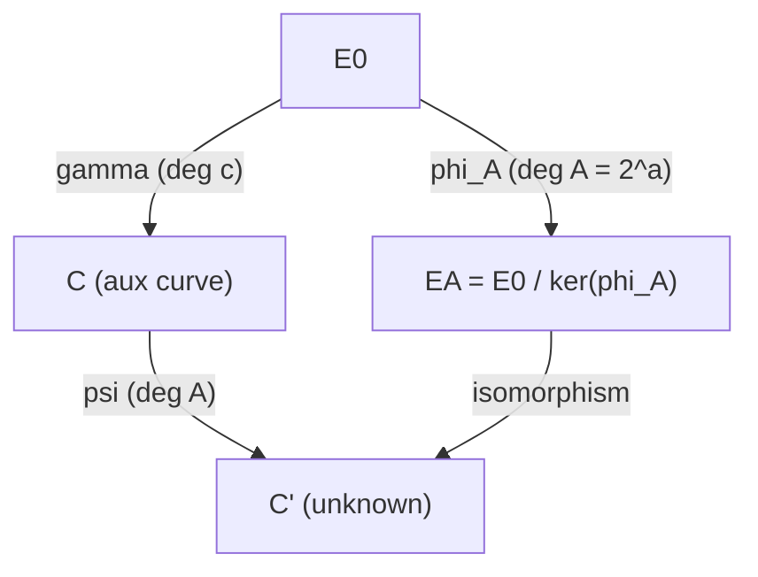
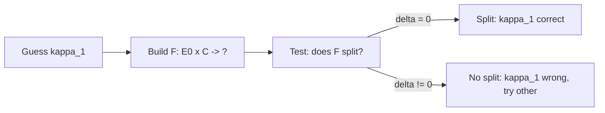

> **Prerequisites**: [[07-polarizations-weil-pairing|07. Polarizations]], [[08-richelot-isogenies|08. Richelot Isogenies]]
> **Lesson type**: Foundation
>
> **Notation**:
> | Ký hiệu | Ý nghĩa |
> |---------|---------|
> | $\phi_f : E_0 \to E$ | Isogeny degree $f$ |
> | $\phi_A : E_0 \to E_A$ | Secret isogeny của Alice, degree $A = 2^a$ |
> | $\gamma : E_0 \to C$ | Auxiliary isogeny degree $c$ từ $E_0$ sang elliptic curve $C$ |
> | $\psi : C \to E_A$ | Isogeny degree $A$ được recover |
> | $F : E_0 \times C \to E_A \times C'$ | $(A,A)$-isogeny trong dimension 2 |
> | $N$ | Tổng degree $= A + c$ trong Kani setup |

---

## Motivation

Kani's theorem (1997) là **tim đập** của Castryck-Decru attack. Nó là một định lý thuần túy về algebraic geometry — về khi nào một isogeny từ product của hai elliptic curves lại cho ra product khác. Castryck và Decru nhận ra rằng định lý này, kết hợp với torsion point images trong SIDH public key, cho phép **test từng bit** của secret isogeny Alice.

---

## 1. Isogeny Diamond — Cấu Trúc Cơ Bản

Trước khi phát biểu Kani, ta cần hiểu khái niệm "isogeny diamond".

> [!note] Định nghĩa 9.1 — Isogeny Diamond
> Một **isogeny diamond** order $N$ là diagram giao hoán (commutative diagram) của 4 elliptic curves và 4 isogenies:
>
> $$
> \begin{array}{ccc}
> E_0 & \xrightarrow{\phi_f} & E_1 \\
> \downarrow_{\phi_A} & & \downarrow_{\phi_A'} \\
> E_2 & \xrightarrow{\phi_f'} & E_3
> \end{array}
> $$
>
> Trong đó $\deg \phi_f = f$, $\deg \phi_A = A$, và $f + A = N$ (hoặc $f \cdot A = N$ trong một convention khác).

Castryck-Decru dùng một dạng đặc biệt của isogeny diamond: hai isogenies đi ra từ $E_0$ với degrees $A$ (secret) và $c$ (auxiliary), và target là hai elliptic curves.

---

## 2. Kani's Reducibility Criterion

> [!abstract] Theorem 9.2 — Kani's Reducibility Criterion (Kani 1997, Thm. 2.6)
> Cho $E_0, E$ và $C$ là các elliptic curves trên trường $k$, và cho:
>
> - $\phi_A : E_0 \to E$ isogeny degree $A$
> - $\gamma : E_0 \to C$ isogeny degree $c$
> - $N = A + c$ (với $\gcd(A, c) = 1$ và $\gcd(N, p) = 1$)
>
> Định nghĩa isogeny $F : E_0 \times C \to ?$ với kernel:
>
> $$
> \ker F = \{ (x, \gamma(x)) \in E_0[N] \times C[N] : x \in E_0[N] \}
> $$
>
> Khi đó **$F$ là $(A,A)$-isogeny** (degree $A^2$, nếu $\ker F$ là maximal isotropic trong $(E_0 \times C)[N]$) và:
>
> **Kani's Reducibility Criterion**: $F$ **reducible** (tức là codomain $\cong E' \times C'$ split) khi và chỉ khi tồn tại isogeny $\psi : C \to E$ sao cho:
>
> $$
> \psi \circ \gamma = \hat{\phi}_A \quad \text{trên } E_0[N]
> $$
>
> Tức là: anti-isometry $\psi|_{C[N]} \circ \gamma|_{E_0[N]} = \hat{\phi}_A|_{E_0[N]}$ với respect to Weil pairings.

> [!info] Diễn Giải
> Nói một cách intuitive: nếu có đủ "compatibility" giữa $\gamma$ và $\hat{\phi}_A$ trên $N$-torsion, thì isogeny $F$ từ $E_0 \times C$ đi đến một **product** $E \times C'$ (reducible/split), thay vì đến Jacobian của một genus-2 curve.
>
> Điều kiện cụ thể: $\gamma$ và $\hat{\phi}_A$ cùng "match" trên $N$-torsion theo nghĩa của anti-isometry.

**Proof.** (Sketch đầy đủ trong Appendix A0.) Kernel $\ker F = \{(x, \gamma(x)) : x \in E_0[N]\}$ là một subgroup isotropic của $(E_0 \times C)[N]$ với product Weil pairing nếu và chỉ nếu $\gamma$ là anti-isometry (đảo chiều pairing). Khi đó $F$ là $(N,N)$-isogeny với degree $N^2$. Để $F$ reducible, tức là để codomain split, cần có isogeny $\psi : C \to E$ degree $A$ như một "complement" trong diagram. Điều này tương đương với $\hat{\phi}_A = \psi \circ \gamma$ trên $E_0[N]$. *(Proof đầy đủ trong [[a0-kani-proof|A0. Proof of Kani's Theorem]])* $\square$

---

## 3. Isogeny Diamond Của Castryck-Decru

Trong attack, Castryck-Decru build isogeny diamond sau:

*Isogeny diamond trong Castryck-Decru: $E_0 \to E_A$ (secret), $E_0 \to C$ (auxiliary), $C \to C'$ (recovered).*

Kani's criterion nói: $F : E_0 \times C \to E_A \times C'$ reducible $\Leftrightarrow$ $\psi \circ \gamma = \hat{\phi}_A$ trên $E_0[A+c]$.

---

## 4. Ứng Dụng Vào SIDH — Search-to-Decision Reduction

Castryck-Decru dùng Kani như thế nào? Đây là key insight:

**Setup**: Attacker biết $E_0$, $E_A$, $\phi_A(P_B)$, $\phi_A(Q_B)$ (public key Alice).

**Bước 1**: Chọn auxiliary endomorphism $\gamma \in \text{End}(E_0)$ với $\text{Nrd}(\gamma) = c$ sao cho $N = A + c$ smooth (product of small primes).

**Bước 2**: Với candidate "first step" $\kappa_1 \in \{0, 1\}$ (bit đầu tiên của $s_A$), test xem:

Bắt đầu với $E_0 \times C$ (với $C$ là một elliptic curve cụ thể), compute chain Richelot isogenies:

$$
E_0 \times C \to J(C_1) \to J(C_2) \to \cdots \to ?
$$

Nếu cuối chain **split** (codomain là $E' \times C''$), thì $\kappa_1$ đúng. Nếu không split, thì $\kappa_1$ sai.

**Bước 3**: Lặp lại cho từng bit $\kappa_1, \kappa_2, \ldots, \kappa_a$.

---

## 5. Tại Sao Test Splitting = Kiểm Tra $\delta = 0$?

Từ Lesson 8: Richelot isogeny split khi và chỉ khi $\delta = 0$ — một discriminant đơn giản. Đây là điều làm cho attack khả thi về mặt tính toán: mỗi bước chỉ cần một phép kiểm tra $\delta = 0$, không cần solve discrete log hay bất cứ thứ khó nào.

> [!abstract] Corollary 9.3 — Splitting Test là Efficient Oracle
> Tại mỗi bước $i$, với candidate $\kappa_i$:
>
> 1. Compute Richelot isogeny step $i$ với kernel xác định bởi $\kappa_i$
> 2. Tính discriminant $\delta_i$ của Richelot formulas
> 3. Nếu $\delta_i = 0$ → kappa_i đúng; nếu $\delta_i \neq 0$ → kappa_i sai
>
> Mỗi bước chạy trong $O(\log p)$ time. Tổng: $O(a \log p) = O(\log^2 p)$ time để recover toàn bộ secret key $s_A$.

---

## 6. Tóm Tắt

- **Kani's theorem** (1997): điều kiện cần và đủ để $(A,A)$-isogeny từ $E_0 \times C$ split ở codomain
- Điều kiện: anti-isometry $\psi \circ \gamma = \hat{\phi}_A$ trên $E_0[N]$
- Attack dùng torsion images $(\phi_A(P_B), \phi_A(Q_B))$ để **kiểm tra** điều kiện Kani tại mỗi bit
- Splitting check = $\delta = 0$ trong Richelot formulas = $O(1)$ test
- Kết quả: **polynomial time** key recovery từ SIDH public key

---

## References

- Kani, E. — *The number of curves of genus two with elliptic differentials*, J. reine angew. Math. 485 (1997)
- Castryck, W. & Decru, T. — *An efficient key recovery attack on SIDH* (ePrint 2022/975), Sections 2–3
- Robert, D. — *Reducible gluing of abelian varieties* (lecture notes, 2022)
- Arpin, S. & Martindale, C. — *Exploiting Higher Dimensions in Isogeny-Based Cryptography*, AWS 2026 notes
