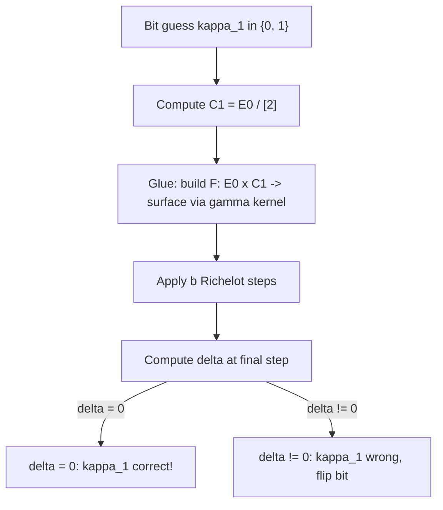
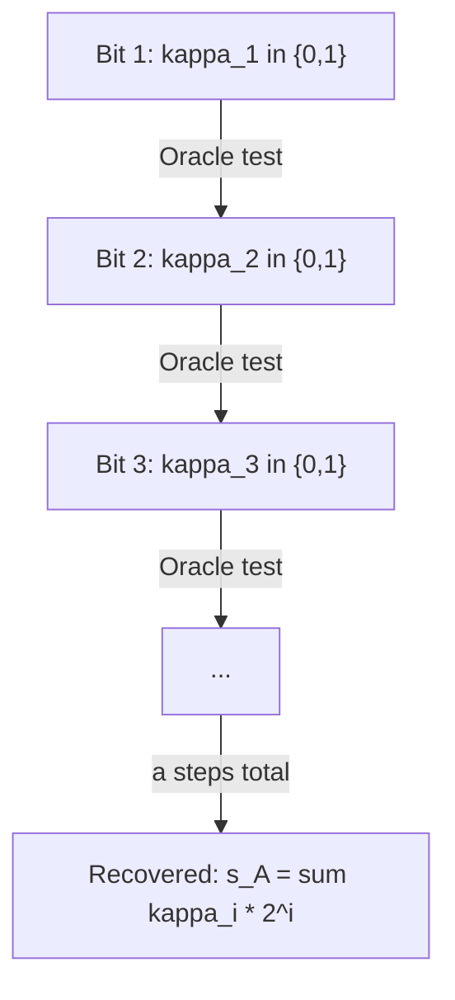

> **Prerequisites**: [[05-sike-parameters|05. SIKE Parameters]], [[08-richelot-isogenies|08. Richelot Isogenies]], [[09-kani-theorem|09. Kani's Theorem]]
> **Lesson type**: Deep Dive
>
> **Notation**:
> | Ký hiệu | Ý nghĩa |
> |---------|---------|
> | $\kappa_i$ | Bit thứ $i$ của $s_A$ (trong binary expansion) |
> | $E_i$ | Intermediate curve tại bước thứ $i$ trong chain của Alice |
> | $\mathcal{O}(E_i, \kappa_i)$ | Glue-and-split oracle tại bước $i$ |
> | "Glue" | Kết hợp $E_i \times C$ thành abelian surface product |
> | "Split" | Kiểm tra xem Richelot codomain có split không ($\delta = 0$?) |

---

## Motivation

Trước khi đi vào formal description đầy đủ (Lesson 11), bài này xây dựng **intuition** cho toàn bộ attack. Mục tiêu là trả lời: tại sao public key của SIDH lại đủ để recover secret? Cơ chế nào biến torsion images thành một "oracle" có thể test từng bit?

---

## 1. Tại Sao Torsion Images = Information Về Secret

Nhắc lại từ Lesson 5: Alice's public key chứa $(\phi_A(P_B), \phi_A(Q_B))$ — images của Bob's torsion basis qua $\phi_A$.

**Key observation**: Vì $\{P_B, Q_B\}$ là basis của $E_0[3^b]$ và $\phi_A$ là homomorphism, ta biết hoàn toàn action của $\phi_A$ trên $E_0[3^b]$.

Bây giờ, điều này có nghĩa là: nếu ta muốn kiểm tra "Liệu isogeny bí mật của Alice tại step $i$ có đi qua subgroup $G_i = \langle P_A + [\kappa_i] Q_A \rangle$ không?", ta có thể dùng Kani's criterion để kiểm tra — **mà không cần biết $\phi_A$ trực tiếp**.

---

## 2. Cơ Chế Glue-and-Split — High Level

Gọi $E_1 = E_0 / \langle [2^{a-1}]S_A \rangle$ là curve tại giữa đường đi của Alice (sau một bước 2-isogeny). Giả sử attacker đang đoán bit đầu tiên $\kappa_1$ của $s_A$.

**"Glue" step**: Từ candidate intermediate curve $C_1$ (tính từ $\kappa_1$), xây dựng abelian surface:

$$
A = E_0 \times C_1
$$

và tạo ra isogeny $F : E_0 \times C_1 \to ?$ với kernel được xây dựng từ:
- Torsion points $E_0[2^a]$ (known từ public params)
- Isogeny $\gamma \in \text{End}(E_0)$ (known vì $\text{End}(E_0)$ public)
- Torsion images $\phi_A(P_B), \phi_A(Q_B)$ (known từ public key)

"Glue" nghĩa là: kết dính (glue) $E_0$ và $C_1$ lại bằng một kernel thích hợp để tạo ra một surface rồi apply Richelot.

**"Split" test**: Apply Richelot isogeny (chain of $b$ steps) lên surface vừa xây dựng. Tại cuối chain, tính $\delta$:
- Nếu $\delta = 0$ → codomain split → $\kappa_1$ **đúng**
- Nếu $\delta \neq 0$ → codomain không split → $\kappa_1$ **sai**, thử $\kappa_1 \oplus 1$

---

## 3. Tại Sao "Glue" Dùng $\gamma$?

Đây là điểm kỹ thuật quan trọng: kernel của $F : E_0 \times C_1 \to ?$ phải là **maximal isotropic subgroup** của $(E_0 \times C_1)[N]$ — không phải là product kernel.

> [!note] Kernel Construction
> Với $N = A + c = 2^a + c$ (trong đó $c = \text{deg}(\gamma)$), kernel của $F$ là:
>
> $$
> \ker F = \{ (x, -\gamma(x)) : x \in E_0[N] \} \subset (E_0 \times C)[N]
> $$
>
> Đây là **anti-diagonal** kernel — nó "glues" $E_0$ và $C$ theo $\gamma$.
>
> Kernel này isotropic đối với product Weil pairing khi và chỉ khi $\gamma$ là **anti-isometry** — điều này hold khi $\gamma$ là endomorphism (preserve curve).

Vì $\gamma \in \text{End}(E_0)$, $C = E_0 / \ker[\gamma] = $ codomain của $\gamma$, và anti-diagonal kernel tự động isotropic. Điều này là lý do tại sao cần $E_0$ có known endomorphism — để compute $\gamma$ hiệu quả.

---

## 4. Tại Sao "Split" ↔ Đoán Đúng Bit?

Đây là hệ quả của Kani's theorem (Theorem 9.2). Tóm tắt chain logic:

1. Nếu $\kappa_1$ đúng, thì $C_1 = $ intermediate curve thực sự trên path của Alice
2. Khi đó $\hat{\phi}_A$ restricted to $E_0[N]$ và $\gamma$ restricted to $E_0[N]$ thỏa mãn **Kani's condition**
3. Kani's theorem → isogeny $F: E_0 \times C_1 \to E_A \times C_1'$ **reducible** (split)
4. Richelot chain kết thúc với $\delta = 0$ ✓

Ngược lại, nếu $\kappa_1$ sai:

1. $C_1$ không phải intermediate curve của Alice
2. Kani's condition không thỏa mãn với random $C_1$
3. Codomain của $F$ là Jacobian của genus-2 curve (không split)
4. Richelot chain kết thúc với $\delta \neq 0$ ✗

> [!warning] Heuristic Failure Probability
> Có xác suất nhỏ (~$1/p$) rằng một $\kappa_1$ sai vẫn cho $\delta = 0$ — false positive. Heuristic phân tích cho thấy điều này hiếm khi xảy ra và có thể handle bằng cách verify kết quả. Lesson 13 phân tích kỹ hơn.

---

## 5. Toàn Bộ Attack Như Một Cây Quyết Định

Attack recover tất cả $a$ bits của $s_A$ bằng cách chạy oracle lặp lại:

Mỗi bước: 2 candidates (0 hoặc 1), một glue-and-split test, một answer. Tổng: $2a$ oracle calls, mỗi call là $O(b)$ Richelot steps. Với $a, b = O(\log p)$, total time = $O(\log^2 p)$ = polynomial.

---

## 6. Điểm Tinh Tế: Torsion Images Cho Phép Build Kernel

Nhưng tại sao attacker có thể build đúng kernel tại mỗi bước? Đây là vai trò của $(\phi_A(P_B), \phi_A(Q_B))$:

Kernel của $F$ (cụ thể là phần liên quan đến $E_0[N]$) cần "match" với action của $\phi_A$ trên $E_0[3^b]$. Khi torsion images $\phi_A(P_B)$ và $\phi_A(Q_B)$ được cho, attacker biết chính xác action matrix $M_{\phi_A}$ trên $E_0[3^b]$. Điều này đủ để construct kernel của $F$ đúng cách.

> [!tip] Tóm Gọn
> **Torsion images → biết action matrix $M_{\phi_A}$ → build correct kernel cho $F$ → apply Richelot chain → split test → bit recovery**
>
> Mỗi bước là hiệu quả vì tất cả nguyên liệu đều có trong public key.

---

## References

- NCC Group blog — *Implementing the Castryck-Decru SIDH Key Recovery Attack in SageMath* (nccgroup.com, 2022)
- Galbraith, S. — *Breaking supersingular isogeny Diffie-Hellman (SIDH)*, ellipticnews.wordpress.com, 2022
- Castryck, W. & Decru, T. — *An efficient key recovery attack on SIDH* (ePrint 2022/975), Section 1 (Overview)
