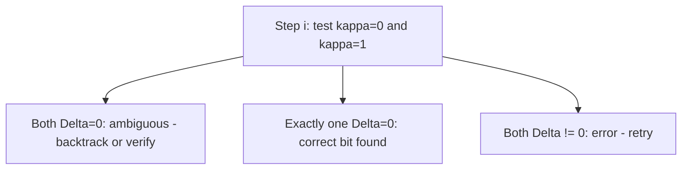

> **Prerequisites**: [[09-kani-theorem|09. Kani's Theorem]], [[10-glue-and-split-oracle|10. Glue-and-Split Oracle]]
> **Lesson type**: Attack
>
> **Notation**:
> | Ký hiệu | Ý nghĩa |
> |---------|---------|
> | $(E_A, R_B, S_B)$ | Alice's public key: $R_B = \phi_A(P_B)$, $S_B = \phi_A(Q_B)$ |
> | $\gamma : E_0 \to C$ | Auxiliary isogeny deg $c$, $\gamma \in \text{End}(E_0)$ |
> | $N = 2^a + c$ | Tổng degree (smooth) |
> | $\mathcal{K}_i$ | Chain của các intermediate curves tại step $i$ |
> | $\alpha_i$ | Candidate kernel point tại step $i$ |

---

## Motivation

Bài này là **formal description** đầy đủ của Castryck-Decru attack, kết hợp mọi thành phần từ các bài trước: Kani's theorem (Lesson 9), Richelot oracle (Lesson 8), auxiliary endomorphism $\gamma$ (Lesson 12 cover chi tiết), và torsion point images (Lesson 5). Mục tiêu: recover Alice's secret key $s_A$ từ public key $(E_A, \phi_A(P_B), \phi_A(Q_B))$ trong polynomial time.

---

## 1. Thiết Lập — Attack Setting

**Input**:
- Public parameters: $(E_0, P_A, Q_A, P_B, Q_B, a, b)$ — tất cả đều public
- Alice's public key: $(E_A, R_B = \phi_A(P_B), S_B = \phi_A(Q_B))$
- $\text{End}(E_0)$ = known (vì $E_0$ là public starting curve với known CM)

**Goal**: Recover $s_A \in \mathbb{Z}/2^a\mathbb{Z}$ sao cho $\ker \phi_A = \langle P_A + [s_A] Q_A \rangle$.

**Auxiliary data**: Chọn endomorphism $\gamma \in \text{End}(E_0)$ với degree $c = \text{Nrd}(\gamma)$ sao cho $N = 2^a + c$ là $B$-smooth (mọi prime factor $\leq B$ nhỏ). Đây là bước precomputation phụ thuộc vào system parameters, không phụ thuộc vào public key của Alice. Lesson 12 giải thích cách tìm $\gamma$.

---

## 2. Cấu Trúc Tổng Thể của Attack

Attack recover $s_A$ theo từng bit, từ least significant đến most significant. Sau $a$ bước, toàn bộ $s_A$ được xác định.

> [!note] Scheme 11.1 — Castryck-Decru Key Recovery
> **Input**: $(E_0, P_A, Q_A, P_B, Q_B, E_A, R_B, S_B, \gamma, N)$
>
> **Khởi tạo**:
> - $E_{\text{curr}} = E_0$ (current intermediate curve của Alice, khởi đầu là $E_0$)
> - $R_{\text{curr}} = R_B$, $S_{\text{curr}} = S_B$ (images hiện tại của torsion basis Bob)
>
> **Vòng lặp**: Với $i = 1, 2, \ldots, a$:
>
> 1. **Candidate kernels**: Với mỗi $\kappa \in \{0, 1\}$, tính:
>    $$
>    T_\kappa = [2^{a-i}]P_A + [\kappa \cdot 2^{a-i}]Q_A \in E_{\text{curr}}[2]
>    $$
>    (order-2 point xác định $i$-th isogeny step)
>
> 2. **Glue step**: Với mỗi $\kappa$, xây dựng kernel:
>    $$
>    K_\kappa = \{ (x, -\gamma(x)) : x \in E_0[N] \} \subset (E_{\text{curr}} \times C)[N]
>    $$
>    trong đó $C$ là intermediate curve tương ứng với $T_\kappa$ (tính từ Vélu)
>
> 3. **Richelot chain**: Apply $b$ bước $(3,3)$-isogeny (hoặc Richelot nếu dùng $(2,2)$):
>    $$
>    E_{\text{curr}} \times C \xrightarrow{F_1} A_1 \xrightarrow{F_2} \cdots \xrightarrow{F_b} A_b
>    $$
>
> 4. **Split test**: Tính discriminant $\Delta_b$ tại bước cuối.
>    Nếu $\Delta_b = 0$ → $\kappa$ đúng. Gọi $\kappa_i^* = \kappa$.
>    Nếu $\Delta_b \neq 0$ → thử $\kappa$ kia.
>
> 5. **Update**: Compute next intermediate curve:
>    $$
>    E_{\text{curr}} \leftarrow E_{\text{curr}} / \langle T_{\kappa_i^*} \rangle
>    $$
>    Update torsion images $R_{\text{curr}}$ và $S_{\text{curr}}$ qua step isogeny.
>
> **Output**: $s_A = \sum_{i=1}^{a} \kappa_i^* \cdot 2^{i-1}$

---

## 3. Tại Sao Attack Đúng

> [!abstract] Theorem 11.2 — Correctness of Castryck-Decru Attack
> Với high probability (heuristic), attack trên cho ra đúng secret key $s_A$.

**Proof.** Tại bước $i$, candidate đúng $\kappa_i^* = $ bit thứ $i$ của $s_A$. Khi $\kappa = \kappa_i^*$:

- $C = E_0 / \langle \ker[\text{subgroup thứ i của } \phi_A] \rangle$ là intermediate curve thực sự
- Kani's condition thỏa mãn: $\hat{\phi}_A|_{E_0[N]} = \psi \circ \gamma|_{E_0[N]}$ (vì $\phi_A$ là correct isogeny)
- Kani's theorem → $F : E_{\text{curr}} \times C \to E_A \times C'$ reducible → $\Delta_b = 0$

Khi $\kappa \neq \kappa_i^*$:

- $C$ không phải intermediate curve của Alice
- Kani's condition không thỏa mãn với overwhelming probability
- Heuristic: $\Delta_b \neq 0$ với xác suất $\approx 1 - 1/p$

$\square$

---

## 4. Tại Sao Torsion Images Cần Thiết

> [!info] Vai Trò Của $R_B, S_B$
> Tại bước $i$, khi update $R_{\text{curr}}$ và $S_{\text{curr}}$:
>
> $$
> R_{\text{curr}} \leftarrow \phi_{\kappa_i^*}(R_{\text{curr}}), \quad S_{\text{curr}} \leftarrow \phi_{\kappa_i^*}(S_{\text{curr}})
> $$
>
> trong đó $\phi_{\kappa_i^*} : E_{\text{curr}} \to E_{\text{curr}}'$ là step isogeny tại bước $i$.
>
> Các giá trị $R_{\text{curr}}, S_{\text{curr}}$ xác định **kernel của $F$ tại mỗi bước** — chúng cho phép attacker build đúng anti-diagonal kernel mà Kani yêu cầu. Không có chúng, kernel không thể construct được.

---

## 5. Complexity Analysis (Sơ Bộ)

| Thành phần | Cost |
|-----------|------|
| Precompute $\gamma$ | $O(\log p)$ — một lần, phụ thuộc params |
| Mỗi glue step | $O(\log p)$ field operations |
| Mỗi Richelot chain ($b$ steps) | $O(b \log p) = O(\log^2 p)$ |
| Tổng $a$ iterations | $O(a \cdot b \cdot \log p) = O(\log^3 p)$ |

Với $p \approx 2^{434}$: $a = 216$, $b = 137$, mỗi step vài milliseconds → **total ~10 phút** trên single core (theo paper).

Lesson 13 phân tích chi tiết hơn.

---

## 6. Decision Diagram — Mitigating False Positives

Trong trường hợp hiếm có hai candidate $\kappa = 0$ và $\kappa = 1$ đều cho $\Delta = 0$ tại một bước (false positive), attack có thể backtrack hoặc dùng additional checks. Paper gốc thảo luận về điều này trong Remark 4.

Trong thực tế, ambiguity rất hiếm và attack chạy thẳng gần như không cần backtrack.

---

## 7. Tóm Tắt

- Attack recover $s_A$ bit-by-bit qua $a$ iterations
- Mỗi iteration: build glue kernel, apply Richelot chain, test splitting ($\Delta = 0$)
- Đúng khi và chỉ khi Kani's condition thỏa mãn → split detected
- Torsion images $R_B, S_B$ là thiết yếu để build correct kernel mỗi bước
- **Total complexity**: heuristic polynomial $O(\log^3 p)$ time

---

## References

- Castryck, W. & Decru, T. — *An efficient key recovery attack on SIDH* (ePrint 2022/975)
- Oudompheng, R. & Pope, G. — *A note on reimplementing the Castryck-Decru attack and lessons learned for SageMath* (ePrint 2022/1283)
- NCC Group — *Implementing the Castryck-Decru SIDH Key Recovery Attack in SageMath* (2022)
