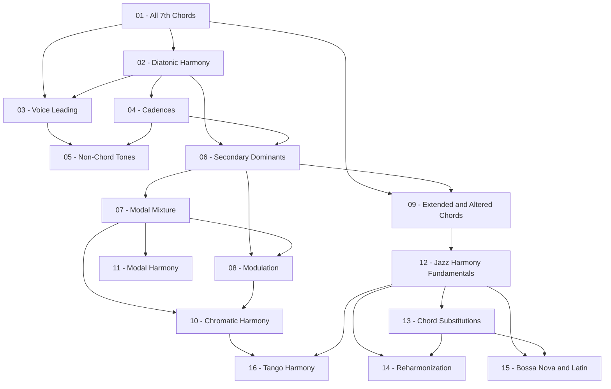

> **Topic**: Harmony Music Theory
> **Domain**: Music Theory (Other/Custom)
> **Level**: Intermediate (biết triads, dom7, modes, Roman numerals cơ bản)
> **Background**: Guitar/Bass chính, biết sơ piano, scales, intervals, modes, phân tích Roman numeral bài đơn giản
> **Styles**: Jazz & Blues, Classical, Bossa Nova, Tango
> **Goals**: Phân tích nhạc khi nghe, sáng tác, ứng tấu, lý thuyết thuần túy
> **Lesson Structure**: Motivation → Concept/Theory → Musical Examples → Guitar Application → Practice

---

## Lesson Structure (áp dụng cho mọi bài)

| Block | Nội dung |
|-------|---------|
| **Motivation** | Tại sao cần học khái niệm này? Âm nhạc nghe thế nào khi có/thiếu nó? |
| **Concept / Theory** | Định nghĩa, quy tắc, công thức nhạc lý — dùng ký hiệu Roman numeral + notation |
| **Musical Examples** | Phân tích đoạn nhạc thật từ Classical, Jazz, Bossa, Tango |
| **Guitar Application** | Voicing trên guitar, diagram cần thiết, chord shapes thực tế |
| **Practice** | Bài tập tự luyện — viết, phân tích, hoặc nghe |

---

## Module 0 — Nền Tảng (Foundation Solidification)

| # | Title | Key Concepts | Prerequisites | Difficulty |
|---|-------|-------------|---------------|------------|
| 01 | All 7th Chords — Từ Triad Đến Seventh | maj7, m7, dom7, m7b5, dim7, augM7 — cấu trúc & voicing | Biết triads | ★★☆☆☆ |
| 02 | Diatonic Harmony & Roman Numeral Mastery | Diatonic chords trong major/minor, chức năng Tonic/Subdominant/Dominant | 01 | ★★☆☆☆ |
| 03 | Voice Leading & Smooth Motion | Common tone, contrary motion, parallel 5th/8th, SATB basics | 01, 02 | ★★★☆☆ |

## Module 1 — Hòa Âm Chức Năng (Functional Harmony — Classical Core)

| # | Title | Key Concepts | Prerequisites | Difficulty |
|---|-------|-------------|---------------|------------|
| 04 | Cadences & Phrase Structure | PAC, IAC, HC, DC, PC — period & phrase architecture | 02 | ★★☆☆☆ |
| 05 | Non-Chord Tones | Passing, neighbor, suspension (4-3, 7-6, 9-8), appoggiatura, anticipation | 03, 04 | ★★★☆☆ |
| 06 | Secondary Dominants | V/V, V/ii, V/IV, V/vi — tonicization, chromatic alteration | 02, 04 | ★★★☆☆ |
| 07 | Modal Mixture & Borrowed Chords | bVII, bVI, iv trong major, parallel mode borrowing | 06 | ★★★☆☆ |
| 08 | Modulation | Pivot chord modulation, common tone mod, chromatic mod, closely/distantly related keys | 06, 07 | ★★★★☆ |

## Module 2 — Hòa Âm Mở Rộng (Extended & Chromatic Harmony)

| # | Title | Key Concepts | Prerequisites | Difficulty |
|---|-------|-------------|---------------|------------|
| 09 | Extended Chords & Altered Dominants | 9th/11th/13th chords, altered dominant (7#9, 7b9, 7#5, 7b5, 7alt) | 01, 06 | ★★★★☆ |
| 10 | Chromatic Harmony — Neapolitan & Augmented Sixths | bII (Neapolitan), It+6, Fr+6, Ger+6 — chức năng pre-dominant | 07, 08 | ★★★★☆ |
| 11 | Modal Harmony | Modes như harmonic centers, modal cadences, modal interchange hiện đại | 07 | ★★★☆☆ |

## Module 3 — Hòa Âm Jazz (Jazz Harmony)

| # | Title | Key Concepts | Prerequisites | Difficulty |
|---|-------|-------------|---------------|------------|
| 12 | Jazz Harmony Fundamentals | Jazz chord symbols, ii-V-I, chord-scale theory, guide tones | 09 | ★★★☆☆ |
| 13 | Chord Substitutions | Tritone substitution, related ii-V, backdoor dominant, chromatic approach | 12 | ★★★★☆ |
| 14 | Reharmonization | Chord planing, passing chords, approach chords, contrafact | 12, 13 | ★★★★★ |

## Module 4 — Style Đặc Trưng

| # | Title | Key Concepts | Prerequisites | Difficulty |
|---|-------|-------------|---------------|------------|
| 15 | Bossa Nova & Latin Harmony | Brazilian harmony, Jobim-style progressions, clave feel, samba/bossa rhythm-harmony link | 12, 13 | ★★★☆☆ |
| 16 | Tango Harmony | Argentine tango chromaticism, milonga, Piazzolla harmonic language, bandoneon voicings | 10, 12 | ★★★★☆ |

---

## Appendix Candidates

| ID | Content | Related Lesson | Notes |
|----|---------|----------------|-------|
| A0 | Chord Symbol & Roman Numeral Reference | Tất cả | Bảng tra nhanh: ký hiệu jazz ↔ Roman numeral ↔ intervals |
| A1 | Circle of Fifths & Key Relationships | 02, 08 | Modulation map, closely/distantly related keys |
| A2 | Chord-Scale Relationship Table | 12 | Mỗi chord type → scale phù hợp cho improvisation |
| A3 | Guitar Chord Voicing Library | 01, 09, 12 | Voicings thực tế trên guitar cho từng chord type |

---

## Dependency Graph

---

## Progress Tracker

- [ ] [[00-roadmap|00. Roadmap]]
- [ ] [[01-all-7th-chords|01. All 7th Chords — Từ Triad Đến Seventh]]
- [ ] [[02-diatonic-harmony|02. Diatonic Harmony & Roman Numeral Mastery]]
- [ ] [[03-voice-leading|03. Voice Leading & Smooth Motion]]
- [ ] [[04-cadences|04. Cadences & Phrase Structure]]
- [ ] [[05-non-chord-tones|05. Non-Chord Tones]]
- [ ] [[06-secondary-dominants|06. Secondary Dominants]]
- [ ] [[07-modal-mixture|07. Modal Mixture & Borrowed Chords]]
- [ ] [[08-modulation|08. Modulation]]
- [ ] [[09-extended-altered-chords|09. Extended Chords & Altered Dominants]]
- [ ] [[10-chromatic-harmony|10. Chromatic Harmony — Neapolitan & Augmented Sixths]]
- [ ] [[11-modal-harmony|11. Modal Harmony]]
- [ ] [[12-jazz-harmony-fundamentals|12. Jazz Harmony Fundamentals]]
- [ ] [[13-chord-substitutions|13. Chord Substitutions]]
- [ ] [[14-reharmonization|14. Reharmonization]]
- [ ] [[15-bossa-nova-latin-harmony|15. Bossa Nova & Latin Harmony]]
- [ ] [[16-tango-harmony|16. Tango Harmony]]
- [ ] [[a0-chord-symbol-reference|A0. Chord Symbol & Roman Numeral Reference]]
- [ ] [[a1-circle-of-fifths|A1. Circle of Fifths & Key Relationships]]
- [ ] [[a2-chord-scale-table|A2. Chord-Scale Relationship Table]]
- [ ] [[a3-guitar-voicing-library|A3. Guitar Chord Voicing Library]]
