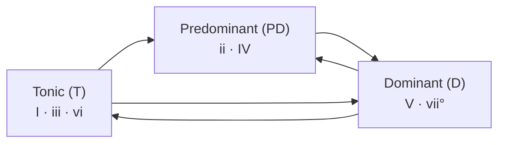

> **Prerequisites**: [[01-all-7th-chords|01. All 7th Chords]] — biết 6 loại seventh chord và công thức interval; biết major scale
> **Objectives**:
> - Xây dựng đầy đủ 7 diatonic triads và 7 diatonic seventh chords trong major key
> - Nắm 3 nhóm chức năng: Tonic (T), Predominant (PD), Dominant (D)
> - Đọc và viết Roman numeral analysis cho đoạn nhạc thực tế
> - Hiểu diatonic chords trong minor key (harmonic minor)
> - Nhận ra các progression cổ điển: I–IV–V–I, I–vi–ii–V, ii–V–I

---

## Motivation

Tưởng tượng bạn có 7 màu sơn — mỗi màu là một chord trong một key. Câu hỏi không phải "chord này là gì?" mà là **"chord này đang làm gì trong câu nhạc?"** Đó là điều Roman numeral analysis trả lời: không phải tên chord (Dm, Am...) mà là **vai trò chức năng** (ii, vi...).

Đây là tại sao hệ thống này mạnh đến vậy:

> Bài *Autumn Leaves* dùng vòng **ii–V–I–IV–vii°–III–vi** — nhìn vào Roman numeral, bạn nhận ra nó chỉ là vòng circle of fifths đi qua tất cả 7 chord diatonic.

Khi bạn phân tích nhạc bằng Roman numeral, bạn thấy **pattern** xuyên suốt mọi key, mọi phong cách. Một bài Jazz ở Bb và một bài Classical ở G major có thể dùng cùng một cấu trúc — chỉ khác màu key.

---

## Concept / Theory

### Diatonic Chords là gì?

> [!definition] Definition 2.1 — Diatonic Chords
> **Diatonic chords (hợp âm trong giọng)** là các chord được xây dựng bằng cách xếp chồng quãng ba (thirds) trên từng bậc của scale, **chỉ dùng các nốt có trong scale đó** — không thêm bất kỳ accidental nào.
>
> Với major scale 7 nốt → ta có đúng **7 diatonic chords** (1 chord mỗi bậc).

---

### Diatonic Triads trong Major Key

Lấy C major làm ví dụ. Xếp chồng thirds từng bậc:

```abc
X:1
T:7 Diatonic Triads — C Major
M:4/4
L:1/4
Q:80
K:C
"^I"[CEG]4 | "^ii"[DFA]4 | "^iii"[EGB]4 | "^IV"[FAc]4 | "^V"[GBd]4 | "^vi"[Ace]4 | "^viio"[Bdf]4 |]
```

> [!definition] Definition 2.2 — 7 Diatonic Triads (Major Key)
> | Roman | Chord (C major) | Loại | Tên bậc |
> |-------|----------------|------|---------|
> | **I** | C major | Major | Tonic |
> | **ii** | D minor | Minor | Supertonic |
> | **iii** | E minor | Minor | Mediant |
> | **IV** | F major | Major | Subdominant |
> | **V** | G major | Major | Dominant |
> | **vi** | A minor | Minor | Submediant |
> | **vii°** | B diminished | Diminished | Leading tone |
>
> *Quy tắc viết*: chữ hoa (I, IV, V) = major triad; chữ thường (ii, iii, vi) = minor triad; vii° = diminished.

**Mẹo nhớ**: Thứ tự loại chord luôn là **M–m–m–M–M–m–dim** trong mọi major key.

---

### Diatonic Seventh Chords trong Major Key

Thêm một nốt third nữa vào mỗi triad:

```abc
X:2
T:7 Diatonic Seventh Chords — C Major
M:4/4
L:1/4
Q:80
K:C
"^Imaj7"[CEGB]4 | "^iim7"[DFAc]4 | "^iiim7"[EGBd]4 | "^IVmaj7"[FAce]4 | "^V7"[GBdf]4 | "^vim7"[Aceg]4 | "^viio7"[Bdfa]4 |]
```

> [!definition] Definition 2.3 — 7 Diatonic Seventh Chords (Major Key)
> | Roman | Chord (C) | Loại | Từ Lesson 01 |
> |-------|----------|------|-------------|
> | **Imaj7** | Cmaj7 | Major 7th | M7 |
> | **iim7** | Dm7 | Minor 7th | m7 |
> | **iiim7** | Em7 | Minor 7th | m7 |
> | **IVmaj7** | Fmaj7 | Major 7th | M7 |
> | **V7** | G7 | Dominant 7th | dom7 |
> | **vim7** | Am7 | Minor 7th | m7 |
> | **viiø7** | Bm7♭5 | Half-diminished | m7♭5 |
>
> *Quan sát*: Trong major key, **chỉ V7 là dominant 7th** — đây là chord duy nhất có tension tự nhiên muốn giải về I.

---

### Ba Nhóm Chức Năng (Harmonic Functions)

Đây là khái niệm quan trọng nhất của toàn bộ harmony:

> [!definition] Definition 2.4 — Ba Nhóm Chức Năng
> Mỗi chord diatonic thuộc một trong ba nhóm chức năng, dựa trên **cảm giác** và **hướng chuyển động** của nó:
>
> | Nhóm | Ký hiệu | Chords (major) | Đặc điểm |
> |------|---------|----------------|----------|
> | **Tonic** | T | I, iii, vi | Ổn định, "home", điểm đến |
> | **Predominant** | PD | ii, IV | Trung gian, chuẩn bị cho Dominant |
> | **Dominant** | D | V, vii° | Căng thẳng, muốn giải về Tonic |

Luồng chuyển động cơ bản trong mọi tonal music:



> [!warning] Quy tắc quan trọng
> - **D → T**: chord kết (cadence) — luôn đúng và mạnh nhất
> - **T → PD → D → T**: vòng hoàn chỉnh — progression cảm giác "kể một câu chuyện"
> - **D → PD**: hiếm gặp, thường chỉ ở deceptive cadence (sẽ học Lesson 04)
> - **T → D**: bỏ qua PD — vẫn đúng, thường ngắn gọn hơn

---

### Chord Substitution Trong Cùng Nhóm

Vì các chord trong cùng nhóm chia sẻ nhiều common tone, chúng có thể **thay thế lẫn nhau**:

- **vi thay cho I** (cùng nhóm T): I → vi nghe như "lừa" — deceptive cadence
- **ii thay cho IV** (cùng nhóm PD): ii → V → I nghe "jazzy" hơn IV → V → I

```abc
X:3
T:IV vs ii — Cung chuc nang Predominant, am thanh khac nhau
M:4/4
L:1/4
Q:80
K:C
"^IV"[FAc]2 "^V"[GBd]2 | "^I"[CEG]4 || "^ii"[DFA]2 "^V"[GBd]2 | "^I"[CEG]4 |]
```

Nghe sự khác biệt: IV–V–I nghe "classical/folk", ii–V–I nghe "jazzy". Cùng chức năng, khác màu sắc.

---

### Diatonic Chords Trong Minor Key

Minor key phức tạp hơn vì có 3 dạng scale (natural, harmonic, melodic). Trong harmony thực tế, ta chủ yếu dùng **harmonic minor** vì nó cho V7 (dominant) tự nhiên:

> [!definition] Definition 2.5 — Diatonic Chords trong Harmonic Minor (key Am)
> | Roman | Chord (Am) | Loại | Chức năng |
> |-------|-----------|------|----------|
> | **i** | Am | minor | T |
> | **iiø** | Bm7♭5 | half-dim | PD |
> | **III+** | C augmented* | aug | T |
> | **iv** | Dm | minor | PD |
> | **V** | E major | major | D |
> | **VI** | F major | major | T |
> | **vii°** | G# diminished | dim | D |
>
> *III+ (augmented) hiếm dùng — thường thay bằng III (C major) từ natural minor.
>
> *Chú ý quan trọng*: V trong minor là **E major** (không phải Em!) vì ta raise leading tone G→G# trong harmonic minor. Đây chính là lý do harmonic minor được tạo ra.

```abc
X:4
T:Minor ii-V-i — Harmonic Minor (key Am)
M:4/4
L:1/4
Q:80
K:Amin
"^iio"[Bdf]2 "^V7"[E^GBd]2 | "^i"[Ace]4 |]
```

*Lưu ý ABC*: `^G` = G# (raised leading tone trong harmonic minor của Am).

---

## Musical Examples

### I–IV–V–I: Progression Nền Tảng Nhất

Đây là vòng harmony cơ bản nhất trong âm nhạc Tây phương — từ Church music thế kỷ 16 đến Rock hiện đại:

```abc
X:5
T:I-IV-V-I — C Major (progression co ban nhat)
M:4/4
L:1/4
Q:90
K:C
"^I"[CEG]4 | "^IV"[FAc]4 | "^V"[GBd]4 | "^I"[CEG]4 |]
```

Nghe tension: I (home) → IV (rời home) → V (căng thẳng muốn về) → I (resolved).

---

### I–vi–ii–V: Jazz Turnaround

Đây là "turnaround" (vòng kết thúc) phổ biến nhất trong Jazz — xuất hiện ở hàng nghìn standard:

```abc
X:6
T:I-vi-ii-V — Jazz Turnaround (C Major)
M:4/4
L:1/4
Q:100
K:C
"^Imaj7"[CEGB]2 "^vim7"[Aceg]2 | "^iim7"[DFAc]2 "^V7"[GBdf]2 |]
```

Với 7th chords, progression này nghe hoàn toàn "Jazz". Bạn sẽ nhận ra pattern này trong *Autumn Leaves*, *Blue Bossa*, *Misty*, và vô số bài khác.

---

### ii–V–I: Cốt Lõi của Jazz Harmony

```abc
X:7
T:ii-V-I — C Major, Jazz core progression
M:4/4
L:1/4
Q:100
K:C
"^iim7"[DFAc]4 | "^V7"[GBdf]4 | "^Imaj7"[CEGB]4 | z4 |]
```

Cảm giác tension → resolution rõ rệt nhất ở đây:
- **Dm7** (ii): nhẹ nhàng, chuẩn bị
- **G7** (V): căng thẳng rõ — tritone giữa B (3rd) và F (7th) muốn resolve
- **Cmaj7** (I): home, ấm, resolved

---

### Phân tích: *Autumn Leaves* — 8 bars đầu

*Autumn Leaves* là bài chuẩn để học diatonic harmony. 8 bars đầu (key G major / E minor):

```abc
X:8
T:Autumn Leaves — 4 bars dau (G major section)
M:4/4
L:1/4
Q:120
K:G
"^iim7"[Aceg]4 | "^V7"[DFAc]4 | "^Imaj7"[GBdf]4 | "^IVmaj7"[CEGB]4 |]
```

> [!note] Chú ý phân tích
> Thực ra *Autumn Leaves* dùng **chuỗi ii–V–I liên tiếp qua 2 key** (G major rồi E minor) — đây là kỹ thuật "sequential ii–V–I" cực kỳ quan trọng trong Jazz. Bạn sẽ học kỹ hơn ở Lesson 12, nhưng hãy nghe pattern này ngay bây giờ.

---

### Phân tích: *Misty* — Intro (Erroll Garner)

Một ví dụ Classical/Jazz hybrid, key E♭ major:

| Bar | Chord | Roman | Chức năng |
|-----|-------|-------|----------|
| 1 | E♭maj7 | Imaj7 | T |
| 2 | B♭7 | V7 | D |
| 3 | E♭maj7 | Imaj7 | T |
| 4 | Fm7 – B♭7 | iim7 – V7 | PD – D |
| 5 | E♭maj7 | Imaj7 | T |
| 6 | Cm7 | vim7 | T |
| 7 | Fm7 – B♭7 | iim7 – V7 | PD – D |
| 8 | E♭maj7 | Imaj7 | T (resolve) |

*Nhận xét*: 8 bars hoàn toàn diatonic, luân phiên T và D/PD → T. Đây là "câu nhạc" cổ điển nhất.

---

## Guitar Application

### Chơi Diatonic Triads "In Position" — Key of G

Thay vì nhảy khắp cần đàn, chơi tất cả 7 chord trong cùng một khu vực (position). Key G, position II–IV:

```
Dây: e  B  G  D  A  E
     (1)(2)(3)(4)(5)(6)

I   = Gmaj:   2  3  4  x  x  3   (G major open)
ii  = Am:     x  1  2  2  0  x   (Am open)
iii = Bm:     x  2  4  4  3  2   (Bm barre fret 2)
IV  = Cmaj:   0  1  0  2  3  x   (C major open)
V   = Dmaj:   2  3  2  0  x  x   (D major open)
vi  = Em:     0  0  0  2  2  0   (Em open)
vii = F#dim:  x  1  2  3  4  2   (rare — học sau)
```

> [!example] Thực hành Guitar 2.1
> Chơi vòng **I–IV–V–I** trong G major bằng open chords. Sau đó chơi **I–vi–ii–V** (G – Em – Am – D). Mục tiêu: chơi trơn tru, đều nhịp — không cần nhanh.

---

### Chơi Diatonic 7th Chords — Key of C, Jazz Comping

Dạng compact (không dây buông), tất cả ở khu vực fret 3–8:

```
Imaj7  (Cmaj7): x 3 5 4 3 x
iim7   (Dm7):   x 5 7 5 6 x
iiim7  (Em7):   x 7 9 7 8 x
IVmaj7 (Fmaj7): x 8 10 9 8 x
V7     (G7):    x 10 12 10 11 x
vim7   (Am7):   x 0 2 0 1 x (open position)
viiø7  (Bm7b5): x 2 3 2 3 x
```

> [!example] Thực hành Guitar 2.2 — ii–V–I trong C
> Chơi **Dm7 → G7 → Cmaj7** liên tục, 4 beats mỗi chord. Sau đó thử 2 beats mỗi chord. Tập nghe transition V7 → Imaj7 — đó là khoảnh khắc "home" quan trọng nhất trong Jazz.

---

## Practice

> [!example] Bài tập 2.1 — Xây dựng diatonic chords
> Xây dựng đầy đủ 7 diatonic seventh chords (với tên và loại) trong các key sau:
> - **G major** (có F#)
> - **F major** (có Bb)
> - **D major** (có F#, C#)
>
> Với mỗi key: điền vào bảng I–ii–iii–IV–V–vi–vii° với tên chord và loại (maj7/m7/dom7/ø7).

> [!example] Bài tập 2.2 — Phân tích Roman Numeral
> Xác định key và viết Roman numeral cho mỗi progression sau:
>
> 1. Am – F – C – G (key = ?)
> 2. Dmaj7 – G7 – Cmaj7 – Fmaj7 (key = ?)
> 3. Gm7 – C7 – Fmaj7 – Bb (key = ?)
> 4. Em – Am – D7 – G (key = ?)

> [!example] Bài tập 2.3 — Nghe và nhận diện chức năng
> Nghe (hoặc chơi) các ABC examples X:5, X:6, X:7. Với mỗi chord, nói to: "Tonic", "Predominant", hoặc "Dominant". Luyện cho đến khi phản xạ tự nhiên.

> [!example] Bài tập 2.4 — Sáng tác ngắn
> Viết một progression 8-bar trong key G major, chỉ dùng diatonic chords, tuân theo luồng T → PD → D → T. Mỗi chord kéo dài 2 beats. Có thể lặp lại pattern.

---

## Summary / Key Takeaways

- **Diatonic chords** = chỉ dùng nốt trong scale — major key cho M–m–m–M–M–m–dim (triads)
- **Diatonic 7th chords** major key: Imaj7, iim7, iiim7, IVmaj7, **V7**, vim7, viiø7
- **V7 là chord duy nhất** có dom7 tự nhiên trong major key → tension cao nhất
- **Ba chức năng**: Tonic (I, iii, vi) — Predominant (ii, IV) — Dominant (V, vii°)
- **Luồng cơ bản**: T → PD → D → T (có thể bỏ PD, nhưng không nhảy D → PD)
- **Minor key**: dùng harmonic minor để có V major (dominant) — V → i là cadence minor mạnh nhất
- **ii–V–I** = progression quan trọng nhất trong Jazz; **I–IV–V–I** = nền tảng Classical/Pop

---

## Đáp án Bài tập 2.2

1. Am – F – C – G → key **C major**: vi – IV – I – V
2. Dmaj7 – G7 – Cmaj7 – Fmaj7 → key **C major**: IImaj7 – V7 – Imaj7 – IVmaj7 *(Dmaj7 là non-diatonic! Đây là secondary dominant V/V — sẽ học Lesson 06)*
3. Gm7 – C7 – Fmaj7 – Bb → key **F major**: iim7 – V7 – Imaj7 – IV
4. Em – Am – D7 – G → key **G major**: vi – ii – V7 – I

---

## References

- Walter Piston — *Harmony* (5th ed.), Ch. 6–8: Diatonic Harmony & Harmonic Progression
- Open Music Theory — *Harmonic Functions* (openmusictheory.github.io)
- Mark Levine — *The Jazz Theory Book*, Ch. 2: The ii–V–I Progression
- Ian Quinn (Yale) — Functional Bass Theory
- *Autumn Leaves* (Joseph Kosma, 1945) — lead sheet analysis
