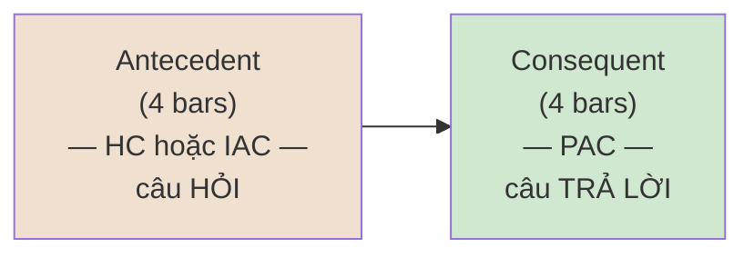

> **Prerequisites**: [[02-diatonic-harmony|02. Diatonic Harmony]] — Roman numerals, chức năng T/PD/D; [[03-voice-leading|03. Voice Leading]] — tendency tones, leading tone resolution
> **Objectives**:
> - Phân biệt và nghe được 5 loại cadence: PAC, IAC, HC, DC, PC
> - Hiểu cấu trúc phrase (4 bars) và period (8 bars = antecedent + consequent)
> - Nhận diện dấu câu hòa âm trong nhạc Classical, Jazz, Bossa Nova
> - Áp dụng vào phân tích bài thực tế và viết phrase cơ bản

---

## Motivation

Ngôn ngữ có dấu câu — dấu phẩy, chấm phẩy, chấm hỏi, chấm. Âm nhạc cũng vậy. **Cadence** chính là dấu câu của hòa âm, và nếu bạn không nhận ra chúng, bạn đang đọc một đoạn văn dài không có dấu ngắt — khó hiểu cấu trúc, khó cảm nhận chiều sâu.

Một nhạc sĩ lý giải hay về các loại cadence như sau:

> - **HC** (Half Cadence) = dấu **phẩy** — âm nhạc dừng lại tạm thời, nhưng câu chưa xong
> - **IAC** (Imperfect Authentic Cadence) = dấu **chấm phẩy** — kết thúc một ý, nhưng vẫn còn tiếp
> - **PAC** (Perfect Authentic Cadence) = dấu **chấm** — kết thúc hoàn toàn, rõ ràng
> - **DC** (Deceptive Cadence) = dấu **chấm hỏi** — bất ngờ, không như kỳ vọng
> - **PC** (Plagal Cadence) = dấu **chấm lửng...** — nhẹ nhàng, yên bình

Khi bạn phân tích một bản nhạc, việc xác định cadence ở đâu sẽ cho bạn biết **nhạc sĩ đang "nói" gì** — câu nào là câu hỏi, câu nào là câu trả lời, điểm nhấn ở đâu.

---

## Concept / Theory

### Cadence là gì?

> [!definition] Definition 4.1 — Cadence
> **Cadence (điểm kết)** là một chuỗi hai chord kết thúc phrase, tạo cảm giác nghỉ ngơi — hoàn chỉnh hoặc chưa hoàn chỉnh. Cadence xác định **mức độ đóng/mở** của một phrase:
> - **Conclusive cadence** (kết đóng): kết thúc trên tonic — I hoặc i
> - **Inconclusive cadence** (kết mở): kết thúc trên non-tonic — V, vi, v.v.

---

### 5 Loại Cadence

#### 1. PAC — Perfect Authentic Cadence (Điểm Kết Hoàn Hảo)

> [!definition] Definition 4.2 — PAC
> **Công thức**: V (hoặc V7) → I, cả hai chord ở **root position**, soprano kết thúc trên **bậc 1 (tonic)**
>
> Đây là cadence **mạnh nhất và hoàn chỉnh nhất** — "full stop" của âm nhạc.

```abc
X:1
T:PAC — Perfect Authentic Cadence in C
M:4/4
L:1/4
Q:80
K:C
V:1 name="Soprano"
d4 | c4 |]
V:2 name="Bass"
G,4 | C,4 |]
```

*Soprano: D→C (bậc 2→1, đi xuống step vào tonic) — PAC chuẩn.*

Dùng ở: cuối movement, cuối section, bất kỳ điểm kết lớn nào. Gần như mọi bản nhạc Classical kết thúc bằng PAC.

---

#### 2. IAC — Imperfect Authentic Cadence (Điểm Kết Chưa Hoàn Hảo)

> [!definition] Definition 4.3 — IAC
> **Công thức**: V → I, nhưng **thiếu** ít nhất một điều kiện của PAC:
> - Soprano không kết trên tonic (kết trên bậc 3 hoặc 5), **hoặc**
> - Một trong hai chord bị inversion (không ở root position)

```abc
X:2
T:IAC — Soprano ends on 3rd, not tonic
M:4/4
L:1/4
Q:80
K:C
V:1 name="Soprano"
d4 | e4 |]
V:2 name="Bass"
G,4 | C,4 |]
```

*Soprano: D→E (bậc 2→3) — không lên tonic, nên là IAC. Nghe vẫn "kết" nhưng "lơ lửng" hơn PAC.*

Dùng ở: cuối antecedent phrase (câu hỏi) trong period structure, hoặc kết thúc section trung gian.

---

#### 3. HC — Half Cadence (Điểm Kết Nửa Chừng)

> [!definition] Definition 4.4 — HC
> **Công thức**: Bất kỳ chord nào → **V** (dominant)
>
> Thường gặp: I→V, ii→V, IV→V. Kết thúc trên dominant = "câu hỏi", âm nhạc phải tiếp tục.

```abc
X:3
T:HC — Ending on V, "question mark"
M:4/4
L:1/4
Q:80
K:C
V:1 name="Soprano"
c4 | d4 |]
V:2 name="Bass"
F,4 | G,4 |]
```

*IV→V: kết thúc trên G major (dominant). Nghe như nhạc "lơ lửng", chờ tiếp.*

**Phrygian Half Cadence** (đặc biệt): iv⁶→V trong minor key — bass đi xuống half step (Fa→Mi), rất dramatic:

```abc
X:4
T:Phrygian HC — iv6 to V in Am
M:4/4
L:1/4
Q:80
K:Amin
V:1 name="Soprano"
c4 | B4 |]
V:2 name="Bass"
F,4 | E,4 |]
```

*Bass: F→E (half step ↓) — điển hình Baroque và Flamenco.*

---

#### 4. DC — Deceptive Cadence (Điểm Kết Lừa)

> [!definition] Definition 4.5 — DC (Deceptive/Interrupted Cadence)
> **Công thức**: V → **vi** (thay vì I như kỳ vọng)
>
> Tai nghe V và *kỳ vọng* I — nhưng nhạc sĩ cho vi (submediant). Hiệu ứng: bất ngờ, kéo dài, tạo cảm xúc "lửng lơ".

```abc
X:5
T:DC — V goes to vi instead of I
M:4/4
L:1/4
Q:80
K:C
V:1 name="Soprano"
d4 | c4 |]
V:2 name="Bass"
G,4 | A,4 |]
```

*Bass kết trên A (vi = Am) thay vì C (I). Soprano C là common tone giữa G major và A minor — chuyển mượt mà nhưng bất ngờ.*

DC cực kỳ hiệu quả để: kéo dài coda, tạo drama trước PAC cuối cùng, hoặc mở ra section mới.

---

#### 5. PC — Plagal Cadence (Điểm Kết Giáo Đường)

> [!definition] Definition 4.6 — PC (Plagal/Amen Cadence)
> **Công thức**: IV → I
>
> Còn gọi là "Amen cadence" vì được dùng sau mọi bài hymn/thánh ca. Nghe "thần thánh", yên bình, không có tension mạnh.

```abc
X:6
T:PC — Plagal "Amen" Cadence
M:4/4
L:1/4
Q:80
K:C
V:1 name="Soprano"
a4 | g4 |]
V:2 name="Bass"
F,4 | C,4 |]
```

*IV→I không có V, không có leading tone tension — cảm giác "settle" nhẹ nhàng.*

---

### Bảng Tổng Hợp 5 Cadences

| Loại | Công thức | Kết thúc trên | Cảm giác | Dùng khi |
|------|----------|--------------|----------|---------|
| **PAC** | V(7)→I, root pos., soprano=1 | Tonic | Hoàn chỉnh, đóng | Cuối piece/section lớn |
| **IAC** | V→I, nhưng inverted hoặc soprano≠1 | Tonic | Kết nhưng chưa xong | Cuối antecedent, section trung |
| **HC** | ?→V | Dominant | Mở, chờ tiếp | Giữa period (câu hỏi) |
| **DC** | V→vi | Submediant | Bất ngờ, lừa | Drama, kéo dài coda |
| **PC** | IV→I | Tonic | Yên bình, "Amen" | Sau PAC, coda nhẹ nhàng |

---

### Phrase và Period — Kiến Trúc Câu Nhạc

> [!definition] Definition 4.7 — Phrase
> **Phrase (câu nhạc)** = một đơn vị âm nhạc hoàn chỉnh, thường **4 bars**, kết thúc bằng một cadence. Giống như một câu văn: có mở đầu, phát triển, và kết thúc.

> [!definition] Definition 4.8 — Period
> **Period (đoạn nhạc)** = hai phrase đặt cạnh nhau theo quan hệ **antecedent–consequent (câu hỏi–câu trả lời)**:
> - **Antecedent** (4 bars): kết bằng cadence yếu — HC hoặc IAC
> - **Consequent** (4 bars): kết bằng cadence mạnh hơn — PAC (thường)
>
> Tổng: **8 bars**, là đơn vị form cơ bản của Classical music.



**Parallel period**: cả hai phrase bắt đầu với **cùng melodic material** — antecedent (a), consequent (a')
**Contrasting period**: hai phrase bắt đầu **khác nhau** — antecedent (a), consequent (b)

---

## Musical Examples

### Mozart Piano Sonata K.331 — Parallel Period Chuẩn Mực

Theme nổi tiếng nhất về period structure trong lịch sử âm nhạc (key A major):

```abc
X:7
T:Mozart K.331 — Parallel period structure (simplified, key C)
M:3/4
L:1/4
Q:120
K:C
V:1 name="Melody"
c2 e | g2 e | f2 d | e3 |
c2 e | g2 a | g2 f | e3 |]
V:2 name="Harmony"
C,3 | C,3 | G,3 | G,3 |
C,3 | C,3 | G,3 | C,3 |]
```

*Phân tích*:
- **Bar 1–4** (Antecedent): kết thúc trên E với bass G → **HC** (câu hỏi)
- **Bar 5–8** (Consequent): cùng melody nhưng bar 7–8 đổi → kết trên C với bass C → **PAC** (câu trả lời)
- Hai phrase bắt đầu giống nhau (C–E–G) → **Parallel period**

---

### Deceptive Cadence trong Thực Tế — *Für Elise* (Beethoven)

Beethoven dùng DC để tạo surprise trước khi kết:

```abc
X:8
T:Fur Elise — Deceptive cadence pattern (simplified)
M:3/4
L:1/4
Q:100
K:Amin
V:1 name="Melody"
e2 ^d | e2 ^d | e2 B | d2 c |
B3 | z2 E | ^G2 E | B3 |]
V:2 name="Harmony"
z3 | z3 | z3 | z3 |
A,3 | C3 | E,3 | A,3 |]
```

*Bar 5*: kết trên Am (tonic i) — IAC
*Bar 7*: E major (V) — tension
*Bar 8*: kết trên Am — lần này là PAC trong minor

Pattern: trong A minor, V→i (E→Am) là PAC. Beethoven thường delay resolution bằng deceptive cadence trước khi cho PAC cuối.

---

### Jazz Standard — Cadences trong *Fly Me to the Moon*

*Fly Me to the Moon* (Frank Sinatra) là ví dụ đẹp về cadences trong Jazz standard (key C):

| Bars | Chord | Cadence | Chức năng |
|------|-------|---------|----------|
| 1–2 | Am7 – Dm7 | — | T → PD |
| 3–4 | G7 – Cmaj7 | **IAC** (soprano = E, bậc 3) | V→I (chưa hoàn chỉnh) |
| 5–6 | Fmaj7 – Bm7b5 | — | PD → ? |
| 7–8 | E7 – Am7 | **PAC minor** | V→i trong Am |
| 9–12 | Dm7–G7–Cmaj7 | **PAC major** | ii–V–I kết |

*Nhận xét*: bài dùng cả PAC major (C) lẫn PAC minor (Am) — tạo cảm giác ambiguous giữa C major và A minor (relative keys). Đây là kỹ thuật đặc trưng của Jazz standard.

---

### Bossa Nova — Phrase Structure trong *Wave* (Tom Jobim)

Jobim xây dựng phrases asymmetric (không đều 4+4 bar) — một đặc điểm của Bossa Nova:

```abc
X:9
T:Wave-style phrase — HC then PAC
M:4/4
L:1/4
Q:110
K:D
V:1 name="Melody"
"^Dmaj7"f4 | "^G7"g2 e2 | "^Dmaj7"f4 | "^E7"^c4 |
"^A7"e4 | "^Dmaj7"d4 |]
V:2 name="Bass"
D,4 | G,4 | D,4 | E,4 |
A,4 | D,4 |]
```

*Phân tích*:
- **Bar 1–4**: Dmaj7 → G7 → Dmaj7 → E7 — kết trên E7 (dominant của A7 = V/V) → **HC extended**
- **Bar 5–6**: A7 → Dmaj7 — **PAC** (V→I trong D major)
- 6-bar phrase (bất đối xứng) — đặc trưng Jobim, không bị ép vào khuôn 4+4

---

### Classical — Double Period trong Beethoven *Für Elise*

Structure tổng quát của *Für Elise* phần A:

```
Phrase 1 (4 bars): Am ... E7 → Am    IAC (V→i, soprano trên bậc 3)
Phrase 2 (4 bars): Am ... E7 → Am    IAC
Phrase 3 (4 bars): Am ... E7 → Am    IAC
Phrase 4 (4 bars): Am ... E7 → Am    PAC (kết đầy đủ)
```

Đây là **double period** (4 phrases, chỉ phrase 4 mới PAC) — tạo ra cảm giác "lang thang" trước khi kết, rất đặc trưng của Beethoven.

---

## Guitar Application

### Nghe Cadence Khi Chơi

Cách đơn giản nhất để tập nghe cadence trên guitar: tự chơi và **đặt tên** cho từng điểm kết.

> [!example] Thực hành Guitar 4.1 — Chơi và nhận diện
> Chơi vòng sau trong C major (dùng open chords):
>
> ```
> C → Am → F → G   (kết ở G = HC)
> C → Am → F → G → C   (kết ở C = PAC)
> C → Am → F → G → Am  (kết ở Am = DC!)
> ```
>
> Nghe sự khác biệt giữa 3 kết thúc. Cái thứ ba (DC) nghe bất ngờ vì tai kỳ vọng C nhưng lại nghe Am.

---

### Viết Phrase 8 Bar Cơ Bản

Cấu trúc period đơn giản nhất để áp dụng lên guitar/sáng tác:

```
Bar 1–2: I → IV      (T → PD)
Bar 3–4: V → V       (D, kéo dài) → [HC]
Bar 5–6: I → IV      (T → PD, lặp lại)
Bar 7–8: V7 → I      (D → T) → [PAC]
```

```abc
X:10
T:8-bar period template — C major
M:4/4
L:1/4
Q:100
K:C
V:1 name="Chord tones"
"^I"e4 | "^IV"f4 | "^V"g4 | "^V"g4 |
"^I"e4 | "^IV"f4 | "^V7"f4 | "^I"e4 |]
V:2 name="Bass"
C,4 | F,4 | G,4 | G,4 |
C,4 | F,4 | G,4 | C,4 |]
```

*Bar 4 kết ở G (HC), bar 8 kết ở C (PAC)* — 8-bar parallel period hoàn chỉnh.

---

## Practice

> [!example] Bài tập 4.1 — Xác định Cadence
> Xác định loại cadence (PAC/IAC/HC/DC/PC) cho mỗi progression sau:
>
> 1. Key C: ... → G7 → **Am** (kết thúc ở Am)
> 2. Key G: ... → D7 → **G** (soprano = G, root position)
> 3. Key F: ... → **C7** (kết thúc ở C7)
> 4. Key Bb: ... → Bb/D → **Bb** (Bb chord, nhưng soprano = D)
> 5. Key Am: ... → **E7** (kết thúc ở E7)

> [!example] Bài tập 4.2 — Phân tích Period
> Phân tích progression 8-bar sau:
>
> Bar 1: Cmaj7 — Bar 2: Am7 — Bar 3: Dm7 — Bar 4: G7
> Bar 5: Cmaj7 — Bar 6: Am7 — Bar 7: Dm7 — Bar 8: G7 → Cmaj7
>
> Câu hỏi: (a) Bar 4 kết thúc bằng cadence gì? (b) Bar 8 kết thúc bằng cadence gì? (c) Đây là parallel hay contrasting period?

> [!example] Bài tập 4.3 — Sáng tác 8 bars
> Viết một period 8-bar trong key G major, tuân theo:
> - Antecedent (bar 1–4): kết bằng HC (bar 4 = D major)
> - Consequent (bar 5–8): cùng mở đầu với antecedent, kết bằng PAC (bar 8 = G major, soprano = G)
> - Chỉ dùng diatonic chords

> [!example] Bài tập 4.4 — Nghe
> Nghe *Für Elise* (Beethoven) và xác định:
> - Cadence ở bar 4 là gì?
> - Cadence ở bar 8 là gì?
> - Toàn bộ 8-bar là period hay phrase group?

---

## Summary / Key Takeaways

- **5 cadences**: PAC (V→I hoàn chỉnh) > IAC (V→I chưa hoàn chỉnh) > HC (→V) > DC (V→vi) > PC (IV→I)
- **PAC** = mạnh nhất — root position, soprano = tonic; **HC** = mở nhất — kết trên V
- **DC** (deceptive) = "lừa" — V kỳ vọng đến I nhưng đến vi; tạo dramatic effect
- **Phrase** = 4 bars kết thúc bằng cadence; **Period** = antecedent (HC/IAC) + consequent (PAC) = 8 bars
- **Parallel period**: hai phrase cùng mở đầu (a + a'); **contrasting**: khác nhau (a + b)
- Trong Jazz: cadences tương tự Classical nhưng "mềm" hơn — IAC rất phổ biến, PAC thường có 7th chord
- Bossa Nova thường dùng phrases asymmetric (6-bar, 5-bar) thay vì khuôn cứng 4+4

---

## Đáp án Bài tập 4.1

1. G7 → Am: **DC** (V→vi, lừa về Am thay vì C)
2. D7 → G (soprano G, root position): **PAC**
3. Kết thúc ở C7: **HC** (dominant của F major)
4. Bb/D → Bb (soprano D, bậc 3): **IAC** (V→I nhưng soprano ≠ tonic)
5. Kết thúc ở E7 trong Am: **HC** (dominant of Am)

---

## References

- Walter Piston — *Harmony* (5th ed.), Ch. 9: Cadences
- William Caplin — *Classical Form: A Theory of Formal Functions*, Ch. 3
- Open Music Theory — *Cadences* và *The Period* (musictheory.pugetsound.edu)
- Wikipedia — *Cadence (music)*
- *Fly Me to the Moon* (Bart Howard, 1954) — Jazz standard analysis
- Tom Jobim — *Wave* (1967) — Bossa Nova phrase structure
