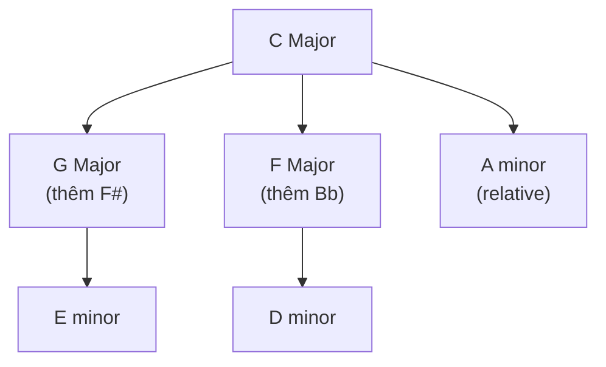
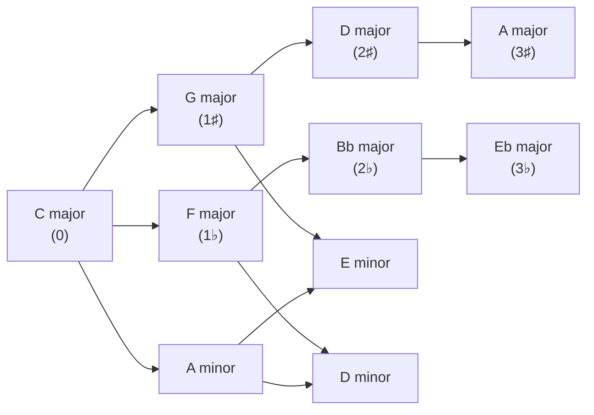

> **Prerequisites**: [[02-diatonic-harmony|02. Diatonic Harmony]], [[06-secondary-dominants|06. Secondary Dominants]], [[07-modal-mixture|07. Modal Mixture]] — Roman numerals, tonicization, borrowed chords, circle of fifths
> **Objectives**:
> - Phân biệt tonicization, modulation, và mode change
> - Nắm circle of fifths và khái niệm closely/distantly related keys
> - Thực hiện được 3 kỹ thuật modulation chính: pivot chord, direct, common tone
> - Nhận ra modulation trong nhạc thực tế qua accidentals và cadences mới
> - Phân tích modulation trong Jazz standards và Classical music

---

## Motivation

Hình dung bạn đang nghe một bản nhạc trong C major — tất cả nghe quen thuộc, ổn định. Rồi nhạc sĩ dẫn bạn sang G major, rồi E minor, rồi bất ngờ nhảy sang Eb major. Mỗi lần chuyển key là một **cảm giác mới** — như đang đi vào một căn phòng khác.

Khác với tonicization (chỉ "ghé thăm" trong 1–2 chord), **modulation** thật sự **đổi nhà** — key mới được thiết lập bằng cadence, kéo dài ít nhất một phrase, và tonic cũ tạm thời bị "quên đi".

Jazz standards thường modulate qua 3–4 key trong một bài. Classical sonata đi từ tonic sang dominant ở exposition, rồi modulate qua nhiều key khác ở development. Biết nghe và phân tích modulation là biết đọc bản đồ của âm nhạc.

---

## Concept / Theory

### Phân Biệt 3 Khái Niệm

> [!definition] Definition 8.1 — Tonicization, Modulation, Mode Change
>
> | Khái niệm | Thời gian | Cadence mới? | Cảm giác |
> |-----------|----------|-------------|---------|
> | **Tonicization** | 1–2 chord | Không | "Ghé thăm" |
> | **Modulation** | ≥ 1 phrase | **Có** | "Đổi nhà" |
> | **Mode change** | Cùng root | Không đổi tonic | I → i (C major → C minor) |
>
> *Điều kiện modulation*: phải có **cadence** xác nhận key mới (thường PAC hoặc IAC trong key mới).

---

### Circle of Fifths và Closely Related Keys

> [!definition] Definition 8.2 — Closely Related Keys
> Hai key được gọi là **closely related (gần nhau)** nếu key signature của chúng chỉ khác nhau **nhiều nhất 1 accidental** (1 sharp hoặc 1 flat).
>
> Với mỗi major key, có **5 closely related keys**:
> - Key dominant (V) — thêm 1 sharp
> - Key subdominant (IV) — thêm 1 flat
> - Relative minor (vi)
> - Relative minor của dominant
> - Relative minor của subdominant



*Modulation đến closely related keys* → dễ, nhiều common chords, nghe smooth.
*Modulation đến distantly related keys* → cần kỹ thuật đặc biệt (chromatic pivot, enharmonic).

---

### Kỹ Thuật 1: Pivot Chord Modulation (Phổ Biến Nhất)

> [!definition] Definition 8.3 — Pivot Chord Modulation
> Dùng một chord **diatonic trong cả hai key** làm "cầu nối" — chord đó có một function trong key cũ và một function khác trong key mới.
>
> **Ký hiệu**: viết dual Roman numeral tại điểm pivot:
> ```
> old key:  I  –  IV  –  [vi = ii/new]  –  V/new  –  I/new
>                         ↑ pivot chord
> new key:                [ii]           –  V      –  I
> ```

**Ví dụ**: Modulate từ C major → G major

C major và G major share 4 common chords: C(I/IV), Em(iii/vi), G(V/I), Am(vi/ii)

```abc
X:1
T:Pivot chord modulation — C major to G major
M:4/4
L:1/4
Q:90
K:C
"^I (C)"[CEG]4 | "^IV (C)"[FAc]4 | "^vi/ii* (C/G)"[Ace]4 | "^V (G)"[GBd]4 | "^I (G)"[GBd]4 |]
```

*Bar 3*: Am = **vi** trong C major, đồng thời = **ii** trong G major → pivot chord!
*Bar 4*: D7 (V của G) → xác nhận key mới G major
*Annotation*: viết `[vi = ii]` tại chord Am.

---

### Kỹ Thuật 2: Direct Modulation (Phrase Modulation)

> [!definition] Definition 8.4 — Direct Modulation
> Nhảy thẳng sang key mới **không có pivot chord** — thường xảy ra ở cuối phrase, bắt đầu phrase mới trong key mới.
>
> **Cảm giác**: đột ngột, dramatic, "bạo lực" — hoặc rất natural nếu nghe quen.
>
> **Phổ biến nhất trong**: Pop/Rock (half-step up để climax), Jazz (phrase ending → new key), Gospel.

```abc
X:2
T:Direct modulation — C to Db (half-step up, pop climax)
M:4/4
L:1/4
Q:100
K:C
"^I"[CEG]4 | "^IV"[FAc]4 | "^V"[GBd]4 | "^I"[CEG]4 |
[K:_D]"^I (Db!)"[_D_FA]4 | "^IV"[_G_Bd]4 | "^V"[_A_ce]4 | "^I"[_D_FA]4 |]
```

*Bar 5*: key đổi sang Db major không chuẩn bị. Tai nghe bị "đẩy lên" — energy tăng đột ngột. Kỹ thuật này dùng trong climax của hàng nghìn bài Pop, Gospel, R&B (*Man in the Mirror* — Michael Jackson).

---

### Kỹ Thuật 3: Common Tone Modulation

> [!definition] Definition 8.5 — Common Tone Modulation
> Một **nốt đơn** (không phải chord) được giữ nguyên qua key change — nốt đó có một vai trò trong key cũ và vai trò khác trong key mới.
>
> **Hiệu quả nhất với**: chromatic mediant keys (cách nhau M3 hoặc m3).

**Ví dụ**: C major → Eb major, common tone = G (P5 của C, P3 của Eb)

```abc
X:3
T:Common tone modulation — C to Eb via G
M:4/4
L:1/4
Q:80
K:C
"^I"[CEG]4 | "^V"[GBd]4 |
[K:_E]"^bIII (Eb!) - G is common tone"[_EG_B]4 | "^I (Eb)"[_EG_B]4 |]
```

*G* là P5 của C major (I chord) và P3 của Eb major (I chord) — cùng một nốt, hai vai trò. Nghe như "ánh sáng đột ngột thay đổi màu".

---

### Nhận Ra Modulation Trong Score

Khi phân tích nhạc, tìm modulation bằng:

1. **Accidentals liên tục** không phải secondary dominant — nhiều # hoặc b mới xuất hiện
2. **Cadence mới** — V→I trong key khác, đặc biệt PAC
3. **Roman numeral không khớp** với key hiện tại
4. **"First chord that makes no sense"** trong key cũ → đó thường là điểm pivot hoặc bắt đầu key mới

> [!note] Mẹo phân tích
> Đi ngược từ cadence: tìm V7→I trong key mới, rồi đi ngược để xác định điểm pivot.

---

## Musical Examples

### Classical — Sonata Form: Tonic → Dominant

Trong Classical sonata, exposition thường modulate từ **I → V** (major) hoặc **i → III** (minor). Đây là modulation cơ bản và quan trọng nhất:

```abc
X:4
T:Sonata-style modulation — C major to G major
M:4/4
L:1/4
Q:100
K:C
"^I"[CEG]4 | "^V"[GBd]4 | "^vi = ii*"[Ace]4 | "^V7/G"[D^FAc]4 | "^I (G)"[GBd]4 |]
```

*Bar 3* = pivot: Am là **vi** trong C, **ii** trong G
*Bar 4* = D7, V7 của G → xác nhận modulation
*Bar 5* = G major, home key mới

*Nhận xét*: F# trong D7 (bar 4) là dấu hiệu đầu tiên key đang đổi sang G.

---

### Jazz Standard — *Autumn Leaves*: Dual-Key Structure

*Autumn Leaves* là ví dụ hoàn hảo về **dual-key modulation** trong Jazz — toàn bài oscillate giữa G major và E minor:

| Section | Bars | Key | Kỹ thuật |
|---------|------|-----|---------|
| A1 (phrase 1–2) | 1–4 | G major | Pivot: Am = vi/G = ii/G |
| A2 (phrase 3–4) | 5–8 | E minor | B7 (V/vi) → Em (i) |
| B (phrase 5–8) | 9–16 | Return G→Em cycle | Sequential |

Đây không phải "modulation thật sự" theo nghĩa Classical — mà là **tonal ambiguity**, key của bài là "G major / E minor" đồng thời. Rất đặc trưng Jazz.

---

### Jazz Standard — *Blue Bossa*: Direct Modulation

*Blue Bossa* (Kenny Dorham) nổi tiếng với direct modulation bất ngờ giữa hai key cách nhau tritone:

```abc
X:5
T:Blue Bossa — Direct modulation C minor to Db major
M:4/4
L:1/4
Q:110
K:Cmin
"^Cm7"[C_EG_B]4 | "^Fm7"[F_Ac_e]4 | "^Dm7b5"[D_FAc]4 | "^G7"[G_Bdf]4 |
[K:_D]"^Dbmaj7"[_D_FAc]4 | "^Gb7"[_GBD_F]4 | "^Dbmaj7"[_D_FAc]4 | z4 |]
```

*Bar 5*: Dbmaj7 xuất hiện sau G7 (dominant của Cm) — thay vì resolve về Cm, nhạc nhảy thẳng sang Db major. Đây là direct modulation — tritone away (C → Db = half step). Cảm giác surprise hoàn toàn, rất đặc trưng Bossa Nova.

---

### Pop — Half-Step Up Modulation

Kỹ thuật "truck driver modulation" hay "climax key change" — đơn giản nhất nhưng hiệu quả nhất trong Pop:

```abc
X:6
T:Pop climax modulation — G to Ab (half step up)
M:4/4
L:1/4
Q:120
K:G
"^I"[GBd]4 | "^IV"[ceg]4 | "^I"[GBd]4 | "^V"[DFA]4 |
[K:_A]"^I (Ab!)"[_A_CE]4 | "^IV"[_D_FA]4 | "^I"[_A_CE]4 | "^V"[_EG_B]4 |]
```

Không có pivot chord — nhảy thẳng. Energy tăng ngay lập tức vì tất cả nốt đều cao hơn nửa cung.

---

### Classical — Schubert: Common Tone Modulation (Chromatic Mediant)

Schubert nổi tiếng với những common tone modulation bất ngờ sang chromatic mediant keys:

```abc
X:7
T:Schubert-style chromatic mediant — C to Ab via C common tone
M:4/4
L:1/4
Q:72
K:C
"^I"[CEG]4 | "^I"[CEG]2 z2 |
[K:_A]"^bVI (Ab!) - C is common tone"[_A_CE]4 | "^V7 (Ab)"[EGBD]4 |]
```

*C* là root của I trong C major = minor 3rd của Ab major. Schubert giữ C như common tone, key đổi hoàn toàn — nghe như "ánh sáng thay đổi đột ngột".

---

## Closely Related Keys — Circle of Fifths Reference



*Closely related* = 1 bước trên vòng này. *Distantly related* = 3+ bước. *Tritone* = đối diện (C ↔ F#) — xa nhất.

---

## Guitar Application

### Nhận Ra Modulation Khi Chơi

> [!example] Guitar Practice 8.1 — Pivot chord modulation C → G
> Chơi progression sau và nhận ra điểm pivot:
>
> ```
> C  → F  → Am → D7 → G
> I     IV   vi     V7/G  I(G)
>              ↑ pivot: Am = vi(C) = ii(G)
> ```
>
> Tập cảm nhận khoảnh khắc tai "chuyển tông" — thường xảy ra khi nghe D7 (có F#).

> [!example] Guitar Practice 8.2 — Direct modulation trong Jazz
> Nghe và chơi *Blue Bossa* (lead sheet). Ở bar 9, chord Dbmaj7 xuất hiện đột ngột sau G7. Khoảnh khắc đó là direct modulation. Nhận ra bằng cách: trước đó toàn Cm chord family, rồi bỗng dưng có Db, Eb, Gb — tất cả flat keys.

---

## Practice

> [!example] Bài tập 8.1 — Tìm pivot chord
> Trong modulation từ **F major → C major**, tìm ít nhất 3 common chords (cùng chất lượng và root) có thể dùng làm pivot. Với mỗi chord: viết function trong cả hai key.

> [!example] Bài tập 8.2 — Phân tích modulation
> Progression sau modulate ở đâu, sang key nào?
>
> Key gốc C major:
> C – G – Am – Em – F – C – **F# dim7** – **B7** – **Em** – Am – D7 – G – C
>
> (a) Tìm điểm modulation và key mới
> (b) Chord nào là pivot chord?
> (c) Sau khi modulate, key trở về C như thế nào?

> [!example] Bài tập 8.3 — Viết modulation
> Viết một progression 8-bar modulate từ **G major → D major** dùng pivot chord:
> - Bar 1–3: G major diatonic
> - Bar 4: pivot chord (gợi ý: Em = vi/G = ii/D)
> - Bar 5: V7 của D (A7)
> - Bar 6–8: D major, kết bằng PAC

> [!example] Bài tập 8.4 — Nghe
> Nghe *Blue Bossa* (bất kỳ version nào). Xác định:
> - Bar bao nhiêu modulate sang Db?
> - Sau bao nhiêu bars, nhạc trở về Cm?
> - Kỹ thuật modulation là gì (pivot / direct / common tone)?

---

## Summary / Key Takeaways

- **Modulation** = đổi key thật sự, cần cadence xác nhận — khác với tonicization (mini-mod, không cần cadence)
- **Closely related keys** = chênh 1 accidental trên circle of fifths — 5 keys gần nhất
- **Kỹ thuật 1 — Pivot chord**: dùng chord diatonic trong cả 2 key → smooth, cổ điển nhất
- **Kỹ thuật 2 — Direct**: nhảy thẳng không chuẩn bị → dramatic; phổ biến Pop/Jazz
- **Kỹ thuật 3 — Common tone**: giữ một nốt, key đổi xung quanh → Schubert, cinematic
- **Tìm pivot chord**: `[vi = ii]`, `[IV = I]`, `[I = V]` — viết dual Roman numeral
- **Nhận ra modulation**: tìm accidentals liên tục + cadence mới
- **Jazz**: thường dùng direct modulation, hoặc tonal ambiguity (dual-key) thay vì pivot
- **Pop**: half-step up direct modulation = "truck driver modulation" — climax kinh điển
- **Classical sonata**: I → V (major) hoặc i → III (minor) là modulation cơ bản nhất

---

## Đáp án Bài tập 8.1 (F major → C major)

F major: F–G–Am–Bb–C–Dm–E°
C major: C–Dm–Em–F–G–Am–B°

Common chords (pivot candidates):
1. **C major** → I trong F major, **V** trong C major
2. **Am** → iii trong F major, **vi** trong C major
3. **Dm** → vi trong F major, **ii** trong C major
4. **G major** → không diatonic trong F... wait, V trong C nhưng không trong F.

Chính xác: F major (F–G–A–Bb–C–D–E), C major (C–D–E–F–G–A–B):
- **Dm**: vi trong F = **ii** trong C ✓
- **Am**: iii trong F = **vi** trong C ✓
- **C**: I trong F hoặc... C major = **I** trong C → tốt nhất!

---

## Đáp án Bài tập 8.2

Progression: C – G – Am – Em – F – C – **F#dim7** – **B7** – **Em** – Am – D7 – G – C

- **Điểm modulation**: tại F#dim7 (hoặc B7) — cả hai không thuộc C major
- **Key mới**: **E minor** (B7 = V7 của E minor)
- **Pivot chord**: Am = vi trong C major = **iv trong E minor**
- **Trở về C**: D7 → G → C (V7 → I → I trong C) — G major là V của C và I của G → modulate lại về C

---

## References

- Walter Piston — *Harmony* (5th ed.), Ch. 18–19: Modulation
- Open Music Theory — *Chromatic Modulation* (viva.pressbooks.pub)
- Wikipedia — *Modulation (music)*
- Milne Publishing — *Fundamentals, Function, and Form*, Ch. 28
- Kaitlin Bove — *Chromatic Modulation*
- *Blue Bossa* (Kenny Dorham, 1962) — tritone direct modulation
- *Autumn Leaves* (Joseph Kosma, 1945) — dual-key structure
