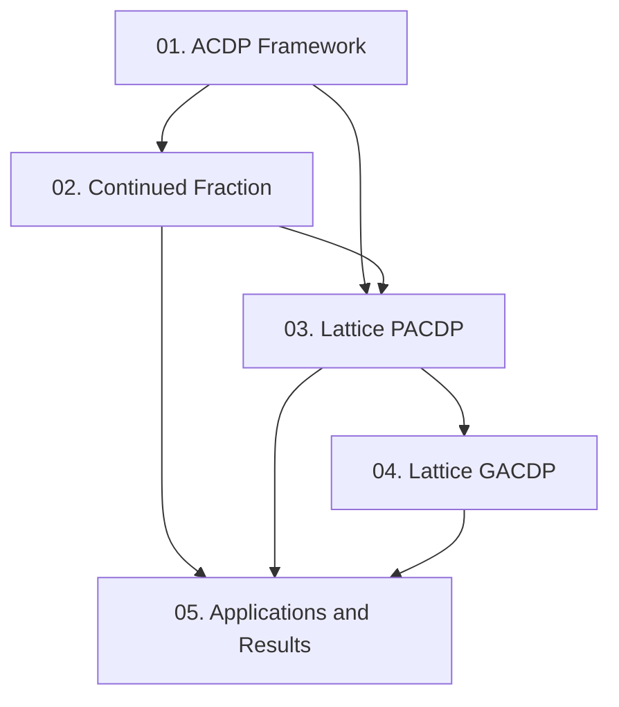

Paper này tổng quát hóa kỹ thuật Coppersmith/Boneh-Durfee sang **Approximate Common Divisor Problem (ACDP)**: cho hai số nguyên chỉ biết gần đúng, hãy khôi phục ước chung lớn của chúng. Course distill toàn bộ 7 sections — từ định nghĩa bài toán, hai phương pháp giải (continued fraction và lattice), đến ứng dụng phá khóa và các open problems.

**Tài liệu gốc**: Approximate Integer Common Divisors — Nick Howgrave-Graham, CaLC 2001, LNCS 2146  
**Kiến thức nền tảng yêu cầu** (🔴 Prerequisite): LLL algorithm [8]; số học cơ bản [6]; Coppersmith's method [1]; continued fractions [6]

---

## Lesson Overview

| # | Tiêu đề | Type | Covers | File | Dependencies |
|---|---------|------|--------|------|-------------|
| 01 | ACDP Framework & Algorithm Definitions | Foundation | §1, §1.1 | [[01-acdp-framework\|01. ACDP Framework]] | — |
| 02 | Continued Fraction Attack on ACDP | Attack | §2, Thm 21 | [[02-continued-fraction-acdp\|02. Continued Fraction Attack]] | 01 |
| 03 | Lattice Attack on PACDP | Attack | §3, Alg. 12 | [[03-lattice-pacdp\|03. Lattice Attack on PACDP]] | 01, 02 |
| 04 | Lattice Attack on GACDP | Attack | §4, Alg. 14 | [[04-lattice-gacdp\|04. Lattice Attack on GACDP]] | 03 |
| 05 | Applications, Results & Open Problems | Survey | §5, §6, §7 | [[05-applications-results\|05. Applications & Results]] | 02, 03, 04 |

---

## Coverage Map

| Section trong paper | Covered in |
|--------------------|-----------|
| §1 Introduction (ACDP motivation, error-correcting analogy) | Lesson 01 |
| §1.1 Algorithm Definitions (Alg. 11–14) | Lesson 01 |
| §2 Continued Fraction Approach (Theorem 21, PACD_CF, GACD_CF) | Lesson 02 |
| §3 Lattices for PACDP (Alg. 12, lattice construction, determinant) | Lesson 03 |
| §4 Lattices for GACDP (bivariate polynomials, Alg. 14, heuristic) | Lesson 04 |
| §5 An Equivalent Problem? (small inverse problem, Wiener bound) | Lesson 05 |
| §6 Results (Figure 61, Table 1, practical experiments) | Lesson 05 |
| §7 Conclusions and Open Problems | Lesson 05 |

---

## Dependency Graph

---

## Progress

- [x] [[01-acdp-framework\|01. ACDP Framework & Algorithm Definitions]]
- [x] [[02-continued-fraction-acdp\|02. Continued Fraction Attack on ACDP]]
- [x] [[03-lattice-pacdp\|03. Lattice Attack on PACDP]]
- [x] [[04-lattice-gacdp\|04. Lattice Attack on GACDP]]
- [x] [[05-applications-results\|05. Applications, Results & Open Problems]]

---

## 🟡 Integrated References

| Ref | Dùng trong Lesson | Nội dung integrate |
|-----|------------------|--------------------|
| [1] Coppersmith, Eurocrypt'96 | 03 | Kỹ thuật lattice gốc cho small roots of bivariate polynomials |
| [5] Howgrave-Graham, Thesis 1999 | 01, 03 | Lattice algorithm factoring $N = p^r q$, áp dụng cho PACDP |
| [11] Okamoto, 1986 | 01 | Cryptosystem bị phá: $n = p^2 q$, public info $u = a + bpq$ |
| [15] Wiener, IEEE Trans. 1990 | 02 | Continued fraction attack trên RSA với $d < N^{1/4}$ |
| [3] Boneh & Durfee, 2000 | 05 | Small inverse problem, bound $1 - 1/\sqrt{2}$ |

---

## Notes

Đọc Lesson 01 trước để nắm hệ tham số $(α, β, M, X)$ — tất cả lessons sau đều tham chiếu ký hiệu này. Lesson 02 trình bày phương pháp yếu hơn (continued fraction) nhưng cần để hiểu tại sao lattice method mạnh hơn. Lesson 03 là core kỹ thuật của paper. Lesson 04 là phần heuristic khó nhất — đọc sau khi đã vững Lesson 03.
