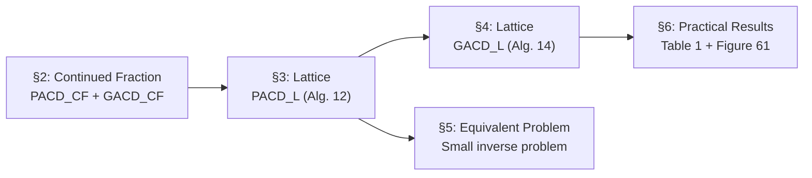

> **Prerequisites**: Modular arithmetic, GCD (Euclidean algorithm), basic number theory, khái niệm lattice và LLL (sẽ dùng như black box)  
> 🔴 **Prerequisite references**: Hardy & Wright — *An Introduction to the Theory of Numbers* [6] (nền tảng); Lenstra-Lenstra-Lovász — *LLL algorithm* [8] (sẽ dùng ở Lesson 03)  
> **Lesson type**: Foundation  
> **Covers**: §1 Introduction, §1.1 Algorithm Definitions (Alg. 11, 12, 13, 14)
>
> **Notation**:
> | Ký hiệu | Ý nghĩa | Ký hiệu trong paper |
> |---------|---------|---------------------|
> | $a, b$ | Hai số nguyên có ước chung lớn (unknown) | $a, b$ |
> | $a_0, b_0$ | Approximations đã biết của $a, b$ | $a_0, b_0$ |
> | $x_0, y_0$ | Sai số: $x_0 = a - a_0$, $y_0 = b - b_0$ | $x_0, y_0$ |
> | $d$ | Ước chung lớn cần tìm ($d \mid a$ và $d \mid b$) | $d$ |
> | $X, Y$ | Bounds: $\|x_0\| \leq X$, $\|y_0\| \leq Y$ | $X, Y$ |
> | $\alpha$ | $\log_{b_0} d$ — kích thước tương đối của $d$ | $\alpha \in (0\ldots 1)$ |
> | $\alpha_0$ | Lower bound đã biết cho $\alpha$ (input của lattice alg.) | $\alpha_0$ |
> | $\beta$ | $\log_{b_0} X$ — kích thước tương đối của error $X$ | $\beta$ |
> | $\beta_0$ | Giá trị $\beta$ được dùng trong Alg. 12, 14 | $\beta_0$ |
> | $M$ | Lower bound trên $d$: $M = b_0^{\alpha_0}$ | $M$ |
> | $\varepsilon$ | Slack parameter nhỏ tuỳ ý trong asymptotic bounds | $\varepsilon \ll \log_{b_0} X$ |

---

## Motivation: GCD với Sai Số

Bài toán GCD cổ điển đặt câu hỏi: cho hai số nguyên $a$ và $b$, tìm $d = \gcd(a, b)$. Thuật toán Euclid giải trong thời gian đa thức. Nhưng nếu ta chỉ có được các xấp xỉ $a_0 \approx a$ và $b_0 \approx b$ — tức là biết $a$ và $b$ với một sai số cộng thêm nhỏ — thì có thể khôi phục $d$ không?

Đây chính là **Approximate Common Divisor Problem (ACDP)** mà Howgrave-Graham phân tích trong paper này. Sự tương tự với lý thuyết mã sửa lỗi (error-correcting codes) rất tự nhiên: bài toán giống như thiết kế decoder khi channel gây ra additive noise trên các codewords.

> [!note] Setting 1.1 — Bài toán ACDP (Informal)
> **Input**: Hai số nguyên $a_0, b_0$ và các bound $X \geq Y > 0$, $M > 0$.  
> **Đảm bảo**: Tồn tại $d > M$ và $x_0, y_0$ với $|x_0| \leq X$, $|y_0| \leq Y$ sao cho
>
> $$
> d \mid (a_0 + x_0) \quad \text{và} \quad d \mid (b_0 + y_0).
> $$
>
> **Output**: Tất cả các $d$ thoả mãn điều kiện trên (nếu số lượng đa thức), hoặc báo không tồn tại.

Hai câu hỏi trung tâm mà paper đặt ra:

1. **Tính duy nhất**: Dưới điều kiện nào trên $\alpha, \beta$ thì $d$ duy nhất (hoặc chỉ có đa thức nhiều nghiệm)?
2. **Thuật toán**: Dưới điều kiện đó, có thể tìm $d$ trong thời gian đa thức không?

---

## Hai Biến Thể: PACDP và GACDP

Paper phân biệt dứt khoát hai bài toán con, tùy theo mức độ mà các inputs được biết:

> [!note] Definition 1.2 — PACDP vs GACDP
> Giả sử không mất tổng quát $X \geq Y$ (tức $a_0$ là input kém chính xác hơn).
>
> - **PACDP** (Partially Approximate Common Divisor Problem): $Y = 0$, tức $b_0$ **biết chính xác** ($b_0 = b$). Chỉ $a_0$ là xấp xỉ với sai số $|x_0| \leq X$.
> - **GACDP** (General Approximate Common Divisor Problem): $Y > 0$, cả hai $a_0$ và $b_0$ đều chỉ là xấp xỉ.

**Tại sao phân biệt quan trọng?** Khi $b_0$ biết chính xác, ta có thể subtract bất kỳ bội số nào của $b_0$ từ $a_0$ — điều này cho phép reduce về bài toán 1 chiều (univariate). Trong GACDP, cả hai chiều đều có sai số, dẫn đến bài toán bivariate phức tạp hơn nhiều.

---

## Hệ Tham Số: α, β, M, X

Paper dùng hệ tham số logarithmic để diễn tả kích thước tương đối. Ký hiệu $u \sim_{\varepsilon_0} v$ nghĩa là $|\log_2 \log_2 u - \log_2 \log_2 v| < \varepsilon_0$ (hai số cùng "cỡ" bit-length).

Với $b_0$ là số lớn đã biết, ta viết:

$$
d = b_0^{\alpha}, \quad X = b_0^{\beta}, \quad M = b_0^{\alpha_0}
$$

trong đó $\alpha = \log_{b_0} d \in (0, 1)$ mô tả divisor chiếm bao nhiêu phần log-size của $b_0$. Giá trị $\alpha$ lớn → $d$ lớn so với $b_0$ → bài toán dễ hơn (divisor "nổi bật" hơn). Tương tự $\beta = \log_{b_0} X$ mô tả cỡ của error.

Trong các thuật toán lattice, $\alpha$ không biết chính xác; thay vào đó ta cần input $\alpha_0$ là lower bound đã biết cho $\alpha$ (ta muốn $\alpha_0$ xấp xỉ $\alpha$ từ dưới).

---

## Bốn Thuật Toán: Định Nghĩa Chính Thức

Paper định nghĩa 4 thuật toán ngay trong §1.1. Hai cái dùng continued fractions (CF), hai cái dùng lattice (L):

> [!note] Scheme 1.3 — Algorithm 11: PACD_CF (Continued Fraction PACDP)
> **Type**: PACDP Algorithm  
> **Method**: Continued fraction approximation
>
> **$\mathsf{PACD\_CF}(a_0, b_0)$**
> - Input: Hai số nguyên $a_0 < b_0$
> - Điều kiện đảm bảo: tồn tại $x_0$ với $|x_0| < X = b_0^{2\alpha - 1}$ và $d = b_0^\alpha$ với $\alpha > 1/2$ chia hết cả $a_0 + x_0$ lẫn $b_0$
> - Step 1: Tính continued fraction expansion của $a_0 / b_0$; lấy tất cả convergents $g_i/h_i$
> - Step 2: Với mỗi convergent, kiểm tra $h_i \mid b_0$; nếu có, output $d = b_0 / h_i$
> - Output: Tất cả ước chung $d > b_0^{1/2}$ với $|x_0| < b_0^{2\alpha-1}$, hoặc báo không tồn tại

> [!note] Scheme 1.4 — Algorithm 12: PACD_L (Lattice PACDP)
> **Type**: PACDP Algorithm  
> **Method**: Lattice reduction (LLL)
>
> **$\mathsf{PACD\_L}(a_0, b_0, \varepsilon, \alpha_0)$**
> - Input: Hai số nguyên $a_0 < b_0$; hai số thực $\varepsilon, \alpha_0 \in (0\ldots 1)$
> - Đặt $M = b_0^{\alpha_0}$, $X = b_0^{\beta_0}$ với $\beta_0 = \alpha_0^2 - \varepsilon$
> - Step 1: Xây dựng lattice từ các đa thức $p_i(x) = (a_0 + x)^{u-i} b_0^i$ (xem [[03-lattice-pacdp|Lesson 03]])
> - Step 2: Rút gọn lattice bằng LLL; tìm vector ngắn $\mathbf{r}$ → đa thức $r(x)$
> - Step 3: Tìm tất cả nghiệm nguyên của $r(x) = 0$; với mỗi nghiệm $x_0$, tính $d = \gcd(a_0 + x_0, b_0)$
> - Output: Tất cả $d > M$ với $|x_0| < X$, hoặc báo không tồn tại
>
> **Điểm mấu chốt**: $\beta_0 = \alpha_0^2 - \varepsilon$ — tức là bound trên error là **bình phương** của bound trên divisor. Đây là cải tiến đáng kể so với PACD_CF.

> [!note] Scheme 1.5 — Algorithm 13: GACD_CF (Continued Fraction GACDP, equi-sized)
> **Type**: GACDP Algorithm  
> **Method**: Continued fraction approximation  
> **Restriction**: equi-sized inputs ($a_0 \sim b_0$)
>
> **$\mathsf{GACD\_CF}(a_0, b_0)$**
> - Input: Hai số nguyên $a_0 \sim b_0$, $a_0 < b_0$
> - Điều kiện: tồn tại $x_0, y_0$ với $|x_0|, |y_0| < X = b_0^\beta$, $\beta = \max(2\alpha - 1,\ 1 - \alpha)$, và $d = b_0^\alpha$ với $\alpha > 1/2$
> - Step 1: Tính convergents $g_i/h_i$ của $a_0/b_0$
> - Step 2: Với mỗi convergent, tìm integer $k$ tối thiểu hoá $\|k(g_i, h_i) - (a_0, b_0)\|_\infty$; output $d$ tương ứng
> - Output: Tất cả ước chung $d$ thoả điều kiện, hoặc báo không tồn tại

> [!note] Scheme 1.6 — Algorithm 14: GACD_L (Lattice GACDP, equi-sized, heuristic)
> **Type**: GACDP Algorithm  
> **Method**: Lattice reduction (LLL), heuristic  
> **Restriction**: equi-sized inputs ($a_0 \sim b_0$), $\alpha_0 \in (0\ldots 2/3)$
>
> **$\mathsf{GACD\_L}(a_0, b_0, \varepsilon, \alpha_0)$**
> - Input: $a_0 \sim b_0$, $a_0 < b_0$; $\varepsilon, \alpha_0 \in (0 \ldots 2/3)$
> - Đặt $M = b_0^{\alpha_0}$, $X = b_0^{\beta_0}$ với
> $$
> \beta_0 = 1 - \tfrac{1}{2}\alpha_0 - \sqrt{1 - \alpha_0 - \tfrac{1}{2}\alpha_0^2} - \varepsilon
> $$
> - Step 1: Xây dựng lattice từ bivariate polynomials $p_i(x,y) = (a_0+x)^{u-i}(b_0+y)^i$ (xem [[04-lattice-gacdp|Lesson 04]])
> - Step 2: Rút gọn lattice bằng LLL; tìm **hai** vector nhỏ → hai đa thức $r_1(x,y)$, $r_2(x,y)$
> - Step 3: **Heuristic assumption**: $r_1, r_2$ algebraically independent → dùng resultant để tìm $(x_0, y_0)$
> - Step 4: Tính $d = \gcd(a_0 + x_0, b_0 + y_0)$
> - Output: Tất cả $d > M$ với $|x_0|, |y_0| < X$, hoặc báo "unlikely to exist"

> [!warning] Tại sao GACD_L là heuristic?
> Bước 3 giả định rằng hai vector ngắn thu được từ LLL tương ứng với hai đa thức **algebraically independent** (không phải bội số của nhau). Điều này không thể prove trong trường hợp tổng quát (do kết quả impossibility của Manders & Adleman [9] với bivariate modular equations). Tuy nhiên, trong thực nghiệm (Table 1 của paper) không có trường hợp nào phá vỡ giả thuyết này.

---

## So Sánh Bốn Thuật Toán

| Thuật toán | Bài toán | Method | Bound trên $\beta$ | Điều kiện $\alpha$ |
|-----------|---------|--------|---------------------|---------------------|
| PACD_CF (Alg. 11) | PACDP | Continued fraction | $\beta < 2\alpha - 1$ | $\alpha > 1/2$ |
| PACD_L (Alg. 12) | PACDP | Lattice (LLL) | $\beta_0 < \alpha_0^2$ | Bất kỳ $\alpha_0 \in (0,1)$ |
| GACD_CF (Alg. 13) | GACDP | Continued fraction | $\beta < \max(2\alpha-1, 1-\alpha)$ | $\alpha > 1/2$ |
| GACD_L (Alg. 14) | GACDP | Lattice (LLL) — heuristic | $\beta_0 < 1 - \frac{\alpha_0}{2} - \sqrt{1-\alpha_0-\frac{\alpha_0^2}{2}}$ | $\alpha_0 < 2/3$ |

**Đóng góp chính của paper**: PACD_L cho phép $\alpha < 1/2$ — điều mà CF method không làm được. Đây là bước vượt trội so với "Wiener-style" attacks vốn yêu cầu $\alpha > 1/2$.

---

## Ứng Dụng: Phá Vỡ Cryptosystem Okamoto

> [!info] 🟡 Okamoto Cryptosystem [11]
> Okamoto (1986) đề xuất một public-key cryptosystem dựa trên bài toán factoring $n = p^2 q$. Public key gồm $n$ và $u = a + bpq$ trong đó $a < \frac{1}{2}\sqrt{pq}$ là một giá trị nhỏ.
>
> *(theo [11]: Okamoto — Fast public-key cryptosystem using congruent polynomials, Electronics Letters 1986)*

Nhìn nhận theo góc độ PACDP: ta biết $n = p^2 q$ (public) và $u = a + bpq$ (public). Đây tương đương với việc cho hai xấp xỉ của bội số của $pq$:

$$
a_0 = u, \quad b_0 = n, \quad d = pq
$$

với sai số $x_0 = -a$ (nhỏ vì $a < \frac{1}{2}\sqrt{pq}$). Cụ thể, $|x_0| < N^{1/4}$ — đây chính xác là bound mà PACD_L xử lý được! Do đó:

> [!danger] Okamoto Cryptosystem bị phá trong thời gian đa thức
> Thuật toán PACD_L (Alg. 12) khôi phục $d = pq$ từ $(n, u)$ trong thời gian đa thức, từ đó factoring $n = p^2 q$ và lộ toàn bộ private key. Đây là **break mạnh hơn** kết quả trước của [14] (chỉ recover plaintexts mà không recover private key).
>
> Điều thú vị hơn: bài toán vẫn giải được ngay cả khi ta chỉ biết một xấp xỉ $p_0'$ sao cho $p_0' = kp + x_0$ với **bất kỳ integer $k$** (không nhất thiết $k = 1$) và cùng bound trên $x_0$.

---

## Tính Hữu Hạn Đa Thức Của Nghiệm

Các điều kiện trên $\alpha$ và $\beta$ không chỉ đảm bảo thuật toán tìm được $d$, mà còn đảm bảo số lượng $d$ thoả mãn là **đa thức** theo kích thước input. Đây là điều kiện cần thiết để bài toán well-defined: nếu có exponentially nhiều $d$ thoả mãn, không thể enumerate hết chúng.

> [!tip] 💡 Agent note
> Khi dùng các algorithms này như encoding/decoding schemes (ứng dụng trong coding theory), cần đảm bảo $d$ "thực sự" cần tìm nằm **đủ xa dưới** bound của thuật toán — để xác suất bị nhầm với một $d$ khác trong tập đa thức là negligible (thực ra là exponentially nhỏ).

---

## Cấu Trúc Của Phần Còn Lại

Paper triển khai theo logic sau:

Mỗi lesson tiếp theo đi sâu vào một node trong graph này.

---

## Summary

- **ACDP** = tìm ước chung lớn khi inputs bị perturb bởi additive noise.
- **PACDP**: một input biết chính xác ($Y = 0$); **GACDP**: cả hai bị xấp xỉ ($Y > 0$).
- Tham số then chốt: $\alpha = \log_{b_0} d$ (cỡ divisor), $\beta = \log_{b_0} X$ (cỡ error).
- PACD_CF cần $\alpha > 1/2$; **PACD_L không cần** — đây là đóng góp chính.
- PACD_L bound: $\beta < \alpha^2$ (quadratic trong $\alpha$).
- GACD_L bound: $\beta < 1 - \frac{\alpha}{2} - \sqrt{1 - \alpha - \frac{\alpha^2}{2}}$ (heuristic).
- Ứng dụng trực tiếp: phá Okamoto cryptosystem từ public key trong polynomial time.

---

## References

- [5] Howgrave-Graham — *Computational mathematics inspired by RSA*, PhD Thesis, Bath 1999 (🟡)
- [11] Okamoto — *Fast public-key cryptosystem using congruent polynomials*, Electronics Letters 1986 (🟡)
- [8] Lenstra, Lenstra, Lovász — *Factoring polynomials with rational coefficients*, Math. Ann. 1982 (🔴 Prerequisite)
- [6] Hardy & Wright — *An Introduction to the Theory of Numbers*, Oxford (🔴 Prerequisite)
- [14] Vallée, Girault, Toffin — Eurocrypt '88 (⚪)
