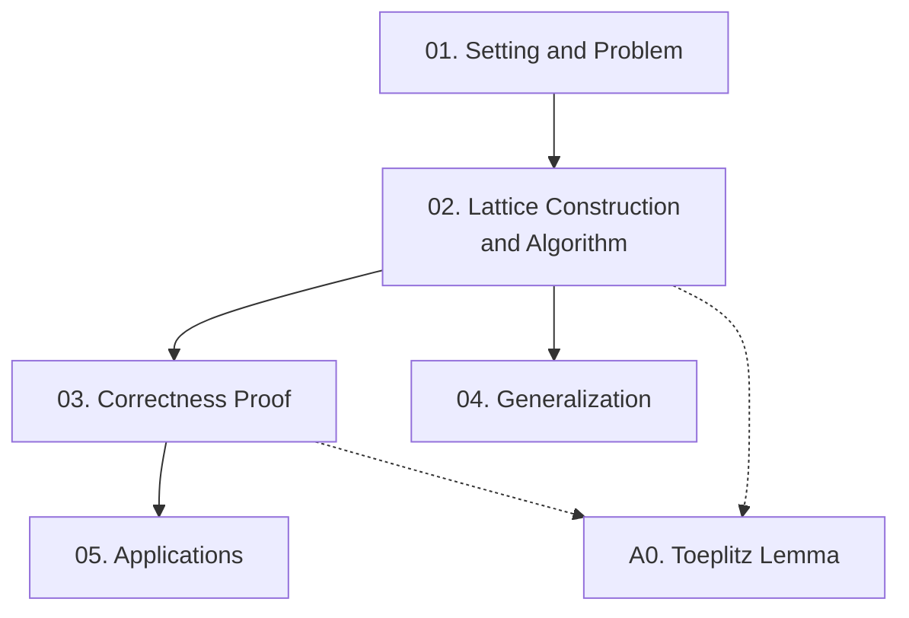

Paper của Coppersmith (EUROCRYPT 1996) giải bài toán phân tích $N = PQ$ khi biết các bit cao của $P$, cải thiện yêu cầu từ $1/3$ xuống $1/4$ số bit bằng kỹ thuật dùng nhiều polynomial lattice đồng thời. Course này cover toàn bộ paper gốc qua 5 bài học và 1 appendix kỹ thuật.

**Kiến thức nền tảng yêu cầu** (🔴 Prerequisite): Lenstra–Lenstra–Lovász lattice basis reduction [2]; số học nguyên và đa thức cơ bản; cơ bản về RSA.

---

## Lesson Overview

| # | Title | Type | Covers | File | Dependencies |
|---|-------|------|--------|------|-------------|
| 01 | Setting and Problem Formulation | Foundation | §1, §2 (setup) | [[01-nen-tang-va-bai-toan\|01. Setting]] | — |
| 02 | Lattice Construction and Main Algorithm | Scheme | §2 (full), §3 | [[02-xay-dung-lattice-va-thuat-toan-chinh\|02. Algorithm]] | 01 |
| 03 | Correctness Proof — Determinant Bound | Math Component | §2 (Thm 1, Cor 2), Lemma 4 summary | [[03-chung-minh-dung-dan\|03. Proof]] | 02 |
| 04 | Generalization and More Variables | Deep Dive | §4, §5, Thm 3 | [[04-tong-quat-hoa-va-nhieu-bien\|04. Generalization]] | 02 |
| 05 | Applications and Comparisons | Attack | §6, §7, §8 | [[05-ung-dung-va-so-sanh\|05. Applications]] | 02, 03 |
| A0 | Appendix: Toeplitz Near-Orthogonality | — | §10 Appendix, Lemma 4 | [[a0-toeplitz-lemma\|A0. Toeplitz Lemma]] | 02 |

---

## Coverage Map

| Section tài liệu gốc | Lesson |
|----------------------|--------|
| §1 Introduction | 01 |
| §2 Problem setup (P₀, Q₀, p(x,y), D, condition) | 01 |
| §2 Matrix construction M₁→M₂→M₃ | 02 |
| §2 Vector s, LLL, hyperplane, resultant | 02 |
| §2 Theorem 1, Corollary 2 | 02 |
| §3 Discussion on lattice methods | 02 |
| §4 Other bivariate polynomials, Theorem 3 | 04 |
| §5 More variables | 04 |
| §6 Comparison with univariate modular algorithm | 05 |
| §7 Comparison with previous work | 05 |
| §8 Application to RSA variant (Vanstone–Zuccherato) | 05 |
| §10 Appendix (Lemma 4, Toeplitz proof) | A0 |

---

## Dependency Graph

---

## Progress

- [x] [[01-nen-tang-va-bai-toan\|01. Setting and Problem Formulation]]
- [x] [[02-xay-dung-lattice-va-thuat-toan-chinh\|02. Lattice Construction and Main Algorithm]]
- [x] [[03-chung-minh-dung-dan\|03. Correctness Proof — Determinant Bound]]
- [x] [[04-tong-quat-hoa-va-nhieu-bien\|04. Generalization and More Variables]]
- [x] [[05-ung-dung-va-so-sanh\|05. Applications and Comparisons]]
- [x] [[a0-toeplitz-lemma\|A0. Toeplitz Near-Orthogonality (Lemma 4)]]

---

## 🟡 Integrated References

| Ref Key | Dùng trong lesson | Nội dung tích hợp |
|---------|------------------|-------------------|
| [1] Coppersmith univariate | 05 | So sánh bound $X$ và kỹ thuật $\bmod N^j$ |
| [5] Rivest & Shamir | 01, 05 | Bound $1/3$ bits và kỹ thuật một polynomial |
| [7] Vanstone & Zuccherato | 05 | Scheme bị tấn công bởi thuật toán của paper |

---

## Notes

Đọc Lesson 01 và 02 tuần tự bắt buộc — chúng là nền tảng của toàn bộ course. Lesson 03 (chứng minh bound determinant) có thể đọc song song với A0 (Lemma 4 kỹ thuật). Lesson 04 và 05 có thể đọc độc lập sau Lesson 02.
