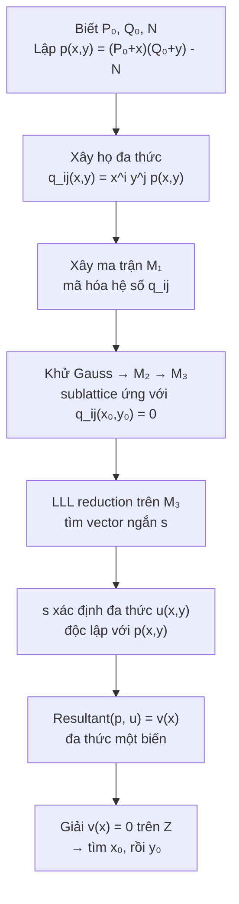

> **Prerequisites**: Số học modular, đa thức nguyên (integer polynomials), kiến thức cơ bản về RSA và phân tích thừa số.  
> 🔴 **Prerequisite references**: Lenstra, Lenstra, Lovász — *Factoring Polynomials with Integer Coefficients* [2] (LLL lattice basis reduction — nền tảng toán của toàn bộ course); Rivest & Shamir — *Efficient Factoring Based on Partial Information* [5] (kết quả trước đó với bound $1/3$)  
> **Lesson type**: Foundation  
> **Covers**: §1 (Introduction), §2 (Problem setup, polynomial formulation, tham số $D$, điều kiện $XY < D^{2/(3\delta)}$)
>
> **Notation**:
> | Ký hiệu | Ý nghĩa |
> |---------|---------|
> | $N = PQ$ | Modulus RSA cần phân tích, $P, Q$ là nhân tử nguyên tố |
> | $P_0, Q_0$ | Phần **đã biết** (high-order bits) của $P, Q$ |
> | $x_0, y_0$ | Phần **chưa biết** của $P, Q$: $P = P_0 + x_0$, $Q = Q_0 + y_0$ |
> | $X, Y$ | Bound trên $\|x_0\|$ và $\|y_0\|$ |
> | $D$ | Hệ số lớn nhất có thể của đa thức $p(x,y)$ trong vùng nghiệm |
> | $\delta$ | Bậc của đa thức $p(x,y)$ trong mỗi biến riêng lẻ |
> | $k$ | Tham số điều chỉnh kích thước lattice; chọn $k > 1/(4\varepsilon)$ |
> | $\varepsilon$ | Lượng bit **dư** biết được: biết $(\frac{1}{4}+\varepsilon)\log_2 N$ bits |

---

## Bài toán: Phân tích thừa số khi biết bit cao

### Bối cảnh

RSA dựa trên độ khó của việc phân tích $N = PQ$ thành nhân tử nguyên tố. Nhưng điều gì xảy ra nếu kẻ tấn công **biết một phần** của $P$?

Câu hỏi này có ý nghĩa thực tiễn trực tiếp: trong một số phiên bản RSA đặc biệt (ví dụ: identity-based RSA của Vanstone & Zuccherato [7], xem bài 05), cấu trúc của $N$ tiết lộ bit cao của nhân tử. Bài toán đặt ra là:

> **Cho $N = PQ$. Biết các bit cao nhất của $P$. Hỏi có thể tìm $P, Q$ không?**

Năm 1985, Rivest và Shamir [5] chỉ ra rằng nếu biết $(1/3)\log_2 N$ bit cao của $P$ thì có thể phân tích trong thời gian đa thức — dùng một đa thức lattice.

Coppersmith [paper này, 1996] cải thiện bound xuống còn chỉ cần **(1/4)$\log_2 N$** bit — bằng cách dùng **nhiều đa thức lattice đồng thời** thay vì một.

---

## Định nghĩa bài toán

### Phân rã ẩn và đã biết

Giả sử biết $(\frac{1}{4}+\varepsilon)\log_2 N$ bit cao của $P$ với $\varepsilon > 0$. Khi đó có thể viết:

$$
P = P_0 + x_0, \quad Q = Q_0 + y_0
$$

trong đó:
- $P_0, Q_0$ là **đã biết** (phần bit cao, xác định bằng phép chia $N / P_0 \approx Q_0$)
- $x_0, y_0$ là **chưa biết**, bị chặn bởi:

$$
|x_0| < X = \frac{P_0}{N^{1/4+\varepsilon}}, \quad |y_0| < Y = \frac{Q_0}{N^{1/4+\varepsilon}}
$$

> [!tip] 💡 Agent note
> Tại sao bound $X = P_0 / N^{1/4+\varepsilon}$? Vì $P \approx P_0$ (bit cao khớp), nên $|P - P_0| = |x_0|$ nhỏ hơn $P_0$ một nhân tử $N^{1/4+\varepsilon}$. Cụ thể: biết $(1/4+\varepsilon)\log_2 N$ bit cao ↔ sai số $|x_0| < P / N^{1/4+\varepsilon} \approx P_0 / N^{1/4+\varepsilon}$.

### Phương trình đa thức

Vì $PQ = N$, thay $P = P_0 + x$, $Q = Q_0 + y$ vào:

$$
p(x, y) = (P_0 + x)(Q_0 + y) - N
$$

Khai triển:

$$
p(x, y) = (P_0 Q_0 - N) + Q_0 x + P_0 y + xy
$$

Nghiệm cần tìm là $(x_0, y_0)$ thỏa mãn:

$$
p(x_0, y_0) = PQ - N = 0
$$

> [!note] Problem 1.1 — Small Root of Bivariate Integer Polynomial
> **Input**: Đa thức nguyên $p(x, y) \in \mathbb{Z}[x, y]$ bậc $\delta$ trong mỗi biến; bounds $X, Y > 0$.
>
> **Goal**: Tìm tất cả nghiệm nguyên $(x_0, y_0)$ thỏa mãn:
> - $|x_0| < X$, $|y_0| < Y$
> - $p(x_0, y_0) = 0$
>
> **Setting**: $p(x,y) = \sum_{i,j} p_{ij} x^i y^j$, irreducible over $\mathbb{Z}$, các hệ số không có ước chung không tầm thường.

Bài toán phân tích RSA với bit cao đã biết là một **trường hợp đặc biệt** với $p(x,y) = (P_0 + x)(Q_0 + y) - N$ — bậc $\delta = 1$ trong mỗi biến (nhưng có hạng tử $xy$).

---

## Tham số $D$ và điều kiện thành công

### Định nghĩa $D$

Để thuật toán hoạt động, cần đo kích thước "tự nhiên" của từng hạng tử trong $p(x,y)$ khi $|x| \le X$, $|y| \le Y$:

$$
D = \max_{i,j} \left\{ |p_{ij}| \cdot X^i Y^j \right\}
$$

Đây là **giá trị lớn nhất có thể** của một hạng tử riêng lẻ $p_{ij} x^i y^j$ trong vùng nghiệm bị chặn.

Với đa thức cụ thể của bài toán RSA ($\delta = 1$):

$$
D = \max\bigl\{|P_0 Q_0 - N|,\; Q_0 X,\; P_0 Y,\; XY\bigr\}
$$

bốn hạng tử lần lượt là hằng số, $Q_0 x$, $P_0 y$, và $xy$.

### Điều kiện thành công

> [!abstract] Theorem 1.2 — Điều kiện tìm nghiệm (sơ lược)
> Thuật toán của Coppersmith tìm được $(x_0, y_0)$ (nếu tồn tại) với $|x_0| < X$, $|y_0| < Y$, miễn là:
>
> $$
> XY < D^{2/(3\delta)}
> $$
>
> trong đó $\delta$ là bậc của $p$ trong mỗi biến riêng lẻ.

Với $\delta = 1$ (trường hợp RSA), điều kiện là $(XY)^{3/2} < D$.

**Tại sao $(\frac{1}{4} + \varepsilon)$ bit là đủ?** Từ định nghĩa $X$ và $Y$:

$$
XY = \frac{P_0}{N^{1/4+\varepsilon}} \cdot \frac{Q_0}{N^{1/4+\varepsilon}} = \frac{P_0 Q_0}{N^{1/2+2\varepsilon}}
$$

Vì $P_0 Q_0 \approx N$:

$$
XY \approx N^{1/2 - 2\varepsilon}
$$

Mặt khác, $D \ge P_0 Y = P_0 \cdot Q_0 / N^{1/4+\varepsilon} \approx N / N^{1/4+\varepsilon} = N^{3/4-\varepsilon}$, nên:

$$
(XY)^{3/2} \approx N^{3/4 - 3\varepsilon} < N^{3/4-\varepsilon} \lesssim D
$$

Điều kiện $(XY)^{3/2} < D$ được thỏa mãn khi $\varepsilon > 0$ — tức là luôn đúng khi biết **nghiêm ngặt hơn** $(1/4)\log_2 N$ bits.

---

## So sánh với kết quả trước: Rivest & Shamir

> [!info] 🟡 Kết quả Rivest & Shamir [5] — EUROCRYPT 1985
> Rivest và Shamir [5] chứng minh: nếu biết $(\frac{1}{3})\log_2 N$ bit cao của $P$, có thể phân tích $N$ trong thời gian đa thức.
>
> Kỹ thuật: dùng **một** đa thức $q_{00}(x,y) = p(x,y)$ để xây dựng lattice — chỉ khai thác một polynomial relationship.
>
> Bound $1/3$ xuất phát từ điều kiện $(XY)^{(\delta+1)^2 \delta/2} \le D$ khi dùng một đa thức duy nhất với $\delta = 1$, dẫn đến $XY \le D^{2/(\delta+1)^2} = D^{1/2}$, hay $X \approx Y \approx N^{1/3}$.

Coppersmith cải thiện từ $1/3$ xuống $1/4$ bằng cách dùng **họ đa thức** $q_{ij}(x,y) = x^i y^j p(x,y)$ cho $0 \le i, j < k$, cho phép "amortize" chi phí của nhiều ẩn số trên nhiều phương trình — làm yếu điều kiện thành công từ $(XY)^{(\delta+1)^2\delta/2} \le D$ xuống còn $(XY)^{3\delta/2} < D$.

| Kết quả | Bits cần biết | Số polynomials |
|---------|--------------|----------------|
| Rivest–Shamir [5] | $(1/3)\log_2 N$ | 1 |
| **Coppersmith [paper này]** | **(1/4)$\log_2 N$** | **$k^2$ (tham số hóa)** |

---

## Cấu trúc tổng quan của thuật toán

Thuật toán chính (được phát triển đầy đủ trong bài 02) có các bước sau:

Ý tưởng cốt lõi: nghiệm $(x_0, y_0)$ tạo ra một vector **đặc biệt ngắn** trong lattice. LLL reduction buộc vector ngắn phải nằm trong một hyperplane — hyperplane này dịch thành một phương trình đa thức $u(x_0, y_0) = 0$ mới. Kết hợp $p$ và $u$ cho phép giải ra $x_0$ qua resultant.

---

## Summary

- Bài toán: tìm nghiệm nguyên nhỏ $(x_0, y_0)$ của $p(x,y) = 0$, ứng dụng vào phân tích $N = PQ$ khi biết bit cao của $P$.
- Polynomial RSA: $p(x,y) = (P_0+x)(Q_0+y) - N$, bậc $\delta = 1$ mỗi biến.
- Tham số $D$ đo "kích thước tự nhiên" của hạng tử lớn nhất trong vùng nghiệm.
- Điều kiện thành công: $(XY)^{3/2} < D$ — tương đương biết $>(\frac{1}{4})\log_2 N$ bits của $P$.
- Cải thiện so với Rivest–Shamir [5]: dùng $k^2$ polynomial thay vì 1, giảm yêu cầu từ $1/3$ xuống $1/4$ bits.

---

## References

- [1] Coppersmith — *Finding a Small Root of a Univariate Modular Equation*, EUROCRYPT 1996
- [2] Lenstra, Lenstra, Lovász — *Factoring Polynomials with Integer Coefficients*, Math. Annalen 261, 1982 (🔴 Prerequisite)
- [5] Rivest & Shamir — *Efficient Factoring Based on Partial Information*, EUROCRYPT 1985 (🟡 Integrated above)
- [7] Vanstone & Zuccherato — *Short RSA Keys and Their Generation*, J. Cryptology 8(2), 1995
