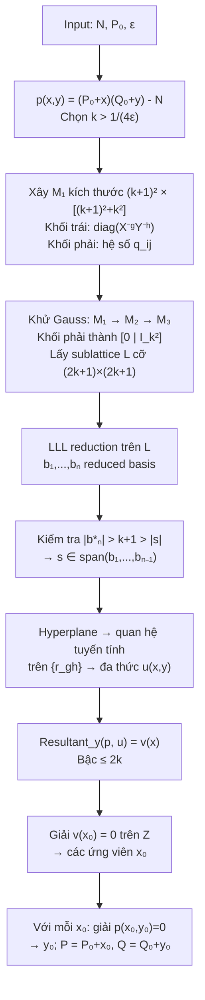

> **Prerequisites**: [[01-nen-tang-va-bai-toan|01. Setting and Problem Formulation]]  
> 🔴 **Prerequisite references**: Lenstra, Lenstra, Lovász — *Factoring Polynomials with Integer Coefficients* [2] (LLL basis reduction: nếu lattice $L$ có basis $\{b_i\}$, LLL cho ra reduced basis thỏa $|b_n^*| \ge |\det(L)|^{1/n} 2^{-(n-1)/4}$)  
> **Lesson type**: Scheme  
> **Covers**: §2 (full algorithm: $M_1 \to M_2 \to M_3$, vector $\mathbf{s}$, LLL, resultant), §3 (discussion on why multiple polynomials help)
>
> **Notation**:
> | Ký hiệu | Ý nghĩa |
> |---------|---------|
> | $q_{ij}(x,y) = x^i y^j p(x,y)$ | Họ đa thức nhân với monomials $x^i y^j$ |
> | $k$ | Tham số kích thước; $k > 1/(4\varepsilon)$ |
> | $r_{gh}$ | Biến nguyên đại diện $x_0^g y_0^h$ |
> | $\gamma(g,h) = (k+1)g + h$ | Hàm index cho hàng của $M_1$ (ứng với biến $r_{gh}$) |
> | $\beta(i,j) = (k+1)^2 + ki + j$ | Hàm index cho cột phải của $M_1$ (ứng với $q_{ij}$) |
> | $M_1, M_2, M_3$ | Các ma trận lattice qua các bước biến đổi |
> | $W$ | Ma trận đường chéo scaling: $W_{(\gamma(g,h),\gamma(g,h))} = X^g Y^h$ |
> | $L$ | Submatrix $(2k+1)\times(2k+1)$ trái của $M_3$; $|\det(L)| > N^{k/4}$ |
> | $\mathbf{s}$ | Vector ngắn trong lattice $L$ ứng với nghiệm $(x_0,y_0)$ |
> | $\mathbf{b}_n^*$ | Thành phần của basis vector cuối $\mathbf{b}_n$ trực giao với $\mathbf{b}_1,\ldots,\mathbf{b}_{n-1}$ |

---

## Ý tưởng tổng quan

Lattice basis reduction (LLL [2]) về bản chất là công cụ **tuyến tính**: nó tìm vector ngắn trong tổ hợp nguyên của các basis vectors. Vấn đề: phương trình $p(x_0, y_0) = 0$ là **phi tuyến** — có hạng tử $xy$, không phải quan hệ tuyến tính giữa $x_0$ và $y_0$.

**Ý tưởng then chốt**: thay thế mỗi monomial $x^g y^h$ bằng một biến nguyên độc lập mới $r_{gh}$, biến $p(x,y)=0$ thành quan hệ tuyến tính $\sum_{g,h} p_{gh} r_{gh} = 0$. Sau đó dùng nhiều phương trình $q_{ij}(x_0,y_0)=0$ để **ràng buộc** các biến $r_{gh}$ với nhau — và lattice reduction sẽ tìm ràng buộc mới, bổ sung.

> [!tip] 💡 Agent note
> Tại sao nhiều polynomial tốt hơn một? Mỗi ẩn $r_{gh}$ đóng góp nhân tử $X^{-g}Y^{-h}$ vào $\det(M_1)$ (làm det nhỏ đi), còn mỗi phương trình $q_{ij}=0$ đóng góp nhân tử $X^i Y^j D$ (làm det lớn lên). Với $k^2$ phương trình và $(k+1)^2$ ẩn, cân bằng giữa hai chiều cho phép det đủ lớn với bound $XY < D^{2/(3\delta)}$ — yếu hơn nhiều so với việc chỉ dùng một polynomial.

---

## Bước 1: Xây họ đa thức $q_{ij}$

Chọn tham số nguyên $k > 1/(4\varepsilon)$. Với mỗi cặp $(i,j)$, $0 \le i,j < k$, định nghĩa:

$$
q_{ij}(x, y) = x^i y^j \cdot p(x, y)
$$

Vì $p(x_0, y_0) = 0$, ta có $q_{ij}(x_0, y_0) = 0$ với mọi $(i,j)$.

Đây là $k^2$ phương trình đa thức đều bị triệt tiêu tại nghiệm cần tìm.

---

## Bước 2: Xây ma trận $M_1$

> [!note] Scheme 2.1 — Construction of $M_1$
> **Type**: Lattice matrix construction  
> **Setting**: Đa thức $p(x,y) = (P_0Q_0 - N) + Q_0 x + P_0 y + xy$, tham số $k$, bounds $X, Y$
>
> **$\mathsf{BuildM1}(p, k, X, Y)$**
>
> - Input: $p(x,y)$, tham số $k$, bounds $X, Y$
>
> - **Kích thước ma trận**: $(k+1)^2$ hàng × $\left[(k+1)^2 + k^2\right]$ cột
>
> - **Hàm index hàng**: $\gamma(g,h) = (k+1)g + h$, với $0 \le g,h \le k$
>   - Hàng $\gamma(g,h)$ ứng với ẩn $r_{gh}$ (đại diện $x_0^g y_0^h$)
>
> - **Hàm index cột**:
>   - Cột trái: $\gamma(g,h)$, $0 \le g,h \le k$ → **khối vuông chéo** $(k+1)^2 \times (k+1)^2$
>   - Cột phải: $\beta(i,j) = (k+1)^2 + ki + j$, $0 \le i,j < k$ → **khối hệ số** $k^2$ cột
>
> - **Khối trái** (diagonal): phần tử $(\gamma(g,h), \gamma(g,h)) = X^{-g} Y^{-h}$
>   - Dùng để bound $|r_{gh}| \lesssim X^g Y^h$ sau này
>
> - **Khối phải**: phần tử $(\gamma(g,h), \beta(i,j))$ = hệ số của $x^g y^h$ trong $q_{ij}(x,y)$
>
> - Output: ma trận $M_1$

**Ý nghĩa của cột phải**: Cột $\beta(i,j)$ mã hóa đa thức $q_{ij}(x,y)$. Một zero tại cột $\beta(i,j)$ tương ứng với điều kiện $q_{ij}(x_0,y_0)=0$.

### Ví dụ nhỏ ($k=1$, $\delta=1$)

Với $k=1$: $(k+1)^2 = 4$ hàng (ứng với $r_{00}, r_{01}, r_{10}, r_{11}$), $k^2=1$ cột phải (ứng với $q_{00} = p$).

Khối trái là ma trận chéo $\text{diag}(1, Y^{-1}, X^{-1}, X^{-1}Y^{-1})$.

Khối phải có 1 cột chứa hệ số của $p(x,y) = (P_0Q_0-N) + Q_0x + P_0y + xy$ theo các biến $r_{00}, r_{01}, r_{10}, r_{11}$:

$$
\begin{pmatrix} P_0Q_0-N \\ P_0 \\ Q_0 \\ 1 \end{pmatrix}
$$

---

## Bước 3: Khử Gauss → $M_2$ → $M_3$

> [!note] Scheme 2.2 — Gaussian Elimination to $M_3$
> **$\mathsf{BuildM3}(M_1)$**
>
> - Input: $M_1$
>
> - Thực hiện phép biến đổi hàng sơ cấp trên $M_1$ để ra $M_2$:
>   - Khối phải của $M_2$ có: $k^2 \times k^2$ identity ở **dưới**, $(2k+1) \times k^2$ zeros ở **trên**
>   - Điều này khả thi vì hệ số của $xy$ trong $p$ là $1$ → khối phải của $M_1$ là tam giác trên với 1 trên đường chéo
>
> - Lấy $2k+1$ hàng trên cùng của $M_2$: đây là **sublattice $M_3$**
>   - $M_3$ là sublattice ứng với việc ép tất cả cột phải = 0, tức là $q_{ij}(x_0,y_0)=0$
>
> - Output: $M_3$ kích thước $(2k+1) \times (k+1)^2$; lấy submatrix vuông trái $L$ cỡ $(2k+1)\times(2k+1)$

**Tại sao $2k+1$ hàng?** Sau khi dùng $k^2$ hàng dưới để khử $k^2$ cột phải, số hàng còn lại là $(k+1)^2 - k^2 = 2k+1$.

---

## Bước 4: Vector nghiệm $\mathbf{s}$ trong lattice

Xét vector hàng $\mathbf{r}$ chiều $(k+1)^2$ với phần tử $\gamma(g,h)$ là $x_0^g y_0^h$. Định nghĩa:

$$
\mathbf{s} = \mathbf{r} M_1
$$

Khi đó:

$$
s_{\gamma(g,h)} = (x_0/X)^g (y_0/Y)^h, \quad |s_{\gamma(g,h)}| \le 1
$$

$$
s_{\beta(i,j)} = q_{ij}(x_0, y_0) = 0
$$

$$
|\mathbf{s}| < k+1
$$

Vì phần phải của $\mathbf{s}$ là **zero**, $\mathbf{s}$ nằm trong lattice của $M_3$. Đây là vector **ngắn** trong lattice, ứng với nghiệm $(x_0, y_0)$.

---

## Bước 5: Ước lượng $|\det(L)|$

Để LLL có thể "phát hiện" $\mathbf{s}$ là vector ngắn, cần biết det của lattice $L$.

Định nghĩa ma trận scaling $W$ cỡ $(k+1)^2 \times (k+1)^2$, đường chéo:

$$
W_{(\gamma(g,h),\gamma(g,h))} = X^g Y^h
$$

Trong ma trận $WM_1$, khối trái là identity. Cột $\beta(i,j)$ của khối phải $WM_1$ có phần tử lớn nhất cỡ $X^i Y^j D$.

Paper chứng minh (dùng Lemma 4 trong Appendix — xem [[a0-toeplitz-lemma|A0. Toeplitz Lemma]]) rằng các cột phải gần trực giao, dẫn đến:

$$
|\det(WM_1)| = (XY)^{k^2(k-1)/2} D^{k^2}
$$

(đây là kết quả chính xác cho $p(x,y) = (P_0+x)(Q_0+y)-N$ với $\delta=1$, vì các hệ số không tầm thường nằm ở các góc của Newton polygon.)

Từ đó:

$$
|\det(M_1)| = \frac{|\det(WM_1)|}{\det(W)} = \frac{(XY)^{k^2(k-1)/2} D^{k^2}}{(XY)^{(k+1)^2 k/2}} = \left(D^k (XY)^{-(3k+1)/2}\right)^k
$$

Vì phép biến đổi hàng không đổi det, và cấu trúc block của $M_2$ cho phép thu gọn về submatrix $L$ cỡ $n = 2k+1$:

$$
|\det(L)| > N^{k/4}
$$

(từ điều kiện $(XY)^{3/2} < D$ và $P_0 Q_0 \approx N$.)

---

## Bước 6: LLL reduction và hyperplane argument

> [!note] Scheme 2.3 — LLL và Hyperplane Confinement
> **$\mathsf{LLLReduce}(L)$**
>
> - Input: Ma trận $L$ cỡ $n \times n$ ($n = 2k+1$)
>
> - Áp dụng LLL basis reduction [2] trên cơ sở hàng của $L$ → reduced basis $\mathbf{b}_1, \ldots, \mathbf{b}_n$
>
> - Từ lý thuyết LLL [2], basis vector cuối thỏa:
>   > $$|\mathbf{b}_n^*| \ge |\det(L)|^{1/n} \cdot 2^{-(n-1)/4}$$
>
> - Thay $|\det(L)| > N^{k/4}$ và $n = 2k+1$:
>
>   $$|\mathbf{b}_n^*| \ge N^{(k/4)(1/(2k+1))} \cdot 2^{-k/2} \approx N^{1/8 - 1/(16k)} \cdot 2^{-k/2} > k+1 > |\mathbf{s}|$$
>
>   (bất đẳng thức cuối đúng khi $k < \frac{1}{4}\log_2 N - 2\log_2\log_2 N - O(1)$)
>
> - **Hệ quả**: Với mọi vector $\mathbf{t}$ trong lattice $L$, nếu $|\mathbf{t}| \le |\mathbf{s}|$ thì $\mathbf{t}$ phải thuộc span của $\mathbf{b}_1, \ldots, \mathbf{b}_{n-1}$ (không "chạm" đến $\mathbf{b}_n$).
>
> - $\bar{\mathbf{s}}$ (chiếu $\mathbf{s}$ lên $L$) thỏa $|\bar{\mathbf{s}}| \le |\mathbf{s}|$, nên $\bar{\mathbf{s}} \in \text{span}(\mathbf{b}_1,\ldots,\mathbf{b}_{n-1})$
>
> - Output: Quan hệ tuyến tính mới trên các hệ số $r_{gh} = x_0^g y_0^h$

**Hyperplane argument**: Thuộc span $(\mathbf{b}_1,\ldots,\mathbf{b}_{n-1})$ — một hyperplane chiều $n-1$ trong không gian $n$ chiều — dịch thành một **phương trình tuyến tính** mới trên $\{r_{gh}\}$. Viết lại theo $x,y$: ta thu được đa thức $u(x,y)$ thỏa $u(x_0, y_0) = 0$, và $u$ **không phải** bội của $p$.

---

## Bước 7: Resultant và giải cuối

> [!note] Scheme 2.4 — Resultant to Univariate Polynomial
> **$\mathsf{SolveByResultant}(p, u)$**
>
> - Input: $p(x,y)$ (bậc 1 mỗi biến) và $u(x,y)$ (bậc $\le k$ mỗi biến), cả hai đều bị triệt tiêu tại $(x_0, y_0)$
>
> - Tính resultant theo $y$:
>   > $$v(x) = \text{Resultant}_y\bigl(p(x,y),\, u(x,y)\bigr)$$
>
> - Vì $p$ là irreducible và $u$ không phải bội của $p$, $v(x)$ là đa thức nguyên không tầm thường, bậc $\le 2k$, thỏa $v(x_0) = 0$
>
> - Giải $v(x) = 0$ trên $\mathbb{Z}$ (dùng thuật toán tìm nghiệm nguyên đa thức) để lấy danh sách ứng viên $x_0$ với $|x_0| < X$
>
> - Với mỗi $x_0$ ứng viên: giải $p(x_0, y) = 0$ theo $y$ trên $\mathbb{Z}$, lấy $y_0$ với $|y_0| < Y$
>
> - Output: Tất cả cặp nguyên $(x_0, y_0)$ thỏa điều kiện bound; từ đó $P = P_0 + x_0$, $Q = Q_0 + y_0$

---

## Thuật toán tổng thể và độ phức tạp

> [!note] Scheme 2.5 — Coppersmith Bivariate Algorithm (Full)
> **Type**: Integer factorization with high bits known  
> **Setting**: $N = PQ$, biết $P_0 = P - x_0$ với $|x_0| < X = P_0/N^{1/4+\varepsilon}$; $Q_0 = N/P_0$ gần đúng
>
> **$\mathsf{CoppersmithBivariate}(N, P_0, \varepsilon)$**
>
> - Input: $N$, $P_0$ (high bits of $P$), $\varepsilon > 0$
> - Step 1: Tính $Q_0 = \lfloor N/P_0 \rfloor$; đặt $X = P_0/N^{1/4+\varepsilon}$, $Y = Q_0/N^{1/4+\varepsilon}$
> - Step 2: Lập $p(x,y) = (P_0+x)(Q_0+y) - N$; chọn $k > 1/(4\varepsilon)$
> - Step 3: Xây $M_1$ theo Scheme 2.1
> - Step 4: Khử Gauss → $M_3$; lấy submatrix $L$ theo Scheme 2.2
> - Step 5: Chạy LLL reduction trên $L$ → tìm $\bar{\mathbf{s}}$; giải quan hệ tuyến tính → $u(x,y)$ theo Scheme 2.3
> - Step 6: Tính $v(x) = \text{Resultant}_y(p,u)$; giải $v(x_0)=0$ → $(x_0,y_0)$ theo Scheme 2.4
> - Step 7: Xuất $P = P_0+x_0$, $Q = Q_0+y_0$
> - Output: Nhân tử $P, Q$ của $N$

> [!abstract] Theorem 2.6 — Theorem 1 (Coppersmith 1996)
> Nếu biết $N = PQ$ và biết $(\frac{1}{4}+\varepsilon)(\log_2 N)$ bits cao của $P$ với $\varepsilon > 2/(\log_2 N)$, thì trong thời gian đa thức theo $\log N$ và $1/\varepsilon$ có thể tìm được $P$ và $Q$.

**Proof.** Điều kiện $\varepsilon > 2/\log_2 N$ đảm bảo có thể chọn $k$ nguyên thỏa $1/(4\varepsilon) < k < (\log_2 N)/4 - 2\log_2\log_2 N - O(1)$. Với $k$ này:
- $|\det(L)| > N^{k/4}$, suy ra $|\mathbf{b}_n^*| > |\mathbf{s}|$ (xem Scheme 2.3).
- Hyperplane argument cho $u(x,y)$ độc lập với $p(x,y)$.
- Resultant $v(x)$ là đa thức nguyên bậc $\le 2k$ với $v(x_0)=0$.

Độ phức tạp: LLL trên ma trận kích thước $n = 2k+1 \approx 1/(2\varepsilon)$ với phần tử là số nguyên độ dài $O(\log N)$ bits — chạy trong thời gian đa thức theo $\log N$ và $1/\varepsilon$. $\blacksquare$

> [!abstract] Corollary 2.7 — Corollary 2 (Coppersmith 1996)
> Nếu biết đúng $(\frac{1}{4})(\log_2 N)$ bits cao của $P$, thì trong thời gian đa thức theo $\log N$ có thể tìm $P, Q$.

**Proof.** Đặt $\varepsilon = 4/\log_2 N$. Khi đó $1/(4\varepsilon) = O(1)$, cho phép exhaustive search trên $O(1)$ bit cao chưa chắc chắn của $x_0$ (hoặc bit trung gian của $P$). Với mỗi guess, chạy thuật toán trên. $\blacksquare$

---

## Tại sao nhiều polynomial hoạt động: §3 Discussion

Paper giải thích rõ trong §3 tại sao cần dùng nhiều polynomial thay vì một.

### Cách tiếp cận naïve (một polynomial)

Nếu chỉ thay thế $r_{gh} = x^g y^h$ bằng biến độc lập và dùng **một** polynomial $p$, điều kiện để vector nghiệm là ngắn nhất là:

$$
\prod_{g,h} R_{gh} \le D, \quad R_{gh} = X^g Y^h
$$

Điều này dẫn đến $(XY)^{(\delta+1)^2 \delta/2} \le D$ — với $\delta=1$ cho $X \approx Y \approx D^{1/3}$, tương đương bound $1/3$ của Rivest–Shamir [5].

### Amortization qua nhiều polynomial

Với $k^2$ polynomial $q_{ij}$, mỗi ẩn $r_{gh}$ đóng góp nhân tử $X^{-g}Y^{-h}$ vào $\det(M_1)$ (chiều âm), còn mỗi phương trình đóng góp $X^i Y^j D$ (chiều dương). Tỉ lệ dương/âm cải thiện khi $k$ tăng, cho phép tolerate bound yếu hơn:

$$
(XY)^{3\delta/2} < D
$$

thay vì $(XY)^{(\delta+1)^2 \delta / 2} < D$.

> [!tip] 💡 Agent note
> Sự cải thiện từ $1/3$ xuống $1/4$ có thể hiểu theo cách sau: với một polynomial, để vector nghiệm ngắn, mỗi biến $r_{gh}$ phải "trả giá" bằng bound $R_{gh}$ mà không có "thu nhập" bù đắp từ polynomial khác. Khi dùng nhiều polynomial, chi phí của từng biến được "chia sẻ" trên nhiều phương trình — lattice det lớn hơn, cho phép bound lỏng hơn.

---

## Luồng dữ liệu qua thuật toán

---

## Summary

- **$k^2$ polynomial** $q_{ij} = x^i y^j p$, tất cả triệt tiêu tại $(x_0, y_0)$ → amortize det.
- **$M_1$**: mã hóa hệ số của tất cả $q_{ij}$ + scaling $X^{-g}Y^{-h}$ cho các biến.
- **Khử Gauss** → sublattice $M_3$: ép cột phải = 0 ↔ $q_{ij}(x_0,y_0)=0$.
- **Vector $\mathbf{s}$**: ngắn ($|\mathbf{s}| < k+1$), nằm trong $M_3$ → vector nghiệm trong lattice.
- **LLL**: vì $|\det(L)| > N^{k/4}$, basis vector cuối dài hơn $\mathbf{s}$ → $\mathbf{s}$ bị giam trong hyperplane → polynomial mới $u(x,y)$.
- **Resultant**: kết hợp $p$ và $u$ → đa thức một biến $v(x_0)=0$ → giải tìm $x_0, y_0$.
- Độ phức tạp: đa thức theo $\log N$ và $1/\varepsilon$.

---

## References

- [1] Coppersmith — *Finding a Small Root of a Univariate Modular Equation*, EUROCRYPT 1996
- [2] Lenstra, Lenstra, Lovász — *Factoring Polynomials with Integer Coefficients*, Math. Annalen 261, 1982 (🔴 Prerequisite)
- [5] Rivest & Shamir — *Efficient Factoring Based on Partial Information*, EUROCRYPT 1985
- [[a0-toeplitz-lemma|A0. Toeplitz Lemma]] — Lemma 4 và chứng minh near-orthogonality
