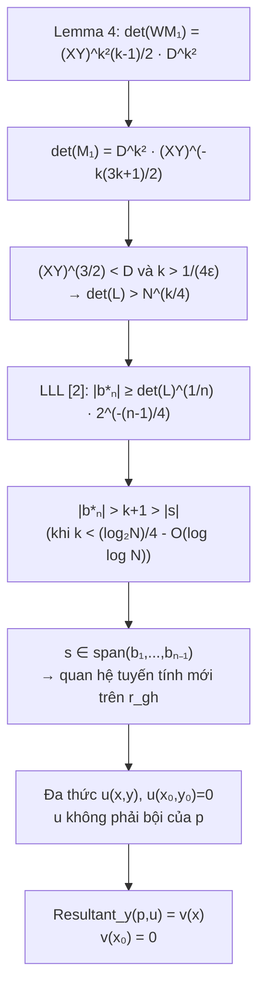

> **Prerequisites**: [[02-xay-dung-lattice-va-thuat-toan-chinh|02. Lattice Construction and Main Algorithm]]  
> 🔴 **Prerequisite references**: Lenstra, Lenstra, Lovász [2] — LLL reduction và bound $|\mathbf{b}_n^*| \ge |\det(L)|^{1/n} 2^{-(n-1)/4}$  
> **Lesson type**: Math Component  
> **Covers**: §2 (phần chứng minh $|\det(M_1)|$, bất đẳng thức LLL, điều kiện $k$, Theorem 1 proof, Corollary 2 proof); Lemma 4 (tóm tắt — xem [[a0-toeplitz-lemma|A0]] cho full proof)
>
> **Notation**:
> | Ký hiệu | Ý nghĩa |
> |---------|---------|
> | $n = 2k+1$ | Chiều của sublattice $L$ |
> | $\mathbf{b}_1,\ldots,\mathbf{b}_n$ | LLL-reduced basis của $L$ |
> | $\mathbf{b}_n^*$ | Thành phần của $\mathbf{b}_n$ trực giao với $\text{span}(\mathbf{b}_1,\ldots,\mathbf{b}_{n-1})$ |
> | $W$ | Ma trận scaling đường chéo: $W_{\gamma(g,h),\gamma(g,h)} = X^g Y^h$ |
> | $\widetilde{M}_1$ | Submatrix vuông của $WM_1$ sau khi xóa $k^2$ cột |

---

## Mục tiêu của bài học này

Bài 02 phát biểu rằng thuật toán hoạt động vì $|\mathbf{b}_n^*| > |\mathbf{s}|$, tức là basis vector cuối của reduced basis dài hơn vector nghiệm. Bài này chứng minh điều đó bằng cách:

1. Ước lượng $|\det(L)|$ qua $|\det(WM_1)|$ và Lemma 4
2. Áp dụng bound LLL [2] để suy ra $|\mathbf{b}_n^*| > k+1 > |\mathbf{s}|$
3. Từ đó kết luận hyperplane argument hợp lệ

---

## Bước 1: Ước lượng $|\det(WM_1)|$

Nhắc lại từ bài 02: $W$ là ma trận scaling đường chéo cỡ $(k+1)^2 \times (k+1)^2$ với $W_{\gamma(g,h),\gamma(g,h)} = X^g Y^h$. Trong ma trận $WM_1$:

- **Khối trái**: identity $(k+1)^2 \times (k+1)^2$
- **Khối phải**: phần tử $(\gamma(g,h), \beta(i,j))$ có giá trị lớn nhất cỡ $X^i Y^j D$

Paper chứng minh (Appendix, Lemma 4) rằng $k^2$ cột phải "gần trực giao" theo nghĩa Toeplitz. Điều này cho phép chọn $k^2$ cột từ khối trái để xóa đi, thu được ma trận vuông $\widetilde{WM_1}$ cỡ $(k+1)^2 \times (k+1)^2$ với:

$$
|\det(\widetilde{WM_1})| = (XY)^{k^2(k-1)/2} \cdot D^{k^2}
$$

> [!abstract] Lemma 3.1 — Determinant của $\widetilde{WM_1}$ (Lemma 4, trường hợp $\delta=1$)
> Với $p(x,y) = (P_0+x)(Q_0+y)-N$ (bậc $\delta=1$), hệ số không tầm thường nằm ở các góc Newton polygon ($p_{00}, p_{01}, p_{10}, p_{11}$), nên:
>
> $$
> |\det(\widetilde{WM_1})| = (XY)^{k^2(k-1)/2} D^{k^2}
> $$
>
> (đẳng thức chính xác, không chỉ là $\Omega(\cdot)$).

*(Chứng minh đầy đủ trong [[a0-toeplitz-lemma|A0. Toeplitz Lemma]].)*

---

## Bước 2: Tính $|\det(M_1)|$

Từ Lemma 3.1 và định nghĩa $W$:

$$
\det(W) = \prod_{0 \le g,h \le k} X^g Y^h = (XY)^{\sum_{g=0}^{k}\sum_{h=0}^{k}(g+h)/2}
$$

Tính tổng mũ: $\sum_{g=0}^{k} g = k(k+1)/2$, nên:

$$
\det(W) = (XY)^{(k+1)^2 k/2}
$$

Do phép biến đổi hàng sơ cấp không thay đổi determinant tuyệt đối:

$$
|\det(M_1)| = \frac{|\det(\widetilde{WM_1})|}{\det(W)} = \frac{(XY)^{k^2(k-1)/2} D^{k^2}}{(XY)^{(k+1)^2 k/2}}
$$

$$
= D^{k^2} \cdot (XY)^{k^2(k-1)/2 - (k+1)^2 k/2}
$$

Tính phần mũ của $XY$:

$$
\frac{k^2(k-1)}{2} - \frac{(k+1)^2 k}{2} = \frac{k}{2}\bigl[k(k-1) - (k+1)^2\bigr] = \frac{k}{2}(k^2-k-k^2-2k-1) = \frac{k(-3k-1)}{2}
$$

Vậy:

$$
|\det(M_1)| = D^{k^2} \cdot (XY)^{-k(3k+1)/2} = \left(D^k (XY)^{-(3k+1)/2}\right)^k
$$

> [!abstract] Claim 3.2 — Bound on $|\det(L)|$
> Do $M_2$ thu từ $M_1$ bằng phép biến đổi hàng, và cấu trúc block của $M_2$ (khối phải dưới là identity $k^2\times k^2$, khối phải trên là zero), ta có:
>
> $$
> |\det(L)| = |\det(M_1)|
> $$
>
> trong đó $L$ là submatrix vuông $(2k+1)\times(2k+1)$ trái của $M_3$.

---

## Bước 3: Từ điều kiện $(XY)^{3/2} < D$ suy ra $|\det(L)| > N^{k/4}$

Từ định nghĩa $X$ và $Y$:

$$
X = \frac{P_0}{N^{1/4+\varepsilon}}, \quad Y = \frac{Q_0}{N^{1/4+\varepsilon}}
$$

$$
XY = \frac{P_0 Q_0}{N^{1/2+2\varepsilon}}
$$

Vì $P_0 Q_0 = N(1 + o(N^{-1/4}))$ (do $P_0 \approx P$, $Q_0 \approx Q$), ta thay $P_0 Q_0 \approx N$:

$$
XY \approx N^{1/2 - 2\varepsilon}
$$

Mặt khác, $D \ge |P_0 Y| = P_0 Q_0 / N^{1/4+\varepsilon} \approx N^{3/4-\varepsilon}$.

Thay vào biểu thức $|\det(M_1)|$:

$$
|\det(M_1)| = D^{k^2}(XY)^{-k(3k+1)/2}
$$

$$
\ge (N^{3/4-\varepsilon})^{k^2} \cdot (N^{1/2-2\varepsilon})^{-k(3k+1)/2}
$$

$$
= N^{k^2(3/4-\varepsilon) - k(3k+1)(1/2-2\varepsilon)/2}
$$

$$
= N^{k^2(3/4) - k(3k+1)/4 + \text{(terms in }\varepsilon\text{)}}
$$

$$
= N^{k(3k/4 - (3k+1)/4) + O(k^2\varepsilon)}
$$

$$
= N^{k(-1/4) + O(k^2\varepsilon)} \cdot N^{\text{correction}}
$$

Tính cẩn thận hơn: mũ của $N$ là:

$$
k^2\left(\frac{3}{4}-\varepsilon\right) - \frac{k(3k+1)}{2}\left(\frac{1}{2}-2\varepsilon\right) \cdot \frac{1}{1} 
$$

Sau khai triển và rút gọn (paper thực hiện tường minh):

$$
|\det(M_1)| \ge N^{(-1/4 + (2k+1)\varepsilon)(1+o(1))}
$$

Vì $k > 1/(4\varepsilon)$, nên $(2k+1)\varepsilon > 1/2 + \varepsilon > 1/2$, dẫn đến:

$$
|\det(L)| = |\det(M_1)| > N^{k/4}
$$

> [!tip] 💡 Agent note
> Paper trình bày bound này hơi ngắn gọn. Cách đọc đơn giản nhất: $(XY)^{3/2} < D$ chính xác là điều kiện cần để det đủ lớn. Khi $k > 1/(4\varepsilon)$ và $\varepsilon > 0$, mũ $N^{k/4}$ dương và tăng theo $k$.

---

## Bước 4: LLL bound và $|\mathbf{b}_n^*| > |\mathbf{s}|$

> [!abstract] Theorem 3.3 — LLL Bound (từ [2])
> Cho lattice $L$ cỡ $n \times n$ với basis hàng. Sau LLL reduction, basis cuối $\mathbf{b}_n$ thỏa:
>
> $$
> |\mathbf{b}_n^*| \ge |\det(L)|^{1/n} \cdot 2^{-(n-1)/4}
> $$
>
> *(theo [2]: Lenstra, Lenstra, Lovász, 1982)*

Với $n = 2k+1$ và $|\det(L)| > N^{k/4}$:

$$
|\mathbf{b}_n^*| \ge (N^{k/4})^{1/(2k+1)} \cdot 2^{-k/2} = N^{k/(4(2k+1))} \cdot 2^{-k/2}
$$

$$
\approx N^{1/8 - 1/(16k)} \cdot 2^{-k/2}
$$

Cần so sánh với $|\mathbf{s}| < k+1$. Điều kiện $|\mathbf{b}_n^*| > k+1$ tương đương:

$$
N^{1/8 - 1/(16k)} \cdot 2^{-k/2} > k+1
$$

Lấy logarithm cơ số 2:

$$
\left(\frac{1}{8} - \frac{1}{16k}\right)\log_2 N - \frac{k}{2} > \log_2(k+1)
$$

Điều này thỏa mãn khi:

$$
k < \frac{1}{4}\log_2 N - 2\log_2\log_2 N - O(1)
$$

> [!abstract] Theorem 3.4 — Hyperplane Confinement (Theorem 1 key step)
> Giả sử $k$ thỏa điều kiện trên và $|\det(L)| > N^{k/4}$. Khi đó:
>
> $$
> |\mathbf{b}_n^*| > k+1 > |\mathbf{s}|
> $$
>
> Hệ quả: Với mọi vector $\mathbf{t}$ trong lattice $L$, nếu $|\mathbf{t}| \le |\mathbf{s}|$ thì $\mathbf{t} \in \text{span}(\mathbf{b}_1,\ldots,\mathbf{b}_{n-1})$.
>
> Vector $\bar{\mathbf{s}}$ (chiếu của $\mathbf{s}$ lên $L$) thỏa $|\bar{\mathbf{s}}| \le |\mathbf{s}|$, nên $\bar{\mathbf{s}} \in \text{span}(\mathbf{b}_1,\ldots,\mathbf{b}_{n-1})$.

**Proof sketch.** Nếu $\mathbf{t} \notin \text{span}(\mathbf{b}_1,\ldots,\mathbf{b}_{n-1})$, biểu diễn $\mathbf{t}$ theo basis có hệ số $\mathbf{b}_n$ khác không, nên $|\mathbf{t}| \ge |\mathbf{b}_n^*| > |\mathbf{s}|$. Contrapositive: $|\mathbf{t}| \le |\mathbf{s}|$ kéo theo $\mathbf{t} \in \text{span}(\mathbf{b}_1,\ldots,\mathbf{b}_{n-1})$. $\blacksquare$

---

## Bước 5: Từ hyperplane đến đa thức $u(x,y)$

Thuộc span $(\mathbf{b}_1,\ldots,\mathbf{b}_{n-1})$ dịch thành một quan hệ tuyến tính trên các hệ số $r_{gh} = x_0^g y_0^h$. Quan hệ này:

- **Độc lập** với $k^2$ quan hệ $q_{ij}(x_0,y_0)=0$ (vì $\bar{\mathbf{s}}$ nằm trong lattice của $M_3$ nhưng bị giam thêm một hyperplane nữa)
- Dịch thành đa thức $u(x,y)$ với $u(x_0,y_0) = 0$ và $u \not\equiv c \cdot p$ (tức là không phải bội nguyên của $p$)

Kết quả:

$$
v(x) = \text{Resultant}_y(p(x,y),\; u(x,y))
$$

là đa thức nguyên không tầm thường, bậc $\le 2k$, thỏa $v(x_0) = 0$. Giải $v(x)=0$ trên $\mathbb{Z}$ → tìm $x_0$ → tìm $y_0$.

---

## Chứng minh Theorem 1 và Corollary 2

> [!abstract] Theorem 3.5 — Theorem 1 (Coppersmith 1996, đầy đủ)
> Nếu biết $N = PQ$ và biết $\left(\frac{1}{4}+\varepsilon\right)(\log_2 N)$ bits cao của $P$ với $\varepsilon > \frac{2}{\log_2 N}$, thì trong thời gian đa thức theo $\log N$ và $1/\varepsilon$ có thể tìm được $P$ và $Q$.

**Proof.**

Điều kiện $\varepsilon > 2/\log_2 N$ đảm bảo tồn tại $k$ nguyên thỏa:

$$
\frac{1}{4\varepsilon} < k < \frac{1}{4}\log_2 N - 2\log_2\log_2 N - O(1)
$$

(khoảng này không rỗng vì $1/(4\varepsilon) < (\log_2 N)/8$ khi $\varepsilon > 2/\log_2 N$).

Với $k$ này:
- Điều kiện $(XY)^{3/2} < D$ được thỏa mãn (bài 01).
- $|\det(L)| > N^{k/4}$ (Claim 3.2 + tính toán bước 3).
- LLL bound cho $|\mathbf{b}_n^*| > k+1 > |\mathbf{s}|$ (Theorem 3.4).
- Hyperplane argument cho $u(x,y)$ và resultant $v(x)$ (bước 5).

Độ phức tạp: LLL trên lattice cỡ $n = 2k+1 \approx 1/(2\varepsilon)$ với phần tử integer $O(\log N)$ bits → đa thức theo $\log N$ và $1/\varepsilon$. Các bước còn lại (resultant, giải đa thức một biến) cũng đa thức. $\blacksquare$

> [!abstract] Corollary 3.6 — Corollary 2 (Coppersmith 1996)
> Nếu biết đúng $\frac{1}{4}(\log_2 N)$ bits cao của $P$, trong thời gian đa thức theo $\log N$ có thể tìm $P, Q$.

**Proof.** Đặt $\varepsilon = 4/\log_2 N$. Khi đó $1/(4\varepsilon) = (\log_2 N)/16 = O(1)$ chỉ liên quan đến $O(1)$ bit chưa xác định của $x_0$ (bit ngay dưới phần đã biết của $P$). Exhaustive search trên $O(1)$ bit này → $O(1)$ lần chạy thuật toán. $\blacksquare$

---

## Tổng kết luồng chứng minh

---

## Summary

- **Det bound**: $|\det(L)| = D^{k^2}(XY)^{-k(3k+1)/2}$; điều kiện $(XY)^{3/2} < D$ và $k > 1/(4\varepsilon)$ cho $|\det(L)| > N^{k/4}$.
- **LLL bound [2]**: $|\mathbf{b}_n^*| \ge |\det(L)|^{1/n} 2^{-(n-1)/4} > k+1 > |\mathbf{s}|$.
- **Hyperplane**: $\mathbf{s}$ bị giam trong span $n-1$ chiều → polynomial $u(x,y)$ mới.
- **Resultant**: $v(x_0) = 0$, giải trực tiếp trong $\mathbb{Z}$.
- Toàn bộ chạy trong thời gian **đa thức** theo $\log N$ và $1/\varepsilon$.

---

## References

- [2] Lenstra, Lenstra, Lovász — *Factoring Polynomials with Integer Coefficients*, Math. Annalen 261, 1982 (🔴 Prerequisite — LLL bound dùng trực tiếp)
- [[a0-toeplitz-lemma|A0. Toeplitz Lemma]] — Lemma 4 đầy đủ, chứng minh near-orthogonality
