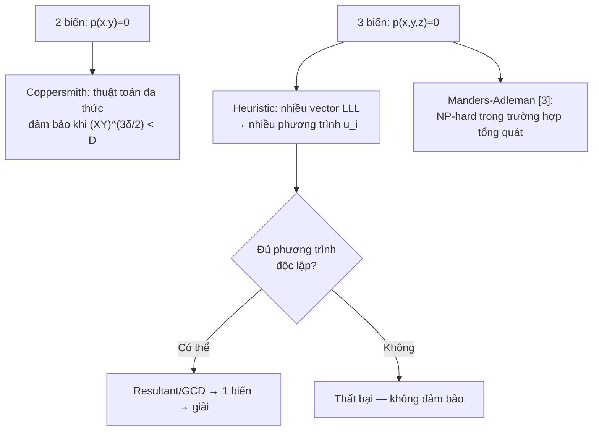

> **Prerequisites**: [[02-xay-dung-lattice-va-thuat-toan-chinh|02. Lattice Construction and Main Algorithm]]  
> 🔴 **Prerequisite references**: Lenstra, Lenstra, Lovász [2] (LLL); Manders & Adleman [3] (NP-hardness 3 biến)  
> **Lesson type**: Deep Dive  
> **Covers**: §4 (Other bivariate polynomials, Theorem 3), §5 (More variables — heuristic và giới hạn NP-hard)
>
> **Notation**:
> | Ký hiệu | Ý nghĩa |
> |---------|---------|
> | $\delta$ | Bậc của $p(x,y)$ trong $x$ |
> | $\tau$ | Bậc của $p(x,y)$ trong $y$ |
> | $\alpha$ | Tham số tỉ lệ: điều chỉnh phạm vi $i$ và $j$ trong $q_{ij}$ |
> | $k\alpha$ | Giới hạn trên của $i$; $k$ là giới hạn trên của $j$ |

---

## §4 — Đa thức hai biến tổng quát

### Tại sao kết quả phụ thuộc vào dạng của $p$?

Trong bài 02–03, bài toán RSA dùng $p(x,y) = (P_0+x)(Q_0+y) - N$ — bậc $\delta = \tau = 1$ trong mỗi biến, nhưng hạng tử cao nhất là $xy$ (không có $x^2$ hay $y^2$). Tính chất đặc biệt này khiến **Newton polygon** của $p$ nhỏ, và det của $WM_1$ tối ưu.

Với một đa thức tổng quát bậc $\delta$ trong $x$ và $\tau$ trong $y$, khi khối phải của $WM_1$ có phần tử lớn nhất cỡ $X^i Y^j D$, phần cân bằng giữa các mũ trong tính toán det thay đổi. Cụ thể: việc thêm hạng tử $x^2$ (bậc 2 theo $x$) buộc phải mở rộng phạm vi $g$ trong $r_{gh}$ — làm det nhỏ hơn.

### Tổng quát hóa theo bậc riêng lẻ $(\delta, \tau)$

> [!abstract] Theorem 4.1 — Theorem 3, trường hợp bậc riêng lẻ
> Gọi $p(x,y) = \sum_{i,j} p_{ij} x^i y^j$ là đa thức nguyên irreducible, bậc $\delta$ trong $x$ và $\tau$ trong $y$. Định nghĩa $D = \max_{i,j} |p_{ij}| X^i Y^j$.
>
> Chọn tham số $\alpha > 0$. Dùng họ polynomial $q_{ij}$ với $0 \le i < k\alpha$ và $0 \le j < k$. Khi đó thuật toán tìm được mọi $(x_0, y_0)$ với $|x_0| < X$, $|y_0| < Y$ và $p(x_0,y_0)=0$, miễn là:
>
> $$
> X^{\delta + (\alpha\tau/2)} Y^{\tau + (\delta/(2\alpha))} < D
> $$
>
> Thuật toán chạy trong thời gian đa thức theo $\delta, \tau, \alpha$ và $\log_2 D$.

**Trường hợp đặc biệt** $\alpha = 1$ (cân bằng): điều kiện trở thành $X^{\delta+\tau/2} Y^{\tau+\delta/2} < D$, tức là $(XY)^{(\delta+\tau)/2} (XY)^{\min(\delta,\tau)/2} < D$.

**Trường hợp tối ưu cho bài RSA** ($\delta = \tau = 1$, $\alpha = 1$): điều kiện là $X^{3/2} Y^{3/2} = (XY)^{3/2} < D$ — khớp với kết quả bài 01–02.

### Giải thích cơ chế $\alpha$

Tham số $\alpha$ điều chỉnh **tỉ lệ** số polynomial theo $x$ so với theo $y$:

- Dùng $i$ lên đến $k\alpha$ và $j$ lên đến $k$: $k^2\alpha$ polynomial tổng cộng.
- Nếu $p$ bất đối xứng ($\delta \ne \tau$), chọn $\alpha \ne 1$ có thể cân bằng tốt hơn giữa đóng góp của $x$ và $y$ vào det.

> [!tip] 💡 Agent note
> Trực giác: mỗi polynomial $q_{ij}$ đóng góp $X^i Y^j D$ vào $|\det(WM_1)|$, còn mỗi biến $r_{gh}$ đóng góp $X^{-g} Y^{-h}$. Cần cân bằng tổng mũ dương (từ polynomial) và âm (từ biến). Nếu $p$ có bậc cao hơn trong $x$ thì số biến $r_{gh}$ theo chiều $g$ nhiều hơn, cần nhiều polynomial theo $i$ hơn để bù — đây chính xác là vai trò của $\alpha$.

### Trường hợp bậc tổng $\delta$

Nếu $p(x,y)$ có **bậc tổng** $\delta$ (không nhất thiết bậc riêng lẻ), dùng họ polynomial $q_{ij}$ với $i \ge 0, j \ge 0, i+j < k$:

> [!abstract] Theorem 4.2 — Theorem 3, trường hợp bậc tổng
> Gọi $p(x,y)$ có bậc tổng $\delta$, irreducible, $D = \max_{i,j}|p_{ij}|X^i Y^j$. Khi đó thuật toán tìm $(x_0,y_0)$ với $p(x_0,y_0)=0$ miễn là:
>
> $$
> (XY)^\delta < D \times 2^{-6\delta^2 - 2}
> $$
>
> Thuật toán chạy trong thời gian đa thức theo $\delta$ và $\log_2 D$.

**So sánh hai trường hợp**:

| Loại đa thức | Điều kiện thành công |
|-------------|---------------------|
| Bậc $\delta$ trong từng biến, $\alpha=1$ | $X^{\delta+\tau/2} Y^{\tau+\delta/2} < D$ |
| Bậc tổng $\delta$ | $(XY)^\delta < D \cdot 2^{-6\delta^2-2}$ |
| RSA ($\delta=\tau=1$, biết $\frac{1}{4}\log N$ bits) | $(XY)^{3/2} < D$ |

Trường hợp bậc riêng lẻ **tốt hơn** khi $p$ thực sự có bậc thấp trong từng biến riêng lẻ (như bài RSA). Trường hợp bậc tổng tốt hơn cho đa thức dày đặc.

> [!warning] Giới hạn thực tiễn
> Ngay cả trong trường hợp hai biến, kết quả phụ thuộc nhạy vào **dạng Newton polygon** của $p$. Với đa thức bậc hai tổng quát có đủ hạng tử $x^2, xy, y^2$, điều kiện thành công chặt hơn đáng kể so với bài RSA chỉ có hạng tử $xy$.

---

## §5 — Ba biến trở lên: Heuristic và giới hạn

### Ý tưởng mở rộng

Với $p(x,y,z)$ ba biến, ta có thể bắt chước cách tiếp cận:
1. Xây họ polynomial $q_{ijk}(x,y,z) = x^i y^j z^k p(x,y,z)$ và lattice tương ứng.
2. LLL cho một hyperplane trong lattice → quan hệ $u(x,y,z)$, không phải bội của $p$.
3. Tính resultant của $p$ và $u$ theo $z$ → đa thức $v(x,y)$ hai biến.
4. Áp dụng thuật toán hiện tại cho $v$.

**Vấn đề**: Bậc của $v(x,y)$ rất cao (tích bậc của $p$ và $u$), làm bound $X, Y$ cần thiết để giải $v$ rất nhỏ — thường không thực tế.

### Heuristic tốt hơn

LLL có thể cho nhiều vector ngắn, không chỉ một. Mỗi vector ngắn thêm tăng **codimension** của không gian chứa nghiệm, tức là cho thêm một phương trình $u_i(x,y,z) = 0$. Nếu thu được đủ phương trình độc lập, có thể dùng resultant và GCD để giảm về một biến.

> [!warning] Chỉ là heuristic
> Cách tiếp cận này **không được đảm bảo**: các phương trình $u_i$ có thể không độc lập. Paper nêu đây chỉ là "heuristic procedure which might work for a given polynomial."

### Giới hạn NP-hard

> [!danger] Giới hạn lý thuyết — NP-hardness
> Manders và Adleman [3] chứng minh: bài toán tìm nghiệm nguyên bị chặn của $p_N(x,y,z) = x^2 - yN - z = 0$ là **NP-hard**. Đây là trường hợp đặc biệt của bài toán ba biến.
>
> Hệ quả: Không có thuật toán đa thức **đảm bảo** cho bài toán ba biến tổng quát, trừ khi P = NP.

Điều này giải thích tại sao phần §5 của paper ngắn và chỉ nêu heuristic: giới hạn lý thuyết cơ bản ngăn cản tổng quát hóa đảm bảo sang ba biến.

---

## Tóm tắt §4–§5

- **§4**: Bậc riêng lẻ $(\delta, \tau)$ → điều kiện $X^{\delta+\alpha\tau/2} Y^{\tau+\delta/(2\alpha)} < D$, tối ưu bằng cách chọn $\alpha$. Bậc tổng $\delta$ → $(XY)^\delta < D \cdot 2^{-6\delta^2-2}$.
- **§5**: Ba biến → không đảm bảo; NP-hard trong trường hợp tổng quát [3]; heuristic có thể thử.
- Kết quả chính của paper (hai biến, $\delta=\tau=1$) là tối ưu trong class polynomial time có đảm bảo.

---

## References

- [2] Lenstra, Lenstra, Lovász — *Factoring Polynomials with Integer Coefficients*, Math. Annalen 261, 1982 (🔴 Prerequisite)
- [3] Manders & Adleman — *NP-complete decision problems for binary quadratics*, J. Comput. System Sci. 16 (⚪ — giới hạn NP-hard §5)
