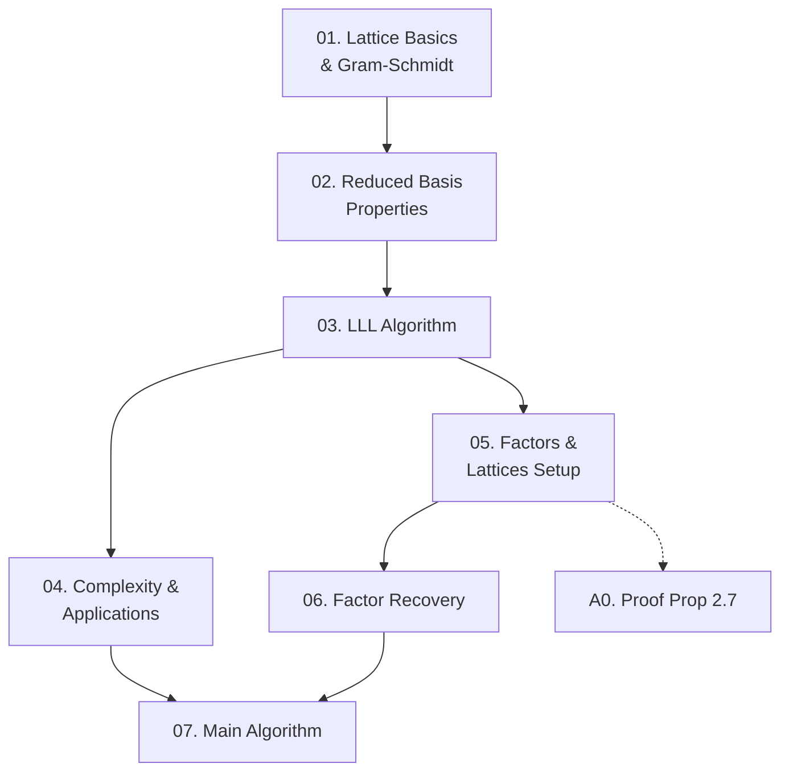

Paper Lenstra-Lenstra-Lovász (1982) trình bày thuật toán thời gian đa thức đầu tiên để phân tích đa thức $f \in \mathbb{Q}[X]$ thành nhân tử bất khả quy, với độ phức tạp $O(n^{12} + n^9(\log|f|)^3)$ bit operations. Course này cover toàn bộ nội dung paper: lý thuyết lattice reduction (§1), kết nối giữa nhân tử đa thức và lattice (§2), và thuật toán factoring hoàn chỉnh (§3).

**Kiến thức nền tảng yêu cầu** (🔴 Prerequisite references):
- Cassels — *An Introduction to the Geometry of Numbers* [4] (lattice geometry, successive minima)
- Knuth — *The Art of Computer Programming Vol. 2* [7] (Berlekamp's algorithm, Hensel's lemma, subresultant)

---

## Lesson Overview

| # | Title | Type | Covers | File | Dependencies |
|---|-------|------|--------|------|-------------|
| 01 | Lattice Basics & Gram-Schmidt | Math Component | Intro, §1:(1.1)–(1.5) | [[01-lattice-basics-gram-schmidt\|01. Lattice Basics]] | — |
| 02 | Properties of Reduced Bases | Math Component | §1:(1.6)–(1.14) | [[02-reduced-basis-properties\|02. Reduced Basis Properties]] | 01 |
| 03 | LLL Basis Reduction Algorithm | Scheme | §1:(1.15), Fig.1, (1.22)–(1.25) | [[03-lll-reduction-algorithm\|03. LLL Algorithm]] | 01, 02 |
| 04 | Complexity Analysis & Diophantine Applications | Deep Dive | §1:(1.26)–(1.39) | [[04-complexity-and-applications\|04. Complexity & Applications]] | 03 |
| 05 | Factors and Lattices — Setup | Math Component | §2:(2.1)–(2.8) | [[05-factors-and-lattices-setup\|05. Factors & Lattices Setup]] | 03 |
| 06 | Factor Recovery via LLL | Deep Dive | §2:(2.13),(2.14),(2.16) | [[06-factor-recovery\|06. Factor Recovery]] | 05 |
| 07 | Main Polynomial Factoring Algorithm | Scheme | §3:(3.1)–(3.10) | [[07-polynomial-factoring-algorithm\|07. Main Algorithm]] | 04, 06 |
| A0 | Proof of Proposition (2.7) | — | §2: proof of (2.7) | [[a0-proof-proposition-2-7\|A0. Proof Prop 2.7]] | 05 |

---

## Coverage Map

| Document section | Lesson |
|-----------------|--------|
| Introduction — problem statement, algorithm outline, running time | 01 |
| §1 (1.1)–(1.3) Lattice def, determinant, Gram-Schmidt | 01 |
| §1 (1.4)–(1.5) Reduced basis definition | 01 |
| §1 Proposition (1.6), inequalities (1.7)–(1.9) | 02 |
| §1 Hadamard (1.10), Prop (1.11), Prop (1.12), Remark (1.14) | 02 |
| §1 Algorithm (1.15), Fig. 1, Case 1 formulae (1.22) | 03 |
| §1 Termination proof (1.23)–(1.25) | 03 |
| §1 Complexity Prop (1.26)–(1.35) | 04 |
| §1 Remarks (1.37), (1.38) | 04 |
| §1 Diophantine Approximation Prop (1.39) + Q-linear relations | 04 |
| §2 Setup (2.1)–(2.4), Prop (2.5) | 05 |
| §2 Lattice L construction (2.6)–(2.8), Prop (2.7) statement | 05 |
| §2 Proof of Prop (2.7) | A0 |
| §2 Prop (2.13) — degree detection | 06 |
| §2 Sufficient condition (2.14), Prop (2.16) — full recovery | 06 |
| §3 Sub-algorithm (3.1), Prop (3.2) | 07 |
| §3 Algorithm (3.3), Prop (3.4) | 07 |
| §3 Main algorithm (3.5), Theorem (3.6) | 07 |
| §3 Remark (3.10) — simplification | 07 |

---

## Dependency Graph

---

## Progress

- [x] [[01-lattice-basics-gram-schmidt\|01. Lattice Basics & Gram-Schmidt]]
- [x] [[02-reduced-basis-properties\|02. Properties of Reduced Bases]]
- [x] [[03-lll-reduction-algorithm\|03. LLL Basis Reduction Algorithm]]
- [x] [[04-complexity-and-applications\|04. Complexity Analysis & Diophantine Applications]]
- [x] [[05-factors-and-lattices-setup\|05. Factors and Lattices — Setup]]
- [x] [[06-factor-recovery\|06. Factor Recovery via LLL]]
- [x] [[07-polynomial-factoring-algorithm\|07. Main Polynomial Factoring Algorithm]]
- [x] [[a0-proof-proposition-2-7\|A0. Proof of Proposition (2.7)]]

---

## 🟡 Integrated References

| Ref | Lesson | Nội dung tích hợp |
|-----|--------|------------------|
| [8] Lenstra AK (1981) | 05, 06 | Phiên bản yếu hơn của Prop (2.7) — gcd version |
| [10] Mignotte (1974) | 06 | Bound $\|h_0\| \le \binom{2m}{m}^{1/2}\|f\|$ dùng trong proof (2.13), (2.16) |
| [12] Rosser & Schoenfeld (1962) | 07 | $\prod_{q<p} q > e^{Ap}$ với $A = 0.84$, bound prime $p$ trong (3.6) |
| [6] Hardy & Wright (1979) | 07 | Sect. 22.2 — prime distribution lower bound |

---

## Notes

- §1 là phần dày nhất và quan trọng nhất về mặt kỹ thuật — nên đọc kỹ lessons 01–04 trước khi chuyển sang §2.
- Proof của Proposition (2.7) rất kỹ thuật (dùng Hadamard's inequality + argument về leading coefficient) — đặt trong A0 để không làm nặng lesson 05.
- Remark (3.10) cho thấy nếu dùng đúng thuật toán LLL từ §1, có thể tránh bước gcd computation — một simplification đẹp kết nối §1 và §3.
- Đọc song song paper gốc là tốt — ký hiệu trong paper nhất quán và proof rất súc tích.
