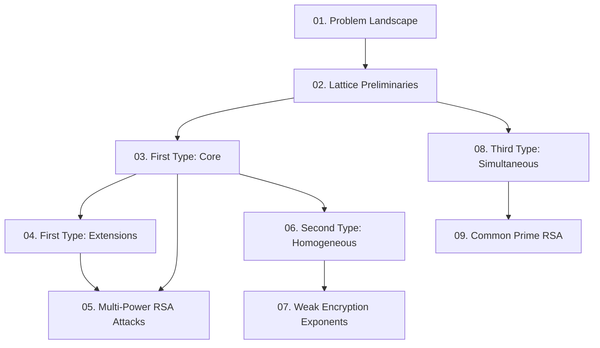

Paper này tổng quát hóa ba nhóm phương trình tuyến tính modulo ước số ẩn $p$ — mở rộng kết quả của Howgrave-Graham, Herrmann-May và Cohn-Heninger — và áp dụng để cải thiện kết quả tốt nhất hiện tại cho các tấn công vào Multi-Power RSA, CRT-RSA và Common Prime RSA. Course này cover toàn bộ 5 sections, 12 theorems/propositions, và tất cả experimental results trong paper.

**Kiến thức nền tảng yêu cầu**: LLL lattice reduction, Coppersmith method cơ bản, RSA & số học modular.

---

## Lesson Overview

| # | Title | Type | Covers | File | Dependencies |
|---|-------|------|--------|------|-------------|
| 01 | Problem Landscape & Prior Work | Foundation | §1, §1.1 | [[01-problem-landscape\|01. Problem Landscape & Prior Work]] | — |
| 02 | Lattice Preliminaries | Math Component | §2 | [[02-lattice-preliminaries\|02. Lattice Preliminaries]] | 01 |
| 03 | First Type: Core Algorithm | Scheme | §3, §3.1 (Thm 2, Fig 1) | [[03-first-type-core\|03. First Type: Core Algorithm]] | 02 |
| 04 | First Type: Extensions | Deep Dive | §3.1 (Thm 3, Prop 1) | [[04-first-type-extensions\|04. First Type: Extensions]] | 03 |
| 05 | First Type: Multi-Power RSA Attacks | Attack | §3.2 (Thms 4–6, Tables 1–3) | [[05-multi-power-rsa-attacks\|05. Multi-Power RSA Attacks]] | 03, 04 |
| 06 | Second Type: Homogeneous Equations | Scheme | §4, §4.1 (Thm 7, Prop 2) | [[06-second-type-homogeneous\|06. Second Type: Homogeneous Equations]] | 03 |
| 07 | Second Type: Weak Encryption Exponents | Attack | §4.2 (Thms 8–9, Table 4) | [[07-weak-encryption-exponents\|07. Weak Encryption Exponents]] | 06 |
| 08 | Third Type: Simultaneous Equations | Scheme | §5, §5.1 (Thms 10–11) | [[08-third-type-simultaneous\|08. Third Type: Simultaneous Equations]] | 02, 03 |
| 09 | Third Type: Common Prime RSA | Attack | §5.2 (Thm 12, Fig 3, Table 5) | [[09-common-prime-rsa\|09. Common Prime RSA Attack]] | 08 |

**Lesson types**: Foundation · Math Component · Scheme · Attack · Deep Dive

---

## Coverage Map

| Document section | Lesson |
|-----------------|--------|
| §1 Introduction | 01 |
| §1.1 Our Contributions | 01 |
| §2 Preliminary (Lemmas 1–2, Theorem 1, Assumption 1) | 02 |
| §3.1 Theorem 2 (First Type, univariate linear) | 03 |
| §3.1 Figure 1 (lattice matrix) | 03 |
| §3.1 Theorem 3 (degree-$\delta$ extension) | 04 |
| §3.1 Proposition 1 ($n$-variable extension) | 04 |
| §3.2 Theorem 4 (small secret exponent, Multi-Power RSA) | 05 |
| §3.2 Theorem 5 (partial key exposure — MSBs) | 05 |
| §3.2 Theorem 6 (partial key exposure — LSBs) | 05 |
| §3.2 Factoring with known bits / BDH comparison / Table 1–3 | 05 |
| §4.1 Theorem 7 (Second Type, homogeneous bivariate) | 06 |
| §4.1 Comparison with Herrmann-May & Castagnos et al. | 06 |
| §4.1 Proposition 2 ($n$-variable homogeneous) | 06 |
| §4.2 Theorem 8 (weak encryption exponents, RSA) | 07 |
| §4.2 Theorem 9 (CRT-RSA weak exponent) | 07 |
| §4.2 Table 4 (experiments) | 07 |
| §5.1 Theorem 10 (Third Type, simultaneous modular univariate) | 08 |
| §5.1 Theorem 11 (higher-degree extension) | 08 |
| §5.2 Theorem 12 (Common Prime RSA) | 09 |
| §5.2 Figure 3 + Table 5 (experiments, comparison) | 09 |
| §6 Conclusion | 09 |

---

## Dependency Graph

---

## Progress

- [x] [[01-problem-landscape\|01. Problem Landscape & Prior Work]]
- [x] [[02-lattice-preliminaries\|02. Lattice Preliminaries]]
- [x] [[03-first-type-core\|03. First Type: Core Algorithm]]
- [x] [[04-first-type-extensions\|04. First Type: Extensions]]
- [x] [[05-multi-power-rsa-attacks\|05. Multi-Power RSA Attacks]]
- [x] [[06-second-type-homogeneous\|06. Second Type: Homogeneous Equations]]
- [x] [[07-weak-encryption-exponents\|07. Weak Encryption Exponents]]
- [x] [[08-third-type-simultaneous\|08. Third Type: Simultaneous Equations]]
- [x] [[09-common-prime-rsa\|09. Common Prime RSA Attack]]

---

## 🟡 Integrated References

| Ref | Dùng trong lesson | Nội dung tích hợp |
|-----|------------------|-------------------|
| [LLL82] | 02 | Lemma 1 — LLL bound on reduced basis norms |
| [HG97] | 02 | Lemma 2 — Howgrave-Graham sufficient condition |
| [Cop97] | 02 | Theorem 1 — Coppersmith univariate small root |
| [May10] | 02, 03 | Theorem 1 co-attribution; special case $u=v$ của Thm 2 |
| [HG01] | 03 | ACDP origin; special case $u=v=1$ |
| [HM08] | 03, 06 | Bound $3\beta-2+2(1-\beta)^{3/2}$ được cải thiện |
| [CH12] | 08 | Simultaneous equations (1) là special case của Thm 10 |
| [May04] | 05 | Bound $N^{\max\{r/(r+1)^2,\,(r-1)^2/(r+1)^2\}}$ bị cải thiện bởi Thm 4 |
| [BDH99] | 05 | BDH method so sánh trực tiếp (Sec 3.2, Table 3) |
| [Tak98] | 05 | Multi-Power RSA definition; original bound $N^{1/2(r+1)}$ |
| [Nit12] | 07 | Bounds được extend trong Thms 8, 9 |
| [JM06] | 09 | Bound cải thiện bởi Thm 12 |
| [Hin06] | 09 | Common Prime RSA definition |
| [NS05] | 03 | L²-algorithm — running time analysis trong proof Thm 2 |

---

## Notes

- **Lesson 02** là nền tảng kỹ thuật cốt lõi — đọc kỹ trước khi tiếp tục.
- **Lesson 03** là trung tâm của toàn paper; proof của Theorem 2 dài nhưng tất cả steps đều quan trọng, đặc biệt phần tính $\det(L)$ và bound $\gamma < uv\beta^2$.
- **Lessons 04 → 05** và **06 → 07** và **08 → 09** là cặp Scheme → Attack có thể đọc song song sau khi nắm Lesson 03.
- Experimental results (Tables 2–5) được cover trong các lesson Attack tương ứng — chúng confirm lý thuyết và cũng cho thấy tradeoff lattice dimension vs. accuracy.
