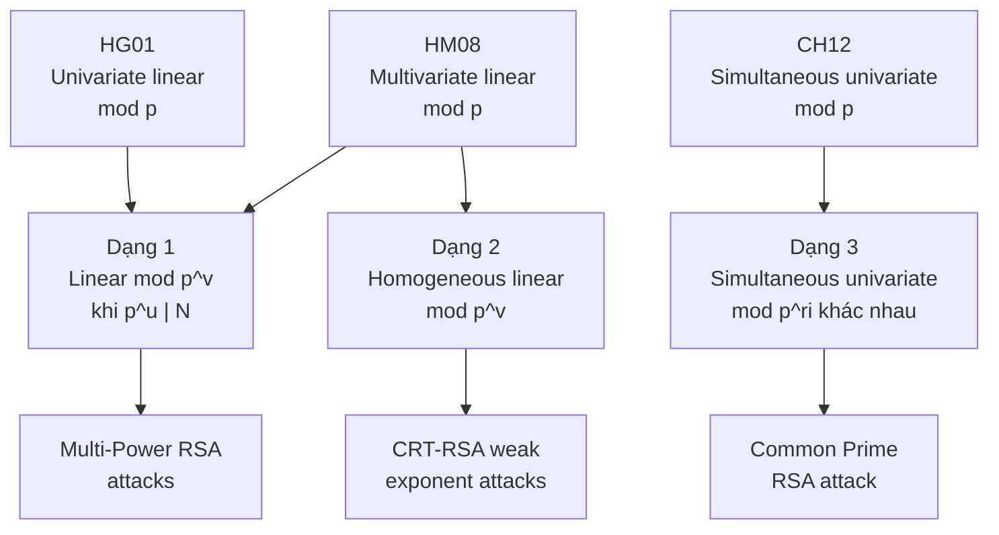

> **Prerequisites**: RSA & số học modular, Coppersmith method cơ bản, LLL lattice reduction cơ bản  
> **Lesson type**: Foundation  
> **Covers**: §1 Introduction, §1.1 Our Contributions
>
> **Notation** (ký hiệu dùng xuyên suốt course):
> | Ký hiệu | Ý nghĩa |
> |---------|---------|
> | $N$ | Composite modulus đã biết (known composite integer) |
> | $p$ | Ước số nguyên tố ẩn của $N$ |
> | $\beta$ | Tham số kích thước: $p \ge N^\beta$, với $0 < \beta \le 1$ |
> | $u$ | Số mũ bội số: $p^u \mid N$ (thông tin đã biết) |
> | $v$ | Số mũ modulus phương trình: phương trình đặt modulo $p^v$ |
> | $\gamma$ | Tham số kích thước nghiệm: $|y| \le N^\gamma$ |
> | $\epsilon$ | Slack dương tùy ý nhỏ trong các bound tiệm cận |

---

## Bài toán Gốc: Tìm Nghiệm Nhỏ Modulo Ước Số Ẩn

Cho một số nguyên hợp $N$ đã biết, và biết rằng $N$ có một ước số nguyên tố **ẩn** $p$ với $p \ge N^\beta$. Bài toán cốt lõi là:

> **Tìm tất cả nghiệm nhỏ $y$ của phương trình $f(x) = 0 \pmod{p}$, khi $p$ không được biết trực tiếp.**

Điều khó ở đây là ta không biết $p$ — chỉ biết $N$ là bội số của $p$. Nếu biết $p$, bài toán là trivial (giải phương trình tuyến tính thông thường). Ý tưởng của Coppersmith và Howgrave-Graham là dùng cấu trúc lattice để "bypass" việc không biết $p$.

Bài toán này xuất hiện tự nhiên trong **cryptanalysis**: để tấn công RSA, đối thủ thường cần tìm một giá trị bí mật nhỏ thỏa một hệ thức tuyến tính modulo một thừa số ẩn của $N$.

---

## Ba Đường Tổng Quát Hóa Trước Đây

Paper này xuất phát từ ba kết quả nền tảng đã có:

### 1. Howgrave-Graham 2001 — Phương trình univariate tuyến tính

> [!info] 🟡 Howgrave-Graham [HG01] — Approximate Integer Common Divisors
> Howgrave-Graham giới thiệu bài toán **Approximate Common Divisor Problem (ACDP)**: cho hai số là "xấp xỉ bội số" của một số ẩn $p$, tìm $p$. Bài toán được rút gọn về việc giải phương trình:
>
> $$f(x) = x + a \equiv 0 \pmod{p}$$
>
> với $a$ đã biết, $p$ ẩn và $p \mid N$. Ông đề xuất thuật toán polynomial-time tìm nghiệm nhỏ $|y| \le N^\beta$ (trường hợp $u = v = 1$ trong framework của paper này).
>
> *(theo [HG01]: Howgrave-Graham — Approximate Integer Common Divisors, CaLC 2001)*

ACDP là nền tảng của một số crypto scheme, bao gồm **Fully Homomorphic Encryption over the integers** (van Dijk et al., Eurocrypt 2010).

### 2. Herrmann-May 2008 — Tổng quát hóa multivariate

> [!info] 🟡 Herrmann-May [HM08] — Solving Linear Equations Modulo Divisors
> Herrmann và May mở rộng bài toán univariate thành phương trình tuyến tính $n$ biến:
>
> $$f(x_1, \ldots, x_n) = a_0 + a_1 x_1 + \cdots + a_n x_n \equiv 0 \pmod{p}$$
>
> với $p$ ẩn, $p \mid N$. Thuật toán của họ tìm nghiệm nhỏ trong thời gian polynomial. Ứng dụng trực tiếp: **factoring with known bits** cho $N = pq$ khi các bit ẩn nằm rải rác trong $p$.
>
> *(theo [HM08]: Herrmann, May — Solving Linear Equations Modulo Divisors: On Factoring Given Any Bits, Asiacrypt 2008)*

### 3. Cohn-Heninger 2012 — Hệ phương trình univariate đồng thời

Cohn và Heninger tổng quát hóa theo hướng khác: nhiều phương trình univariate **đồng thời** trên cùng một $p$ ẩn:

$$\begin{cases} f_1(x_1) = a_1 + x_1 \equiv 0 \pmod{p} \\ f_2(x_2) = a_2 + x_2 \equiv 0 \pmod{p} \\ \quad \vdots \\ f_n(x_n) = a_n + x_n \equiv 0 \pmod{p} \end{cases}$$

Ứng dụng: phân tích bảo mật của **FHE over the integers**, implicit factorization, fault attacks trên CRT-RSA.

---

## Ba Dạng Phương Trình Mới Trong Paper Này

Paper này giới thiệu ba tổng quát hóa mới, mỗi dạng giải quyết một lớp tấn công mà các phương pháp trước không áp dụng được:

### Dạng 1 — Tổng quát hóa Herrmann-May với $p^u \mid N$ và modulus $p^v$

$$f(x_1, \ldots, x_n) = a_0 + a_1 x_1 + \cdots + a_n x_n \equiv 0 \pmod{p^v}$$

với $p^u \mid N$ (biết rằng $N$ là bội của $p^u$, không chỉ $p$). Tham số $u \ge 1$, $v \ge 1$ tùy ý.

> [!note] Tại sao cần $u > 1$ và $v > 1$?
> Trong **Multi-Power RSA** với $N = p^r q$, để tấn công secret exponent $d$, ta có phương trình $ed \equiv 1 \pmod{p^{r-1}(p-1)(q-1)}$. Điều này dẫn đến phương trình linear modulo $p^{r-1}$ ($v = r-1$), trong khi $N \equiv 0 \pmod{p^r}$ ($u = r$). Các phương pháp với $u = v = 1$ không cho kết quả tốt trong trường hợp này.

Kết quả chính (Theorem 2): Có thể tìm nghiệm $|y| \le N^\gamma$ khi

$$\gamma < uv\beta^2$$

### Dạng 2 — Phương trình tuyến tính thuần nhất (homogeneous)

$$f_2(x_1, x_2) = a_1 x_1 + a_2 x_2 \equiv 0 \pmod{p^v}$$

Trường hợp đặc biệt $a_0 = 0$ của Dạng 1, nhưng cho phép cải thiện bound nhờ tận dụng cấu trúc homogeneous. Ứng dụng trong tấn công **weak encryption exponents** của Nitaj.

### Dạng 3 — Hệ phương trình univariate đồng thời với bậc lũy thừa khác nhau

$$\begin{cases} f_1(x_1) = a_1 + x_1 \equiv 0 \pmod{p^{r_1}} \\ f_2(x_2) = a_2 + x_2 \equiv 0 \pmod{p^{r_2}} \\ \quad \vdots \\ f_n(x_n) = a_n + x_n \equiv 0 \pmod{p^{r_n}} \end{cases}$$

Mỗi phương trình có modulus $p^{r_j}$ khác nhau. Đây là tổng quát hóa của Cohn-Heninger (trường hợp $r_1 = \cdots = r_n = 1$). Ứng dụng trong tấn công **Common Prime RSA**.

---

## Đóng Góp Chính

Paper đạt được các cải thiện sau đây so với kết quả tốt nhất trước đó:

> [!abstract] Small Secret Exponent Attack — Multi-Power RSA
> Với $N = p^r q$ ($r \ge 2$), nếu $d < N^{r(r-1)/(r+1)^2 - \epsilon}$, thì có thể phân tích $N$ trong thời gian polynomial. Kết quả này cải thiện bound của May (PKC'04) khi $r > 2$.

> [!abstract] Factoring $N = p^r q$ với Known Bits
> Cùng bound tiệm cận $|x_0| \le N^{r/(r+1)^2 - \epsilon}$ như BDH (Crypto'99), nhưng thuật toán mới linh hoạt hơn trong chọn lattice dimension, cho kết quả thực nghiệm tốt hơn khi $r$ lớn.

> [!abstract] Weak Encryption Exponents — RSA & CRT-RSA
> Cải thiện kết quả của Nitaj (Africacrypt'12): với phương trình thuần nhất $ex + y \equiv 0 \pmod{p}$, bound cải thiện từ $\gamma + \delta \le (\sqrt{2}-1)/2 \approx 0.207$ lên $\gamma + \delta \le 0.25$.

> [!abstract] Common Prime RSA — Jochemsz-May Attack
> Cải thiện đáng kể khi $\gamma$ lớn: với $\gamma > 1/4$, bound được cải thiện lên $\beta < 4\gamma^3$, trong khi Jochemsz-May bị giới hạn bởi $\beta \approx 0.275$ khi $\gamma \to 1/2$.

---

## Sơ Đồ Kiến Trúc

---

## Tại Sao Các Phương Pháp Cũ Không Đủ?

Khó khăn cốt lõi nằm ở **cách nhúng thông tin đại số vào lattice construction**. Cụ thể:

Khi $N = p^r q$ với $r \ge 2$, ta có $\text{gcd}(ed-1, N) = p^{r-1}$ nhưng $N \equiv 0 \pmod{p^r}$. Thông tin này có hai mức: $p^{r-1}$ xuất hiện trong phương trình, còn $p^r$ xuất hiện trong modulus. Các thuật toán với $u = v$ không thể tận dụng sự chênh lệch này.

Paper giải quyết bằng cách chọn các đa thức shift $g_k(x)$ một cách khéo léo để cả hai mức thông tin đều được nhúng vào lattice, cho phép bound chặt hơn.

---

## References

- [HG01] Howgrave-Graham — *Approximate Integer Common Divisors*, CaLC 2001
- [HM08] Herrmann, May — *Solving Linear Equations Modulo Divisors: On Factoring Given Any Bits*, Asiacrypt 2008
- [CH12] Cohn, Heninger — *Approximate Common Divisors via Lattices*, ANTS-X 2012
- [May04] May — *Secret Exponent Attacks on RSA-Type Schemes with Moduli $N = p^r q$*, PKC 2004
- [BDH99] Boneh, Durfee, Howgrave-Graham — *Factoring $N = p^r q$ for Large $r$*, Crypto 1999
- [Nit12] Nitaj — *A New Attack on RSA and CRT-RSA*, Africacrypt 2012
- [JM06] Jochemsz, May — *A Strategy for Finding Roots of Multivariate Polynomials*, Asiacrypt 2006
