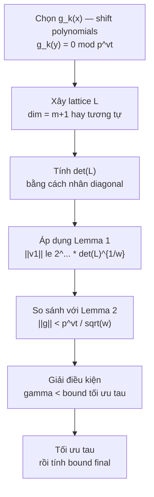

> **Prerequisites**: [[01-problem-landscape|01. Problem Landscape & Prior Work]], LLL algorithm & lattice reduction  
> **Lesson type**: Math Component  
> **Covers**: §2 Preliminary — Lemma 1 (LLL), Lemma 2 (Howgrave-Graham), Theorem 1 (Coppersmith/May), Assumption 1
>
> **Notation**:
> | Ký hiệu | Ý nghĩa | Ký hiệu trong paper |
> |---------|---------|---------------------|
> | $L$ | Lattice được xây dựng | $L$ |
> | $w$ | Dimension của lattice | $w$ (Lemma 1), $d$ (proof Thm 2) |
> | $\det(L)$ | Determinant của lattice | $\det(L)$ |
> | $\lVert v \rVert$ | Chuẩn Euclidean của vector $v$ | $\lVert \cdot \rVert$ |
> | $g(x_1, \ldots, x_k)$ | Đa thức nguyên nhiều biến | $g$ |
> | $\lVert g \rVert$ | Chuẩn Euclidean của vector hệ số của $g$ | $\lVert g \rVert$ |
> | $p^m$ | Lũy thừa của ước số ẩn dùng làm modulus trong Lemma 2 | $p^m$ |

---

## Tại Sao Cần Lattice?

Bài toán tìm nghiệm nhỏ của $f(x) \equiv 0 \pmod{p}$ — với $p$ ẩn — không thể giải trực tiếp bằng số học modular vì ta không có $p$. Ý tưởng của Coppersmith:

1. **Xây dựng một họ đa thức** $\{g_i\}$ sao cho mọi đa thức đều có $y$ là nghiệm modulo $p^m$ (với $m$ đủ lớn).
2. **Embed các đa thức này vào một lattice** $L$ (mỗi vector là vector hệ số của một đa thức sau khi substitute $x \mapsto xX$).
3. **Chạy LLL** để tìm vector ngắn trong $L$ — vector ngắn tương ứng một đa thức $g$ với hệ số nhỏ.
4. **Áp dụng Howgrave-Graham**: nếu $\lVert g \rVert$ đủ nhỏ, thì $g(y) = 0$ trên số nguyên (không phải chỉ modulo $p^m$).
5. **Tìm nghiệm nguyên** của $g$ bằng các phương pháp chuẩn.

Ba công cụ sau đây là nền tảng kỹ thuật cho tất cả các proof trong paper.

---

## Lemma 1 — LLL Bound on Reduced Basis

> [!info] 🟡 LLL Algorithm [LLL82]
> Thuật toán LLL (Lenstra-Lenstra-Lovász, 1982) nhận đầu vào là một cơ sở lattice tùy ý và xuất ra một **LLL-reduced basis** trong thời gian polynomial, với đảm bảo về độ ngắn của các vector cơ sở.
>
> *(theo [LLL82]: Lenstra, Lenstra, Lovász — Factoring polynomials with rational coefficients, Math. Ann. 261(4), 1982)*

> [!abstract] Lemma 1 — LLL (Lu et al. §2, từ [LLL82])
> Cho $L$ là lattice dimension $w$. Trong thời gian polynomial, LLL xuất ra cơ sở rút gọn $v_1, \ldots, v_w$ thỏa:
>
> $$
> \lVert v_1 \rVert \le \lVert v_2 \rVert \le \cdots \le \lVert v_i \rVert \le 2^{\frac{w(w-1)}{4(w+1-i)}} \det(L)^{\frac{1}{w+1-i}}
> $$

**Nhận xét quan trọng**: Bound lý thuyết trên thường **pessimistic** — trong thực nghiệm, LLL thường cho vector ngắn hơn đáng kể, đặc biệt khi lattice "random-looking". Đây là lý do tại sao heuristic attack thường hiệu quả hơn lý thuyết dự đoán.

**Hệ quả cần dùng**: Vector ngắn nhất $v_1$ thỏa:

$$
\lVert v_1 \rVert \le 2^{\frac{w-1}{4}} \det(L)^{\frac{1}{w}}
$$

(lấy $i = 1$). Đây là bound được dùng trong tất cả proof của paper.

---

## Lemma 2 — Điều Kiện Đủ Howgrave-Graham

Lemma này là cầu nối giữa "nghiệm modulo $p^m$" và "nghiệm trên số nguyên":

> [!info] 🟡 Howgrave-Graham [HG97]
> Howgrave-Graham (IMACC 1997) reformulated và cụ thể hóa ý tưởng của Coppersmith thành điều kiện đủ có thể kiểm tra được.
>
> *(theo [HG97]: Howgrave-Graham — Finding Small Roots of Univariate Modular Equations Revisited, IMACC 1997, LNCS 1355)*

> [!abstract] Lemma 2 — Howgrave-Graham Sufficient Condition (Lu et al. §2, từ [HG97])
> Cho $g(x_1, \ldots, x_k) \in \mathbb{Z}[x_1, \ldots, x_k]$ là đa thức nguyên gồm tối đa $w$ monomial. Giả sử:
>
> 1. $g(y_1, \ldots, y_k) \equiv 0 \pmod{p^m}$ với $|y_i| \le X_i$, và
> 2. $\lVert g(x_1 X_1, \ldots, x_k X_k) \rVert < \dfrac{p^m}{\sqrt{w}}$
>
> Thì $g(y_1, \ldots, y_k) = 0$ trên số nguyên (không phải chỉ modulo $p^m$).

**Proof sketch.** Gọi $h(x_1, \ldots, x_k) = g(x_1 X_1, \ldots, x_k X_k)$. Với $|y_i| \le X_i$, ta có $|y_i / X_i| \le 1$, nên các monomial của $h$ evaluated tại $y_i/X_i$ bị chặn bởi hệ số tương ứng. Bởi Cauchy-Schwarz:

$$
|g(y_1, \ldots, y_k)| = |h(y_1/X_1, \ldots, y_k/X_k)| \le \sqrt{w} \cdot \lVert h \rVert < p^m
$$

Vì $g(y_1, \ldots, y_k) \equiv 0 \pmod{p^m}$ và $|g(y_1, \ldots, y_k)| < p^m$, suy ra $g(y_1, \ldots, y_k) = 0$ trên $\mathbb{Z}$. $\blacksquare$

> [!tip] 💡 Agent note
> Điều kiện (2) yêu cầu $\lVert g(x_1 X_1, \ldots) \rVert$ nhỏ — đây chính xác là điều LLL đảm bảo cho vector ngắn nhất trong lattice. Quy trình Coppersmith là: xây lattice → chạy LLL → kiểm tra điều kiện (2) → nếu thỏa thì có nghiệm nguyên. Toàn bộ paper Lu et al. xoay quanh việc **chọn lattice khéo léo** sao cho điều kiện (2) được thỏa với bound $\gamma$ tốt nhất có thể.

---

## Theorem 1 — Coppersmith/May: Nghiệm Nhỏ Univariate

Kết hợp Lemma 1 và Lemma 2, ta được:

> [!info] 🟡 Coppersmith [Cop97] & May [May10]
> Coppersmith (J. Cryptology 1997) trình bày phương pháp lattice tìm nghiệm nhỏ của đa thức modular. May (2010) reformulated và phân tích độ phức tạp chính xác.
>
> *(theo [Cop97]: Coppersmith — Small Solutions to Polynomial Equations, J. Cryptology 10(4), 1997)*  
> *(theo [May10]: May — Using LLL-Reduction for Solving RSA and Factorization Problems, The LLL Algorithm, 2010)*

> [!abstract] Theorem 1 — Coppersmith/May (Lu et al. §2)
> Cho $N$ là số nguyên có ước số $p \ge N^\beta$ ($0 < \beta \le 1$). Cho $f(x)$ là đa thức monic bậc $\delta$ với hệ số nguyên. Thì trong thời gian $O(\epsilon^{-7}\delta^5 \log^9 N)$, có thể tìm tất cả nghiệm $x_0$ của:
>
> $$
> f(x) \equiv 0 \pmod{p} \quad \text{với } |x_0| \le N^{\beta^2/\delta - \epsilon}
> $$

**Tại sao bound là $\beta^2/\delta$?** Đây là kết quả tối ưu của bài toán lattice dimension 1D tương ứng: với đa thức bậc $\delta$, sau khi embed vào lattice, điều kiện LLL + Howgrave-Graham dẫn đến bound $X < N^{\beta^2/\delta}$.

**Trường hợp đặc biệt**: $\delta = 1$ (tuyến tính) → bound $|x_0| \le N^{\beta^2}$. Paper Lu et al. cải thiện điều này khi có thêm thông tin $p^u \mid N$: bound mới là $N^{uv\beta^2}$ (với $u \ge 1$, $v \ge 1$).

---

## Assumption 1 — Độc Lập Đại Số của Output LLL

Trong bài toán nhiều biến, LLL cho nhiều đa thức. Ta cần giải hệ để tìm nghiệm chung.

> [!abstract] Assumption 1 — Algebraic Independence (Lu et al. §2)
> Cấu trúc lattice sinh ra các đa thức algebraically independent. Nghiệm chung của các đa thức này có thể được tính hiệu quả bằng **Gröbner basis**.

> [!warning] Heuristic — Không phải Rigorous
> Assumption 1 là giả thiết heuristic, được dùng rộng rãi trong toàn bộ literature lattice-based cryptanalysis ([BD00], [HM08], v.v.). Trong lý thuyết, độ phức tạp của Gröbner basis là doubly exponential trong bậc đa thức; tuy nhiên trong thực nghiệm với các đa thức có cấu trúc từ lattice, tính toán thường nhanh. Paper Lu et al. ghi nhận rằng vì LLL thường cho ra nhiều hơn $n$ đa thức cho bài toán $n$ biến, các đa thức phụ này có thể dùng để tăng tốc Gröbner basis.

---

## Quy Trình Coppersmith Tổng Quát

Toàn bộ paper xây dựng trên quy trình sau:

> [!note] Scheme 2.1 — Coppersmith General Framework
> **Type**: Small Root Finding Method  
> **Setting**: $N$ composite, $p \ge N^\beta$ ẩn, $p \mid N$; đa thức $f$ có nghiệm nhỏ $y$ modulo $p^v$
>
> **$\mathsf{CoppersmithSolve}(N, f, X, \beta, u, v)$**
> - Input: $N$, đa thức $f$, bound $X$ (nghiệm ẩn $\le X$), tham số $\beta, u, v$
> - Bước 1: Chọn **họ đa thức shift** $\{g_k\}$ sao cho $g_k(y) \equiv 0 \pmod{p^{vt}}$ với $t$ được tối ưu
> - Bước 2: Xây **lattice $L$** có cơ sở từ vector hệ số của $\{g_k(xX)\}$
> - Bước 3: Chạy **LLL** trên $L$, thu được vector ngắn $\mathbf{b}$
> - Bước 4: Kiểm tra điều kiện **Howgrave-Graham** (Lemma 2): $\lVert \mathbf{b} \rVert < p^{vt}/\sqrt{w}$
> - Bước 5: Nếu thỏa, vector $\mathbf{b}$ ứng với đa thức $g$ có $g(y) = 0$ trên $\mathbb{Z}$
> - Bước 6: Tìm nghiệm nguyên của $g$ (univariate: factoring thông thường; multivariate: Gröbner basis)
> - Output: Tập nghiệm nhỏ $\{y : f(y) \equiv 0 \pmod{p^v},\, |y| \le X\}$

Phần khác nhau giữa các thuật toán trong paper là **Bước 1** — cách chọn họ đa thức $\{g_k\}$. Đây là "nghệ thuật" của lattice-based cryptanalysis.

---

## Kết Nối với Paper

Mọi proof trong paper Lu et al. đều theo cùng skeleton:

Lesson tiếp theo ([[03-first-type-core|03. First Type: Core Algorithm]]) thực hiện toàn bộ quy trình này cho Theorem 2 — kết quả trung tâm của paper.

---

## References

- [LLL82] Lenstra, Lenstra, Lovász — *Factoring polynomials with rational coefficients*, Math. Ann. 261(4), 1982
- [HG97] Howgrave-Graham — *Finding Small Roots of Univariate Modular Equations Revisited*, IMACC 1997
- [Cop97] Coppersmith — *Small Solutions to Polynomial Equations, and Low Exponent RSA Vulnerabilities*, J. Cryptology 10(4), 1997
- [May10] May — *Using LLL-Reduction for Solving RSA and Factorization Problems*, The LLL Algorithm, Springer 2010
- [BD00] Boneh, Durfee — *Cryptanalysis of RSA with Private Key $d$ less than $N^{0.292}$*, IEEE Trans. IT 2000
