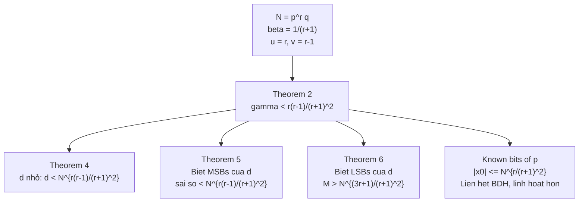

> **Prerequisites**: [[03-first-type-core|03. First Type: Core Algorithm]], [[04-first-type-extensions|04. First Type: Extensions]]  
> **Lesson type**: Attack  
> **Covers**: §3.2 — Theorem 4 (small secret exponent), Theorem 5 (MSBs partial exposure), Theorem 6 (LSBs partial exposure), Factoring with known bits / BDH comparison, Table 1, Table 2, Table 3
>
> **Notation** (thêm vào notation đã có):
> | Ký hiệu | Ý nghĩa |
> |---------|---------|
> | $r$ | Số mũ trong $N = p^r q$, $r \ge 2$ |
> | $\phi(N)$ | Euler's totient: $\phi(N) = p^{r-1}(p-1)(q-1)$ với $N = p^r q$ |
> | $e$ | Public exponent RSA |
> | $d$ | Private exponent RSA: $ed \equiv 1 \pmod{\phi(N)}$ |
> | $\delta$ | Tham số kích thước của $d$: $d \approx N^\delta$ |
> | $\tilde{d}$ | Approximation đã biết của $d$ (trong partial key exposure) |
> | $d_0$, $M$ | LSBs attack: $d = d_1 M + d_0$ với $d_0$ và $M$ đã biết |
> | $\tilde{p}$ | Approximation của $p$ (trong factoring with known bits) |

---

## Bối Cảnh: Multi-Power RSA

> [!info] 🟡 Multi-Power RSA [Tak98]
> Takagi (Crypto 1998) đề xuất RSA variant với modulus $N = p^r q$ ($r \ge 2$) để tăng hiệu quả tính toán — đặc biệt phép decrypt sử dụng CRT. Scheme này được triển khai trong **EPOC** và **ESIGN**, và là nền tảng của **Okamoto-Uchiyama cryptosystem** ($r = 2$).
>
> Tham số: $p, q$ nguyên tố cùng cỡ bit, $e \cdot d \equiv 1 \pmod{\phi(N)}$ với $\phi(N) = p^{r-1}(p-1)(q-1)$.
>
> *(theo [Tak98]: Takagi — Fast RSA-type Cryptosystem Modulo $p^k q$, Crypto 1998)*

Vì $N = p^r q$ và $p \approx q \approx N^{1/(r+1)}$, ta có $p \ge N^{1/(r+1)}$, tức là $\beta = 1/(r+1)$.

**Thông tin lattice đặc biệt**: $N \equiv 0 \pmod{p^r}$, nghĩa là $u = r$ trong framework của paper. Đây là điểm mấu chốt: biết $p^r \mid N$ cho phép đặt $u = r$, cải thiện bound đáng kể.

---

## Tấn Công 1 — Small Secret Exponent (Theorem 4)

### Thiết Lập

Từ $ed \equiv 1 \pmod{\phi(N)} = p^{r-1}(p-1)(q-1)$, tồn tại $k$ nguyên dương sao cho:

$$
ed - 1 = k \cdot p^{r-1}(p-1)(q-1)
$$

Do đó $ed \equiv 1 \pmod{p^{r-1}}$, tức là phương trình:

$$
f_1(x) = ex - 1 \equiv 0 \pmod{p^{r-1}}
$$

có nghiệm $y = d$. Các tham số lattice:
- Modulus phương trình: $p^v$ với $v = r - 1$
- Bội số đã biết: $p^u$ với $u = r$ (vì $N \equiv 0 \pmod{p^r}$)
- Kích thước $p$: $\beta = 1/(r+1)$

### Kết Quả

> [!abstract] Theorem 4 — Small Secret Exponent, Multi-Power RSA (Lu et al. §3.2)
> Cho $N = p^r q$ với $r \ge 2$, $p, q$ nguyên tố cùng cỡ bit; $e$ public exponent, $d$ private exponent thỏa $ed \equiv 1 \pmod{\phi(N)}$. Với mọi $\epsilon > 0$, nếu:
>
> $$
> d < N^{\frac{r(r-1)}{(r+1)^2} - \epsilon}
> $$
>
> thì $N$ có thể được phân tích trong thời gian polynomial.

**Proof.** Áp dụng Theorem 2 với $f_1(x) = ex - 1$, $\beta = 1/(r+1)$, $u = r$, $v = r-1$:

$$
\gamma < uv\beta^2 = r(r-1) \cdot \frac{1}{(r+1)^2} = \frac{r(r-1)}{(r+1)^2}
$$

LLL tìm $d$; sau đó $\gcd(ed - 1, N) = p^{r-1}$, suy ra $p$ và phân tích $N$. $\blacksquare$

> [!tip] 💡 Agent note
> Tại sao $\gcd(ed-1, N) = p^{r-1}$ chứ không phải $p^r$? Vì $ed - 1 = k p^{r-1}(p-1)(q-1)$, phần $(p-1)(q-1)$ chia hết cho $(p-1)$ nhưng $p \nmid (p-1)$. Nên $p^{r-1} \mid (ed-1)$ nhưng $p^r \nmid (ed-1)$.

### So Sánh Bound Với Prior Work

| Thuật toán | Bound $\delta$ ($d \approx N^\delta$) | Điều kiện |
|-----------|---------------------------------------|-----------|
| Takagi [Tak98] | $1/\{2(r+1)\}$ | Bất kỳ $e$ |
| May [May04] | $\max\!\left\{r/(r+1)^2,\,(r-1)^2/(r+1)^2\right\}$ | Bất kỳ $e$ |
| Sarkar [Sar14] | Xem Table 1 | **$e$ nhỏ** |
| **Theorem 4 (paper này)** | $r(r-1)/(r+1)^2$ | **Bất kỳ $e$** |

> [!info] 🟡 May [May04] — Bound Trước Đó
> May (PKC 2004) đã cải thiện Takagi bằng cách dùng Coppersmith method trực tiếp trên đa thức $f(x) = ex - 1 \bmod p^{r-1}$. Bound của May là $\max\{r/(r+1)^2, (r-1)^2/(r+1)^2\}$: với $r = 2$ cho $2/9 \approx 0.222$; với $r = 3$ cho $6/16 = 0.375$... nhưng so với $r(r-1)/(r+1)^2$ của Theorem 4 (với $r = 3$: $6/16 = 0.375$ — bằng nhau!). Thực ra Theorem 4 tốt hơn May khi $r > 2$: xem bảng dưới.
>
> *(theo [May04]: May — Secret Exponent Attacks on RSA-Type Schemes with Moduli $N = p^r q$, PKC 2004)*

**Table 1 (trích từ paper)** — So sánh bound $\delta$ cho $r = 2, \ldots, 9$:

| $r$ | Takagi | May [May04] | Sarkar [Sar14] | **Theorem 4** |
|-----|--------|-------------|----------------|---------------|
| 2 | 0.167 | 0.222 | 0.390 | **0.222** |
| 3 | 0.125 | 0.250 | 0.460 | **0.375** |
| 4 | 0.100 | 0.360 | 0.500 | **0.480** |
| 5 | 0.083 | 0.440 | 0.540 | **0.550** |
| 6 | 0.071 | 0.510 | 0.570 | **0.612** |
| 7 | 0.063 | 0.560 | 0.510 | **0.656** |
| 8 | 0.056 | 0.600 | 0.530 | **0.691** |
| 9 | 0.050 | 0.640 | 0.540 | **0.720** |

Lưu ý: Sarkar tốt hơn Theorem 4 với $r = 2, 3, 4, 5$, nhưng **chỉ hoạt động với $e$ nhỏ**. Theorem 4 áp dụng cho mọi $e$ (kể cả $e$ lớn cỡ $N$) và vượt trội Sarkar từ $r \ge 6$.

> [!warning] $r = 2$: Theorem 4 cho cùng bound với May
> Khi $r = 2$: $r(r-1)/(r+1)^2 = 2/9 \approx 0.222$, bằng $\max\{r/(r+1)^2, (r-1)^2/(r+1)^2\} = \max\{2/9, 1/9\} = 2/9$. Không có cải thiện cho $r = 2$.

---

## Tấn Công 2 — Partial Key Exposure: MSBs (Theorem 5)

### Thiết Lập

Biết xấp xỉ $\tilde{d}$ của $d$ sao cho $|d - \tilde{d}| < N^{r(r-1)/(r+1)^2 - \epsilon}$. Đặt $x = d - \tilde{d}$, thì:

$$
f_1(x) = ex + e\tilde{d} - 1 \equiv 0 \pmod{p^{r-1}}
$$

có nghiệm nhỏ $y = d - \tilde{d}$.

> [!abstract] Theorem 5 — Partial Key Exposure: MSBs (Lu et al. §3.2)
> Cùng setting Theorem 4. Nếu biết $\tilde{d}$ sao cho $|d - \tilde{d}| < N^{r(r-1)/(r+1)^2 - \epsilon}$, thì $N$ có thể được phân tích trong thời gian polynomial.

**Proof.** Áp dụng Theorem 2 với $f_1(x) = ex + (e\tilde{d} - 1)$, cùng $\beta, u, v$ như Theorem 4. Nghiệm $y = d - \tilde{d}$ thỏa $|y| \le N^{r(r-1)/(r+1)^2 - \epsilon}$. $\blacksquare$

---

## Tấn Công 3 — Partial Key Exposure: LSBs (Theorem 6)

### Thiết Lập

Biết $d_0$ và $M = 2^k$ (với $k$ bit thấp nhất của $d$) sao cho $d \equiv d_0 \pmod{M}$. Viết $d = d_1 M + d_0$, thì:

$$
f_1(x) = eMx + (ed_0 - 1) \equiv 0 \pmod{p^{r-1}}
$$

có nghiệm nhỏ $y = d_1$.

> [!abstract] Theorem 6 — Partial Key Exposure: LSBs (Lu et al. §3.2)
> Cùng setting Theorem 4. Nếu biết $d_0$, $M$ với $d \equiv d_0 \pmod{M}$ và $M > N^{(3r+1)/(r+1)^2 + \epsilon}$, thì $N$ có thể được phân tích trong thời gian polynomial.

**Proof.** Áp dụng Theorem 2 với $f_1(x) = eMx + (ed_0 - 1)$. Nghiệm $y = d_1$ thỏa $|d_1| = |d - d_0|/M \le N^\delta / M$. Ta cần $|d_1| < N^{r(r-1)/(r+1)^2}$, tức là $N^\delta / M < N^{r(r-1)/(r+1)^2}$. Vì $\delta < 1$, điều kiện $M > N^{\delta - r(r-1)/(r+1)^2}$. Lấy $\delta = 1$ (worst case): $M > N^{1 - r(r-1)/(r+1)^2} = N^{(3r+1)/(r+1)^2}$. $\blacksquare$

> [!tip] 💡 Agent note
> Điều kiện $M > N^{(3r+1)/(r+1)^2}$ có nghĩa là cần biết ít nhất $\log_2 N^{(3r+1)/(r+1)^2}$ bit thấp nhất của $d$. Với $r = 2$: cần $> N^{7/9} \approx 78\%$ bit. Với $r = 4$: cần $> N^{13/25} = 52\%$ bit.

---

## Tấn Công 4 — Factoring với Known Bits

### Bối Cảnh

> [!info] 🟡 BDH Method [BDH99]
> Boneh, Durfee và Howgrave-Graham (Crypto 1999) mở rộng "factoring with high bits known" từ $N = pq$ lên $N = p^r q$ ($r \ge 2$). Cho $\tilde{p}$ là xấp xỉ của $p$ (biết MSBs của $p$), họ xét đa thức:
>
> $$f(x) = (\tilde{p} + x)^r \bmod p^r$$
>
> và dùng Theorem 1 (Coppersmith) để tìm $x_0 = p - \tilde{p}$. Kết quả: cần $1/(r+1)$-fraction của bit $p$ để phân tích $N$ trong polynomial time.
>
> *(theo [BDH99]: Boneh, Durfee, Howgrave-Graham — Factoring $N = p^r q$ for Large $r$, Crypto 1999)*

### So Sánh BDH vs. Theorem 2

Cả BDH và Theorem 2 (với $\beta = 1/(r+1)$, $u = r$, $v = 1$) đều đạt cùng **asymptotic bound** $|x_0| \le N^{r/(r+1)^2 - \epsilon}$:

$$
\gamma < uv\beta^2 = r \cdot 1 \cdot \frac{1}{(r+1)^2} = \frac{r}{(r+1)^2}
$$

Tuy nhiên, **sự khác biệt thực tiễn** nằm ở **lattice dimension**:

- **BDH**: Dùng đa thức $f(x) = (\tilde{p}+x)^r$ bậc $r$. Lattice dimension phải là **bội số của $(r+1)$**, tức là $(r+1)m$ với $m \in \mathbb{Z}^+$. Với $r = 10$: dimension phải là bội của 11.
- **Theorem 2**: Lattice dimension là **$m+1$ tùy ý**. Với $r = 10$: dimension có thể là bất kỳ số nguyên dương.

> [!note] Scheme 5.1 — BDH vs. Theorem 2 cho Known Bits
> **$\mathsf{BDH}$**: Dimension $= (r+1)m$; đạt $\gamma = r/(r+1)^2$ tại dimension $= r+1$.  
> **$\mathsf{Theorem2}$**: Dimension $= m+1$; đạt $\gamma = r/(r+1)^2$ tại dimension $= 2$ (nếu $m$ đủ lớn).  
> Tính linh hoạt: Theorem 2 có thể tăng dần $m$ từng bước 1, còn BDH phải tăng từng bước $(r+1)$.

**Figure 2 (paper)** minh họa trực quan sự khác biệt về lattice dimension giữa hai phương pháp với $r = 10$: đường cong của Theorem 2 tăng nhanh hơn BDH ở cùng dimension, đạt cùng giá trị $\gamma$ với dimension nhỏ hơn. BDH chỉ có điểm dữ liệu tại các bội của $11$ (dim $= 11, 22, 33, \ldots$), còn Theorem 2 có điểm tại mọi giá trị nguyên dương.

**Table 3 (trích từ paper)** — So sánh thực nghiệm với $N = p^r q$, $p, q$ nguyên tố 500-bit:

| $r$ | Bit lý thuyết ($\tilde{p}$) | Bit thực tế $\tilde{p}$ | BDH dim | BDH time (s) | Ours dim | Ours time (s) |
|-----|--------------------------|------------------------|---------|-------------|----------|--------------|
| 5 | 84 | 164 | 30 | 112.9 | 26 | **29.3** |
| 5 | 84 | 134 | 48 | 2874.8 | 46 | **1343.7** |
| 10 | 46 | 186 | 44 | 670.7 | 34 | **259.3** |
| 10 | 46 | 166 | 44 | 1214.3 | 41 | **917.8** |

Kết quả: phương pháp mới nhanh hơn BDH 2–5 lần trong thực nghiệm, đặc biệt khi $r$ lớn.

---

## Kết Quả Thực Nghiệm (Table 2 — Theorem 4)

Paper đã implement trong Magma 2.11 trên Core Duo 2.53 GHz. Thực nghiệm với $N = p^r q$, $p, q$ nguyên tố 512-bit:

| Bit $N$ | $r$ | Bit $e$ | $\delta_{\text{pred}}$ (bit) | $(m, t)$ | dim($L$) | $\delta_{\text{exp}}$ | Thời gian (s) |
|---------|-----|---------|------------------------------|----------|----------|----------------------|--------------|
| 1536 | 2 | 1536 | 341 | (30,20) | 31 | 0.207 | 3155.7 |
| 2048 | 3 | 2048 | 768 | (20,15) | 21 | 0.345 | 749.2 |
| 2048 | 3 | 4096 | 768 | (20,15) | 21 | 0.345 | 745.2 |
| 2048 | 3 | 2048 | 768 | (40,30) | 41 | 0.359 | 37800.5 |
| 2560 | 4 | 2560 | 1228 | (20,16) | 21 | 0.444 | 1245.8 |
| 2560 | 4 | 2560 | 1228 | (30,24) | 31 | 0.456 | 12266.7 |

**Nhận xét quan trọng**:
- Với $r = 3$, $N$ 2048-bit: tấn công thành công với $d$ lên đến $N^{0.359}$ — vượt bound lý thuyết $r(r-1)/(r+1)^2 = 3/8 = 0.375$ một chút (LLL thực tế tốt hơn lý thuyết dự đoán).
- Tấn công **không phụ thuộc kích thước $e$**: cả $e$ 2048-bit và 4096-bit đều cho cùng kết quả.
- So với Sarkar [Sar14]: với $N = p^3 q$ 1024-bit, Sarkar cần dim 220 đạt $\delta = 0.27$; Theorem 4 đạt $\delta = 0.359$ chỉ với **dim 41**.

---

## Tổng Kết Attacks

---

## References

- [Tak98] Takagi — *Fast RSA-type Cryptosystem Modulo $p^k q$*, Crypto 1998
- [May04] May — *Secret Exponent Attacks on RSA-Type Schemes with Moduli $N = p^r q$*, PKC 2004
- [BDH99] Boneh, Durfee, Howgrave-Graham — *Factoring $N = p^r q$ for Large $r$*, Crypto 1999
- [Sar14] Sarkar — *Small Secret Exponent Attack on RSA Variant with Modulus $N = p^r q$*, DCC 2014
- [Cop97] Coppersmith — *Small Solutions to Polynomial Equations*, J. Cryptology 1997
