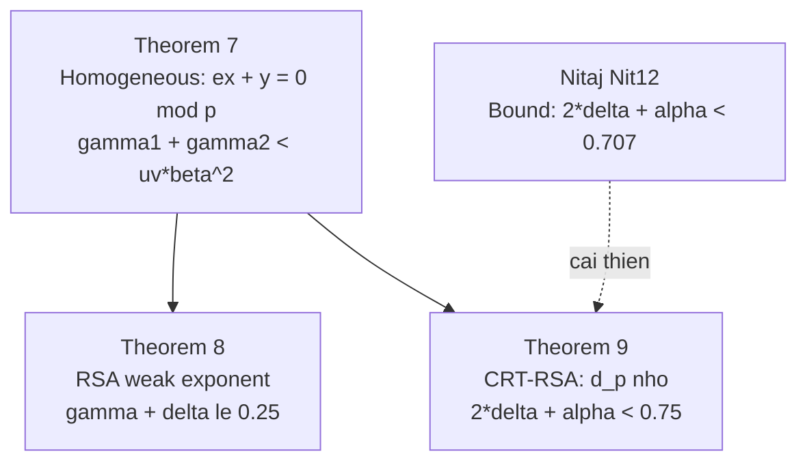

> **Prerequisites**: [[06-second-type-homogeneous|06. Second Type: Homogeneous Equations]]  
> **Lesson type**: Attack  
> **Covers**: §4.2 — Theorem 8 (weak encryption exponents, RSA), Theorem 9 (CRT-RSA weak exponent), Table 4
>
> **Notation** (thêm vào notation đã có):
> | Ký hiệu | Ý nghĩa |
> |---------|---------|
> | $N = pq$ | RSA modulus, $q < p < 2q$ |
> | $e$ | Public exponent RSA; $e \approx N^\alpha$ |
> | $d_p$ | CRT-exponent modulo $p$: $e d_p \equiv 1 \pmod{p-1}$ |
> | $k_p$ | Số nguyên: $e d_p = 1 + k_p(p-1)$ |
> | $\alpha$ | Tham số kích thước $e$: $e = N^\alpha$ |
> | $\delta$ | Tham số kích thước $d_p$: $d_p \approx N^\delta$ |

---

## Bối Cảnh: Tấn Công Của Nitaj

> [!info] 🟡 Nitaj [Nit12] — New Attack on RSA and CRT-RSA
> Nitaj (Africacrypt 2012) đề xuất tấn công RSA và CRT-RSA dựa trên phương trình tuyến tính thuần nhất $ex + y \equiv 0 \pmod{p}$. Bằng Herrmann-May [HM08], ông thu được bound $\gamma + \delta \le (\sqrt{2}-1)/2 \approx 0.207$ (với $\beta = 0.5$, $u = v = 1$). Kết quả của Lesson này cải thiện bound này bằng Theorem 7 (Second Type).
>
> *(theo [Nit12]: Nitaj — A New Attack on RSA and CRT-RSA, Africacrypt 2012)*

### CRT-RSA là gì?

Trong **CRT-RSA**, giải mã dùng Chinese Remainder Theorem: thay vì tính $m = c^d \bmod N$ trực tiếp, tính $m_p = c^{d_p} \bmod p$ và $m_q = c^{d_q} \bmod q$ rồi CRT-combine. Các **CRT-exponents** $d_p, d_q$ thỏa:

$$
e d_p \equiv 1 \pmod{p-1}, \quad e d_q \equiv 1 \pmod{q-1}
$$

Nếu $d_p$ hoặc $d_q$ nhỏ bất thường → RSA dễ bị tấn công.

---

## Tấn Công 1 — Weak Encryption Exponents (Theorem 8)

### Thiết Lập

Giả sử tồn tại các số nguyên $x, y$ nhỏ thỏa:

$$
ex + y \equiv 0 \pmod{p}
$$

với $ex + y \not\equiv 0 \pmod{N}$ (tránh nghiệm tầm thường). Đây là phương trình **thuần nhất** trong $x, y$ — chính xác là dạng bài toán của Theorem 7 với $u = v = 1$, $\beta = 1/2$ (vì $N = pq$, $p \approx \sqrt{N}$).

> [!abstract] Theorem 8 — Weak Encryption Exponents, RSA (Lu et al. §4.2)
> Cho $N = pq$ với $q < p < 2q$. Cho $e$ là public exponent thỏa $ex + y \equiv 0 \pmod{p}$ với $|x| < N^\gamma$, $|y| < N^\delta$ và $ex + y \not\equiv 0 \pmod{N}$. Nếu:
>
> $$
> \gamma + \delta \le 0.25 - \epsilon
> $$
>
> thì $N$ có thể được phân tích trong thời gian polynomial.

**Proof.** Áp dụng Theorem 7 với $f_2(x_1, x_2) = ex + y$ (thuần nhất), $\beta = 0.5$, $u = v = 1$:

$$
\gamma_1 + \gamma_2 < uv\beta^2 = 1 \cdot 1 \cdot (0.5)^2 = 0.25
$$

LLL tìm $(x_0, y_0)$; sau đó $\gcd(ex_0 + y_0, N) = p$ (vì $p \mid ex_0 + y_0$ nhưng $N \nmid ex_0 + y_0$). $\blacksquare$

**Cải thiện so với Nitaj [Nit12]**: Nitaj dùng Herrmann-May cho bài toán **không thuần nhất**, thu bound $\approx 0.207$. Theorem 8 dùng Theorem 7 cho bài toán **thuần nhất** (đúng với cấu trúc của phương trình), thu bound $0.25$ — cải thiện $\approx 21\%$.

---

## Tấn Công 2 — CRT-RSA Weak Exponent (Theorem 9)

### Thiết Lập

Từ $e d_p = 1 + k_p(p-1)$, viết lại:

$$
e d_p + k_p - 1 = k_p p
$$

Do đó modulo $p$:

$$
e d_p + (k_p - 1) \equiv 0 \pmod{p}
$$

Đây là phương trình thuần nhất $ex + y \equiv 0 \pmod{p}$ với $x_0 = d_p$ và $y_0 = k_p - 1$.

**Ước lượng kích thước $k_p$**: Từ $e d_p = 1 + k_p(p-1)$:

$$
k_p = \frac{e d_p - 1}{p - 1} < \frac{e d_p}{p-1} < \frac{N^\alpha \cdot N^\delta}{N^{0.5}} = N^{\alpha + \delta - 0.5}
$$

> [!abstract] Theorem 9 — CRT-RSA Weak Exponent (Lu et al. §4.2)
> Cho $N = pq$ với $q < p < 2q$. Cho $e < N^{0.75}$ là public exponent và $d_p < N^{0.75-\epsilon}/(2\sqrt{e})$ là CRT-exponent với $e d_p \equiv 1 \pmod{p-1}$. Thì $N$ có thể được phân tích trong thời gian polynomial.

**Proof.** Xét phương trình $ex + y \equiv 0 \pmod{p}$ với $x_0 = d_p$, $y_0 = k_p - 1$.

- $|x_0| = d_p < N^\delta$
- $|y_0| = k_p - 1 < k_p < N^{\alpha+\delta-0.5}$

Áp dụng Theorem 7 với $\beta = 0.5$, $u = v = 1$, điều kiện:

$$
\delta + (\alpha + \delta - 0.5) < 0.25 \implies 2\delta + \alpha < 0.75
$$

Từ đây: $\delta < (0.75 - \alpha)/2$. Với $e = N^\alpha$: $d_p < N^{(0.75-\alpha)/2} = N^{0.75}/N^{\alpha/2} = N^{0.75}/(N^\alpha)^{1/2} = N^{0.75}/(2\sqrt{e})$ (ước lượng thô với hằng số $1/2$).

Kiểm tra $ex_0 + y_0 \not\equiv 0 \pmod{N}$: vì $e d_p + k_p - 1 = k_p p$, và $k_p < N^{\alpha+2\delta-0.5} < N^{0.25} < p$, nên $k_p p < p^2 \le N$ (với $p \le \sqrt{2N}$), suy ra $e d_p + k_p - 1 \ne 0 \pmod{N}$.

Sau khi LLL tìm $(d_p, k_p - 1)$: $\gcd(N, e d_p + k_p - 1) = \gcd(N, k_p p) = p$. $\blacksquare$

> [!warning] Điều kiện $e < N^{0.75}$
> Theorem 9 yêu cầu $e < N^{0.75}$, tức là public exponent không quá lớn. Hệ quả: **không thể** áp dụng đồng thời cho cả $d_p$ (modulo $p$) và $d_q$ (modulo $q$) với cùng $e$. Attack chỉ hữu ích khi $d_p$ nhỏ nhưng $d_q$ có kích thước bình thường.

---

## So Sánh Với Nitaj [Nit12]

> [!info] 🟡 Nitaj [Nit12] — Kết Quả Gốc
> Nitaj (Africacrypt 2012) chứng minh: với $N = pq$, nếu $e < N^{\sqrt{2}/2}$ và $e d_p = 1 + k_p(p-1)$ với $d_p < N^{\sqrt{2}/4}/\sqrt{e}$, thì $N$ có thể phân tích. Ông dùng phương trình **không thuần nhất** $e d_p - 1 \equiv 0 \pmod{p-1}$, reduce về $ex + y \equiv 0 \pmod{p}$ với Herrmann-May.
>
> *(theo [Nit12]: Nitaj — A New Attack on RSA and CRT-RSA, Africacrypt 2012)*

| | Nitaj [Nit12] | **Theorem 9** |
|---|---|---|
| Điều kiện $e$ | $e < N^{\sqrt{2}/2} \approx N^{0.707}$ | $e < N^{0.75}$ |
| Điều kiện $d_p$ | $d_p < N^{\sqrt{2}/4}/\sqrt{e}$ | $d_p < N^{0.75-\epsilon}/(2\sqrt{e})$ |
| Phương pháp | Herrmann-May (inhomogeneous) | Theorem 7 (homogeneous) |
| Bound $2\delta + \alpha$ | $< \sqrt{2}/2 \approx 0.707$ | $< 0.75$ |

Theorem 9 cho range $e$ rộng hơn ($< N^{0.75}$ thay vì $< N^{0.707}$) và range $d_p$ rộng hơn khi $e$ cố định.

---

## Kết Quả Thực Nghiệm (Table 4)

Thực nghiệm với $N$ 1024-bit, $p, q$ nguyên tố 512-bit, $e$ 512-bit (tức $\alpha = 0.5$):

| Bit $N$ | $r$ | $d_p$-pred (bit) | $(m, t)$ | dim($L$) | $d_p$-exp (bit) | Time (s) |
|---------|-----|------------------|----------|----------|-----------------|----------|
| 1024 | 1 | 128 | (6,3) | 7 | 110 | 0.125 |
| 1024 | 1 | 128 | (10,5) | 11 | 115 | 1.576 |
| 1024 | 1 | 128 | (30,15) | 31 | 124 | 563.632 |

**Nhận xét**:
- Với $e = N^{0.5}$ ($\alpha = 0.5$): bound $d_p$-pred $= N^{(0.75 - 0.5)/2} = N^{0.125}$ — tức 128 bit với $N$ 1024-bit.
- Dimension 31 đạt gần bound lý thuyết (124/128 bit $\approx 97\%$).
- Nitaj [Nit12] báo cáo với $N$ 1024-bit: $d_p$ thường có kích thước $\le 110$ bit — Theorem 9 vượt qua ngưỡng này.

---

## Tổng Kết

---

## References

- [Nit12] Nitaj — *A New Attack on RSA and CRT-RSA*, Africacrypt 2012
- [HM08] Herrmann, May — *Solving Linear Equations Modulo Divisors*, Asiacrypt 2008
- [Sar12] Sarkar — *Reduction in Lossiness of RSA Trapdoor Permutation*, SPACE 2012
