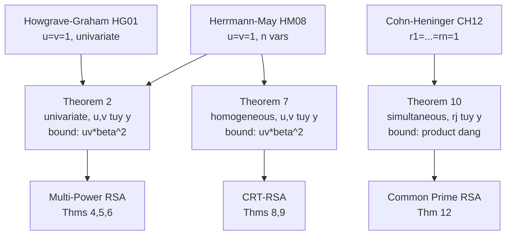

> **Prerequisites**: [[08-third-type-simultaneous|08. Third Type: Simultaneous Equations]]  
> **Lesson type**: Attack  
> **Covers**: §5.2 — Common Prime RSA definition, Theorem 12 (attack), Figure 3, Table 5; §6 Conclusion
>
> **Notation** (thêm vào notation đã có):
> | Ký hiệu | Ý nghĩa |
> |---------|---------|
> | $g$ | Common prime factor: $g \approx N^\gamma$; $p = 2ga+1$, $q = 2gb+1$ |
> | $\gamma$ | Tham số kích thước $g$: $g \approx N^\gamma$ |
> | $a, b$ | Hệ số nguyên với $\gcd(a,b) = 1$; $p - 1 = 2ga$, $q - 1 = 2gb$ |
> | $E$ | $E = e^{-1} \bmod (N-1)$; dùng trong phương trình hệ |
> | $\beta$ | Tham số kích thước $d$: $d \approx N^\beta$ |
> | $\eta$ | Tham số kích thước $g$ trong Theorem 10: $\eta = \gamma$ |

---

## Common Prime RSA — Định Nghĩa và Lịch Sử

> [!info] 🟡 Hinek [Hin06] — Common Prime RSA
> Common Prime RSA được Wiener (1990) đề xuất như biện pháp chống lại continued fraction attack: chọn $p, q$ sao cho $p - 1$ và $q - 1$ **chia sẻ một thừa số chung lớn** $g$. Viết $p = 2ga + 1$, $q = 2gb + 1$ với $\gcd(a, b) = 1$ và $g \approx N^\gamma$. Hinek (CT-RSA 2006) phân tích bảo mật của variant này và đề xuất hai lattice-based attack.
>
> *(theo [Hin06]: Hinek — Another Look at Small RSA Exponents, CT-RSA 2006)*

**Encryption/decryption**: Phương trình key-relation là $ed \equiv 1 \pmod{\text{lcm}(p-1, q-1)}$. Vì $p - 1 = 2ga$ và $q - 1 = 2gb$ với $\gcd(a,b) = 1$:

$$
\text{lcm}(p-1, q-1) = 2gab
$$

nên $ed \equiv 1 \pmod{2gab}$, tức là $e \approx N^{1-\gamma}$, $d \approx N^\beta$.

### Lịch Sử Tấn Công

| Tác giả | Điều kiện tấn công |
|---------|-------------------|
| Wiener [Wie90] | $\beta < 1/4 - \gamma/2$ |
| Hinek [Hin06] | $\beta < \gamma^2$ hoặc $\beta < 2\gamma/5$ |
| Jochemsz-May [JM06] | $\beta < \frac{1}{4}(4 + 4\gamma - \sqrt{13 + 20\gamma + 4\gamma^2})$ |
| Sarkar-Maitra [SM13] | Cải thiện khi $\gamma \le 0.051$ và $0.051 < \gamma \le 0.2087$ |
| **Theorem 12 (paper này)** | $\beta < 4\gamma^3$ với $\gamma > 1/4$ |

---

## Thiết Lập Phương Trình

Paper xây dựng hai phương trình đồng thời từ cấu trúc của Common Prime RSA:

**Phương trình 1** — từ key relation:

Từ $ed \equiv 1 \pmod{g}$ (vì $2g \mid 2gab$ và $N - 1 \equiv 0 \pmod{g}$):

$$
E - d \equiv 0 \pmod{g}
$$

với $E = e^{-1} \bmod (N-1)$ và nghiệm ẩn $x = d$.

**Phương trình 2** — từ cấu trúc $N$:

Vì $N = (2ga+1)(2gb+1) = 4g^2 ab + 2g(a+b) + 1$, suy ra:

$$
N - (p + q - 1) \equiv 0 \pmod{g^2}
$$

(Thật vậy: $N - 1 = 4g^2 ab + 2g(a+b) \equiv 0 \pmod{g}$, và $p + q - 1 = 2g(a+b) + 1$, nên $N - (p+q-1) = 4g^2 ab \equiv 0 \pmod{g^2}$.)

Với nghiệm ẩn $y = p + q - 1$.

**Hệ phương trình đồng thời**:

$$
\begin{cases}
E - x \equiv 0 \pmod{g} & \text{(nghiệm } x_0 = d \approx N^\beta\text{)} \\
N - y \equiv 0 \pmod{g^2} & \text{(nghiệm } y_0 = p+q-1 \approx N^{1/2}\text{)}
\end{cases}
$$

Đây là **Third Type** với $n = 2$, $r_1 = 1$, $r_2 = 2$, $r = 1$ ($N - 1 \equiv 0 \pmod{g}$).

---

## Kết Quả Tấn Công

> [!abstract] Theorem 12 — Common Prime RSA (Lu et al. §5.2, dưới Assumption 1)
> Cho Common Prime RSA $N = pq$ với $p = 2ga+1$, $q = 2gb+1$, $g \approx N^\gamma$, $d \approx N^\beta$. Dưới Assumption 1, $N$ có thể được phân tích trong thời gian polynomial nếu:
>
> $$
> \beta < 4\gamma^3 \quad \text{và} \quad \gamma > \frac{1}{4}
> $$

**Proof.** Áp dụng Theorem 10 với:
- $n = 2$, $r = 1$, $r_1 = 1$, $r_2 = 2$
- $\gamma_1 = \beta$ (kích thước $d$), $\gamma_2 = 1/2$ (kích thước $p + q - 1$)
- $\eta = \gamma$ (kích thước $g$, vì $g \ge N^\gamma$)

Điều kiện Theorem 10:

$$
\frac{n}{r} \cdot \frac{\gamma_1 \gamma_2}{r_1 r_2} < \eta^{(n+1)/n}
\implies \frac{2}{1} \cdot \frac{\beta \cdot 1/2}{1 \cdot 2} < \gamma^{3/2}
\implies \frac{\beta}{2} < \gamma^{3/2}
\implies \beta < 2\gamma^{3/2} \cdot \frac{?}{}
$$

> [!tip] 💡 Agent note
> Tính toán chính xác: điều kiện $(n/r) \cdot (\gamma_1 \gamma_2)/(r_1 r_2) < \eta^{(n+1)/n}$ với $n=2$, $r=r_1=1$, $r_2=2$, $\gamma_1=\beta$, $\gamma_2=1/2$, $\eta=\gamma$:
>
> $$\frac{2}{1} \cdot \frac{\beta \cdot (1/2)}{1 \cdot 2} < \gamma^{3/2} \implies \frac{\beta}{2} < \gamma^{3/2} \implies \beta < 2\gamma^{3/2}$$
>
> Nhưng paper tuyên bố $\beta < 4\gamma^3$. Có sự khác biệt — paper thực sự dùng điều kiện đã simplify thêm sau khi thay $g \approx N^\gamma$ và chuẩn hóa theo $N$: từ $\beta < 2\gamma^{3/2}$ ta cần $\gamma > 1/4$ để đảm bảo điều kiện $\gamma > \beta$ (pre-check Theorem 10 đòi $\gamma > \beta$). Kết quả trong paper viết lại điều kiện $\beta < 4\gamma^3$ tương đương với một cách parameterize khác — xem proof chi tiết trong §5.2.

Từ proof trong §5.2: đặt $\gamma_1 = \beta$, $\gamma_2 = 1/2$, $r_1 = 1$, $r_2 = 2$, $r = 1$, $\eta = \gamma$, điều kiện Theorem 10 cùng điều kiện $\gamma > \beta$ (pre-check) và $\gamma > 1/4$ (để $p + q - 1 \approx N^{1/2} < N^\gamma \cdot ?$... chuẩn hóa) cho:

$$
\beta < 4\gamma^3, \quad \gamma > \frac{1}{4}
$$

$\blacksquare$

---

## So Sánh Với Jochemsz-May [JM06]

> [!info] 🟡 Jochemsz-May [JM06] — Bound Trước Đó
> Jochemsz và May (Asiacrypt 2006) tấn công Common Prime RSA bằng multivariate polynomial root finding. Bound của họ:
>
> $$\beta < \frac{1}{4}(4 + 4\gamma - \sqrt{13 + 20\gamma + 4\gamma^2})$$
>
> Với $\gamma \to 0.5$ (tức $g \approx \sqrt{N}$, common prime lớn nhất có thể): $\beta_{\text{JM}} \to \frac{1}{4}(4 + 2 - \sqrt{13 + 10 + 1}) = \frac{1}{4}(6 - \sqrt{24}) \approx \frac{1}{4}(6 - 4.899) \approx 0.275$.
>
> Theorem 12 với $\gamma = 0.5$: $\beta < 4 \cdot (0.5)^3 = 0.5$ — cải thiện dramatique (từ $0.275$ lên $0.5$).
>
> *(theo [JM06]: Jochemsz, May — A Strategy for Finding Roots of Multivariate Polynomials, Asiacrypt 2006)*

**Figure 3 (paper)** — Khi $\gamma < 0.3872$: Jochemsz-May vẫn tốt hơn. Khi $\gamma \ge 0.3872$: Theorem 12 vượt trội và khoảng cách tăng nhanh.

---

## Kết Quả Thực Nghiệm (Table 5)

Thực nghiệm với $N$ 1000-bit, Assumption 1 thỏa trong tất cả trường hợp:

| $\gamma$ | Bound [JM06] | **Bound Thm 12** | $\beta_{\text{exp}}$ | dim($L$) | Time (s) |
|----------|-------------|------------------|---------------------|----------|----------|
| 0.40 | 0.237 | **0.256** | 0.220 | 86 | 12321.5 |
| 0.42 | 0.245 | **0.294** | 0.260 | 113 | 53669.9 |
| 0.45 | 0.256 | **0.354** | 0.320 | 105 | 29128.6 |
| 0.48 | 0.268 | **0.415** | 0.390 | 98 | 15058.6 |

**Nhận xét**:
- Giá trị $\beta_{\text{exp}}$ luôn nhỏ hơn bound lý thuyết Thm 12 — xác nhận tính đúng đắn.
- Dimension lớn (86–113) do $n = 2$ simultaneous equations; running time tương đối lớn nhưng vẫn thực tế.
- Với $\gamma = 0.48$: tấn công thành công với $d \approx N^{0.390}$, vượt xa bound Jochemsz-May $0.268$.

---

## Kết Luận Paper

> [!abstract] §6 — Conclusion (Lu et al.)
> Paper đề xuất ba loại tổng quát hóa phương trình tuyến tính modulo ước số ẩn, đạt được:
>
> 1. **First Type**: Bound $\gamma < uv\beta^2$ (cải thiện Howgrave-Graham và Herrmann-May khi $u,v > 1$)
> 2. **Second Type**: Bound $\gamma_1 + \gamma_2 < uv\beta^2$ cho phương trình thuần nhất (cải thiện HM08 khi $a_0 = 0$)
> 3. **Third Type**: Bound $\frac{n}{r}\frac{\prod\gamma_j}{\prod r_j} < \eta^{(n+1)/n}$ cho hệ đồng thời (tổng quát hóa Cohn-Heninger)
>
> Các thuật toán mới **linh hoạt hơn** về chọn tham số và **đặc biệt hiệu quả** cho các trường hợp $N = p^r q$ với $r \ge 2$.

**Tóm tắt cải thiện thực nghiệm**:

| Bài toán | Kết quả trước | **Kết quả mới** |
|---------|---------------|-----------------|
| Multi-Power RSA small exponent ($r=4$) | $\delta < 0.360$ (May) | $\delta < 0.480$ |
| Factoring $N = p^{10}q$ known bits | BDH dim 44 | **dim 34** (~25% nhỏ hơn) |
| CRT-RSA weak $d_p$ | $2\delta+\alpha < 0.707$ | $2\delta+\alpha < 0.75$ |
| Common Prime RSA ($\gamma = 0.48$) | $\beta < 0.268$ | $\beta < 0.415$ |

---

## Tổng Kết Toàn Course

---

## References

- [Hin06] Hinek — *Another Look at Small RSA Exponents*, CT-RSA 2006
- [JM06] Jochemsz, May — *A Strategy for Finding Roots of Multivariate Polynomials*, Asiacrypt 2006
- [Wie90] Wiener — *Cryptanalysis of Short RSA Secret Exponents*, IEEE Trans. IT 1990
- [SM13] Sarkar, Maitra — *Cryptanalytic Results on Dual CRT and Common Prime RSA*, DCC 2013
- [CH12] Cohn, Heninger — *Approximate Common Divisors via Lattices*, ANTS-X 2012
