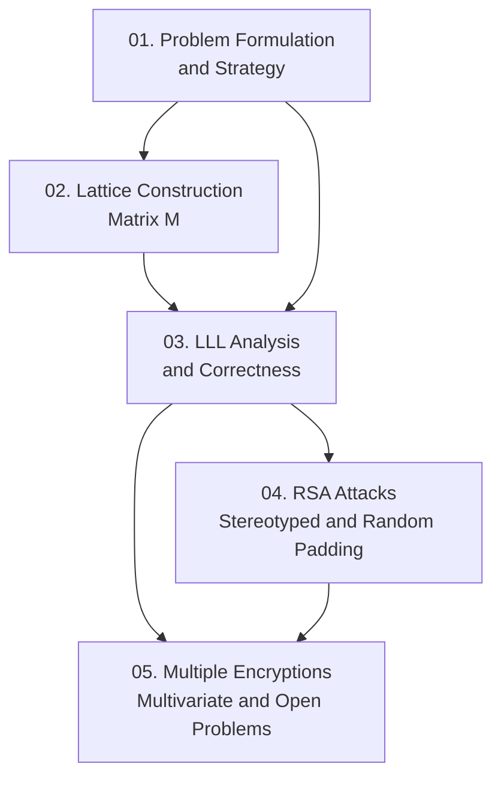

Paper của Coppersmith (1996) trình bày thuật toán tìm nghiệm nguyên nhỏ của phương trình đa thức bậc $k$ theo modulo $N$ (composite, chưa biết phân tích), miễn là $|x_0| < N^{1/k}$, chạy trong thời gian đa thức theo $\log N$ và $k$. Course này cover toàn bộ nội dung paper — từ bài toán, xây dựng lattice, phân tích LLL, đến hai ứng dụng tấn công RSA và các mở rộng heuristic.

**Tài liệu gốc**: Finding a Small Root of a Univariate Modular Equation — Coppersmith, EUROCRYPT '96, LNCS 1070, pp. 155–165  
**Kiến thức nền tảng yêu cầu** (🔴 Prerequisite references): LLL lattice basis reduction [LLL82]; RSA encryption fundamentals; modular arithmetic & CRT

---

## Lesson Overview

| # | Title | Type | Covers | File | Dependencies |
|---|-------|------|--------|------|-------------|
| 01 | Problem Formulation & Strategy | Foundation | §1 | [[01-problem-formulation\|01. Problem Formulation & Strategy]] | — |
| 02 | Lattice Construction: Matrix M | Math Component | §2 (construction, det, short vector) | [[02-lattice-construction-matrix-m\|02. Lattice Construction: Matrix M]] | 01 |
| 03 | LLL Analysis & Correctness Proof | Math Component | §2 (LLL argument, Thm 1, Cor 2), §2.1 | [[03-lll-analysis-correctness\|03. LLL Analysis & Correctness Proof]] | 01, 02 |
| 04 | RSA Attacks: Stereotyped Messages & Random Padding | Attack | §4, §5 | [[04-rsa-attacks-stereotyped-random-padding\|04. RSA Attacks: Stereotyped Messages & Random Padding]] | 01, 03 |
| 05 | Multiple Encryptions, Multivariate Extension & Open Problems | Attack | §3, §6, §7 | [[05-multiple-encryptions-multivariate\|05. Multiple Encryptions, Multivariate Extension & Open Problems]] | 03, 04 |

**Lesson types**: Foundation · Math Component · Scheme · Attack · Protocol · Deep Dive · Specification · Survey

---

## Coverage Map

| Document section | Covered in lesson |
|------------------|-------------------|
| §1 Introduction | 01 |
| §2 Solving a univariate polynomial — matrix construction | 02 |
| §2 Solving a univariate polynomial — LLL argument, Theorem 1, Corollary 2 | 03 |
| §2.1 Comparison to Previous Work [VGT88] | 03 |
| §3 Extension to Multivariate Polynomials | 05 |
| §4 RSA with Stereotyped Messages | 04 |
| §5 Application to RSA with Random Padding | 04 |
| §6 Another Solution for Multiple Encryptions | 05 |
| §7 Conclusions and Open Problems | 05 |

---

## Dependency Graph

---

## Progress

- [ ] [[01-problem-formulation\|01. Problem Formulation & Strategy]]
- [ ] [[02-lattice-construction-matrix-m\|02. Lattice Construction: Matrix M]]
- [ ] [[03-lll-analysis-correctness\|03. LLL Analysis & Correctness Proof]]
- [ ] [[04-rsa-attacks-stereotyped-random-padding\|04. RSA Attacks: Stereotyped Messages & Random Padding]]
- [ ] [[05-multiple-encryptions-multivariate\|05. Multiple Encryptions, Multivariate Extension & Open Problems]]

---

## 🟡 Integrated References

| Ref Key | Tích hợp trong lesson | Nội dung tích hợp |
|---------|----------------------|--------------------|
| [FR95] | 04 | Franklin–Reiter recovery formula cho $m$ từ $c, c', t, N$ khi $m' = m+t$ |
| [VGT88] | 03 | Bound cũ $N^{2/[k(k+1)]}$ vs Coppersmith $N^{1/k}$; phân tích nguyên nhân cải tiến |

---

## Notes

Đọc Lesson 01 trước để nắm bài toán và intuition tổng thể. Lesson 02 và 03 là core kỹ thuật — cần đọc song song với §2 của paper gốc để theo dõi từng bước matrix construction. Lesson 04 và 05 là ứng dụng có thể đọc sau khi xong Lesson 03.
