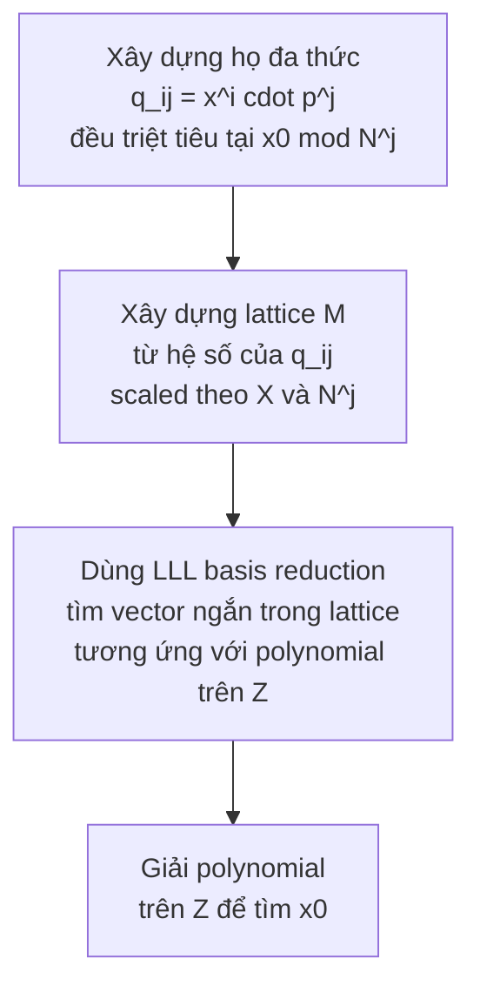

> **Prerequisites**: RSA encryption fundamentals; modular arithmetic; LLL lattice basis reduction [LLL82]  
> 🔴 **Prerequisite references**: Lenstra, Lenstra, Lovász — *Factoring Polynomials with Integer Coefficients* [LLL82] (LLL algorithm background)  
> **Lesson type**: Foundation  
> **Covers**: §1 Introduction
>
> **Notation**:
> | Ký hiệu | Ý nghĩa | Ký hiệu trong paper |
> |---------|---------|---------------------|
> | $N$ | Hợp số lớn chưa biết phân tích | $N$ |
> | $p(x)$ | Đa thức monic bậc $k$ hệ số nguyên | $p(z)$ (paper dùng $z$) |
> | $x_0$ | Nghiệm nguyên cần tìm | $z_0$ (paper dùng $z_0$) |
> | $k$ | Bậc của đa thức | $k$ |
> | $\varepsilon$ | Tham số sai số nhỏ $\varepsilon > 0$ | $\varepsilon$ |
> | $X$ | Giới hạn trên của $|x_0|$ được chọn | $X = \frac{1}{2}N^{(1/k)-\varepsilon}$ |

---

## Motivation

Trong mật mã, bài toán tìm nghiệm của phương trình đa thức theo modulo một số nguyên lớn $N$ xuất hiện tự nhiên ở nhiều dạng tấn công RSA. Chẳng hạn:

- **Stereotyped messages**: Attacker biết $2/3$ số bit của plaintext và toàn bộ ciphertext — có thể recover phần còn lại không?
- **Random padding**: Cùng một message được mã hoá hai lần với padding ngẫu nhiên khác nhau — liệu hai ciphertext có tiết lộ message không?

Cả hai đều quy về cùng một bài toán cơ bản: *tìm nghiệm nhỏ của một đa thức theo modulo $N$ composite*. Trước Coppersmith 1996, bài toán này chỉ giải được với điều kiện $|x_0| < N^{2/[k(k+1)]}$ — rất hạn chế. Paper này mở rộng lên $|x_0| < N^{1/k}$, một cải tiến đột phá cho $k \geq 2$.

---

## Bài Toán Cốt Lõi

> [!note] Definition 1.1 — Small Root Problem (Univariate Modular)
> **Input**: Đa thức monic bậc $k$ có hệ số nguyên
>
> $$
> p(x) = x^k + a_{k-1}x^{k-1} + \cdots + a_1 x + a_0
> $$
>
> và một hợp số dương $N$ (không biết phân tích nguyên tố).
>
> **Mục tiêu**: Tìm tất cả nghiệm nguyên $x_0$ thoả mãn
>
> $$
> p(x_0) \equiv 0 \pmod{N}, \qquad |x_0| < N^{1/k}
> $$
>
> **Output**: Tập tất cả các $x_0$ như vậy.

Điều kiện $|x_0| < N^{1/k}$ là **tối ưu về mặt information-theoretic** theo nghĩa sau: nếu $k=1$ thì $p(x) = x + a_0$ và nghiệm duy nhất mod $N$ là $x_0 = -a_0 \bmod N$, có thể lớn tới $N$; còn với $k \geq 2$, bound $N^{1/k}$ là ngưỡng tự nhiên để số lượng nghiệm "nhỏ" vẫn có thể xử lý được.

> [!warning] Tại sao bài toán này khó?
> Nếu biết phân tích $N = p \cdot q$, ta chỉ cần giải $p(x_0) \equiv 0 \pmod{p}$ và $p(x_0) \equiv 0 \pmod{q}$ riêng biệt rồi dùng CRT — đây là bài toán dễ. Nhưng khi không biết phân tích $N$, không có cách hiển nhiên nào để "tách" bài toán. Phương pháp của Coppersmith hoạt động hoàn toàn với $N$ composite mà không cần factorization.

---

## Chiến Lược Tổng Quát

Ý tưởng trung tâm là **lift** (nâng) bài toán từ $\mathbb{Z}/N\mathbb{Z}$ lên $\mathbb{Z}$: thay vì làm việc trực tiếp với $p(x_0) \equiv 0 \pmod{N}$, ta cố gắng tìm một đa thức $f(x) \in \mathbb{Z}[x]$ (hệ số nguyên, không phải modulo) sao cho $f(x_0) = 0$ chính xác trên $\mathbb{Z}$.

Nếu tìm được $f$ như vậy với bậc nhỏ, ta có thể tính nghiệm của $f$ qua $\mathbb{Z}$ trong thời gian đa thức.

Chiến lược gồm ba bước chính:

**Bước 1 — Họ đa thức helper**: Với tham số $h \geq 1$ được chọn phù hợp, xét họ đa thức

$$
q_{ij}(x) = x^i \cdot p(x)^j, \quad 0 \leq i < k,\ 1 \leq j < h
$$

Vì $p(x_0) \equiv 0 \pmod{N}$, ta có ngay $q_{ij}(x_0) \equiv 0 \pmod{N^j}$ — mỗi đa thức $q_{ij}$ triệt tiêu tại $x_0$ theo một lũy thừa cao hơn của $N$.

**Bước 2 — Xây dựng lattice**: Xây dựng một ma trận $M$ kích thước $(2hk-k) \times (2hk-k)$ từ hệ số của tất cả các $q_{ij}(x)$, với các cột được scale theo $X^{-g}$ và các hàng moduli được scale theo $N^j$. Ma trận này mã hoá cấu trúc của toàn bộ họ đa thức.

**Bước 3 — LLL và polynomial trên Z**: Sau khi giản lược cột (elementary row operations) để đưa $M$ về dạng block $\hat{M}$ kích thước $hk \times hk$, ta chạy LLL trên $\hat{M}$. Kết quả cho thấy tất cả các vector trong lattice có chuẩn Euclidean $< 1$ đều nằm trong một subspace chiều $\leq hk - 1$. Vector ứng với $x_0$ có chuẩn $< 1$, nên nó nằm trong subspace đó — và từ đây trích xuất được hệ số $f_g$ của một đa thức $f(x) = \sum_g f_g x^g = 0$ **trên $\mathbb{Z}$**.

---

## Hai Ứng Dụng Trực Tiếp vào RSA

Cả hai ứng dụng đều sử dụng RSA với số mũ $e = 3$.

### Ứng dụng 1 — Stereotyped Messages (§4)

Giả sử plaintext gồm hai phần: phần đã biết $B = 2^k b$ (ví dụ: header cố định của message) và phần bí mật $m$ với $|m| < N^{1/3}$. Ciphertext là:

$$
c = (B + m)^3 \pmod{N}
$$

Ta đặt $p(x) = (B + x)^3 - c$ — đây là đa thức bậc $k=3$ theo $x$ với hệ số nguyên. Nghiệm $x_0 = m$ thoả $p(m) \equiv 0 \pmod{N}$ và $|m| < N^{1/3}$, nên áp dụng được Theorem 1.

> [!tip] 💡 Agent note
> Khi $B = 0$ thì $p(x) = x^3 - c$ và nghiệm là $x_0 = c^{1/3} \bmod N$ — đây là bài toán modular cube root. Coppersmith mở rộng cho $B \neq 0$ (nonzero known part), điều mà trước đây không giải được hiệu quả.

### Ứng dụng 2 — Random Padding (§5)

Giả sử message $m$ được padding bằng một giá trị ngẫu nhiên $t$ nhỏ trước khi mã hoá:

$$
c = (m + t)^3 \pmod{N}
$$

Nếu cùng message được mã hoá **hai lần** với padding khác nhau $t_1, t_2$:

$$
c_1 = (m + t_1)^3 \pmod{N}, \quad c_2 = (m + t_2)^3 \pmod{N}
$$

Attacker biết $c_1, c_2, N$ nhưng không biết $m, t_1, t_2$. Bằng cách lấy **resultant** để loại $m$, thu được đa thức bậc 9 theo $t = t_2 - t_1$. Nếu $|t| < N^{1/9}$, Coppersmith's method tìm được $t$, từ đó recover $m$.

> [!warning] Cảnh báo thực tiễn
> Với RSA 1024-bit và $e=3$, điều kiện $|t| < N^{1/9}$ tương đương padding dưới ~113 bit — hoàn toàn thực tế. Random padding ngắn **không an toàn** khi message được mã hoá nhiều lần với cùng exponent nhỏ.

---

## Kết Quả Chính (Preview)

Lesson tiếp theo sẽ xây dựng chi tiết matrix $M$ và chứng minh kết quả cốt lõi:

> [!abstract] Theorem 1 (Coppersmith 1996) — Preview
> Cho $p(x)$ là đa thức monic bậc $k$ hệ số nguyên, $N$ là hợp số dương chưa biết phân tích, và $\varepsilon > 0$. Tồn tại thuật toán tìm tất cả nghiệm nguyên $x_0$ của $p(x_0) \equiv 0 \pmod{N}$ với $|x_0| < \frac{1}{2}N^{(1/k)-\varepsilon}$ trong thời gian đa thức theo $\log N$, $k$ và $1/\varepsilon$.
>
> Hệ quả (Corollary 2): Với $\varepsilon = 1/\log_2 N$, bound mở rộng tới $|x_0| < N^{1/k}$.

---

## Summary

- **Bài toán**: Tìm nghiệm nguyên $x_0$ của $p(x_0) \equiv 0 \pmod{N}$ với $|x_0| < N^{1/k}$, không cần biết factorization của $N$.
- **Chiến lược**: Xây dựng họ đa thức $q_{ij} = x^i p^j$ triệt tiêu tại $x_0$ mod $N^j$, đưa vào lattice, dùng LLL để tìm polynomial equation trên $\mathbb{Z}$.
- **Cải tiến**: Bound $N^{1/k}$ vượt trội đáng kể so với kết quả cũ $N^{2/[k(k+1)]}$ của Vallée et al.
- **Ứng dụng trực tiếp**: Tấn công RSA-e=3 với stereotyped messages và random padding.

---

## References

- [Cop96] Coppersmith — *Finding a Small Root of a Univariate Modular Equation*, EUROCRYPT 1996
- [LLL82] Lenstra, Lenstra, Lovász — *Factoring Polynomials with Integer Coefficients*, Math. Ann. 261 (1982) (🔴 Prerequisite)
- [VGT88] Vallée, Girault, Toffin — *How to Guess ℓ-th Roots Modulo n by Reducing Lattice Bases*, AAECC-6 (⚪ so sánh trong §2.1)
