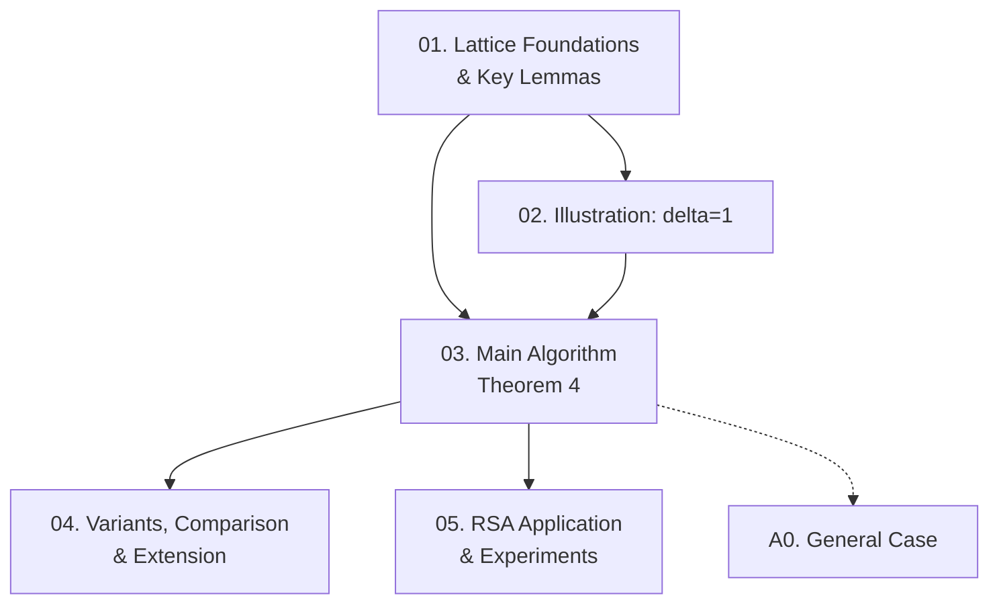

Paper của Coron (Eurocrypt 2004) trình bày một thuật toán đơn giản hơn Coppersmith để tìm nghiệm nhỏ của đa thức nguyên hai biến, sử dụng full-rank triangular lattice thay vì non-full-rank lattice phức tạp. Course này cover toàn bộ nội dung 14 trang gốc ở độ sâu research-level.

**Tài liệu gốc**: Finding Small Roots of Bivariate Integer Polynomial Equations Revisited (Coron 2004)  
**Kiến thức nền yêu cầu** (🔴): LLL lattice reduction [LLL82]; Coppersmith bivariate gốc [Cop97] (để so sánh)

---

## Lesson Overview

| # | Title | Type | Covers | File | Dependencies |
|---|-------|------|--------|------|-------------|
| 01 | Lattice Foundations & Key Lemmas | Math Component | §1, §3.1, §3.2, Thm 1–3, Lem 1–3 | [[01-lattice-foundations-key-lemmas\|01. Lattice Foundations]] | — |
| 02 | Illustration: The δ=1 Case | Deep Dive | §2 (bilinear walkthrough) | [[02-illustration-delta-1\|02. Illustration δ=1]] | 01 |
| 03 | Main Algorithm: Coron's Theorem 4 | Scheme | §4, Figure 1, Theorem 4 (full proof) | [[03-main-algorithm-theorem-4\|03. Main Algorithm]] | 01, 02 |
| 04 | Variants, Comparison & Extension | Deep Dive | §5, §6, Theorem 5, Appendix B | [[04-variants-comparison-extension\|04. Variants & Comparison]] | 03 |
| 05 | RSA Application & Experiments | Attack | §7, §8, Theorem 6, Appendix C, Figures 2–3 | [[05-rsa-application-experiments\|05. RSA Application]] | 03 |
| A0 | General Case: p(0,0)=0 and gcd Conditions | Deep Dive | Appendix A | [[a0-general-case\|A0. General Case]] | 03 |

---

## Coverage Map

| Document section | Covered in lesson |
|-----------------|-------------------|
| §1 Introduction | 01 |
| §3.1 The LLL Algorithm | 01 |
| §3.2 Bound on the Factors of Polynomials | 01 |
| Theorem 1 (Coppersmith univariate) | 01 |
| Theorem 2 (Coppersmith bivariate) | 01 |
| Theorem 3 (LLL) | 01 |
| Lemma 1 (Howgrave-Graham) | 01 |
| Lemma 2 (Mignotte bivariate bound) | 01 |
| Lemma 3 (divisibility by r) | 01 |
| §2 Illustration (δ=1 case) | 02 |
| §4 Main algorithm + full proof | 03 |
| Figure 1 (lattice δ=1, k=1) | 03 |
| Theorem 4 (main result) | 03 |
| §5 Comparison with Coppersmith | 04 |
| §6 Extension to more variables | 04 |
| Theorem 5 (total degree variant) | 04 |
| Appendix B (proof of Theorem 5) | 04 |
| §7 Practical experiments | 05 |
| §8 Conclusion | 05 |
| Theorem 6 (RSA factoring) | 05 |
| Appendix C (proof of Theorem 6) | 05 |
| Figure 2 (Coron running times) | 05 |
| Figure 3 (HG running times) | 05 |
| Appendix A (general case p(0,0)=0) | A0 |

---

## Dependency Graph

---

## Progress

- [x] [[01-lattice-foundations-key-lemmas\|01. Lattice Foundations & Key Lemmas]]
- [x] [[02-illustration-delta-1\|02. Illustration: The δ=1 Case]]
- [x] [[03-main-algorithm-theorem-4\|03. Main Algorithm: Coron's Theorem 4]]
- [x] [[04-variants-comparison-extension\|04. Variants, Comparison & Extension]]
- [x] [[05-rsa-application-experiments\|05. RSA Application & Experiments]]
- [x] [[a0-general-case\|A0. General Case]]

---

## 🟡 Integrated References

| Ref Key | Integrated trong | Nội dung tích hợp |
|---------|-----------------|-------------------|
| [Cop96a] | 01 | Theorem 1 — univariate modular case |
| [Cop97] | 01, 02, 03 | Theorem 2 — bivariate bound $XY < W^{2/(3\delta)}$ (mục tiêu) |
| [HG97] | 01, 02, 03 | Lemma 1 — Howgrave-Graham key lemma |
| [Mig74] | 01 | Mignotte inequality cho factor bound (Lemma 2) |

---

## Notes

- Lesson 01 nặng về background math — nên đọc kỹ trước khi sang 02 và 03.
- Lesson 02 là "warm-up" bắt buộc: intuition từ case đơn giản rất quan trọng để hiểu proof tổng quát.
- Lesson 03 là trung tâm của paper — exhaustive search trick (Bước 10) thường bị bỏ qua nhưng là phần quan trọng nhất của proof.
- Lessons 04, 05, A0 có thể đọc song song sau khi đã nắm Lesson 03.
