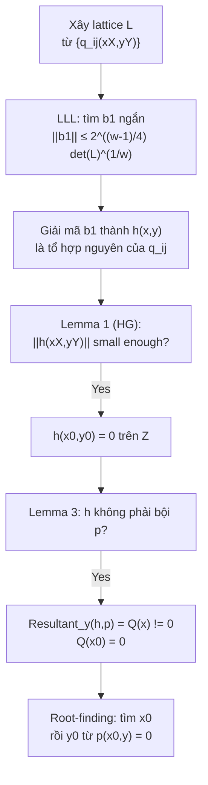

> **Prerequisites**: Kiến thức cơ bản về đa thức nguyên (polynomial over ℤ), modular arithmetic, norm của vector  
> 🔴 **Prerequisite references**: Lenstra-Lenstra-Lovász — *Factoring polynomials with rational coefficients* [LLL82] (lattice reduction background); Coppersmith — *Small solutions to polynomial equations* [Cop97] (original bivariate algorithm, đọc để so sánh)  
> **Lesson type**: Math Component  
> **Covers**: §1 (Introduction), §3.1 (The LLL Algorithm), §3.2 (Bound on the Factors of Polynomials), Theorem 1, Theorem 2, Theorem 3, Lemma 1, Lemma 2, Lemma 3
>
> **Notation**:
> | Ký hiệu | Ý nghĩa |
> |---------|---------|
> | $p(x,y) = \sum_{i,j} p_{ij} x^i y^j$ | Đa thức nguyên hai biến |
> | $\delta$ | Bậc tối đa theo từng biến riêng lẻ (max degree separately in $x$ and $y$) |
> | $X, Y$ | Bound trên nghiệm: $\lvert x_0 \rvert \leq X$, $\lvert y_0 \rvert \leq Y$ |
> | $W = \max_{i,j} \lvert p_{ij} \rvert X^i Y^j$ | $= \lVert p(xX, yY) \rVert_\infty$ — "scaled infinity norm" |
> | $\lVert h \rVert$ | L2 norm của vector hệ số của $h$ |
> | $\lVert h \rVert_\infty$ | Max absolute coefficient của $h$ |
> | $\lVert h(xX, yY) \rVert$ | L2 norm sau khi scale: $\lVert \tilde{h} \rVert$ với $\tilde{h}(x,y) = h(xX, yY)$ |
> | $\omega$ | Số chiều của lattice (số monomial = số vector basis) |
> | $L$ | Lattice được xây dựng từ coefficient vectors của các đa thức scaled |

---

## Bức tranh tổng quan

### Bài toán nghiệm nhỏ

Cho một đa thức $p(x,y) \in \mathbb{Z}[x,y]$ bất khả quy (irreducible), bài toán **bivariate integer equation** đặt câu hỏi: tìm tất cả các cặp nguyên $(x_0, y_0)$ thoả $p(x_0, y_0) = 0$.

Bài toán này nghe có vẻ vô hại, nhưng thực ra bao gồm bài toán **integer factorization** như một trường hợp đặc biệt: lấy $p(x,y) = N - x \cdot y$ với $N = pq$, thì bất kỳ factorization nào đều là nghiệm. Nói cách khác, giải bivariate integer equations **tổng quát** là hard.

Tuy nhiên, khi nghiệm $(x_0, y_0)$ **nhỏ** theo nghĩa $\lvert x_0 \rvert \leq X$, $\lvert y_0 \rvert \leq Y$ với $XY$ đủ nhỏ so với các hệ số của $p$, bài toán trở nên dễ giải nhờ **lattice reduction** (rút gọn mạng). Đây là phát hiện của Coppersmith năm 1996.

> [!abstract] Theorem 1 — Coppersmith Univariate Modular (1996)
> Cho $P(x) \in \mathbb{Z}[x]$ monic bậc $\delta$, và $N$ là số nguyên chưa biết phân tích thừa số. Tồn tại thuật toán chạy trong thời gian đa thức theo $(\log N, 2^\delta)$ tìm tất cả $x_0$ thoả $P(x_0) \equiv 0 \pmod{N}$ và $\lvert x_0 \rvert \leq N^{1/\delta}$.
>
> *(theo [Cop96a]: Coppersmith — Finding a Small Root of a Univariate Modular Equation, Eurocrypt 1996)*
>
> [!info] 🟡 Howgrave-Graham Simplification (1997)
> Coppersmith's algorithm cho univariate modular case được đơn giản hoá đáng kể bởi Howgrave-Graham [HG97]. Simplification của HG dùng một full-rank lattice có basis tam giác tự nhiên, tránh phải tính determinant của non-full-rank lattice. Paper của Coron (bài học này) áp dụng **cùng triết lý** cho bivariate integer case.
>
> *(theo [HG97]: Howgrave-Graham — Finding small roots of univariate modular equations revisited, Cryptography and Coding 1997)*

Kết quả gốc của Coppersmith cho bivariate integer case:

> [!abstract] Theorem 2 — Coppersmith Bivariate Integer (1996/1997)
> Cho $p(x,y) \in \mathbb{Z}[x,y]$ bất khả quy, bậc tối đa $\delta$ theo từng biến. Đặt $W = \max_{i,j} \lvert p_{ij} \rvert X^i Y^j$. Nếu $XY < W^{2/(3\delta)}$, thì trong thời gian đa thức theo $(\log W, 2^\delta)$, có thể tìm tất cả $(x_0, y_0)$ nguyên thoả $p(x_0,y_0) = 0$, $\lvert x_0 \rvert \leq X$, $\lvert y_0 \rvert \leq Y$.
>
> Nếu $p(x,y)$ có tổng bậc (total degree) là $\delta$ (thay vì max degree), bound cải tiến thành $XY < W^{1/\delta}$.
>
> *(theo [Cop97]: Coppersmith — Small solutions to polynomial equations, and low exponent vulnerabilities, J. Cryptology 1997)*

### Vấn đề với Coppersmith gốc

Coppersmith gốc sử dụng **non-full-rank lattice** — lattice có rank nhỏ hơn số chiều ambient space. Điều này khiến:

- Việc tính determinant phức tạp (không phải chỉ là tích các phần tử trên đường chéo).
- Khó derive improved bounds khi polynomial có cấu trúc đặc biệt.
- Khó mở rộng heuristically sang 3+ biến.

Coron [2004] giải quyết bằng cách xây dựng một **full-rank lattice** với **triangular basis tự nhiên** — det$L$ là tích các phần tử đường chéo, tính được ngay lập tức.

---

## §3.1 — Lattice Reduction và LLL

### Lattice là gì?

Cho $u_1, \ldots, u_\omega \in \mathbb{Z}^n$ là các vector độc lập tuyến tính ($\omega \leq n$). **Lattice** $L$ sinh bởi chúng là:

$$
L = \left\{ \sum_{i=1}^\omega n_i \cdot u_i \;\middle|\; n_i \in \mathbb{Z} \right\}
$$

Lattice là **full rank** nếu $\omega = n$ (số vector basis = số chiều ambient). Khi đó:

$$
\det(L) = \lvert \det(M) \rvert
$$

với $M$ là ma trận $\omega \times \omega$ có các hàng là $u_1, \ldots, u_\omega$. Với non-full-rank lattice, $\det(L) = \sqrt{\det(M M^T)}$ — phức tạp hơn nhiều.

> [!tip] 💡 Agent note
> Đây là lý do cốt lõi tại sao Coron chọn xây dựng full-rank lattice: determinant tính ngay bằng tích diagonal khi basis là triangular, thay vì phải dùng Gramian determinant của Coppersmith.

### LLL Algorithm

> [!abstract] Theorem 3 — LLL Short Vector (LLL82)
> Cho lattice $L$ sinh bởi $(u_1, \ldots, u_\omega)$. Thuật toán LLL, nhận đầu vào $(u_1, \ldots, u_\omega)$, tìm trong thời gian đa thức một vector $b_1 \in L$ sao cho:
>
> $$
> \lVert b_1 \rVert \leq 2^{(\omega-1)/4} \cdot \det(L)^{1/\omega}
> $$
>
> 🔴 Prerequisite: [LLL82] — Lenstra, Lenstra, Lovász — Factoring polynomials with rational coefficients, Math. Ann. 1982.

**Ý nghĩa**: LLL cho ta một vector ngắn trong lattice. Độ ngắn được đảm bảo theo $\det(L)^{1/\omega}$ — trung bình hình học của độ dài các vector nếu basis orthogonal. Hệ số $2^{(\omega-1)/4}$ là "gap" giữa LLL output và shortest vector thực sự.

**Trong bối cảnh paper**: ta sẽ xây dựng lattice từ coefficient vectors của các đa thức scaled $\tilde{q}_{ij}(x,y) = q_{ij}(xX, yY)$. LLL cho ta một **tổ hợp tuyến tính nguyên** $h(x,y)$ của các $q_{ij}$ sao cho $\lVert h(xX,yY) \rVert$ nhỏ.

---

## §3.2 — Bound trên Factor của Đa thức

Hai lemma dưới đây là chìa khoá để chứng minh: khi $\lVert h(xX,yY) \rVert$ đủ nhỏ, thì $h(x,y)$ **không phải** là bội của $p(x,y)$. Đây là điều kiện cần để từ $h(x_0,y_0)=0$ và $p(x_0,y_0)=0$ suy ra $\gcd(h, p) \neq \text{const}$, tức là có thể lấy resultant.

> [!abstract] Lemma 2 — Bound on Bivariate Multiples (Mignotte)
> Cho $a(x,y), b(x,y) \in \mathbb{Z}[x,y]$ khác 0, bậc tối đa $d$ theo từng biến. Nếu $b(x,y)$ là bội của $a(x,y)$ trong $\mathbb{Z}[x,y]$, thì:
>
> $$
> \lVert b \rVert \geq 2^{-(d+1)^2} \cdot \lVert a \rVert_\infty
> $$

**Proof.** Sử dụng bất đẳng thức của Mignotte [Mig74] cho đa thức một biến:

> [!info] 🟡 Mignotte's Inequality (Mig74)
> Cho $f(x), g(x) \in \mathbb{Z}[x]$ khác 0 với $\deg f \leq k$ và $f$ chia hết $g$ trong $\mathbb{Z}[x]$. Khi đó:
>
> $$
> \lVert g \rVert \geq 2^{-k} \cdot \lVert f \rVert_\infty
> $$
>
> *(theo [Mig74]: Mignotte — An inequality about factors of polynomials, Math Comp. 1974)*

Xét $f(x) = a(x, x^{d+1}) \in \mathbb{Z}[x]$. Ta có:
- $\deg f \leq (d+1)^2$ (vì bậc theo $x$ là $\leq d$, bậc theo $y = x^{d+1}$ là $\leq d$, nên tổng $\leq d + d(d+1) = (d+1)^2$)
- $f$ và $a$ có cùng danh sách hệ số khác 0 (vì thay $y = x^{d+1}$ không tạo collision hệ số), nên $\lVert f \rVert_\infty = \lVert a \rVert_\infty$

Tương tự, $g(x) = b(x, x^{d+1})$ thoả $\lVert g \rVert = \lVert b \rVert$ và $f \mid g$ trong $\mathbb{Z}[x]$. Áp dụng Mignotte:

$$
\lVert b \rVert = \lVert g \rVert \geq 2^{-(d+1)^2} \cdot \lVert f \rVert_\infty = 2^{-(d+1)^2} \cdot \lVert a \rVert_\infty \qquad \blacksquare
$$

> [!abstract] Lemma 3 — Divisibility by Integer r
> Cho $a(x,y), b(x,y)$ như Lemma 2. Giả sử thêm $a(0,0) \neq 0$ và $b(x,y)$ chia hết cho số nguyên $r \neq 0$ với $\gcd(r, a(0,0)) = 1$. Khi đó $b(x,y)$ chia hết cho $r \cdot a(x,y)$ và:
>
> $$
> \lVert b \rVert \geq 2^{-(d+1)^2} \cdot \lvert r \rvert \cdot \lVert a \rVert_\infty
> $$

**Proof.** Gọi $\lambda(x,y)$ là đa thức thoả $a(x,y) \cdot \lambda(x,y) = b(x,y)$. Ta chứng minh $r \mid \lambda(x,y)$.

Giả sử ngược lại, tồn tại hệ số $\lambda_{ij}$ (hệ số của $x^i y^j$ trong $\lambda$) không chia hết cho $r$. Lấy $(i,j)$ nhỏ nhất theo thứ tự lexicographic. Nhìn vào hệ số của $x^i y^j$ trong đẳng thức $a \cdot \lambda = b$:

$$
b_{ij} = \lambda_{ij} \cdot a(0,0) + (\text{các số hạng từ } (i',j') < (i,j))
$$

Vì $(i,j)$ là nhỏ nhất thoả $r \nmid \lambda_{ij}$, các số hạng kia đều chia hết $r$. Mặt khác $b_{ij} \equiv 0 \pmod{r}$ (vì $r \mid b$) và $a(0,0)$ khả nghịch mod $r$, suy ra $r \mid \lambda_{ij}$ — mâu thuẫn. Vậy $r \mid \lambda(x,y)$, tức là $r \cdot a(x,y) \mid b(x,y)$.

Áp dụng Lemma 2 cho $r \cdot a$ và $b$: $\lVert b \rVert \geq 2^{-(d+1)^2} \cdot \lVert r \cdot a \rVert_\infty = 2^{-(d+1)^2} \cdot \lvert r \rvert \cdot \lVert a \rVert_\infty$. $\blacksquare$

### Vai trò của Lemma 3 trong thuật toán

Khi LLL trả về $h(x,y)$ là tổ hợp tuyến tính nguyên của các $q_{ij}$, ta cần đảm bảo $h$ **không phải** bội của $p$. Nếu $h = \lambda \cdot p$ thì $\text{Resultant}_y(h, p) \equiv 0$ — useless.

Lemma 3 cho ta: nếu $h(xX,yY)$ chia hết cho $(XY)^k$ (tính chất bẩm sinh của lattice) **và** $\lVert h(xX,yY) \rVert < 2^{-\omega} \cdot (XY)^k \cdot W$, thì $h(xX,yY)$ **không thể** là bội của $p(xX,yY) \cdot (XY)^k$ — do đó $h$ không phải bội của $p$.

---

## Lemma Howgrave-Graham: Từ nghiệm mod $n$ sang nghiệm trên $\mathbb{Z}$

Đây là công cụ then chốt, dùng trong cả univariate modular (HG97) lẫn bivariate integer (paper này).

> [!abstract] Lemma 1 — Howgrave-Graham
> Cho $h(x,y) \in \mathbb{Z}[x,y]$ là tổng của tối đa $\omega$ monomial. Giả sử $h(x_0,y_0) \equiv 0 \pmod{n}$ với $\lvert x_0 \rvert \leq X$, $\lvert y_0 \rvert \leq Y$, và:
>
> $$
> \lVert h(xX, yY) \rVert < \frac{n}{\sqrt{\omega}}
> $$
>
> Khi đó $h(x_0, y_0) = 0$ trên $\mathbb{Z}$ (không chỉ modulo $n$).
>
> *(theo [HG97]: Howgrave-Graham — Finding small roots of univariate modular equations revisited, 1997)*

**Proof.** Ta ước lượng $\lvert h(x_0,y_0) \rvert$ trực tiếp:

$$
\begin{aligned}
\lvert h(x_0, y_0) \rvert &= \left\lvert \sum_{i,j} h_{ij} x_0^i y_0^j \right\rvert \\
&= \left\lvert \sum_{i,j} h_{ij} X^i Y^j \cdot \frac{x_0^i}{X^i} \cdot \frac{y_0^j}{Y^j} \right\rvert \\
&\leq \sum_{i,j} \left\lvert h_{ij} X^i Y^j \right\rvert \cdot \underbrace{\left\lvert \frac{x_0}{X} \right\rvert^i}_{\leq 1} \cdot \underbrace{\left\lvert \frac{y_0}{Y} \right\rvert^j}_{\leq 1} \\
&\leq \sum_{i,j} \left\lvert h_{ij} X^i Y^j \right\rvert \\
&\leq \sqrt{\omega} \cdot \lVert h(xX, yY) \rVert \quad (\text{Cauchy-Schwarz}) \\
&< n
\end{aligned}
$$

Vì $h(x_0,y_0) \equiv 0 \pmod{n}$ và $\lvert h(x_0,y_0) \rvert < n$, buộc phải có $h(x_0,y_0) = 0$. $\blacksquare$

> [!tip] 💡 Agent note
> Lemma 1 là "cầu nối" giữa thế giới modular và thế giới nguyên. Ý tưởng: nếu nghiệm nhỏ ($\lvert x_0 \rvert \leq X$, $\lvert y_0 \rvert \leq Y$) và hệ số của $h$ sau scaling nhỏ hơn $n/\sqrt{\omega}$, thì giá trị tuyệt đối $\lvert h(x_0,y_0) \rvert$ bị kẹp giữa 0 và $n$ — chỉ có 0 thoả mãn cả hai điều kiện đó.

---

## Kết nối: Pipeline từ Lattice đến Nghiệm

---

## Summary

- **Bài toán**: Tìm nghiệm nhỏ $(x_0, y_0)$ của $p(x,y)=0$ trên $\mathbb{Z}$ khi $XY < W^{2/(3\delta)-\varepsilon}$.
- **Công cụ chính**: LLL (Theorem 3) — tìm vector ngắn trong lattice.
- **Lemma 1 (HG)**: Chuyển "nghiệm mod $n$" thành "nghiệm trên $\mathbb{Z}$" khi hệ số nhỏ.
- **Lemma 2** (Mignotte): Bội của đa thức không thể quá nhỏ.
- **Lemma 3**: Extension khi có thêm factor nguyên $r$ — cho phép chứng minh $h \nmid p$.
- **Pipeline**: Xây lattice → LLL → Lemma 1+3 → Resultant → root-finding.
- **Đổi mới của Coron**: Full-rank triangular lattice thay vì non-full-rank lattice của Coppersmith — det tính ngay, bound derive dễ.

---

## References

- [Cop96a] Coppersmith — *Finding a Small Root of a Univariate Modular Equation*, Eurocrypt 1996
- [Cop97] Coppersmith — *Small solutions to polynomial equations, and low exponent vulnerabilities*, J. Cryptology 1997 (🟡 Theorem 2)
- [HG97] Howgrave-Graham — *Finding small roots of univariate modular equations revisited*, Cryptography and Coding 1997 (🟡 Lemma 1)
- [LLL82] Lenstra, Lenstra, Lovász — *Factoring polynomials with rational coefficients*, Math. Ann. 1982 (🔴 Prerequisite)
- [Mig74] Mignotte — *An inequality about factors of polynomials*, Math Comp. 1974 (🟡 trong Lemma 2)
