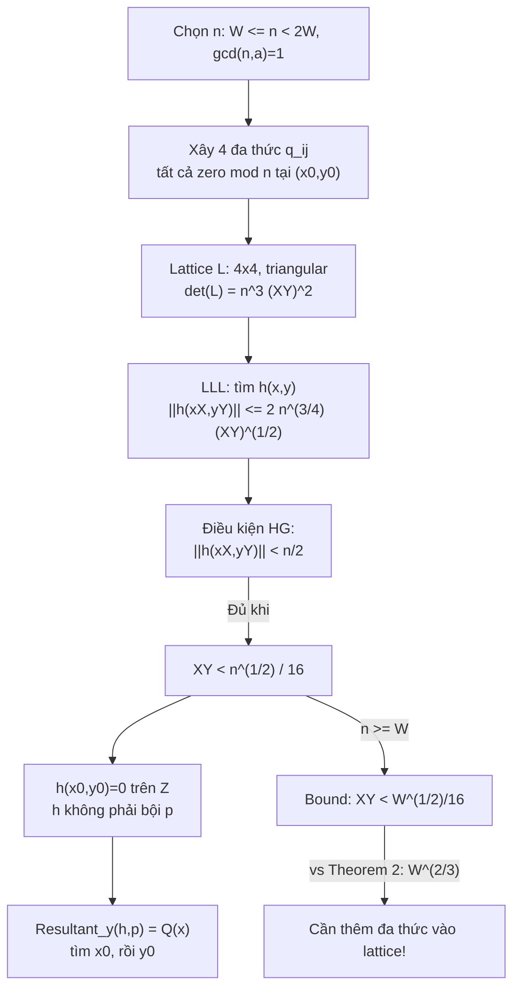

> **Prerequisites**: [[01-lattice-foundations-key-lemmas|01. Lattice Foundations & Key Lemmas]] — đặc biệt: Lemma 1 (HG), Lemma 3, LLL bound  
> **Lesson type**: Deep Dive  
> **Covers**: §2 toàn bộ — minh hoạ thuật toán với $p(x,y) = a + bx + cy + dxy$ ($\delta=1$, case $k=0$); lý do cần tăng $k$; preview approach tổng quát
>
> **Notation**:
> | Ký hiệu | Ý nghĩa |
> |---------|---------|
> | $p(x,y) = a + bx + cy + dxy$ | Đa thức bilinear ($\delta=1$), $a \neq 0$, $d \neq 0$ |
> | $n$ | Số nguyên auxiliary được chọn: $W \leq n < 2W$, $\gcd(n,a)=1$ |
> | $q_{00}, q_{10}, q_{01}, q_{11}$ | Bốn đa thức "shift" thoả $q_?(x_0,y_0) \equiv 0 \pmod{n}$ |
> | $\tilde{q}_{ij}(x,y) = q_{ij}(xX,yY)$ | Phiên bản scaled |
> | $h(x,y)$ | Đa thức output từ LLL — tổ hợp nguyên của $q_{ij}$ |
> | $Q(x) = \text{Resultant}_y(h,p)$ | Đa thức một biến thoả $Q(x_0)=0$ |

---

## Bối cảnh: Tại sao cần minh hoạ trước?

Paper của Coron bắt đầu bằng một case đơn giản nhất ($\delta=1$, tức là $p$ là đa thức bilinear) trước khi trình bày thuật toán tổng quát (§4). Đây là quyết định sư phạm xuất sắc:

- Case $\delta=1$, $k=0$ dùng chỉ **4 đa thức, 1 lattice 4×4** — tính được tay.
- Nó bộc lộ **tại sao** lattice đơn giản nhất chưa đủ (bound $XY < W^{1/2}/16$ thay vì $W^{2/3}$).
- Nó preview **trực giác** của việc cần thêm đa thức vào lattice (tăng $k$).

Bài học này **đi sâu từng bước** theo §2 để xây intuition trước khi học proof tổng quát ở Lesson 03.

---

## Setup: Đa thức bilinear và bài toán

Cho:

$$
p(x,y) = a + bx + cy + dxy \quad (a \neq 0,\ d \neq 0)
$$

bất khả quy, có nghiệm nhỏ $(x_0, y_0)$ với $\lvert x_0 \rvert \leq X$, $\lvert y_0 \rvert \leq Y$. Đặt:

$$
W = \lVert p(xX, yY) \rVert_\infty = \max\bigl(\lvert a \rvert,\ \lvert b \rvert X,\ \lvert c \rvert Y,\ \lvert d \rvert XY\bigr)
$$

Mục tiêu: khôi phục $(x_0, y_0)$.

---

## Bước 1: Sinh số nguyên auxiliary $n$

Chọn số nguyên $n$ sao cho:

$$
W \leq n < 2W \quad \text{và} \quad \gcd(n, a) = 1
$$

**Cách chọn cụ thể**: $n = W + \bigl((1 - W) \bmod \lvert a \rvert\bigr)$.

Kiểm tra: $n \equiv 1 \pmod{\lvert a \rvert}$ nên $\gcd(n, a) = 1$. Và $n \in [W, W + \lvert a \rvert) \subseteq [W, 2W)$ vì $\lvert a \rvert \leq W$.

**Tại sao cần $\gcd(n,a) = 1$?** Để $a$ khả nghịch mod $n$, cho phép chuẩn hoá $p$ thành dạng có hằng số bằng 1.

---

## Bước 2: Xây dựng bốn đa thức shift

Từ $p(x_0,y_0) = 0$ suy ra $p(x_0,y_0) \equiv 0 \pmod{n}$. Nhân thêm:

$$
q_{00}(x,y) = a^{-1} \cdot p(x,y) \bmod n = 1 + b'x + c'y + d'xy
$$

$$
q_{10}(x,y) = n \cdot x, \quad q_{01}(x,y) = n \cdot y, \quad q_{11}(x,y) = n \cdot xy
$$

> [!note] Tính chất chung của bốn đa thức
> Với tất cả bốn đa thức $q_{ij}$ ta đều có:
>
> $$
> q_{ij}(x_0, y_0) \equiv 0 \pmod{n}
> $$
>
> Vì $q_{00}(x_0,y_0) = a^{-1} p(x_0,y_0) \bmod n = 0$, và $q_{10}, q_{01}, q_{11}$ chia hết $n$.

---

## Bước 3: Scale và xây lattice

Xét các phiên bản scaled $\tilde{q}_{ij}(x,y) = q_{ij}(xX, yY)$. Coefficient vectors của chúng sinh ra một **lattice $L$** có basis (ma trận hàng):

$$
L = \begin{pmatrix}
1 & b'X & c'Y & d'XY \\
 & nX & & \\
 & & nY & \\
 & & & nXY
\end{pmatrix}
$$

(các ô trống là 0; đây là **ma trận tam giác trên**, dễ tính det).

Bốn hàng tương ứng với $\tilde{q}_{00}, \tilde{q}_{10}, \tilde{q}_{01}, \tilde{q}_{11}$ theo thứ tự monomial $\{1, x, y, xy\}$.

> [!tip] 💡 Agent note
> Ma trận tam giác (triangular basis) là điểm mấu chốt trong approach của Coron. Determinant của $L$ = tích đường chéo = $1 \cdot nX \cdot nY \cdot nXY = n^3 (XY)^2$.

**Chiều lattice**: $\omega = 4$. **Determinant**:

$$
\det(L) = n^3 (XY)^2
$$

---

## Bước 4: Áp dụng LLL

LLL (Theorem 3) tìm vector ngắn $b_1 \in L$ với:

$$
\lVert b_1 \rVert \leq 2^{(4-1)/4} \cdot \det(L)^{1/4} = 2^{3/4} \cdot n^{3/4} (XY)^{1/2}
$$

Vector này tương ứng với một đa thức $h(x,y)$ sao cho:

$$
\lVert h(xX, yY) \rVert \leq 2^{3/4} \cdot n^{3/4} (XY)^{1/2} \leq 2 \cdot n^{3/4} (XY)^{1/2} \tag{3}
$$

và $h(x_0, y_0) \equiv 0 \pmod{n}$ (vì $h$ là tổ hợp nguyên của các $q_{ij}$, mỗi cái $\equiv 0 \pmod{n}$).

---

## Bước 5: Áp dụng Lemma Howgrave-Graham

Từ Lemma 1 (HG): nếu $\lVert h(xX,yY) \rVert < n/\sqrt{\omega} = n/2$, thì $h(x_0,y_0) = 0$ trên $\mathbb{Z}$.

Kết hợp với (3), điều kiện $\lVert h(xX,yY) \rVert < n/2$ xảy ra khi:

$$
2 \cdot n^{3/4} (XY)^{1/2} < \frac{n}{2}
$$

$$
\Longleftrightarrow \quad (XY)^{1/2} < \frac{n^{1/4}}{4} \quad \Longleftrightarrow \quad XY < \frac{n^{1/2}}{16} \tag{4}
$$

---

## Bước 6: Chứng minh $h$ không phải bội của $p$

Từ (3) và $n \leq 2W$ (theo cách chọn $n$, ta có $n < 2W$):

$$
\lVert h(xX,yY) \rVert < n/2 < W \leq \lVert p(xX,yY) \rVert_\infty \leq \lVert p(xX,yY) \rVert
$$

Nếu $h = \lambda \cdot p$ với $\lambda \in \mathbb{Z}^*$, thì $\lVert h(xX,yY) \rVert = \lvert\lambda\rvert \cdot \lVert p(xX,yY) \rVert \geq \lVert p(xX,yY) \rVert$ — mâu thuẫn!

> [!success] Kết luận trung gian
> Khi điều kiện (4) thoả, ta có:
>
> 1. $h(x_0,y_0) = 0$ trên $\mathbb{Z}$
> 2. $h(x,y)$ không phải bội của $p(x,y)$

---

## Bước 7: Lấy Resultant và tìm nghiệm

Vì $p(x,y)$ bất khả quy và $h(x,y)$ không phải bội của $p$, gcd của chúng trong $\mathbb{Z}[x,y]$ là một hằng số (không trivial factor theo $y$). Do đó:

$$
Q(x) = \text{Resultant}_y\bigl(h(x,y),\; p(x,y)\bigr)
$$

là đa thức một biến **khác 0** thoả $Q(x_0) = 0$. Dùng thuật toán tìm nghiệm chuẩn để tìm $x_0$, rồi giải $p(x_0, y) = 0$ để tìm $y_0$.

> [!tip] 💡 Agent note
> Resultant theo $y$ của hai đa thức $f(x,y)$ và $g(x,y)$ là determinant của ma trận Sylvester — nó bằng 0 khi và chỉ khi $f$ và $g$ có common factor theo $y$. Ở đây: $\gcd(h, p)$ theo $y$ là hằng số, nên resultant $\neq 0$, nhưng vẫn có $x_0$ là nghiệm vì $h(x_0, y)$ và $p(x_0, y)$ có common root $y_0$.

---

## Kết quả: Bound hiện tại

Sử dụng $n \geq W$, điều kiện (4) tương đương:

$$
XY < \frac{n^{1/2}}{16} \leq \frac{W^{1/2}}{16}
$$

Vậy với case $\delta = 1$, $k=0$, thuật toán hoạt động khi:

$$
\boxed{XY < \frac{W^{1/2}}{16}}
$$

---

## So sánh với mục tiêu và bài học từ sự thiếu hụt

Theorem 2 (Coppersmith) với $\delta=1$ yêu cầu: $XY < W^{2/3}$.

Nhưng ta mới đạt được: $XY < W^{1/2}$. **Khoảng cách** này là $W^{1/2}$ vs $W^{2/3}$ — ta đang thiếu sức mạnh.

**Tại sao yếu hơn?** Vì lattice 4×4 của ta quá nhỏ. Determinant $\det(L)^{1/\omega} = (n^3(XY)^2)^{1/4}$ không đủ nhỏ so với $n/\sqrt{\omega}$.

**Cách fix**: Thêm nhiều đa thức vào lattice hơn! Cụ thể, thêm các đa thức $x^i y^j \cdot X^{k-i} Y^{k-j} \cdot q(x,y)$ cho nhiều giá trị $(i,j)$ hơn. Đây chính xác là điều §4 làm với tham số $k \geq 0$.

> [!example] Preview: k=1 cho $\delta=1$
> Với $k=1$, $\omega = (1+1+1)^2 = 9$. Lattice trở thành 9×9 (xem Figure 1 trong paper / Lesson 03). Determinant tăng lên theo $n$ nhiều hơn, nhưng $\omega$ cũng lớn hơn — cân bằng này cuối cùng cho phép đạt bound $XY < W^{2/3-\varepsilon}$ khi $k \to \infty$.

---

## Trace đầy đủ: Từ bất đẳng thức đến bound cuối cùng

Dưới đây là luồng suy luận hoàn chỉnh của §2:

---

## Summary

- **Ý tưởng cốt lõi**: Chuyển bài toán tìm nghiệm nhỏ về bài toán tìm **short vector trong lattice**.
- **Lattice 4×4** với basis tam giác → det tính ngay → LLL cho bound tường minh.
- **Hai điều kiện cần** sau LLL: (a) Lemma 1 HG → nghiệm over ℤ; (b) norm nhỏ hơn $W$ → không phải bội $p$.
- **Điểm yếu**: bound $XY < W^{1/2}/16$ chưa đạt $W^{2/3}$ của Theorem 2.
- **Bài học cho §4**: Thêm nhiều shift polynomial vào lattice (tham số $k$), khiến $\omega$ và $\det(L)$ tăng theo cách cân bằng, cuối cùng đẩy bound về $W^{2/(3\delta)-\varepsilon}$.

---

## References

- [Cop97] Coppersmith — *Small solutions to polynomial equations*, J. Cryptology 1997 (🟡 Theorem 2 mục tiêu)
- [HG97] Howgrave-Graham — *Finding small roots of univariate modular equations revisited*, 1997 (🟡 Lemma 1)
- [LLL82] Lenstra, Lenstra, Lovász — *Factoring polynomials with rational coefficients*, 1982 (🔴 Prerequisite)
