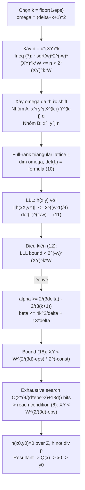

> **Prerequisites**: [[01-lattice-foundations-key-lemmas|01. Lattice Foundations & Key Lemmas]], [[02-illustration-delta-1|02. Illustration: The δ=1 Case]]  
> **Lesson type**: Scheme  
> **Covers**: §4 toàn bộ — Theorem 4 với proof đầy đủ, Figure 1, tất cả bất đẳng thức (7)–(18), tham số $k$ và quá trình exhaustive search  
> 🔴 **Prerequisite references**: [LLL82] — LLL algorithm; [Cop97] — Coppersmith's original bivariate algorithm (để so sánh)
>
> **Notation**:
> | Ký hiệu | Ý nghĩa |
> |---------|---------|
> | $\delta$ | Bậc tối đa của $p(x,y)$ theo từng biến riêng lẻ |
> | $k \geq 0$ | Tham số lattice — càng lớn thì bound càng gần $W^{2/(3\delta)}$ nhưng runtime tăng |
> | $\omega = (\delta+k+1)^2$ | Số chiều của lattice |
> | $u$ | Số auxiliary: $\sqrt{\omega} \cdot 2^{-\omega} W \leq u < 2W$, $\gcd(p_{00}, u)=1$ |
> | $n = u \cdot (XY)^k$ | Modulus chính của thuật toán |
> | $q(x,y) = p_{00}^{-1} p(x,y) \bmod n$ | Normalized polynomial, $q(0,0)=1$ |
> | $q_{ij}$ | Đa thức shift (hai loại, xem bên dưới) |
> | $\tilde{q}_{ij}(x,y) = q_{ij}(xX,yY)$ | Phiên bản scaled |
> | $h(x,y)$ | Output từ LLL — tổ hợp nguyên của $q_{ij}$ |
> | $\alpha, \beta$ | Exponent tính theo $W$ trong bound cuối (formulas 14, 15) |
> | $\varepsilon > 0$ | Precision parameter; chọn $k = \lfloor 1/\varepsilon \rfloor$ |

---

## Phát biểu Định lý Chính

> [!abstract] Theorem 4 — Coron Bivariate Algorithm (Main Result)
> Cho $p(x,y) \in \mathbb{Z}[x,y]$ bất khả quy, bậc tối đa $\delta$ theo từng biến. Đặt $X, Y$ là bound trên nghiệm $(x_0,y_0)$ và $W = \lVert p(xX,yY) \rVert_\infty$.
>
> Nếu với $\varepsilon > 0$ nào đó:
>
> $$
> XY < W^{2/(3\delta) - \varepsilon} \tag{6}
> $$
>
> thì trong thời gian đa thức theo $(\log W, 2^\delta)$, có thể tìm tất cả cặp nguyên $(x_0,y_0)$ thoả $p(x_0,y_0)=0$, $\lvert x_0 \rvert \leq X$, $\lvert y_0 \rvert \leq Y$.

**So sánh nhanh với Coppersmith**: Coppersmith đạt $XY < W^{2/(3\delta)}$ (không có $-\varepsilon$), còn Coron cần $XY < W^{2/(3\delta)-\varepsilon}$. Đánh đổi: algorithm của Coron đơn giản hơn, dễ cài đặt và mở rộng hơn.

---

## Proof của Theorem 4

### Giả thiết ban đầu

Ta giả sử $p_{00} = p(0,0) \neq 0$ và $\gcd(p_{00}, XY) = 1$. Trường hợp tổng quát xử lý trong Appendix A (xem [[a0-general-case|A0. General Case]]).

### Bước 1: Chọn tham số $k$ và $\omega$

Chọn $k \geq 0$ nguyên (sẽ xác định cụ thể sau). Đặt:

$$
\omega = (\delta + k + 1)^2
$$

Chọn $u \in \mathbb{Z}$ sao cho:

$$
\sqrt{\omega} \cdot 2^{-\omega} \cdot W \leq u < 2W \quad \text{và} \quad \gcd(p_{00}, u) = 1 \tag{$u$-condition}
$$

**Cách chọn**: $u = W + \bigl((1-W) \bmod \lvert p_{00} \rvert\bigr)$. (Tương tự §2, đảm bảo $\gcd(u, p_{00})=1$.)

Đặt:

$$
n = u \cdot (XY)^k
$$

Từ điều kiện trên $u$:

$$
\sqrt{\omega} \cdot 2^{-\omega} \cdot (XY)^k \cdot W \leq n < 2 \cdot (XY)^k \cdot W \tag{7}
$$

> [!tip] 💡 Agent note
> Sự xuất hiện của $(XY)^k$ trong $n$ là **đổi mới then chốt** so với §2 (ở đó $k=0$ nên $n \approx W$). Yếu tố $(XY)^k$ đảm bảo rằng tất cả các đa thức trong lattice đều chia hết cho $(XY)^k$ sau khi scale, cho phép Lemma 3 áp dụng với $r = (XY)^k$.

### Bước 2: Xây dựng đa thức normalized

Đặt:

$$
q(x,y) = p_{00}^{-1} \cdot p(x,y) \bmod n = 1 + \sum_{(i,j) \neq (0,0)} a_{ij} x^i y^j
$$

Chú ý $q(0,0) = 1$ và $q(x_0,y_0) \equiv 0 \pmod{n}$.

### Bước 3: Xây dựng hai nhóm đa thức shift

**Nhóm A** — với $(i,j)$ thoả $0 \leq i, j \leq k$:

$$
q_{ij}(x,y) = x^i y^j X^{k-i} Y^{k-j} \cdot q(x,y)
$$

Đa thức này thoả: $q_{ij}(x_0,y_0) \equiv 0 \pmod{n}$ (vì $q(x_0,y_0) \equiv 0$) và phiên bản scaled $\tilde{q}_{ij}(x,y) = q_{ij}(xX,yY)$ chia hết cho $(XY)^k$.

**Nhóm B** — với $(i,j) \in [0,\delta+k]^2 \setminus [0,k]^2$:

$$
q_{ij}(x,y) = x^i y^j \cdot n
$$

Đa thức này thoả: $q_{ij}(x_0,y_0) \equiv 0 \pmod{n}$ (chia hết cho $n$) và $\tilde{q}_{ij}(x,y) = X^i Y^j n \cdot \text{(monomial)}$ chia hết cho $(XY)^k$ (vì $n = u(XY)^k$).

**Tổng số đa thức**: $\lvert[0,k]^2\rvert + \lvert[0,\delta+k]^2 \setminus [0,k]^2\rvert = (k+1)^2 + \bigl[(\delta+k+1)^2 - (k+1)^2\bigr] = (\delta+k+1)^2 = \omega$.

### Bước 4: Full-rank Triangular Lattice

Xét lattice $L$ sinh bởi coefficient vectors của $(\tilde{q}_{ij})_{(i,j) \in [0,\delta+k]^2}$.

Vì các $\tilde{q}_{ij}$ có **basis tam giác** (mỗi đa thức có một leading monomial $X^i Y^j \cdot (\text{something})$ không xuất hiện ở đa thức khác), $L$ là full-rank lattice kích thước $\omega \times \omega$.

> [!example] Figure 1: Lattice cho $\delta=1$, $k=1$
> Paper trình bày ma trận lattice $L$ đầy đủ cho $\delta=1, k=1$ ($\omega=9$):
>
> ```
>             1    x    y   xy   x²  x²y   y²  xy²  x²y²
> XYq      | XY  a10X² a01XY²  a11X²Y²  ...
> Yxq      |      XY        a01XY²  a10X²Y  a11X²Y²  ...
> Xyq      |           XY   a10X²Y  a01XY²  a11X²Y²  ...
> xyq      |                XY   a10X²Y  a01XY²  a11X²Y²  ...
> x²n      |                     X²n
> x²yn     |                              X²Yn
> y²n      |                                     Y²n
> xy²n     |                                           XY²n
> x²y²n    |                                                X²Y²n
> ```
>
> Các phần tử trên đường chéo (diagonal entries): $XY, XY, XY, XY, X^2n, X^2Yn, Y^2n, XY^2n, X^2Y^2n$.

### Bước 5: Tính Determinant

**Đóng góp từ Nhóm A** ($(k+1)^2$ đa thức, mỗi cái có diagonal entry $(XY)^k$):

$$
\prod_{0 \leq i,j \leq k} (XY)^k = (XY)^{k(k+1)^2}
$$

**Đóng góp từ Nhóm B** ($(\delta+k+1)^2 - (k+1)^2$ đa thức, diagonal entry $X^i Y^j n$):

$$
\prod_{(i,j) \in [0,\delta+k]^2 \setminus [0,k]^2} X^i Y^j n = (XY)^{\frac{(\delta+k)(\delta+k+1)^2}{2} - \frac{k(k+1)^2}{2}} \cdot n^{\delta(\delta+2k+2)}
$$

> [!note] Scheme 3.1 — Determinant Formula
> **Input**: Parameters $\delta \geq 1$, $k \geq 0$, bounds $X, Y$, modulus $n$  
> **Output**: $\det(L)$ của lattice Coron
>
> $$
> \det(L) = (XY)^{\frac{(\delta+k)(\delta+k+1)^2 + k(k+1)^2}{2}} \cdot n^{\delta(\delta+2k+2)} \tag{10}
> $$

### Bước 6: Áp dụng LLL

LLL (Theorem 3) tìm $h(x,y) \neq 0$ thoả:

$$
\lVert h(xX,yY) \rVert \leq 2^{(\omega-1)/4} \cdot \det(L)^{1/\omega} \tag{11}
$$

$h$ có bậc tối đa $\delta+k$ theo từng biến, nên có tối đa $\omega$ monomial.

### Bước 7: Hai điều kiện cần thoả

**Điều kiện (8)** — $h(x_0,y_0) = 0$ trên $\mathbb{Z}$ (Lemma 1 HG):

$$
\lVert h(xX,yY) \rVert < \frac{n}{\sqrt{\omega}} \tag{8}
$$

**Điều kiện (9)** — $h$ không phải bội $p$ (Lemma 3 với $r = (XY)^k$, $a = p(xX,yY)$):

Vì $(XY)^k \mid h(xX,yY)$ (tính chất của lattice) và $\gcd(p_{00}, (XY)^k) = 1$, Lemma 3 cho:

$$
\lVert h(xX,yY) \rVert < 2^{-\omega} \cdot (XY)^k \cdot W \tag{9}
$$

**Quan hệ giữa (8) và (9)**: Từ bất đẳng thức (7):

$$
n \geq \sqrt{\omega} \cdot 2^{-\omega} \cdot (XY)^k \cdot W
$$

suy ra:

$$
\frac{n}{\sqrt{\omega}} \geq 2^{-\omega} \cdot (XY)^k \cdot W
$$

Tức là điều kiện (9) **mạnh hơn** (8): nếu (9) thoả thì (8) tự động thoả. Ta chỉ cần đảm bảo (9).

### Bước 8: Điều kiện trên $XY$ để LLL đủ tốt

Từ (11), điều kiện (9) thoả khi:

$$
2^{(\omega-1)/4} \cdot \det(L)^{1/\omega} < 2^{-\omega} \cdot (XY)^k \cdot W \tag{12}
$$

Thay (10) vào (12) và sử dụng (7), sau khi biến đổi đại số, điều kiện trở thành:

$$
XY < 2^{-\beta} \cdot W^\alpha \tag{13}
$$

với:

$$
\alpha = \frac{2(k+1)^2}{(\delta+k)(\delta+k+1)^2 - k(k+1)^2} \tag{14}
$$

$$
\beta = \frac{10}{4} \cdot \frac{(\delta+k+1)^4 + (\delta+k+1)^2}{(\delta+k)(\delta+k+1)^2 - k(k+1)^2} \tag{15}
$$

### Bước 9: Bound tiệm cận theo $k$

Paper chứng minh hai bất đẳng thức quan trọng: với mọi $\delta \geq 1$, $k \geq 0$:

$$
\alpha \geq \frac{2}{3\delta} - \frac{2}{3(k+1)} \tag{16}
$$

$$
\beta \leq \frac{4k^2}{\delta} + 13\delta \tag{17}
$$

**Ý nghĩa**: Khi $k \to \infty$, $\alpha \to 2/(3\delta)$ (đạt bound của Theorem 2 Coppersmith) và $\beta \to \infty$ (constant factor trong điều kiện trên $XY$).

**Chọn** $k = \lfloor 1/\varepsilon \rfloor$, từ (13), (16), (17):

$$
XY < W^{2/(3\delta)-\varepsilon} \cdot 2^{-4/(\delta\varepsilon^2) - 13\delta} \tag{18}
$$

### Bước 10: Giải quyết khoảng cách giữa (18) và (6)

Điều kiện (6) yêu cầu $XY < W^{2/(3\delta)-\varepsilon}$, trong khi (18) yêu cầu $XY < W^{2/(3\delta)-\varepsilon} \cdot 2^{-4/(\delta\varepsilon^2)-13\delta}$ (ketat hơn thêm một hằng số $2^{-\Theta(1/\varepsilon^2)}$).

**Cách lấp khoảng cách**: Nếu $XY$ chỉ thoả (6) chứ chưa thoả (18), ta **exhaustive search** $4/(\delta\varepsilon^2)+13\delta$ bits cao nhất của $x_0$. Với mỗi candidate $\hat{x}_0$, ta thay $x_0 = \hat{x}_0 + x_0'$ với $x_0'$ nhỏ hơn, tức là $X' = X/2^{4/(\delta\varepsilon^2)+13\delta}$. Khi đó $X'Y < W^{2/(3\delta)-\varepsilon} \cdot 2^{-4/(\delta\varepsilon^2)-13\delta}$, thoả (18), và ta áp dụng thuật toán đã trình bày.

Số lần lặp: $2^{4/(\delta\varepsilon^2)+13\delta}$. Với $\varepsilon > 0$ cố định, đây là hằng số theo $\log W$, nên tổng thời gian vẫn đa thức theo $(\log W, 2^\delta)$.

### Bước 11: Khôi phục nghiệm

Khi điều kiện (12) thoả:
- $h(x_0,y_0) = 0$ trên $\mathbb{Z}$ (Lemma 1)
- $h(x,y)$ không phải bội $p(x,y)$ (Lemma 3)

Do $p$ bất khả quy:

$$
Q(x) = \text{Resultant}_y\bigl(h(x,y),\; p(x,y)\bigr) \neq 0
$$

và $Q(x_0) = 0$. Tìm $x_0$ bằng root-finding, rồi $y_0$ từ $p(x_0,y)=0$. $\blacksquare$

---

## Toàn cảnh: Algorithm đầy đủ

> [!note] Scheme 3.2 — Coron Bivariate Root-Finding Algorithm
> **Type**: Bivariate Integer Small Root Finding  
> **Setting**: $p(x,y) \in \mathbb{Z}[x,y]$ bất khả quy, bậc tối đa $\delta$; bounds $X, Y$; $W = \lVert p(xX,yY) \rVert_\infty$; $\varepsilon > 0$ cho trước  
>
> **$\mathsf{CoronBivariate}(p, X, Y, \varepsilon)$**
> - Input: $p(x,y)$, $X$, $Y$, $\varepsilon > 0$
> - Bước 0: Nếu $p_{00}=0$ hoặc $\gcd(p_{00},XY)\neq 1$, tiền xử lý (Appendix A)
> - Bước 1: Đặt $k = \lfloor 1/\varepsilon \rfloor$, $\omega = (\delta+k+1)^2$
> - Bước 2: For each candidate $\hat{x}_0$ trong exhaustive search $4/(\delta\varepsilon^2)+13\delta$ bits:
>   - Bước 3: Tính $u = W + ((1-W) \bmod \lvert p_{00}\rvert)$; $n = u \cdot (XY')^k$
>   - Bước 4: Xây $q(x,y) = p_{00}^{-1} p(x,y) \bmod n$
>   - Bước 5: Xây $(k+1)^2$ đa thức Nhóm A: $q_{ij} = x^i y^j X'^{k-i} Y^{k-j} q$ với $0 \leq i,j \leq k$
>   - Bước 6: Xây $(\delta+k+1)^2 - (k+1)^2$ đa thức Nhóm B: $q_{ij} = x^i y^j n$
>   - Bước 7: Scale: $\tilde{q}_{ij}(x,y) = q_{ij}(xX', yY)$; xây lattice $L$ ($\omega \times \omega$ triangular)
>   - Bước 8: Áp dụng LLL trên $(XY)^{-k} L$ (hiệu quả hơn); lấy short vector $\to h(x,y)$
>   - Bước 9: Tính $Q(x) = \text{Resultant}_y(h,p)$; nếu $Q \neq 0$, tìm roots $x_0$ của $Q$
>   - Bước 10: Với mỗi $x_0$: giải $p(x_0+\hat{x}_0, y)=0$ để tìm $y_0$; verify $p(x_0+\hat{x}_0, y_0)=0$
> - Output: Tất cả $(x_0,y_0)$ tìm được
>
> [!tip] 💡 Agent note
> Bước 8 note: mọi vector trong lattice $L$ có hệ số chia hết $(XY)^k$, nên hiệu quả hơn khi áp dụng LLL trên $(XY)^{-k}L$ — lattice có cùng hình dạng nhưng entries nhỏ hơn $2^k$ lần. Điều này không ảnh hưởng đến correctness.

---

## Tổng hợp: Dòng chảy Bound



---

## Tại sao algorithm đúng: Kiểm tra 3 câu hỏi

**What is it?** Thuật toán tìm nghiệm nhỏ của đa thức nguyên hai biến bằng cách xây full-rank lattice, áp dụng LLL để tìm đa thức "nhỏ" vanish tại $(x_0,y_0)$, rồi dùng resultant để giảm về bài toán một biến.

**How does it work?** Tham số $k$ kiểm soát size-accuracy tradeoff: $k=0$ nhanh nhưng bound yếu ($\approx W^0$); $k \to \infty$ tiếp cận bound tối ưu $W^{2/(3\delta)}$ nhưng lattice lớn hơn. Chọn $k = \lfloor 1/\varepsilon \rfloor$ là điểm cân bằng: bound $W^{2/(3\delta)-\varepsilon}$ với runtime polynomial cố định $\varepsilon$.

**Why is it correct?**
- Tính chất modular: tất cả $q_{ij}(x_0,y_0) \equiv 0 \pmod{n}$ đảm bảo $h(x_0,y_0) \equiv 0 \pmod{n}$.
- Lemma 1 (HG): khi $\lVert h(xX,yY) \rVert < n/\sqrt{\omega}$, nghiệm modular → nghiệm thực sự.
- Lemma 3: khi $\lVert h(xX,yY) \rVert < 2^{-\omega}(XY)^k W$, $h \nmid p$ → resultant $\neq 0$.
- LLL đảm bảo bound (11); bất đẳng thức (7) đảm bảo điều kiện (9) → (8) tự động.

---

## Summary

- **Tham số $k$** là trái tim của proof: nó tạo ra factor $(XY)^k$ trong $n$, khiến lattice có $(XY)^k$-divisibility tự nhiên, cho phép Lemma 3 áp dụng.
- **Full-rank triangular lattice** → det tính ngay theo formula (10) → bound tường minh.
- **Bound tối ưu tiệm cận**: $\alpha \to 2/(3\delta)$ khi $k \to \infty$, nhưng phải trả giá bằng constant $2^{-\Theta(k^2/\delta)}$ → giải quyết bằng exhaustive search $O(k^2/\delta)$ bits.
- **Tradeoff với Coppersmith**: Coppersmith đạt $XY < W^{2/(3\delta)}$ (sharp), Coron chỉ $W^{2/(3\delta)-\varepsilon}$; nhưng Coron đơn giản hơn đáng kể.
- **Mở rộng**: §5 (so sánh), §6 (nhiều biến), Theorem 5 (total degree), Theorem 6 (RSA application) — xem [[04-variants-comparison-extension|04. Variants & Comparison]] và [[05-rsa-application-experiments|05. RSA Application]].

---

## References

- [Cop97] Coppersmith — *Small solutions to polynomial equations*, J. Cryptology 1997 (🟡 Theorem 2: bound mục tiêu)
- [HG97] Howgrave-Graham — *Finding small roots of univariate modular equations revisited*, 1997 (🟡 Lemma 1)
- [Mig74] Mignotte — *An inequality about factors of polynomials*, Math Comp. 1974 (🟡 Lemma 2→3)
- [LLL82] Lenstra, Lenstra, Lovász — *Factoring polynomials with rational coefficients*, Math. Ann. 1982 (🔴 Prerequisite)
