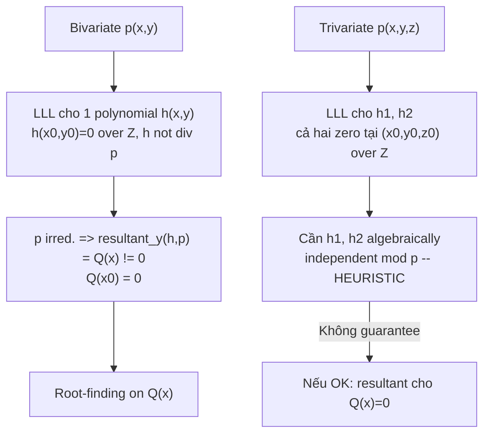

> **Prerequisites**: [[03-main-algorithm-theorem-4|03. Main Algorithm: Coron's Theorem 4]]  
> **Lesson type**: Deep Dive  
> **Covers**: §5 (So sánh với Coppersmith), §6 (Mở rộng sang nhiều biến), Theorem 5 (total degree variant), Appendix B (proof of Theorem 5)
>
> **Notation**:
> | Ký hiệu | Ý nghĩa |
> |---------|---------|
> | $\delta$ | Bậc tối đa theo từng biến (max degree separately) — dùng trong Theorem 4 |
> | $\delta_{\text{tot}}$ | Tổng bậc (total degree) — dùng trong Theorem 5 |
> | $\omega_{\text{tot}} = \frac{(k+\delta+1)(k+\delta+2)}{2}$ | Số chiều lattice khi dùng total degree |
> | $\ell \geq 0$ | Tham số cho extension 3 biến (tương tự $k$) |
> | $p(x,y,z)$ | Đa thức 3 biến — dùng trong §6 |

---

## §5 — So sánh với Thuật toán Coppersmith Gốc

### Recap: Hai thuật toán, hai bound

| Tiêu chí | Coron (paper này) | Coppersmith gốc [Cop97] |
|----------|-------------------|------------------------|
| Bound (max degree $\delta$) | $XY < W^{2/(3\delta)-\varepsilon}$ | $XY < W^{2/(3\delta)}$ |
| Bound (total degree $\delta$) | $XY < W^{1/\delta-\varepsilon}$ | $XY < W^{1/\delta}$ |
| Lattice loại | Full-rank triangular | Non-full-rank |
| Det computation | Tích diagonal — trivial | Gramian det — phức tạp |
| Polynomial-time khi nào | $XY < W^{2/(3\delta)-\varepsilon}$ cố định $\varepsilon>0$ | $XY < W^{2/(3\delta)}$ |
| Runtime theo $\varepsilon$ | Exponential in $1/\varepsilon$ (với $k=\lfloor 1/\varepsilon\rfloor$) | Polynomial in $(log W, \delta, 1/\varepsilon)$ |
| Độ phức tạp tổng quát | Polynomial in $(\log W, 2^\delta)$ | Polynomial in $(\log W, 2^\delta)$ |
| Dễ hiểu/cài đặt | ✅ Đơn giản hơn đáng kể | ❌ Khó |
| Derived bounds theo shape | ✅ Dễ | ❌ Khó |

### Phân tích chi tiết tradeoff

**Khi $XY < W^{2/(3\delta)-\varepsilon} \cdot 2^{-13\delta}$** (điều kiện mạnh hơn):

- Coppersmith: polynomial-time trong $(\log W, \delta, 1/\varepsilon)$ — tức runtime phụ thuộc $1/\varepsilon$ một cách polynomial.
- Coron: polynomial-time trong $(\log W, \delta)$ — **nhanh hơn** theo $\delta$ và $1/\varepsilon$, nhưng exhaustive search $2^{4/(\delta\varepsilon^2)+13\delta}$ bits vẫn là hằng số với $\varepsilon$ cố định.

**Khi $XY < W^{2/(3\delta)}$** (bound tối ưu của Coppersmith):

- Coppersmith: vẫn polynomial-time trong $(\log W, 2^\delta)$.
- Coron: **không còn đảm bảo polynomial** — exhaustive search trở thành $2^{\infty}$ khi $\varepsilon \to 0$.

> [!warning] Giới hạn của Thuật toán Coron
> Thuật toán Coron **không đạt** bound sắc nét $XY < W^{2/(3\delta)}$ của Coppersmith. Với những bài toán cụ thể đòi hỏi bound chính xác đó (không có margin $\varepsilon$), phải dùng Coppersmith gốc.
>
> Ví dụ: factoring $n=pq$ khi biết chính xác $1/4 \log_2 n$ bits của $p$ (không nhiều hơn) — Coppersmith giải được, Coron thì không đảm bảo trừ khi biết $(1/4+\varepsilon)\log_2 n$ bits.
>
> [!tip] 💡 Agent note
> Tuy nhiên, với hầu hết ứng dụng bug-hunting (trong đó ta thường có nhiều bit hơn minimum một chút), thuật toán Coron hoàn toàn đủ dùng và cài đặt đơn giản hơn nhiều. Đây là lý do paper được trích dẫn rộng rãi dù bound yếu hơn.

---

## Theorem 5 — Variant cho Total Degree

Theorem 4 xử lý đa thức có **bậc tối đa $\delta$ theo từng biến riêng lẻ** (max degree separately). Khi đa thức có **tổng bậc $\delta$** (total degree), ta có bound tốt hơn.

> [!abstract] Theorem 5 — Total Degree Variant
> Dưới giả thiết của Theorem 4, ngoại trừ $p(x,y)$ có **tổng bậc $\delta$** (thay vì max degree $\delta$), bound thích hợp là:
>
> $$
> XY < W^{1/\delta - \varepsilon}
> $$
>
> và thuật toán vẫn polynomial-time trong $(\log W, 2^\delta)$.

**So sánh bounds**:
- Max degree $\delta$ → $XY < W^{2/(3\delta)-\varepsilon}$
- Total degree $\delta$ → $XY < W^{1/\delta-\varepsilon}$

Vì $1/\delta > 2/(3\delta)$ với mọi $\delta \geq 1$, **total degree cho bound mạnh hơn**. Điều này hợp lý: đa thức có total degree $\delta$ có ít monomial hơn (chỉ $\binom{\delta+2}{2}$ thay vì $(\delta+1)^2$), nên lattice nhỏ hơn nhưng structure tốt hơn.

### Proof của Theorem 5 (Appendix B)

Proof dùng cùng $n$ và $q(x,y)$ như Theorem 4, nhưng thay đổi cấu trúc shift polynomials.

**Nhóm A** (thay đổi): Dùng $q_{ij}(x,y) = x^i y^j X^{k-i} Y^{k-j} q(x,y)$ nhưng chỉ với $0 \leq i+j \leq k$ (tổng bậc $\leq k$) thay vì $0 \leq i,j \leq k$.

**Nhóm B** (thay đổi): Dùng $q_{ij}(x,y) = x^i y^j n$ với $k < i+j \leq k+\delta$.

> [!note] Scheme 4.1 — Total Degree Lattice
> **Input**: $p(x,y)$ total degree $\delta$, tham số $k \geq 0$  
> **Output**: Full-rank lattice $L$ kích thước $\omega_{\text{tot}} \times \omega_{\text{tot}}$
>
> **$\mathsf{BuildLatticeTotalDegree}(p, X, Y, k)$**
> - Input: $p$, $X$, $Y$, $k$
> - Tính $\omega_{\text{tot}} = (k+\delta+1)(k+\delta+2)/2$
> - Nhóm A: $q_{ij} = x^i y^j X^{k-i} Y^{k-j} q(x,y)$ với $0 \leq i+j \leq k$
> - Nhóm B: $q_{ij} = x^i y^j n$ với $k < i+j \leq k+\delta$
> - Xây triangular lattice $L$ từ $\tilde{q}_{ij}(x,y) = q_{ij}(xX,yY)$
> - Output: $L$ với $\det L$ như formula dưới

**Determinant** (Appendix B):

$$
\det L = (XY)^{\frac{3k(1+k)(2+k) + d(2+d^2+6k+3k^2+3d(1+k))}{6}} \cdot n^{d(3+d+2k)/2}
$$

với $d = \delta$ (paper dùng $d$ trong Appendix B).

**Đóng góp từ Nhóm A**:

$$
\prod_{0 \leq i+j \leq k} (XY)^k = (XY)^{k(k+1)(k+2)/2}
$$

**Đóng góp từ Nhóm B**:

$$
\prod_{k < i+j \leq k+\delta} X^i Y^j n = (XY)^{(\text{exponent})} \cdot n^{\delta(3+\delta+2k)/2}
$$

**Điều kiện cho LLL** (tương tự Theorem 4):

$$
2^{(\omega-1)/4} \det(L)^{1/\omega} < 2^{-(k+\delta+1)^2} \cdot (XY)^k \cdot W
$$

Từ đó derive:

$$
XY < W^{(1/\delta)-\varepsilon} \cdot 2^{-4/(\delta\varepsilon^2)-13\delta}
$$

Exhaustive search $4/(\delta\varepsilon^2)+13\delta$ bits của $x_0$ → đạt bound $XY < W^{1/\delta-\varepsilon}$. $\blacksquare$

> [!example] Ví dụ: Polynomial p(x,y) = N - x·y
> Đây là bài toán factoring cơ bản: $p(x,y) = N - xy$ có **total degree 2** (không phải max degree 1). Vậy:
>
> - Nếu coi max degree: $\delta=1$, bound $XY < W^{2/3-\varepsilon}$
> - Nếu coi total degree: $\delta=2$, bound $XY < W^{1/2-\varepsilon}$
>
> Kết quả: total degree cho bound **yếu hơn** trong trường hợp này! Cần chọn loại degree phù hợp với cấu trúc polynomial.

---

## §6 — Mở rộng sang Nhiều Biến (Heuristic)

### Setup cho 3 biến

Cho $p(x,y,z) \in \mathbb{Z}[x,y,z]$, bậc $\delta$ theo từng biến, nghiệm $(x_0,y_0,z_0)$ với $|x_0|\leq X$, $|y_0|\leq Y$, $|z_0|\leq Z$. Tham số $\ell \geq 0$ (tương tự $k$).

**Xây $n$ và lattice** tương tự bivariate:
- $n \equiv 0 \pmod{(XYZ)^\ell}$
- $q(x,y,z)$ thoả $q(x_0,y_0,z_0) \equiv 0 \pmod{n}$, $q(0,0,0)=1$
- Nhóm A: $x^i y^j z^k X^{\ell-i} Y^{\ell-j} Z^{\ell-k} q(xX,yY,zZ)$ với $0 \leq i,j,k \leq \ell$
- Nhóm B: $(xX)^i(yY)^j(zZ)^k \cdot n$ với $(i,j,k) \in [0,\delta+\ell]^3 \setminus [0,\ell]^3$

LLL đảm bảo tìm **một** đa thức $h_1(x,y,z)$ thoả $h_1(x_0,y_0,z_0)=0$ trên $\mathbb{Z}$ và $h_1 \nmid p$.

### Vấn đề cốt lõi: Algebraic Independence

Với 2 biến, ta chỉ cần một $h(x,y)$ → resultant theo $y$ cho $Q(x) \neq 0$.

Với 3 biến, cần **hai** đa thức $h_1, h_2$ độc lập đại số (algebraically independent) cùng với $p$ để lấy resultant giảm về 1 biến. LLL có thể cho ta $h_1$ và $h_2$ bằng cách bound norm của **second LLL vector** (kỹ thuật từ [BonDur99] và [Jut98]).

> [!warning] Tại sao phương pháp là Heuristic
> Không có đảm bảo rằng $h_1$ và $h_2$ từ LLL là algebraically independent. Ví dụ dễ xảy ra: $h_2 = x \cdot h_1$. Nếu vậy, resultant sẽ bằng 0 — method thất bại.
>
> Trong thực tế, với hầu hết "generic" polynomials, algebraic independence xảy ra. Nhưng không có proof lý thuyết cho điều này.
>
> [!tip] 💡 Agent note
> Đây là điểm quan trọng cho zkVerify bug hunting: nếu gặp bài toán 3+ biến, phải cẩn thận về điều kiện algebraic independence. Với 2 biến, thuật toán provably correct; với 3+ biến, chỉ heuristic. Nhiều implementation thực tế verify independence bằng cách check rank của Jacobian matrix tại điểm nghiệm.

### Tại sao bivariate đặc biệt hơn

---

## Summary

- **Theorem 5** (total degree $\delta$): Dùng lattice nhỏ hơn với shift polynomials theo total degree — bound cải thiện từ $W^{2/(3\delta)}$ lên $W^{1/\delta}$ (cả hai trừ $\varepsilon$).
- **So sánh Coppersmith vs Coron**: Coron đơn giản hơn nhưng bound yếu hơn một $\varepsilon$; với $\varepsilon$ cố định đều polynomial-time.
- **Extension 3+ biến**: Heuristic vì không đảm bảo algebraic independence của các $h_i$ tìm được từ LLL.
- **Điểm thực tế**: Với 2 biến — dùng tự tin; với 3+ biến — verify independence thực nghiệm.

---

## References

- [Cop97] Coppersmith — *Small solutions to polynomial equations*, J. Cryptology 1997 (🟡 bound target Theorem 5)
- [BonDur99] Boneh, Durfee — *Cryptanalysis of RSA with private key d < N^0.292*, Eurocrypt 1999 (⚪ second LLL vector technique)
- [Jut98] Jutla — *On finding small solutions of modular multivariate polynomial equations*, Eurocrypt 1998 (⚪ multivariate technique)
- [LLL82] Lenstra, Lenstra, Lovász — *Factoring polynomials with rational coefficients*, 1982 (🔴 Prerequisite)
