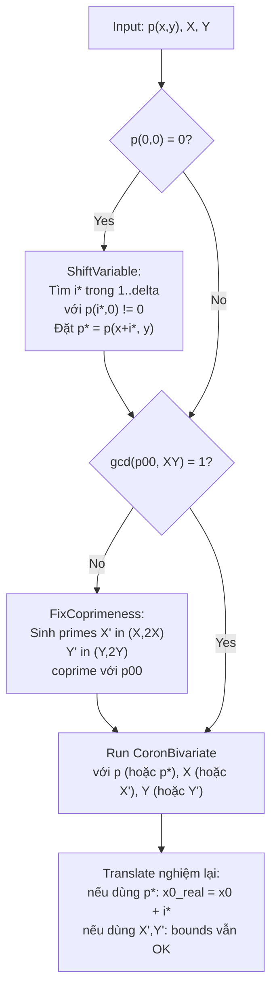

> **Prerequisites**: [[03-main-algorithm-theorem-4|03. Main Algorithm: Coron's Theorem 4]]  
> **Lesson type**: Deep Dive  
> **Covers**: Appendix A toàn bộ — xử lý hai trường hợp đặc biệt: (1) $p(0,0) = 0$ và (2) $\gcd(p(0,0), XY) \neq 1$
>
> **Notation**:
> | Ký hiệu | Ý nghĩa |
> |---------|---------|
> | $p_{00} = p(0,0)$ | Hệ số hằng số của $p$ |
> | $p^*(x,y)$ | Polynomial sau change of variable để đảm bảo $p^*(0,0) \neq 0$ |
> | $i^*$ | Giá trị shift thoả $p(i^*, 0) \neq 0$ |
> | $X', Y'$ | Primes thay thế $X, Y$ trong trường hợp gcd không coprime |

---

## Bối cảnh: Hai Giả thiết trong Main Proof

Proof của Theorem 4 (§4) bắt đầu bằng câu: *"Đầu tiên ta giả sử $p_{00} \neq 0$ và $\gcd(p_{00}, XY) = 1$. Ta sẽ xem cách xử lý trường hợp tổng quát trong Appendix A."*

Hai giả thiết này cần thiết vì:

**Giả thiết 1** — $p_{00} \neq 0$: Để tính $p_{00}^{-1} \pmod{n}$ và xây $q(x,y) = p_{00}^{-1} p(x,y) \bmod n$ với $q(0,0) = 1$.

**Giả thiết 2** — $\gcd(p_{00}, XY) = 1$: Để Lemma 3 áp dụng được với $r = (XY)^k$ và $a(0,0) = p_{00}$, cần $\gcd(r, a(0,0)) = 1$, tức $\gcd((XY)^k, p_{00}) = 1$.

Appendix A xử lý hoàn toàn cả hai trường hợp vi phạm.

---

## Trường hợp 1: $p(0,0) = 0$

### Vấn đề

Nếu $p_{00} = 0$, ta không thể tính $p_{00}^{-1} \pmod{n}$. Hơn nữa, $q(0,0) = 1$ không còn đúng.

### Giải pháp: Change of Variable

> [!note] Scheme A.1 — Shift to Nonzero Constant Term
> **Type**: Preprocessing step  
> **Setting**: $p(x,y) \in \mathbb{Z}[x,y]$ bất khả quy với $p(0,0) = 0$
>
> **$\mathsf{ShiftVariable}(p, \delta)$**
> - Input: $p(x,y)$ với $p(0,0)=0$, bậc tối đa $\delta$
> - Viết $p$ dưới dạng: $p(x,y) = x \cdot a_0(x) + y \cdot c(x,y)$ với $\deg a_0 \leq \delta-1$
> - Vì $p$ bất khả quy, $a_0 \neq 0$ (nếu $a_0 = 0$ thì $p = y \cdot c(x,y)$ — reducible)
> - Vì $\deg a_0 \leq \delta-1$, tồn tại $0 < i^* \leq \delta$ sao cho $a_0(i^*) \neq 0$
>   (đa thức bậc $\leq \delta-1$ có tối đa $\delta-1$ nghiệm)
> - Kiểm tra: $p(i^*, 0) = i^* \cdot a_0(i^*) + 0 = i^* a_0(i^*) \neq 0$
> - Đặt $p^*(x,y) = p(x + i^*, y)$
> - Output: $p^*(x,y)$ với $p^*(0,0) = p(i^*, 0) \neq 0$

**Correctness:** Nếu $(x_0, y_0)$ là nghiệm của $p$, thì $(x_0 - i^*, y_0)$ là nghiệm của $p^*$. Bounds thay đổi: $|x_0 - i^*| \leq X + i^* \leq X + \delta$. Vì $\delta$ thường nhỏ so với $X$, bound không thay đổi đáng kể.

### Tìm $i^*$ trong thực tế

Với $\deg a_0 \leq \delta - 1$, đa thức $a_0(x)$ có tối đa $\delta - 1$ nghiệm nguyên. Do đó trong tập $\{1, 2, \ldots, \delta\}$ ($\delta$ giá trị), ít nhất một giá trị thoả $a_0(i^*) \neq 0$. Tìm bằng brute-force: thử $i = 1, 2, \ldots, \delta$ cho đến khi $a_0(i) \neq 0$.

> [!example] Ví dụ minh hoạ
> Cho $p(x,y) = xy + 2x^2 y - 3y^2$ ($\delta = 2$).
>
> Kiểm tra $p(0,0) = 0$ → cần shift.
>
> Viết: $p(x,y) = x(y + 2xy) + y(-3y) = x \cdot (y+2xy) - 3y^2$. Tách theo $x$:
> $p(x,y) = x \cdot [y + 2xy] - 3y^2$, nhưng cần dạng $x \cdot a_0(x) + y \cdot c(x,y)$.
>
> Thực ra: $p = x \cdot a_0(x) + y \cdot c(x,y)$ với $a_0(x) = 0$ (không có số hạng $x^i$ thuần) — ví dụ này phức tạp hơn. Trong thực tế, cứ thử $p(1,0), p(2,0), \ldots$ cho đến khi $\neq 0$.
>
> $p(1,0) = 1\cdot0 + 2\cdot1\cdot0 - 3\cdot0 = 0$. Thử $p(1,1) \neq 0$? Đây là ví dụ mà $p(i^*,0) \neq 0$ tồn tại trong $\{1,\ldots,\delta\}$.

---

## Trường hợp 2: $\gcd(p_{00}, XY) \neq 1$

### Vấn đề

Giả thiết 2 cần để Lemma 3 áp dụng: khi $r = (XY)^k$ và $a(0,0) = p_{00}$, nếu $\gcd(p_{00}, XY) \neq 1$ thì $\gcd(r, a(0,0)) \neq 1$ — Lemma 3 không kết luận được $h \nmid p$.

### Giải pháp: Thay thế $X, Y$ bằng primes coprime với $p_{00}$

> [!note] Scheme A.2 — Replace Bounds with Coprime Primes
> **Type**: Preprocessing step  
> **Setting**: $p(0,0) = p_{00} \neq 0$ nhưng $\gcd(p_{00}, XY) \neq 1$
>
> **$\mathsf{FixCoprimeness}(p_{00}, X, Y)$**
> - Input: $p_{00} \neq 0$, bounds $X, Y$
> - Sinh ngẫu nhiên số nguyên tố $X'$ thoả $X < X' < 2X$ và $X' \nmid p_{00}$
> - Sinh ngẫu nhiên số nguyên tố $Y'$ thoả $Y < Y' < 2Y$ và $Y' \nmid p_{00}$
> - Vì $p_{00}$ có hữu hạn ước số nguyên tố, các prime $X', Y'$ như vậy tồn tại và chiếm mật độ cao trong $[X, 2X]$ và $[Y, 2Y]$
> - Dùng thuật toán sinh số nguyên tố đệ quy [Mau95] để sinh hiệu quả
> - Output: $X', Y'$ thoả $\gcd(X' Y', p_{00}) = 1$

**Correctness:** Vì $|x_0| \leq X < X'$ và $|y_0| \leq Y < Y'$, bounds mới $X', Y'$ vẫn hợp lệ. Bound $XY$ tăng lên $X'Y' < 4XY$ — không ảnh hưởng đến asymptotic.

> [!info] 🟡 Prime Generation (Mau95)
> Appendix A cite thuật toán sinh số nguyên tố đệ quy của Maurer [Mau95] để sinh prime $X'$ trong khoảng $(X, 2X)$. Điều này đảm bảo polynomial-time: mật độ số nguyên tố trong $[X, 2X]$ là $\sim 1/\ln X$ (Prime Number Theorem), và Mau95 sinh provably prime numbers hiệu quả.
>
> *(theo [Mau95]: Maurer — Fast Generation of Prime Numbers and Secure Public-Key Cryptographic Parameters, J. Cryptology 1995)*

### Tại sao dùng primes?

Vì $p_{00}$ là một số nguyên cố định, nó có tối đa $O(\log p_{00})$ ước số nguyên tố. Một số nguyên tố $X'$ trong $[X, 2X]$ sẽ tự động thoả $\gcd(X', p_{00}) = 1$ trừ khi $X'$ là một trong $O(\log p_{00})$ ước nguyên tố của $p_{00}$ — xác suất này negligible.

---

## Tổng kết: Preprocessing Pipeline đầy đủ

---

## Ảnh hưởng đến bound tổng quát

Cả hai preprocessing steps không làm thay đổi bound $XY < W^{2/(3\delta)-\varepsilon}$ một cách đáng kể:

- **Shift**: $X \to X + \delta$ — factor $(1 + \delta/X)$ negligible khi $X$ lớn.
- **Prime replacement**: $XY \to X'Y' < 4XY$ — chỉ thêm constant factor 4 vào bound, không ảnh hưởng exponent.

Do đó Theorem 4 áp dụng đầy đủ cho trường hợp tổng quát. $\blacksquare$

---

## Summary

- **Trường hợp $p_{00}=0$**: Dùng shift $p^*(x,y) = p(x+i^*,y)$ với $i^* \in \{1,\ldots,\delta\}$ sao cho $p(i^*,0) \neq 0$. Tồn tại vì $p$ bất khả quy.
- **Trường hợp $\gcd(p_{00},XY)\neq 1$**: Thay $X, Y$ bằng primes $X' \in (X,2X)$, $Y' \in (Y,2Y)$ coprime với $p_{00}$. Sinh bằng [Mau95].
- Cả hai bước đều polynomial-time và không ảnh hưởng đến asymptotic bound.
- Preprocessing này hoàn thiện proof của Theorem 4 cho **mọi** đa thức nguyên bất khả quy.

---

## References

- [Mau95] Maurer — *Fast Generation of Prime Numbers and Secure Public-Key Cryptographic Parameters*, J. Cryptology 1995 (🟡 prime generation algorithm)
- [LLL82] Lenstra, Lenstra, Lovász — *Factoring polynomials with rational coefficients*, 1982 (🔴 Prerequisite)
