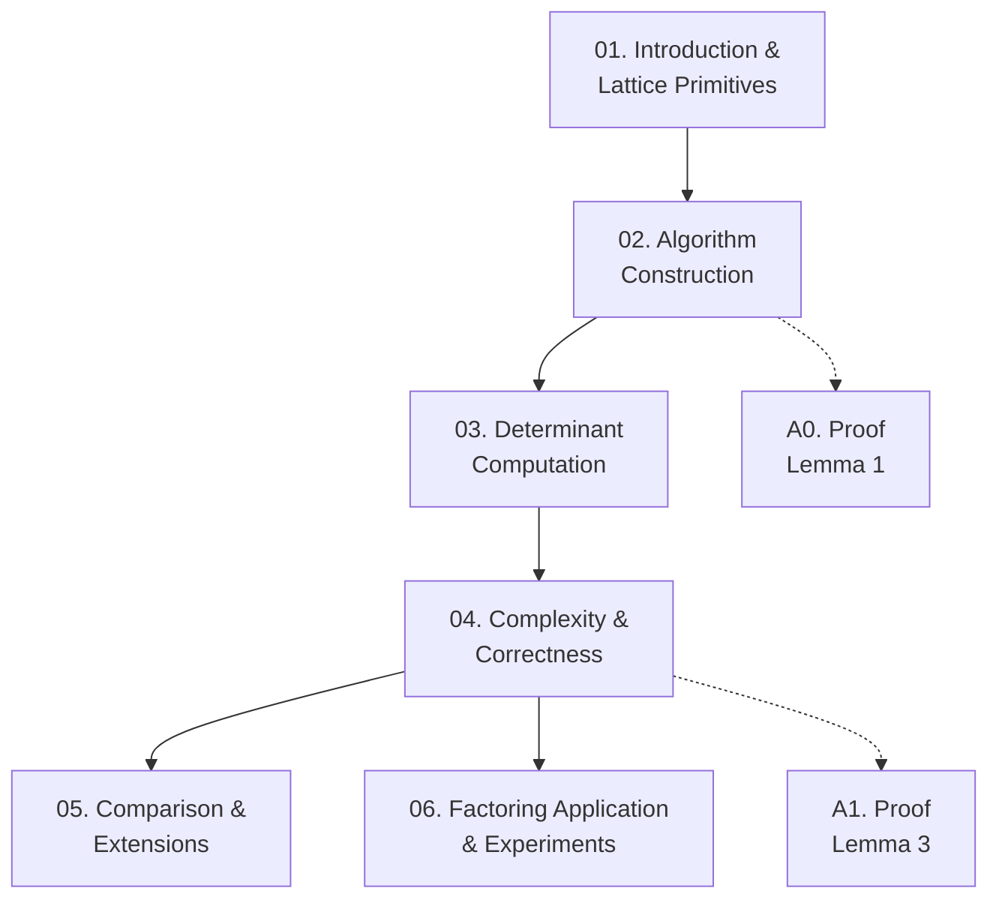

Paper của Coron (2007) trình bày thuật toán tìm nghiệm nhỏ của đa thức hai biến trên $\mathbb{Z}$ — đơn giản hơn Coppersmith gốc nhưng đạt cùng complexity polynomial $O(\log^{15} W)$. Course này cover toàn bộ paper: nền tảng lattice, construction thuật toán, phân tích determinant, chứng minh complexity, và ứng dụng tấn công RSA partial key exposure.

**Tài liệu gốc**: Finding Small Roots of Bivariate Integer Polynomial Equations — Coron, Eurocrypt 2007  
**Kiến thức nền tảng yêu cầu** (🔴 Prerequisites): Coppersmith univariate technique [Cop96a]; LLL algorithm cơ bản [LLL82]; RSA cryptosystem

---

## Lesson Overview

| # | Title | Type | Covers | File | Dependencies |
|---|-------|------|--------|------|-------------|
| 01 | Introduction & Lattice Primitives | Math Component | §1, §2 | [[01-introduction-and-lattice-primitives\|01. Introduction & Lattice Primitives]] | — |
| 02 | Algorithm Construction | Scheme | §3 (body) | [[02-algorithm-construction\|02. Algorithm Construction]] | 01 |
| 03 | Determinant Computation | Deep Dive | §3 (det analysis) | [[03-determinant-computation\|03. Determinant Computation]] | 02 |
| 04 | Complexity & Correctness | Scheme + Deep Dive | §3.1, Thm 2–3 | [[04-complexity-and-correctness\|04. Complexity & Correctness]] | 03 |
| 05 | Comparison & Extensions | Attack + Survey | §3.2, §3.3 | [[05-comparison-and-extensions\|05. Comparison & Extensions]] | 04 |
| 06 | Factoring Application & Experiments | Attack | §4, §5 | [[06-factoring-application-and-experiments\|06. Factoring Application]] | 04 |
| A0 | Proof of Lemma 1 | — | Appendix A | [[a0-proof-lemma1\|A0. Proof of Lemma 1]] | 02 |
| A1 | Proof of Lemma 3 | — | Appendix B | [[a1-proof-lemma3\|A1. Proof of Lemma 3]] | 03 |

---

## Coverage Map

| Section trong paper | Covered in |
|--------------------|-----------|
| §1 Introduction | 01 |
| §2 Preliminaries (lattice, LLL, L² algorithm) | 01 |
| §3 Our New Algorithm — polynomial sets, matrix S, n, L, L₂ | 02 |
| §3 — điều kiện HG (5), không phải bội của p, resultant | 02 |
| §3 — chuỗi biến đổi M'→M₆', det L' = n^ω, det L₂ | 03 |
| §3.1 Computing a Basis of L₂ (HNF, triangularization) | 04 |
| §3 — Lemma 3, condition (11), Theorem 2, Theorem 3 | 04 |
| §3.2 Difference with Algorithm in [9] | 05 |
| §3.3 Extension to more Variables | 05 |
| §4 Practical Experiments (Tables 1–2, Theorem 4) | 06 |
| §5 Conclusion | 06 |
| Appendix A — Proof of Lemma 1 | A0 |
| Appendix B — Proof of Lemma 3 | A1 |

---

## Dependency Graph

---

## Progress

- [ ] [[01-introduction-and-lattice-primitives\|01. Introduction & Lattice Primitives]]
- [ ] [[02-algorithm-construction\|02. Algorithm Construction]]
- [ ] [[03-determinant-computation\|03. Determinant Computation]]
- [ ] [[04-complexity-and-correctness\|04. Complexity & Correctness]]
- [ ] [[05-comparison-and-extensions\|05. Comparison & Extensions]]
- [ ] [[06-factoring-application-and-experiments\|06. Factoring Application & Experiments]]
- [ ] [[a0-proof-lemma1\|A0. Proof of Lemma 1]]
- [ ] [[a1-proof-lemma3\|A1. Proof of Lemma 3]]

---

## 🟡 Integrated References

| Ref Key | Dùng trong lesson | Nội dung tích hợp |
|---------|------------------|-------------------|
| [LLL82] | 01 | Theorem 1: LLL bound $\|b_1\| \le 2^{(\omega-1)/4}\det(L)^{1/\omega}$, complexity $O(\omega^5 n \log^3 B)$ |
| [HG97] | 01 | Lemma 2: small-norm polynomial vanishing mod $n$ → vanishing over $\mathbb{Z}$ |
| [Cop97] | 04, A1 | Cấu trúc proof Lemma 3 (diagonally dominant matrix argument) |
| [NS05] | 04 | L² algorithm: complexity $O(\omega^4 n(\omega + \log B)\log B)$, đưa ra bound $O(\log^{11} W)$ |
| [Cor04] | 05 | Phân tích tại sao [9] cần dimension $(δ+k)^2$ thay vì $\delta^2+2k\delta$, dẫn đến exponential gap |
| [HM91] | 04 | Triangularization: complexity $O(n^{3+\varepsilon} m \log^{1+\varepsilon} B)$ |

---

## Notes

- Lessons 02 và 03 cùng cover §3 nhưng tách biệt vì hai concerns hoàn toàn khác nhau: **02** là *làm gì* (xây dựng polynomial set, chọn $n$, định nghĩa $L_2$), **03** là *chứng minh* det $L_2$ có giá trị đúng.
- Lesson 04 là bản lề: kết hợp Lemma 3 (bound $|\det S|$) với bất đẳng thức (9) để chứng minh condition (11) — đây là điểm mà paper hoàn thành argument về correctness.
- Lesson 05 là phân tích **tại sao** paper này tốt hơn [9] — đây là contribution chính của paper theo góc nhìn novelty. Nên đọc song song với §3.2 gốc.
- Lesson 06 (Theorem 4 + Tables) có thể đọc sau 04 nếu chỉ quan tâm ứng dụng RSA.
