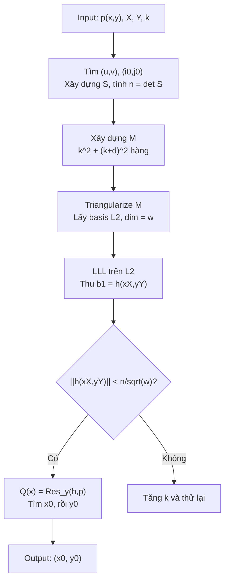

> **Prerequisites**: [[01-introduction-and-lattice-primitives|01. Introduction & Lattice Primitives]] — đặc biệt Theorem 1 (LLL), Lemma 1, Lemma 2 (Howgrave-Graham)  
> **Lesson type**: Scheme  
> **Covers**: §3 (phần xây dựng thuật toán: polynomial sets, chọn $n$, matrix $M$, sublattice $L_2$, điều kiện HG (5), resultant recovery)
>
> **Notation**:
> | Ký hiệu | Ý nghĩa | Ký hiệu trong paper |
> |---------|---------|---------------------|
> | $k$ | Tham số điều chỉnh kích thước lattice, $k > 0$ nguyên | $k$ |
> | $s_{a,b}(x,y)$ | $x^a y^b \cdot p(x,y)$, với $0 \le a,b < k$ | $s_{a,b}$ |
> | $r_{i,j}(x,y)$ | $x^i y^j \cdot n$, với $0 \le i,j < k+\delta$ | $r_{i,j}$ |
> | $S$ | Ma trận $k^2 \times k^2$: hệ số của $s_{a,b}$ trong $\{x^{i_0+i}y^{j_0+j}\}_{0\le i,j<k}$ | $S$ |
> | $(i_0, j_0)$ | Chỉ số tối ưu hóa $|\det S|$ (Lemma 3) | $(i_0, j_0)$ |
> | $n$ | $|\det S|$ — modulus được chọn tường minh | $n$ |
> | $M$ | Ma trận chữ nhật $(k^2 + (k+\delta)^2) \times (k+\delta)^2$ biểu diễn $L$ | $M$ |
> | $L$ | Lattice sinh bởi hệ số của $s_{a,b}(xX,yY)$ và $r_{i,j}(xX,yY)$ | $L$ |
> | $L_2$ | Sublattice của $L$ với chiều $\omega = \delta^2 + 2k\delta$ | $L_2$ |
> | $\omega$ | $\dim L_2 = (k+\delta)^2 - k^2 = \delta^2 + 2k\delta$ | $\omega$ |
> | $h(x,y)$ | Đa thức thu từ LLL trên $L_2$ — nghiệm shared với $p$ | $h(x,y)$ |
> | $Q(x)$ | $\text{Res}_y(h(x,y),\, p(x,y))$ — đa thức một biến có nghiệm $x_0$ | $Q(x)$ |

---

## 1. Tư Tưởng Chính: Chọn $n$ Tường Minh

Trong phiên bản [Cor04], người ta chọn $n$ là số nguyên **tùy ý** có kích thước phù hợp, với điều kiện $n$ coprime với hệ số hằng của $p(x,y)$. Điều này buộc phải làm việc trên **toàn bộ** lattice $L$ có chiều $(δ+k)^2$ — growing quadratically với $k$.

**Insight của paper này**: Nếu chọn $n = |\det S|$ với $S$ là một ma trận con được xây dựng tường minh từ hệ số của $p$, thì $k^2$ cột tương ứng với các monomial $x^{i_0+i}y^{j_0+j}$ ($0 \le i,j < k$) có thể **eliminate hoàn toàn** — lattice thu gọn từ chiều $(δ+k)^2$ xuống $\omega = \delta^2 + 2k\delta$.

Sự thu gọn này là chìa khóa: LLL fudge factor $2^{(\omega-1)/4} = 2^{O(k)}$ thay vì $2^{O(k^2)}$, loại bỏ nguồn gốc của exponential blowup trong [Cor04].

---

## 2. Hai Tập Đa Thức

Cho tham số $k > 0$ nguyên, xây dựng hai tập đa thức:

$$
s_{a,b}(x,y) = x^a \cdot y^b \cdot p(x,y), \quad 0 \le a, b < k \tag{1}
$$

$$
r_{i,j}(x,y) = x^i \cdot y^j \cdot n, \quad 0 \le i, j < k + \delta \tag{2}
$$

**Lý do xây dựng như vậy:**

- $s_{a,b}(x_0, y_0) = x_0^a y_0^b \cdot \underbrace{p(x_0,y_0)}_{=0} = 0$, nên $s_{a,b}(x_0, y_0) \equiv 0 \pmod{n}$ với mọi $a,b$.
- $r_{i,j}(x_0, y_0) = x_0^i y_0^j \cdot n \equiv 0 \pmod{n}$ với mọi $i,j$.

Do đó **mọi tổ hợp tuyến tính số nguyên** $h(x,y)$ của $\{s_{a,b}\}$ và $\{r_{i,j}\}$ đều thỏa $h(x_0, y_0) \equiv 0 \pmod{n}$. Từ Lemma 2 (HG), nếu thêm điều kiện $\|h(xX, yY)\| < n/\sqrt{\omega}$, thì $h(x_0, y_0) = 0$ trên $\mathbb{Z}$.

---

## 3. Chọn $(i_0, j_0)$ và $n = |\det S|$

Gọi $(u, v)$ là chỉ số mà $W = |p_{uv}| X^u Y^v$ đạt max. Chọn $(i_0, j_0)$ trong khoảng $0 \le i_0, j_0 \le \delta$ **maximize** lượng:

$$
8^{(i_0-u)^2+(j_0-v)^2} \cdot |p_{i_0 j_0}| X^{i_0} Y^{j_0}
$$

> [!tip] 💡 Agent note
> Cách chọn $(i_0,j_0)$ này có vẻ lạ nhưng sẽ được làm rõ trong Appendix B (Lemma 3): nó đảm bảo ma trận $S'$ (dạng chuẩn hóa của $S$) là **diagonally dominant**, từ đó bound được $|\det S|$ từ dưới. Factor $8^{(\cdot)}$ xuất phát từ việc bound các off-diagonal entries bằng geometric series $\sum_{(i,j)\ne(0,0)} 8^{-i^2-j^2} \le 3/4$.

**Xây dựng ma trận $S$**: Lấy các hệ số của $s_{a,b}(x,y)$ với $0 \le a,b < k$, **chỉ** trong các monomial $x^{i_0+i}y^{j_0+j}$ với $0 \le i,j < k$.

- Có $k^2$ đa thức $s_{a,b}$ và $k^2$ monomial $\to$ $S$ là **ma trận vuông** $k^2 \times k^2$.
- Phần tử $S_{\mu(a,b),\,\mu(i,j)} = p_{i_0+i-a,\;j_0+j-b}$ (với $\mu(a,b) = ka+b$).

$$
n := |\det S|
$$

> [!example] Ví dụ (Figure 1 trong paper)
> Với $p(x,y) = axy + bx + cy + d$, $k = 2$, $(i_0, j_0) = (1,1)$:
>
> $$
> S = \begin{pmatrix} a & b & c & d \\ a & & & c \\ a & b & & \\ & & a & \end{pmatrix}
> \quad \text{(trên các monomial } x^2y^2,\; x^2y,\; xy^2,\; xy\text{)}
> $$
>
> *(Dạng đầy đủ trong paper: $s_{1,1}$ cho hàng 1, $s_{1,0}$ hàng 2, $s_{0,1}$ hàng 3, $s_{0,0}$ hàng 4.)*  
> Kết quả: $n = |\det S| = a^4$.

**Tại sao $S$ khả nghịch?** Lemma 3 (chứng minh trong [[a1-proof-lemma3|A1]]) sẽ chứng minh $|\det S| > 0$ với lựa chọn $(i_0,j_0)$ tối ưu như trên. Điều này thiết yếu: $n > 0$ là điều kiện cần để mọi thứ hoạt động.

---

## 4. Lattice $L$ và Sublattice $L_2$

**Xây dựng ma trận $M$**: Lấy hệ số của tất cả $s_{a,b}(xX, yY)$ và $r_{i,j}(xX, yY)$ — các đa thức sau khi **rescale** biến: $x \mapsto xX$, $y \mapsto yY$.

- Tổng số đa thức: $k^2$ (từ $s_{a,b}$) + $(k+\delta)^2$ (từ $r_{i,j}$) = $k^2 + (k+\delta)^2$ hàng.
- Các đa thức này có bậc tối đa $\delta + k - 1$ trong mỗi biến, chứa nhiều nhất $(k+\delta)^2$ monomial.
- $M$ là ma trận **chữ nhật**: $[k^2 + (k+\delta)^2] \times (k+\delta)^2$.

> [!example] Ví dụ (Figure 2 trong paper) — $p(x,y) = axy + bx + cy + d$, $k=2$, $(i_0,j_0)=(1,1)$
>
> Cột được đánh nhãn bởi 9 monomial: $x^2y^2,\; x^2y,\; xy^2,\; xy,\; x^2,\; y^2,\; x,\; y,\; 1$.
>
> Các hàng từ $s_{a,b}(xX,yY)$ chiếm 4 hàng đầu (block trái — cột $x^2y^2, x^2y, xy^2, xy$).  
> Các hàng từ $r_{i,j}(xX,yY)$ chiếm 9 hàng dưới (đường chéo — mỗi monomial có hệ số $nX^iY^j$).

**Sublattice $L_2$**: Giữ nguyên lattice $L$ nhưng **set về 0** tất cả các hệ số tương ứng với monomial $x^{i_0+i}y^{j_0+j}$ với $0 \le i,j < k$ (tức là $k^2$ cột của block bên trái trong ma trận $M$).

Chiều của $L_2$:

$$
\omega = (k+\delta)^2 - k^2 = \delta^2 + 2k\delta \tag{3}
$$

> [!tip] 💡 Agent note
> Về mặt hình học, $L_2$ là projection của $L$ lên subspace tương ứng với $\omega$ monomial **còn lại** (không trong block $S$). Cơ sở của $L_2$ thu được bằng cách triangularize ma trận $M$ và lấy submatrix $\omega \times \omega$ tương ứng (Figure 3 trong paper).

Cơ sở của $L_2$ gồm $\omega$ đa thức $q_0, \ldots, q_{\omega-1}$ (Figure 3 trong paper) — hệ số chỉ trong $\omega$ monomial còn lại $\{x^iy^j : 0 \le i,j < k+\delta, \text{ không phải } x^{i_0+i}y^{j_0+j}\}$.

> [!example] Ví dụ (Figure 3 trong paper) — $\omega = 5$ với $\delta=1$, $k=2$
>
> Sau khi triangularize, 5 đa thức $q_0,\ldots,q_4$ có hệ số chỉ trong các monomial $x^2, y^2, x, y, 1$ (5 cột phải trong Figure 3). LLL được áp dụng trên lattice 5 chiều này.

---

## 5. Thuật Toán Đầy Đủ

> [!note] Scheme 2.1 — CoronBivariateRoots (Coron 2007)
> **Type**: Root-finding algorithm for bivariate integer polynomials  
> **Setting**: $p(x,y) \in \mathbb{Z}[x,y]$ bậc tối đa $\delta$ trong mỗi biến, irreducible; bounds $X, Y$; tham số $k > 0$.
>
> **$\mathsf{Setup}(p, X, Y, k)$**
> - Input: $p(x,y)$, $X$, $Y$, $k$
> - Tính $W = \max_{i,j} |p_{i,j}| X^i Y^j$; ghi lại $(u,v)$ thỏa $W = |p_{uv}|X^uY^v$
> - Chọn $(i_0, j_0)$ maximize $8^{(i-u)^2+(j-v)^2}|p_{ij}|X^iY^j$
> - Xây dựng $S$: ma trận $k^2 \times k^2$, $S_{\mu(a,b),\mu(i,j)} = p_{i_0+i-a,j_0+j-b}$
> - Tính $n = |\det S|$
> - Output: $(n,\; i_0,\; j_0)$
>
> **$\mathsf{BuildLattice}(p, X, Y, k, n, i_0, j_0)$**
> - Input: các tham số trên
> - Xây dựng $s_{a,b}(x,y) = x^a y^b p(x,y)$ cho $0 \le a,b < k$
> - Xây dựng $r_{i,j}(x,y) = x^i y^j n$ cho $0 \le i,j < k+\delta$
> - Lập ma trận $M$: hệ số của $s_{a,b}(xX,yY)$ và $r_{i,j}(xX,yY)$, kích thước $[k^2+(k+\delta)^2] \times (k+\delta)^2$
> - Triangularize $M$ để thu cơ sở của $L_2$ (chiều $\omega = \delta^2 + 2k\delta$)
> - Output: cơ sở của $L_2$
>
> **$\mathsf{Reduce}(L_2)$**
> - Input: cơ sở của $L_2$
> - Chạy LLL (hoặc L²) trên $L_2$
> - Output: vector ngắn nhất $b_1$ tương ứng với đa thức $h(xX, yY)$
>
> **$\mathsf{Recover}(p, h, X, Y)$**
> - Input: $p(x,y)$, $h(x,y)$ thu từ $b_1$, $X$, $Y$
> - Kiểm tra điều kiện HG: $\|h(xX,yY)\| < n/\sqrt{\omega}$
> - Nếu thỏa: tính $Q(x) = \text{Res}_y(h(x,y),\; p(x,y))$
> - Tìm tất cả nghiệm nguyên $x_0$ của $Q(x)$ với $|x_0| \le X$
> - Với mỗi $x_0$: giải $p(x_0, y) = 0$ tìm $y_0$ với $|y_0| \le Y$
> - Output: $(x_0, y_0)$

---

## 6. Điều Kiện Howgrave-Graham và Condition (5)

Sau khi LLL cho ra $b_1$ với $\|b_1\| \le 2^{(\omega-1)/4} \det(L_2)^{1/\omega}$, điều kiện để Lemma 2 áp dụng là:

$$
2^{(\omega-1)/4} \cdot \det(L_2)^{1/\omega} \le \frac{n}{\sqrt{\omega}} \tag{5}
$$

Điều kiện này được phân tích đầy đủ trong [[03-determinant-computation|Lesson 03]] (tính $\det L_2$) và [[04-complexity-and-correctness|Lesson 04]] (đưa về điều kiện trên $XY$). Kết quả cuối: (5) thỏa khi $XY < W^{2/(3\delta) - 1/k} \cdot 2^{-9\delta}$.

---

## 7. Tại Sao $h(x,y)$ Không Phải Bội của $p(x,y)$?

Đây là bước **thiết yếu** để resultant $Q(x)$ không tầm thường. Ta cần chứng minh $h$ và $p$ algebraically independent (dưới giả thiết $p$ irreducible).

> [!abstract] Claim — $h(x,y)$ không phải bội của $p(x,y)$
> Nếu $h(x,y) \in L_2$ (tức là $h$ không có hệ số trong các monomial $x^{i_0+i}y^{j_0+j}$), thì $h$ không thể là bội của $p$.

**Proof.** Giả sử ngược lại $h(x,y) = p(x,y) \cdot q(x,y)$ cho một $q \in \mathbb{Z}[x,y]$ nào đó. Vì $h \in L$, vector hàng của hệ số $h$ là tổ hợp tuyến tính (số nguyên) của hàng của $M$. Phần đóng góp từ $r_{i,j}$ tạo ra bội của $n$ trong mỗi hệ số — không liên quan đến các monomial của $S$. Do đó vector hệ số của $h$ trong các monomial $\{x^{i_0+i}y^{j_0+j}\}_{0\le i,j<k}$ phải là tổ hợp số nguyên của **hàng của $S$**.
>
> Nhưng $h \in L_2$ có nghĩa là hệ số của $h$ trong các monomial $x^{i_0+i}y^{j_0+j}$ đều bằng 0 — tức là **tổ hợp tuyến tính của hàng $S$ bằng 0 với hệ số không tất cả bằng 0**. Điều này mâu thuẫn với $S$ **khả nghịch** (vì $\det S = n \ne 0$). $\blacksquare$

**Kết luận**: $p(x,y)$ irreducible + $h$ không phải bội của $p$ $\Rightarrow$ $p$ và $h$ **algebraically independent** (không có nhân tử chung không tầm thường). Khi đó:

$$
Q(x) = \text{Res}_y(h(x,y),\; p(x,y)) \ne 0
$$

và $Q(x_0) = 0$ (vì $(x_0, y_0)$ là nghiệm chung). Dùng thuật toán tìm nghiệm đa thức nguyên (ví dụ factoring over $\mathbb{Z}$) để tìm $x_0$, sau đó giải $p(x_0, y) = 0$ tìm $y_0$.

---

## 8. Tổng Kết Construction

Sơ đồ toàn bộ thuật toán:

Ba điểm cần verify trong các lesson tiếp theo:

1. **$\det L_2$** có giá trị đúng — Lesson 03.
2. **Điều kiện (5)** được thỏa khi $XY < W^{2/(3\delta)-1/k}$ — Lesson 04.
3. **Complexity** của toàn thuật toán là $O(\delta^6 k^{12} \log^3 W)$ — Lesson 04.

---

## References

- [Cop97] Coppersmith — *Small Solutions to Polynomial Equations*, J. Cryptology 10(4), 1997
- [Cor04] Coron — *Finding Small Roots of Bivariate Polynomial Equations Revisited*, Eurocrypt 2004
- [HG97] Howgrave-Graham — *Finding Small Roots of Univariate Modular Equations Revisited*, 1997 (🟡 Integrated — Lemma 2)
