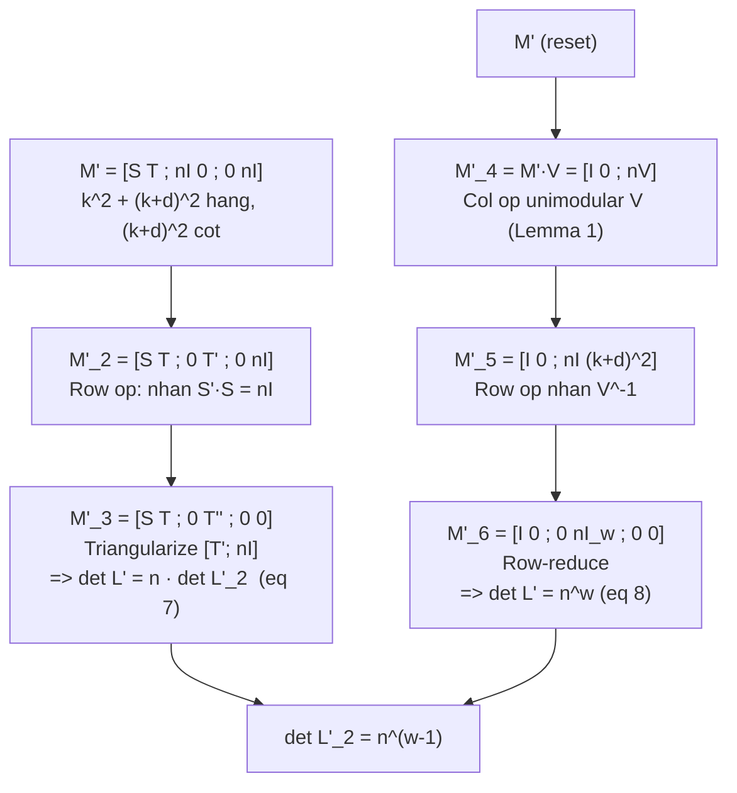

> **Prerequisites**: [[02-algorithm-construction|02. Algorithm Construction]] — đặc biệt định nghĩa $S$, $M$, $L_2$, $\omega$; [[01-introduction-and-lattice-primitives|01. Lemma 1]] (column ops preserve det)  
> **Lesson type**: Deep Dive  
> **Covers**: §3 (phần tính $\det L_2$): chuỗi biến đổi $M' \to M_6'$; chứng minh $\det L' = n^\omega$; suy ra $\det L_2' = n^{\omega-1}$; tính $\det L_2$ đầy đủ với nhân tử $X^i Y^j$
>
> **Notation**:
> | Ký hiệu | Ý nghĩa | Ký hiệu trong paper |
> |---------|---------|---------------------|
> | $M'$ | Ma trận $M$ nhưng không rescale biến ($s_{a,b}(x,y)$ thay vì $s_{a,b}(xX,yY)$) | $M'$ |
> | $L'$ | Lattice sinh bởi hàng của $M'$ (ứng với $L$ không có lũy thừa $X^iY^j$) | $L'$ |
> | $L_2'$ | Sublattice của $L'$ tương ứng với $L_2$ | $L_2'$ |
> | $T$ | Ma trận $k^2 \times \omega$: phần còn lại của hàng $s_{a,b}$ trong $M'$ sau khi tách block $S$ | $T$ |
> | $S'$ | Ma trận adjoint của $S$: $S' \cdot S = (\det S) I_{k^2} = n \cdot I_{k^2}$ | $S'$ |
> | $T'$ | $-S' \cdot T$ — kết quả row-reduce $M_2'$ | $T'$ |
> | $T''$ | Ma trận $\omega \times \omega$ — row basis của $L_2'$ (thu từ triangularization) | $T''$ |
> | $V$ | Ma trận unimodular $(k+\delta)^2 \times (k+\delta)^2$: column ops đưa block trái thành $I_{k^2}$ | $V$ |
> | $I_m$ | Ma trận đơn vị $m \times m$ | $I_m$ |

---

## 1. Chiến Lược: Tách Det $L_2$ qua Det $L$

Việc tính trực tiếp $\det L_2$ từ $M$ là khó vì $M$ chứa cả block $s_{a,b}$ (liên quan đến hệ số $p$) lẫn block $r_{i,j}$ (chỉ có $n$). Thay vào đó, paper dùng chuỗi biến đổi ma trận để tính **hai đại lượng riêng biệt**:

1. $\det L' = n^\omega$ — bằng cách thao tác trực tiếp trên $M'$.
2. Quan hệ $\det L' = n \cdot \det L_2'$ — bằng cách tách block $S$.

Kết hợp: $\det L_2' = n^{\omega-1}$. Cuối cùng, từ $L_2'$ về $L_2$ bằng cách nhân các cột với $X^iY^j$.

---

## 2. Ma Trận $M'$: Loại Bỏ Lũy Thừa $X^iY^j$

Định nghĩa $M'$ là ma trận giống $M$ nhưng **không rescale**: hệ số của $s_{a,b}(x,y)$ và $r_{i,j}(x,y)$ thay vì $s_{a,b}(xX,yY)$ và $r_{i,j}(xX,yY)$.

Ma trận $M'$ có $k^2 + (k+\delta)^2$ hàng và $(k+\delta)^2$ cột. Đặt các cột ứng với monomial $x^{i_0+i}y^{j_0+j}$ ($0 \le i,j < k$) — tức là $k^2$ cột của block $S$ — sang **bên trái**. $M'$ có dạng block:

$$
M' = \begin{pmatrix} S & T \\ n I_{k^2} & 0 \\ 0 & n I_\omega \end{pmatrix} \tag{*}
$$

trong đó:
- $S$ là ma trận $k^2 \times k^2$ đã định nghĩa, $\det S = \pm n$.
- $T$ là ma trận $k^2 \times \omega$: phần còn lại của hệ số $s_{a,b}$ trong $\omega$ monomial không thuộc block $S$.
- $n I_{k^2}$: block từ $r_{i,j}$ tương ứng với monomial trong block $S$ (mỗi $r_{i_0+i, j_0+j}(x,y) = x^{i_0+i}y^{j_0+j}n$ đóng góp $n$ vào đúng một vị trí).
- $n I_\omega$: block từ $r_{i,j}$ tương ứng với $\omega$ monomial còn lại.

---

## 3. Tách Block $S$: Thu $\det L' = n \cdot \det L_2'$

Vì $\det S = \pm n \ne 0$, ma trận $S$ khả nghịch trên $\mathbb{Q}$. Tuy nhiên ta muốn làm việc trên **số nguyên**. Dùng ma trận **adjoint (comatrix)** $S'$:

$$
S' \cdot S = (\det S) I_{k^2} = \pm n \cdot I_{k^2}
$$

(Với dấu phù hợp, ta có $S' \cdot S = n I_{k^2}$.) $S'$ là ma trận nguyên — các phần tử của nó là minor có dấu của $S$.

**Row operation**: Nhân từ trái bởi ma trận block:

$$
\begin{pmatrix} I_{k^2} & 0 & 0 \\ -S' & I_{k^2} & 0 \\ 0 & 0 & I_\omega \end{pmatrix}
$$

Áp dụng lên $M'$, ta thu:

$$
M_2' = \begin{pmatrix} S & T \\ -S' \cdot S + n I_{k^2} & -S' \cdot T \\ 0 & n I_\omega \end{pmatrix} = \begin{pmatrix} S & T \\ 0 & T' \\ 0 & n I_\omega \end{pmatrix} \tag{6}
$$

trong đó $T' = -S' \cdot T$ là ma trận $k^2 \times \omega$. (Bước $-S' \cdot S + n I_{k^2} = -n I_{k^2} + n I_{k^2} = 0$.)

**Row operation tiếp theo**: Triangularize phần $\begin{pmatrix} T' \\ n I_\omega \end{pmatrix}$ để thu ma trận $T''$ là $\omega \times \omega$ row basis của $L_2'$:

$$
M_3' = \begin{pmatrix} S & T \\ 0 & T'' \\ 0 & 0 \end{pmatrix}
$$

Từ cấu trúc block tam giác trên:

$$
\det L' = \left|\det \begin{pmatrix} S & T \\ 0 & T'' \end{pmatrix}\right| = |\det S| \cdot |\det T''| = n \cdot \det L_2' \tag{7}
$$

---

## 4. Tính Trực Tiếp $\det L'$: Bốn Bước Biến Đổi

Để tính $\det L'$ ta khai thác một tính chất quan trọng: $p(x,y)$ **irreducible** over $\mathbb{Z}$, tức gcd của tất cả hệ số $p_{ij}$ bằng 1. Điều này cho phép column operation đưa block góc trái trên về $I_{k^2}$.

**Bước 1 — Column operations trên $M'$** (dùng Lemma 1 — không thay đổi $\det L'$):

Vì $\gcd(\{p_{ij}\}) = 1$, tồn tại ma trận unimodular $V$ kích thước $(k+\delta)^2 \times (k+\delta)^2$ sao cho:

$$
M_4' = M' \cdot V = \begin{pmatrix} I_{k^2} & 0 \\ n \cdot V \end{pmatrix}
$$

(Block trên trái của $M' \cdot V$ là $I_{k^2}$ và block trên phải là $0$.)

> [!tip] 💡 Agent note
> Tại sao $\gcd(\{p_{ij}\}) = 1$ đủ để làm điều này? Đây là tính chất của module free: các cột của block $[S \mid T]$ sinh ra $\mathbb{Z}^{k^2}$ (vì $\gcd$ hệ số = 1), nên có $V$ unimodular mà column-reduces block này về $[I_{k^2} \mid 0]$. Đây là ứng dụng của Smith Normal Form / Hermite Normal Form cho block con.

**Bước 2 — Row operation dựa trên $V^{-1}$**:

$$
M_5' = \begin{pmatrix} I_{k^2} & 0 \\ 0 & V^{-1} \end{pmatrix} \cdot M_4' = \begin{pmatrix} I_{k^2} & 0 \\ n I_{(k+\delta)^2} \end{pmatrix} = \begin{pmatrix} I_{k^2} & 0 \\ n I_{k^2} & 0 \\ 0 & n I_\omega \end{pmatrix}
$$

(Block $nV$ sau khi nhân phải $V^{-1}$ từ trái cho $nV \cdot V^{-1} = nI$... nhưng thực ra: $V^{-1} \cdot (nV)$ — block $nV$ ở **dưới**, row-multiply bởi $V^{-1}$ từ trái cho $n I_{(k+\delta)^2}$.)

**Bước 3 — Row-reduce block $nI_{k^2}$ về $0$**:

$$
M_6' = U' \cdot M_5' = \begin{pmatrix} I_{k^2} & 0 \\ 0 & n I_\omega \\ 0 & 0 \end{pmatrix}
$$

**Bước 4 — Đọc determinant**:

$$
\det L' = \det \begin{pmatrix} I_{k^2} & 0 \\ 0 & n I_\omega \end{pmatrix} = 1^{k^2} \cdot n^\omega = n^\omega \tag{8}
$$

---

## 5. Kết Quả Chính: $\det L_2' = n^{\omega-1}$

Kết hợp phương trình (7) và (8):

$$
n^\omega = \det L' = n \cdot \det L_2' \implies \det L_2' = n^{\omega - 1}
$$

> [!abstract] Proposition 3.1 — Determinant của $L_2'$
> Với $n = |\det S|$ và $\omega = \delta^2 + 2k\delta$:
>
> $$
> \det L_2' = n^{\omega - 1}
> $$

Đây là kết quả chính của §3 trong paper. Tính elegant của nó nằm ở chỗ: dù $n = |\det S|$ phụ thuộc vào hệ số của $p$, **determinant của $L_2'$** có dạng cực kỳ đơn giản — chỉ là lũy thừa của $n$.

---

## 6. Từ $L_2'$ về $L_2$: Nhân Tử $X^iY^j$

$L_2$ và $L_2'$ khác nhau ở chỗ: các cột của $L_2$ ứng với monomial $x^iy^j$ được nhân thêm hệ số $X^iY^j$ (do rescaling $x \mapsto xX$, $y \mapsto yY$). Do đó:

$$
\det L_2 = \det L_2' \cdot \frac{\displaystyle\prod_{\substack{0 \le i,j < k+\delta}} X^i Y^j}{\displaystyle\prod_{\substack{0 \le i,j < k}} X^{i_0+i} Y^{j_0+j}}
$$

Tính tử số: $\prod_{0 \le i,j < k+\delta} X^i Y^j = (XY)^{\sum_{i,j} i + \sum_{i,j} j}$. Với $0 \le i,j < k+\delta$:

$$
\sum_{i=0}^{k+\delta-1}\sum_{j=0}^{k+\delta-1} i = (k+\delta)^2 \cdot \frac{(k+\delta-1)}{2} = \frac{(k+\delta-1)(k+\delta)^2}{2}
$$

Tương tự cho $j$. Tử số $= (XY)^{(k+\delta-1)(k+\delta)^2/2}$.

Mẫu số: $\prod_{0\le i,j<k} X^{i_0+i}Y^{j_0+j} = (X^{i_0}Y^{j_0})^{k^2} \cdot \prod_{0\le i,j<k} X^iY^j = (X^{i_0}Y^{j_0})^{k^2} \cdot (XY)^{(k-1)k^2/2}$.

Tổng hợp:

$$
\boxed{\det L_2 = n^{\omega-1} \cdot \frac{(XY)^{(k+\delta-1)(k+\delta)^2/2\;-\;(k-1)k^2/2}}{(X^{i_0}Y^{j_0})^{k^2}}}
$$

---

## 7. Công Thức $\det L_2$ trong Điều Kiện HG

Từ điều kiện (5): $2^{(\omega-1)/4} \cdot \det(L_2)^{1/\omega} \le n/\sqrt{\omega}$, thay $\det L_2$:

$$
2^{\omega(\omega-1)/4} \cdot \frac{(XY)^{(k+\delta-1)(k+\delta)^2/2\;-\;(k-1)k^2/2}}{(X^{i_0}Y^{j_0})^{k^2}} \le \frac{n^{\omega/2}}{\omega^{\omega/2}} \tag{9}
$$

Bất đẳng thức (9) là điều kiện cần để thuật toán hoạt động. Lesson 04 sẽ:
1. Dùng **Lemma 3** để bound $n = |\det S|$ từ dưới theo $W/(X^{i_0}Y^{j_0})$.
2. Rút gọn (9) về điều kiện đơn giản trên $XY$ và $W$.

---

## 8. Tóm Tắt Chuỗi Biến Đổi

---

## References

- Coron 2007 — §3 (equations (6), (7), (8) và công thức $\det L_2$)
- [[01-introduction-and-lattice-primitives|01. Lemma 1]] — column ops preserve lattice det
- [[a0-proof-lemma1|A0. Proof of Lemma 1]] — full proof của Lemma 1
