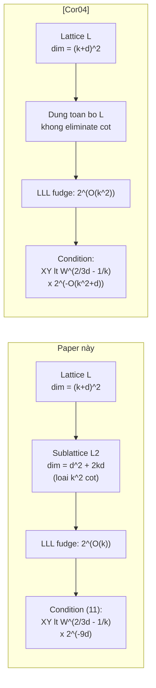

> **Prerequisites**: [[04-complexity-and-correctness|04. Complexity & Correctness]] — đặc biệt complexity analysis và condition (11)  
> **Lesson type**: Survey + Attack Analysis  
> **Covers**: §3.2 (so sánh chi tiết với [Cor04]); §3.3 (extension to more variables)
>
> **Notation**:
> | Ký hiệu | Ý nghĩa |
> |---------|---------|
> | $d_L$ | Chiều lattice đầy đủ trong [Cor04]: $d_L = (δ+k)^2$ |
> | $\omega$ | Chiều sublattice $L_2$ trong paper này: $\omega = \delta^2 + 2k\delta$ |
> | $p(x,y,z)$ | Đa thức ba biến (§3.3 extension) |
> | $m$ | Tham số thay cho $k$ trong extension ba biến |

---

## 1. §3.2 — Tại Sao [Cor04] Bị Sub-Exponential?

> [!info] 🟡 Tích hợp từ [Cor04]: Coron — *Finding Small Roots of Bivariate Polynomial Equations Revisited*, Eurocrypt 2004
>
> [Cor04] xây dựng tập đa thức $s_{a,b}$ và $r_{i,j}$ tương tự paper này, nhưng chọn $n$ là một số nguyên **tùy ý** coprime với hệ số hằng $p_{00}$ của $p(x,y)$. Điều kiện coprimality đảm bảo $L$ full rank, nhưng không cho phép eliminate bất kỳ cột nào.

**Hệ quả của việc chọn $n$ arbitrary:**

Trong [Cor04], không có lý do gì để set $k^2$ cột về 0 — không có ma trận $S$ khả nghịch nào được xây dựng. Do đó LLL phải chạy trên **lattice đầy đủ** $L$ chiều:

$$
d_L = (k+\delta)^2
$$

so với sublattice $L_2$ của paper này chiều:

$$
\omega = \delta^2 + 2k\delta = (k+\delta)^2 - k^2
$$

Sự khác biệt: $d_L - \omega = k^2$ cột bị loại bỏ trong paper này nhờ chọn $n = |\det S|$.

**Tác động lên LLL fudge factor:**

| | Paper này | [Cor04] |
|--|-----------|---------|
| Chiều lattice | $\omega = \delta^2 + 2k\delta$ | $d_L = (k+\delta)^2$ |
| LLL fudge factor | $2^{(\omega-1)/4} = 2^{O(k)}$ | $2^{(d_L-1)/4} = 2^{O(k^2)}$ |
| Điều kiện đủ | $XY < W^{2/(3\delta)-1/k} \cdot 2^{-9\delta}$ | $XY < W^{2/(3\delta)-1/k} \cdot 2^{-O(k^2+\delta)}$ |

> [!warning] Nguồn gốc của exponential blowup trong [Cor04]
> Điều kiện đủ trong [Cor04] chứa $2^{-O(k^2+\delta)}$ thay vì $2^{-9\delta}$. Để đạt $XY < W^{2/(3\delta)}$, cần $k \to \infty$ sao cho $1/k \to 0$, đồng thời $2^{-O(k^2)} \to 0$. Trade-off này buộc phải dùng $k \sim O(\log^{1/3} W)$ (điểm tối ưu giữa hai yêu cầu mâu thuẫn), dẫn đến exhaustive search trên:
>
> $$
> O\!\left(\frac{\log W}{k} + k^2\right) \approx O(\log^{2/3} W) \text{ bits}
> $$
>
> Tổng complexity: $\exp\!\left(O(\log^{2/3} W)\right)$ — **sub-exponential**, không phải polynomial.

**Trong paper này**, vì fudge factor chỉ là $2^{O(k)}$, cần exhaustive search trên $O(\delta)$ bits (không phụ thuộc $k$). Với $k = \lfloor \log W \rfloor$, search space là $2^\delta$ — polynomial trong $2^\delta$ và $\log W$.

---

## 2. So Sánh Trực Quan: Hình Học Lattice

---

## 3. §3.3 — Extension to Three Variables (Heuristic)

Paper mở rộng thuật toán cho ba biến. Tuy nhiên, như Coppersmith đã ghi chú [Cop01], extension đa biến chỉ có thể **heuristic** — không có guarantee về algebraic independence của các đa thức thu được.

**Setup**: Cho $p(x,y,z) \in \mathbb{Z}[x,y,z]$ bậc $\delta$ độc lập trong từng biến, nghiệm $(x_0,y_0,z_0)$ với $|x_0|\le X$, $|y_0|\le Y$, $|z_0|\le Z$.

**Construction tương tự**:

1. Chọn $(i_0,j_0,k_0)$ maximize $X^i Y^j Z^k |p_{ijk}|$.
2. Xây dựng $S$: ma trận $m^3 \times m^3$ từ hệ số của $s_{abc}(x,y,z) = x^ay^bz^cp(x,y,z)$ ($0 \le a,b,c < m$) trong monomial $x^{i_0+i}y^{j_0+j}z^{k_0+k}$ ($0 \le i,j,k < m$).
3. Đặt $n = |\det S|$.
4. Thêm $r_{ijk}(x,y,z) = x^iy^jz^kn$ ($0 \le i,j,k < \delta+m$).
5. Xây dựng lattice $L$ và sublattice $L_2$ (dimension $\omega = (\delta+m)^3 - m^3$).
6. Chứng minh (tương tự): $\det L_2' = n^{\omega-1}$.

**Vấn đề cơ bản**: LLL trả về hai vector $b_1, b_2$ tương ứng với $h_1(x,y,z)$ và $h_2(x,y,z)$. Ta cần:
- $h_1(x_0,y_0,z_0) = 0$ trên $\mathbb{Z}$, $h_1 \nmid p$. ✓ (đảm bảo được)
- $h_2(x_0,y_0,z_0) = 0$ trên $\mathbb{Z}$, $h_2 \nmid p$. ✓ (đảm bảo được bằng cách bound norm $b_2$)
- **$h_1, h_2, p$ algebraically independent** (để resultant có nghĩa). ✗ (không thể đảm bảo)

> [!warning] Tại sao chỉ heuristic với $\ge 3$ biến?
> Với hai biến, $h(x,y) \nmid p(x,y)$ **tự động** dẫn đến algebraic independence vì cả hai là đa thức hai biến và $p$ irreducible. Với ba biến, $h_1 \nmid p$ và $h_2 \nmid p$ **không đủ** — hai đa thức có thể vẫn phụ thuộc đại số qua một quan hệ ẩn. Không có điều kiện đơn giản nào đảm bảo independence trong trường hợp tổng quát.

**Khi giả sử heuristically** $h_1, h_2, p$ algebraically independent: tính resultant $\text{Res}_z(h_1, h_2)$ và $\text{Res}_z(h_2, p)$ để ra hai đa thức trong $(x,y)$, rồi tiếp tục lấy resultant theo $y$ để thu $f(x)$ với $f(x_0) = 0$.

> [!tip] 💡 Agent note
> Thực nghiệm cho thấy extension ba biến hoạt động tốt trong nhiều ứng dụng cụ thể (RSA partial key exposure với nhiều biến ẩn), nhưng không có upper bound lý thuyết cho xác suất thất bại. Đây là pattern chung trong hầu hết các ứng dụng Coppersmith đa biến trong văn liệu — kết quả heuristic được accept vì thực nghiệm nhất quán.

---

## 4. Bảng So Sánh Tổng Hợp

| Thuật toán | Chiều lattice | Điều kiện đủ | Complexity tại ngưỡng | Guarantee |
|-----------|--------------|-------------|----------------------|-----------|
| Coppersmith [Cop97] | Phức tạp (hyperplane method) | $XY < W^{2/(3\delta)}$ | Polynomial | ✓ Rigorous |
| Coron [Cor04] | $(k+\delta)^2$ | $XY < W^{2/(3\delta)-\varepsilon}$ | $\exp(O(\log^{2/3}W))$ | ✓ Rigorous |
| **Paper này** | $\delta^2 + 2k\delta$ | $XY < W^{2/(3\delta)}$ | $O(\log^{15}W)$ | ✓ Rigorous |
| Extension 3 biến | $(\delta+m)^3-m^3$ | $XYZ$ tương tự | Polynomial (heuristic) | ✗ Heuristic |

---

## Summary

- [Cor04] bị sub-exponential vì LLL fudge factor là $2^{O(k^2)}$ (do chiều $(k+\delta)^2$) thay vì $2^{O(k)}$ (chiều $\delta^2+2k\delta$).
- Sự thu gọn $k^2$ chiều trong paper này là **trực tiếp** từ việc chọn $n = |\det S|$ → $S$ khả nghịch → eliminate block trái.
- Extension ba biến có construction hoàn toàn tương tự nhưng chỉ heuristic vì algebraic independence không được đảm bảo.

---

## References

- [Cor04] Coron — *Finding Small Roots of Bivariate Polynomial Equations Revisited*, Eurocrypt 2004 (🟡 Integrated)
- [Cop97] Coppersmith — *Small Solutions to Polynomial Equations*, J. Cryptology 1997
- [Cop01] Coppersmith — *Finding Small Solutions to Small Degree Polynomials*, CALC 2001
