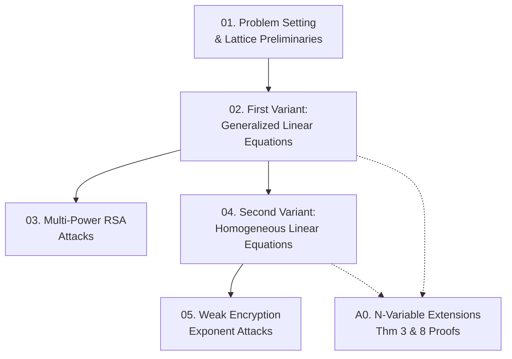

Paper của Lu, Zhang, Lin tổng quát hóa kỹ thuật Herrmann–May (Asiacrypt'08) để giải hai lớp phương trình tuyến tính modulo ước số ẩn $p^v$, và áp dụng vào tấn công RSA multi-power $N = p^r q$ cùng weak encryption exponents, thu được các kết quả tốt nhất hiện tại. Course này cover toàn bộ paper theo thứ tự từ nền tảng lattice đến các attack và thực nghiệm.

**Tài liệu gốc**: New Results on Solving Linear Equations Modulo Unknown Divisors and its Applications — Lu, Zhang, Lin  
**Kiến thức nền tảng yêu cầu** (🔴 Prerequisite references): Coppersmith method [3], LLL algorithm [10], RSA cơ bản, modular arithmetic

---

## Lesson Overview

| # | Title | Type | Covers (sections) | File | Dependencies |
|---|-------|------|-------------------|------|-------------|
| 01 | Problem Setting & Lattice Preliminaries | Foundation | §1, §1.1, §2 | [[01-problem-setting-lattice-preliminaries\|01. Problem Setting & Lattice Preliminaries]] | — |
| 02 | First Variant: Generalized Linear Equations | Math Component | §3, §3.1 (Thm 1, 2, 3) | [[02-first-variant-generalized-linear-equations\|02. First Variant: Generalized Linear Equations]] | 01 |
| 03 | Multi-Power RSA Attacks | Attack | §3.2, §3.3 (Thm 4, 5, 6, Table 1, 2) | [[03-multi-power-rsa-attacks\|03. Multi-Power RSA Attacks]] | 02 |
| 04 | Second Variant: Homogeneous Linear Equations | Math Component | §4, §4.1 (Thm 7, 8) | [[04-second-variant-homogeneous-linear-equations\|04. Second Variant: Homogeneous Linear Equations]] | 02 |
| 05 | Weak Encryption Exponent Attacks | Attack | §4.2, §4.3 (Thm 9, 10, 11, Table 3) | [[05-weak-encryption-exponent-attacks\|05. Weak Encryption Exponent Attacks]] | 04 |
| A0 | N-Variable Extensions: Proofs of Theorems 3 & 8 | — | §3.1 (Thm 3 proof), §4.1 (Thm 8 proof) | [[a0-n-variable-extensions\|A0. N-Variable Extensions]] | 02, 04 |

**Lesson types**: Foundation · Math Component · Scheme · Attack · Protocol · Deep Dive · Specification · Survey

---

## Coverage Map

| Document section | Covered in lesson |
|------------------|-------------------|
| §1 Introduction | 01 |
| §1.1 Our Contributions (overview) | 01 |
| §2 Preliminary (Lemma 1 LLL, Lemma 2 HG) | 01 |
| §3 First Variant | 02 |
| §3.1 Theorem 1 (univariate linear) | 02 |
| §3.1 Theorem 2 (arbitrary degree δ) | 02 |
| §3.1 Theorem 3 (n-variable, statement) | 02 |
| §3.1 Theorem 3 (proof detail) | A0 |
| §3.1 Assumption 1 | 02 |
| §3.2 Theorem 4 (small secret exponent) | 03 |
| §3.2 Theorem 5 (MSB partial key exposure) | 03 |
| §3.2 Theorem 6 (LSB partial key exposure) | 03 |
| §3.2 Table 1 (bound comparison) | 03 |
| §3.3 Table 2 (experimental results) | 03 |
| §4 Second Variant | 04 |
| §4.1 Theorem 7 (bivariate homogeneous) | 04 |
| §4.1 Comparison with prior methods | 04 |
| §4.1 Theorem 8 (n-variable, statement) | 04 |
| §4.1 Theorem 8 (proof detail) | A0 |
| §4.2 Theorem 9 (weak encryption exponents RSA) | 05 |
| §4.2 Theorem 10 (CRT-RSA attack) | 05 |
| §4.2 Theorem 11 (CRT-RSA + Takagi) | 05 |
| §4.3 Table 3 (experimental results) | 05 |

---

## Dependency Graph

---

## Progress

- [x] [[01-problem-setting-lattice-preliminaries\|01. Problem Setting & Lattice Preliminaries]]
- [x] [[02-first-variant-generalized-linear-equations\|02. First Variant: Generalized Linear Equations]]
- [x] [[03-multi-power-rsa-attacks\|03. Multi-Power RSA Attacks]]
- [x] [[04-second-variant-homogeneous-linear-equations\|04. Second Variant: Homogeneous Linear Equations]]
- [x] [[05-weak-encryption-exponent-attacks\|05. Weak Encryption Exponent Attacks]]
- [x] [[a0-n-variable-extensions\|A0. N-Variable Extensions]]

---

## 🟡 Integrated References

| Ref Key | Used in lesson | What is integrated |
|---------|---------------|-------------------|
| [6] Herrmann & May '08 | 01, 02, 04 | Original algorithm cho $f(x_1,\ldots,x_n) \bmod p$; bound $3\beta - 2 + 2(1-\beta)^{3/2}$ |
| [7] Howgrave-Graham '97 | 01 | **Lemma 2**: điều kiện norm để modular root → integer root |
| [8] Howgrave-Graham '01 | 01, 02 | ACDP; Theorem 1 special case $u=v=1$ |
| [11] May thesis '03 | 04 | Univariate linear bound $\beta^2$; rational root transformation |
| [12] May PKC'04 | 03 | Bound $N^{\max\{r/(r+1)^2,\,(r-1)^2/(r+1)^2\}}$; Table 1 |
| [13] May LLL '10 | 02 | Theorem 2 special case $u=v$ |
| [14] Nitaj Africacrypt'12 | 05 | Bound $\delta + \gamma \leq (\sqrt{2}-1)/2$; CRT-RSA bound |
| [16] Sarkar '12 | 05 | Method comparison cho unbalanced variables |
| [17] Sarkar '14 | 03 | Table 1; limitation: requires small $e$ |
| [19] Takagi Crypto'98 | 01, 03 | Multi-power RSA definition; bound $N^{1/(2(r+1))}$ |
| [2] Castagnos et al. '09 | 04 | Comparison cho homogeneous case; limitation với unbalanced $(X_1 \gg X_2)$ |

---

## Notes

- **L01** là nền tảng bắt buộc — Lemma 1 & 2 xuất hiện trong proof của mọi theorem.
- **L02** là trung tâm kỹ thuật của paper — nắm vững lattice construction ở đây trước khi đọc L04.
- **A0** là optional cho người muốn verify proof đầy đủ; không cần cho L03 và L05.
- Đọc paper gốc song song với L02 và L04 để theo dõi từng dòng trong determinant computation.
