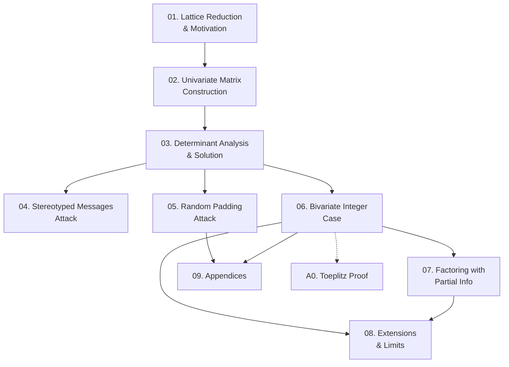

Paper kinh điển của Coppersmith (1997) trình bày phương pháp tìm **nghiệm nguyên nhỏ** của đa thức modulo $N$ (một và hai biến) bằng kỹ thuật rút gọn cơ sở lattice (LLL), sau đó áp dụng để phá RSA với exponent nhỏ và factor hóa $N$ khi biết một phần bit của $P$. Course này cover toàn bộ nội dung paper từ nền tảng lattice đến các tấn công RSA cụ thể ở mức research-level.

**Tài liệu gốc**: *Small Solutions to Polynomial Equations, and Low Exponent RSA Vulnerabilities* — Don Coppersmith, Journal of Cryptology, 1997  
**Kiến thức nền tảng yêu cầu** (🔴 Prerequisites): Lattice basis reduction / LLL algorithm [LLL82]; RSA cryptosystem [RSA78]; Đại số tuyến tính (determinant, Hadamard inequality); Lý thuyết đa thức cơ bản

---

## Lesson Overview

| # | Title | Type | Covers (sections) | File | Dependencies |
|---|-------|------|-------------------|------|-------------|
| 01 | Lattice Basis Reduction & Heuristic Motivation | Math Component | §1, §2, §3 | [[01-lattice-reduction-motivation\|01. Lattice Reduction & Motivation]] | — |
| 02 | Building the Lattice: Univariate Modular Case | Deep Dive | §4 | [[02-univariate-matrix-construction\|02. Univariate Matrix Construction]] | 01 |
| 03 | Determinant Analysis & Completing the Solution | Scheme | §5, §6, Thm 1, Cor 1 | [[03-determinant-analysis-solution\|03. Determinant Analysis & Solution]] | 02 |
| 04 | Attack: Stereotyped Messages (Partial Known Plaintext) | Attack | §7 | [[04-stereotyped-messages-attack\|04. Stereotyped Messages Attack]] | 03 |
| 05 | Attack: Random Padding & Two-Message RSA | Attack | §8, §9 | [[05-random-padding-two-message-attack\|05. Random Padding Attack]] | 03 |
| 06 | Bivariate Integer Case | Math Component | §10, Thm 2, Thm 3, Lemma 3 | [[06-bivariate-integer-case\|06. Bivariate Integer Case]] | 03 |
| 07 | Factoring with Partial Information | Attack | §11, Thm 4, Thm 5 | [[07-factoring-partial-information\|07. Factoring with Partial Info]] | 06 |
| 08 | Extensions, Limits, and Multi-Variable Case | Deep Dive | §12, §13 | [[08-extensions-multi-variable\|08. Extensions & Limits]] | 06, 07 |
| 09 | Multi-Encryption Attack & Toeplitz Proof | Deep Dive | App. 1, App. 2 | [[09-appendices\|09. Appendices]] | 05, 06 |
| A0 | Proof: Nearly Orthogonal Toeplitz Columns | — | App. 2 (full proof) | [[a0-toeplitz-columns-proof\|A0. Toeplitz Columns Proof]] | 06 |

**Lesson types**: Foundation · Math Component · Scheme · Attack · Protocol · Deep Dive · Specification · Survey

---

## Coverage Map

| Document section | Covered in lesson |
|------------------|-------------------|
| §1 Introduction | 01 |
| §2 Lattice Basis Reduction | 01 |
| §3 Motivation (heuristic) | 01 |
| §4 Building the Matrix: Univariate Modular Case | 02 |
| §5 Analysis of the Determinant | 03 |
| §6 Finishing the Solution | 03 |
| Theorem 1, Corollary 1 | 03 |
| §7 Application: Stereotyped Messages | 04 |
| §8 Application: RSA Random Padding, Two Messages | 05 |
| §9 RSA Signatures | 05 |
| §10 Bivariate Integer Case | 06 |
| Theorem 2, Corollary 2, Theorem 3, Lemma 3 | 06 |
| §11 Factoring with High Bits Known | 07 |
| Theorem 4, Theorem 5 | 07 |
| §12 Extension to More Variables | 08 |
| §13 Conclusion and Open Problem | 08 |
| Appendix 1 (multi-encryption attack) | 09 |
| Appendix 2 (proof of Lemma 3) | 09 + A0 |

---

## Dependency Graph

---

## Progress

- [x] [[01-lattice-reduction-motivation\|01. Lattice Reduction & Motivation]]
- [x] [[02-univariate-matrix-construction\|02. Univariate Matrix Construction]]
- [x] [[03-determinant-analysis-solution\|03. Determinant Analysis & Solution]]
- [x] [[04-stereotyped-messages-attack\|04. Stereotyped Messages Attack]]
- [x] [[05-random-padding-two-message-attack\|05. Random Padding Attack]]
- [x] [[06-bivariate-integer-case\|06. Bivariate Integer Case]]
- [x] [[07-factoring-partial-information\|07. Factoring with Partial Info]]
- [x] [[08-extensions-multi-variable\|08. Extensions & Limits]]
- [x] [[09-appendices\|09. Appendices]]
- [x] [[a0-toeplitz-columns-proof\|A0. Toeplitz Columns Proof]]

---

## 🟡 Integrated References

| Ref Key | Used in lesson | Nội dung tích hợp |
|---------|---------------|-------------------|
| [FR95] | 05 | Franklin-Reiter result: recover $m$ from hai ciphertext khi biết $r$ (dùng trực tiếp ở §8) |
| [Has88] | 05 | Håstad's attack (khác moduli) — được đối chiếu để làm rõ đóng góp của Coppersmith |
| [MA78] | 08 | Manders-Adleman counterexample: $x^2 \equiv 1 \pmod{n}$ có $2^m$ nghiệm → thuật toán phải thất bại |

---

## Notes

- **Lesson 01–03** là core kỹ thuật: không bỏ qua, mọi attack sau đều dựa vào Theorem 1.
- **Lesson 04–05** có thể đọc song song sau khi nắm Lesson 03.
- **Lesson 06** là phần toán nặng nhất (bivariate + Lemma 3); proof chi tiết Lemma 3 ở `a0-toeplitz-columns-proof.md`.
- **Lesson 08** bao gồm cả ví dụ thực nghiệm của Coppersmith (21×21 matrix, 45 giờ LLL) và open problem.
- Paper gốc không có hình; diagram trong các lesson đều do agent tổng hợp — được đánh dấu `[!tip] 💡 Agent note`.
