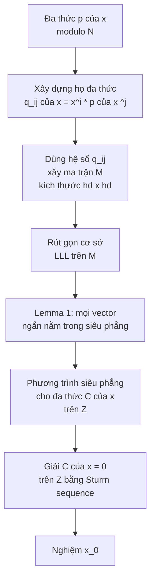

> **Prerequisites**: Đại số tuyến tính (determinant, Gram-Schmidt, Hadamard inequality); RSA cơ bản  
> 🔴 **Prerequisite references**: Lenstra, Lenstra, Lovász — *Factoring polynomials with rational coefficients* [LLL82] (LLL algorithm đầy đủ); Rivest, Shamir, Adleman — *RSA* [RSA78]  
> **Lesson type**: Math Component  
> **Covers**: §1 (Introduction), §2 (Lattice Basis Reduction), §3 (Motivation — heuristic approach)
>
> **Notation**:
> | Ký hiệu | Ý nghĩa | Ký hiệu trong paper |
> |---------|---------|---------------------|
> | $N$ | RSA modulus (composite, factorization unknown) | $N$ |
> | $\delta$ | Bậc của đa thức $p(x)$ | $\delta$ |
> | $x_0$ | Nghiệm nguyên nhỏ cần tìm | $x_0$ |
> | $X$ | Cận trên của $\|x_0\|$ | $X$ |
> | $M$ | Ma trận nguyên sinh ra lattice $L$ | $M$ |
> | $L$ | Lattice sinh bởi các hàng của $M$ | $L$ |
> | $\mathbf{b}_i$ | Vector cơ sở thứ $i$ sau khi LLL rút gọn | $b_i$ |
> | $\mathbf{b}_i^*$ | Thành phần Gram-Schmidt của $\mathbf{b}_i$ | $b_i^*$ |
> | $D$ | $\lvert\det(M)\rvert$ | $D$ |
> | $n$ | Số chiều của lattice (kích thước ma trận) | $n$ |

---

## 1. Bối cảnh — Hai bài toán khó

Tính nghiệm nguyên của đa thức một biến trên $\mathbb{Z}$ là bài toán dễ. Nhưng hai biến thể sau có thể khó:

**Bài toán 1 — Modular univariate:**

$$
p(x) = x^\delta + p_{\delta-1}x^{\delta-1} + \cdots + p_0 \equiv 0 \pmod{N}
$$

Cho $N$ là số nguyên hợp lớn (factorization không biết), tìm nghiệm nguyên $x_0$ thỏa $p(x_0) \equiv 0 \pmod{N}$.

**Bài toán 2 — Bivariate integer:**

$$
p(x, y) = \sum_{i,j} p_{ij} x^i y^j = 0 \quad \text{trên } \mathbb{Z}
$$

Tìm nghiệm nguyên $(x_0, y_0)$ của đa thức hai biến không rút gọn được.

Paper của Coppersmith giải cả hai bài toán trong trường hợp đặc biệt quan trọng: **nghiệm đủ nhỏ so với $N$ hoặc so với các hệ số của $p$**. Kỹ thuật cốt lõi là **rút gọn cơ sở lattice (lattice basis reduction)** — biến bài toán phi tuyến về một bài toán tuyến tính thông qua cấu trúc lattice được thiết kế khéo.

### Ứng dụng chính (§1)

Ba ứng dụng khai mở ngay từ Introduction:

- **RSA-e3 với stereotyped message** (§7): Nếu plaintext $m = B + x_0$ với $B$ đã biết và $\lvert x_0\rvert < N^{1/3}$, ta có thể recover $x_0$ từ $c = m^3 \bmod N$.
- **RSA-e3 với random padding** (§8): Hai ciphertext $c_1 = (m + r_1)^3$, $c_2 = (m + r_2)^3$ với padding $\lvert r_i \rvert < N^{1/9}$ lộ $m$.
- **Factoring với partial bits** (§11): Biết $\frac{1}{4}\log_2 N$ bit cao của $P$ đủ để factor $N = PQ$ trong thời gian polynomial.

---

## 2. Rút gọn cơ sở Lattice — Nền tảng kỹ thuật

### 2.1 Lattice và cơ sở rút gọn

Cho $M$ là ma trận $n \times n$ với hạng đầy đủ (full rank) trên $\mathbb{Q}$. Tập hợp tất cả các tổ hợp nguyên của các hàng của $M$ tạo thành một **lattice** (mạng tinh thể nguyên):

$$
L = \left\{ \mathbf{v} \in \mathbb{Z}^n : \mathbf{v} = \sum_{i=1}^n z_i \mathbf{b}_i,\; z_i \in \mathbb{Z} \right\}
$$

**LLL algorithm** [LLL82] tính một **cơ sở rút gọn** $(\mathbf{b}_1, \mathbf{b}_2, \ldots, \mathbf{b}_n)$ của $L$. Cơ sở rút gọn $B = KM$ với $K$ khả nghịch và cả $K$, $K^{-1}$ đều có hệ số nguyên. Thời gian tính: polynomial trong $n$ và $\log(\max\lvert M_{ij}\rvert)$.

### 2.2 Tính chất cơ sở rút gọn

Gọi $D = \lvert\det(M)\rvert = \lvert\det(B)\rvert$. Cơ sở rút gọn thoả:

$$
D \leq \prod_{i=1}^n \lvert\mathbf{b}_i\rvert \leq 2^{n(n-1)/4} D
$$

Bất đẳng thức trái là **Hadamard inequality** (tích các norm $\leq$ giá trị tuyệt đối của det). Bất đẳng thức phải là tính chất đặc trưng của cơ sở rút gọn [LLL82, eq. 1.8].

Gọi $\mathbf{b}_i^*$ là thành phần của $\mathbf{b}_i$ **vuông góc** với $\text{span}(\mathbf{b}_1, \ldots, \mathbf{b}_{i-1})$ (Gram-Schmidt). Khi đó:

$$
D = \prod_{i=1}^n \lvert\mathbf{b}_i^*\rvert
$$

Tính chất then chốt của LLL: vector cơ sở **cuối** thỏa

$$
\lvert\mathbf{b}_n^*\rvert \geq D^{1/n} \cdot 2^{-(n-1)/4}
$$

(Lưu ý: chiều của bất đẳng thức này ngược với Hadamard — đây là cận **dưới**.)

### 2.3 Lemma cốt lõi — Giam cầm vector ngắn vào siêu phẳng

> [!abstract] Lemma 1 — Vector ngắn bị giam trong siêu phẳng
> Nếu một phần tử $\mathbf{s} \in L$ thỏa
>
> $$
> \lvert\mathbf{s}\rvert < D^{1/n} \cdot 2^{-(n-1)/4}
> $$
>
> thì $\mathbf{s}$ nằm trong siêu phẳng được span bởi $\mathbf{b}_1, \mathbf{b}_2, \ldots, \mathbf{b}_{n-1}$.

**Proof.** Mọi phần tử lattice $\mathbf{s}$ viết được dưới dạng $\mathbf{s} = \sum s_i \mathbf{b}_i$ với $s_i \in \mathbb{Z}$. Ta có $\lvert\mathbf{s}\rvert \geq \lvert s_n\rvert \cdot \lvert\mathbf{b}_n^*\rvert$ vì $\mathbf{b}_n^*$ là thành phần $\mathbf{b}_n$ vuông góc với các $\mathbf{b}_1,\ldots,\mathbf{b}_{n-1}$. Nếu $\lvert\mathbf{s}\rvert < \lvert\mathbf{b}_n^*\rvert \leq D^{1/n} \cdot 2^{-(n-1)/4}$ thì $s_n = 0$, tức là $\mathbf{s}$ nằm trong span của $\mathbf{b}_1, \ldots, \mathbf{b}_{n-1}$. $\blacksquare$

**Tại sao điều này quan trọng**: Lemma 1 không tìm vector ngắn nhất (shortest vector problem — NP-hard), mà chỉ **giam** mọi vector đủ ngắn vào một siêu phẳng có phương trình tường minh. Phương trình của siêu phẳng đó, khi diễn giải qua cấu trúc của lattice, trực tiếp cho ta một **phương trình đa thức** mà nghiệm $x_0$ phải thỏa.

> [!abstract] Lemma 2 — Tổng quát hóa sang không gian con chiều thấp hơn
> Nếu $\mathbf{s} \in L$ thỏa $\lvert\mathbf{s}\rvert < \lvert\mathbf{b}_i^*\rvert$ với mọi $i = k+1, \ldots, n$, thì $\mathbf{s}$ nằm trong span của $\mathbf{b}_1, \ldots, \mathbf{b}_k$.

Lemma 2 sẽ cần thiết trong §12 khi giải đa thức nhiều hơn hai biến — nơi một siêu phẳng chưa đủ và ta cần không gian con có đồng chiều (codimension) lớn hơn 1.

---

## 3. Cách tiếp cận Heuristic — Tại sao nó thất bại

### 3.1 Ý tưởng ban đầu (§3)

Cho đa thức monic bậc $\delta$ modulo $N$:

$$
p(x) = x^\delta + p_{\delta-1}x^{\delta-1} + \cdots + p_0 \equiv 0 \pmod{N}
$$

Giả sử tồn tại nghiệm $x_0$ với $\lvert x_0 \rvert < X$. Ý tưởng heuristic: xây dựng một lattice mà vector

$$
\mathbf{r} = \bigl(1,\; x_0,\; x_0^2,\; \ldots,\; x_0^{\delta-1},\; x_0^\delta,\; -y_0\bigr)
$$

(trong đó $p(x_0) = y_0 N$) sinh ra một vector ngắn trong lattice.

> [!note] Scheme 3.1 — Heuristic Matrix Construction
> **Type**: Lattice Construction (heuristic, chưa hoạt động tốt)  
> **Setting**: Đa thức monic bậc $\delta$; cận $X$ trên $\lvert x_0 \rvert$
>
> **$\mathsf{BuildMatrix}_{\text{heuristic}}(p, N, X)$**
> - Input: $p(x) = x^\delta + \sum p_i x^i$, modulus $N$, bound $X$
> - Xây ma trận $M$ kích thước $(\delta+2) \times (\delta+2)$:
>
> $$
> M = \begin{pmatrix} 1 & 0 & 0 & \cdots & 0 & p_0 \\ 0 & X^{-1} & 0 & \cdots & 0 & p_1 \\ 0 & 0 & X^{-2} & \cdots & 0 & p_2 \\ \vdots & \vdots & \vdots & \ddots & \vdots & \vdots \\ 0 & 0 & 0 & \cdots & X^{-\delta} & p_\delta \\ 0 & 0 & 0 & \cdots & 0 & N \end{pmatrix}
> $$
>
> - Output: Ma trận $M$ tam giác trên
>
> **Tính chất**: Với $\mathbf{r} = (1, x_0, x_0^2, \ldots, x_0^\delta, -y_0)$, tích $\mathbf{s} = \mathbf{r}M$ bằng
>
> $$
> \mathbf{s} = \left(1,\; \frac{x_0}{X},\; \left(\frac{x_0}{X}\right)^2,\; \ldots,\; \left(\frac{x_0}{X}\right)^\delta,\; 0\right)
> $$
>
> phần tử cuối = $p(x_0) - y_0 N = 0$. Norm: $\lvert\mathbf{s}\rvert \leq \sqrt{\delta+1}$.

### 3.2 Tại sao heuristic thất bại

Ma trận $M$ tam giác trên, nên:

$$
\det(M) = (1)(X^{-1})(X^{-2})\cdots(X^{-\delta})(N) = N \cdot X^{-\delta(\delta+1)/2}
$$

Để áp dụng Lemma 1, cần $\lvert\mathbf{s}\rvert < \det(M)^{1/(\delta+2)}$. Bỏ qua hệ số $2^{(n-1)/4}$, điều kiện trở thành:

$$
\det(M)^{1/(\delta+2)} > 1 \implies N X^{-\delta(\delta+1)/2} > 1 \implies X^{\delta(\delta+1)/2} < N
$$

$$
\implies X < N^{2/(\delta^2+\delta)}
$$

**Đây là cận quá chặt**. Với $\delta = 3$ (RSA-e3), cần $X < N^{1/6}$ — quá nhỏ để thực dụng. Paper của Coppersmith đạt $X < N^{1/\delta}$, cải thiện bình phương mũ.

### 3.3 Gốc rễ của vấn đề và hướng khắc phục

Có hai vấn đề cơ bản:

**Vấn đề 1 — Quá ít quan hệ, quá nhiều ẩn.** Vector $\mathbf{r}$ có $\delta + 2$ thành phần (các lũy thừa $x_0^i$ và $y_0$) nhưng chỉ có một quan hệ $p(x_0) = y_0 N$. Mỗi ẩn $x_0^i$ đóng góp một nhân tử $X^{-i}$ vào $\det(M)$, nhưng chỉ có một quan hệ đóng góp nhân tử $N$. Sự mất cân bằng này dẫn đến điều kiện $X^{\delta(\delta+1)/2} < N$.

**Vấn đề 2 — Không enforce cấu trúc lũy thừa.** Trong cấu trúc lattice thuần, không có cơ chế nào buộc $r_{i+1}/r_i = x_0$ — các thành phần $r_i$ là tự do.

**Giải pháp của Coppersmith**: Dùng **nhiều quan hệ** thay vì một. Cụ thể, với mọi $i, j$ thỏa $0 \leq i < \delta$ và $1 \leq j < h$:

$$
q_{ij}(x) = x^i \cdot p(x)^j \implies q_{ij}(x_0) \equiv 0 \pmod{N^j}
$$

Mỗi quan hệ $q_{ij}(x_0) \equiv 0 \pmod{N^j}$ đóng góp **nhân tử $N^j$** vào $\det(M)$, trong khi các ẩn $x_0^i$ được **tái sử dụng** qua nhiều quan hệ. Sự tích lũy của các nhân tử $N^j$ này — thay vì chỉ một nhân tử $N$ duy nhất — là nguồn gốc của cải thiện từ $N^{2/(\delta^2+\delta)}$ lên $N^{1/\delta}$.

> [!tip] 💡 Agent note
> Có một trực giác đẹp ẩn sau sự lựa chọn $q_{ij} = x^i p(x)^j$: hai phương trình $q_{0j}$ và $q_{1j}$ (shift theo $x$) có cùng cấu trúc hệ số nhưng lệch chỉ số. Điều này "bắt chước" ràng buộc $r_3/r_2 = r_4/r_3 = x_0$ — lý do trực quan tại sao phương pháp mới hoạt động dù vẫn không enforce điều kiện đó một cách tường minh.

---

## 4. Bức tranh tổng quan của phương pháp Coppersmith

Phương pháp đầy đủ (trình bày chi tiết từ Lesson 02 trở đi) hoạt động theo pipeline:

**Đảm bảo**: Khác với nhiều ứng dụng LLL (chỉ heuristic), phương pháp này **đảm bảo tìm được mọi nghiệm nhỏ** — vì Lemma 1 áp dụng cho **tất cả** vector ngắn, không chỉ vector ngắn nhất.

---

## 5. So sánh: Heuristic vs. Coppersmith

| Tiêu chí | Heuristic (§3) | Coppersmith (§4–§6) |
|----------|---------------|---------------------|
| Số quan hệ dùng | 1 ($p(x_0) = y_0 N$) | $O(h\delta)$ ($q_{ij}(x_0) \equiv 0 \bmod N^j$) |
| Đóng góp của $N$ vào $\det$ | $N^1$ | $N^{\delta h(h-1)/2}$ |
| Cận tìm được | $X < N^{2/(\delta^2+\delta)}$ | $X < \frac{1}{2}N^{1/\delta - \varepsilon}$ |
| Kích thước ma trận | $(\delta+2)^2$ | $(h\delta)^2$ |
| Đảm bảo tìm nghiệm | Heuristic | Đảm bảo (Theorem 1) |

---

## Summary

- Coppersmith tấn công hai bài toán: (1) nghiệm nhỏ của $p(x) \equiv 0 \pmod{N}$ và (2) nghiệm nhỏ của $p(x,y) = 0$ trên $\mathbb{Z}$.
- Nền tảng kỹ thuật: LLL basis reduction — tính cơ sở rút gọn cho lattice trong thời gian polynomial.
- **Lemma 1**: mọi vector lattice có norm $< D^{1/n} \cdot 2^{-(n-1)/4}$ đều nằm trong một siêu phẳng xác định được tường minh.
- Cách tiếp cận heuristic (một quan hệ) chỉ đạt $X < N^{2/(\delta^2+\delta)}$ — quá chặt.
- Coppersmith vượt qua bằng cách dùng **nhiều quan hệ** $q_{ij}(x_0) \equiv 0 \pmod{N^j}$, tích lũy lũy thừa $N^j$ trong det để đạt $X < N^{1/\delta}$.

---

## References

- [Cop97] Coppersmith — *Small Solutions to Polynomial Equations, and Low Exponent RSA Vulnerabilities*, J. Cryptology 1997 (paper gốc, §1–§3)
- [LLL82] Lenstra, Lenstra, Lovász — *Factoring polynomials with rational coefficients*, Math. Ann. 261, 1982 (🔴 Prerequisite)
- [RSA78] Rivest, Shamir, Adleman — *A method for obtaining digital signatures and public-key cryptosystems*, Comm. ACM 1978 (🔴 Prerequisite)
