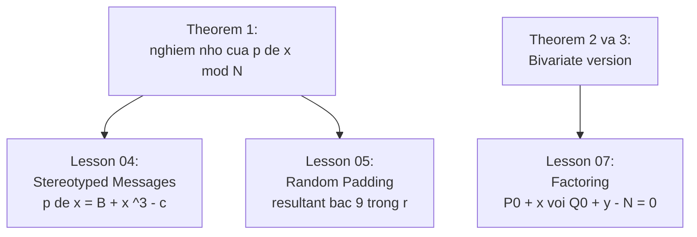

> **Prerequisites**: [[01-lattice-reduction-motivation|01. Lattice Reduction & Motivation]] (Lemma 1, điều kiện áp dụng); [[02-univariate-matrix-construction|02. Univariate Matrix Construction]] (cấu trúc $M$, $\hat{M}$, vector $\mathbf{s}$)  
> 🔴 **Prerequisite references**: [LLL82] LLL algorithm; Knuth — *TAOCP vol. 2* §4.6.1 (Sturm sequence [Knu81])  
> **Lesson type**: Scheme  
> **Covers**: §5 (Analysis of the Determinant), §6 (Finishing the Solution), Theorem 1, Corollary 1
>
> **Notation**:
> | Ký hiệu | Ý nghĩa | Ký hiệu trong paper |
> |---------|---------|---------------------|
> | $n$ | Chiều của $\hat{M}$: $n = h\delta$ | $n$ |
> | $\det(\hat{M})$ | Determinant của sub-lattice matrix | $\det(\hat{M})$ |
> | $c_g$ | Hệ số của đa thức $C(x)$ được tính từ siêu phẳng | $c_g$ |
> | $C(x)$ | Đa thức nguyên mà $x_0$ phải thỏa: $C(x_0) = 0$ trên $\mathbb{Z}$ | $C(x)$ |
> | $\varepsilon$ | Tham số cận: cần $X \leq \frac{1}{2}N^{1/\delta - \varepsilon}$ | $\varepsilon$ |

---

## 1. Bối cảnh

Ta đã xây ma trận $M$ kích thước $(2h\delta - \delta)^2$ và rút gọn về sub-lattice $\hat{M}$ kích thước $h\delta \times h\delta$ (Lesson 02). Vector $\mathbf{s} = \mathbf{r}M$ là phần tử của lattice $\hat{M}$ với $\lvert\mathbf{s}\rvert < 1$.

Nhiệm vụ của §5–§6: chứng minh rằng $\det(\hat{M})$ đủ lớn để áp dụng Lemma 1, từ đó extract đa thức $C(x)$ trên $\mathbb{Z}$ có $x_0$ là nghiệm.

---

## 2. Tính Determinant (§5)

### 2.1 Công thức tường minh

$M$ là ma trận tam giác trên (upper triangular), nên $\det(M)$ chính là tích các phần tử đường chéo:

$$
\det(M) = \prod_{g=0}^{h\delta-1} \frac{X^{-g}}{\sqrt{h\delta}} \times \prod_{\substack{0 \leq i < \delta \\ 1 \leq j < h}} N^j
$$

**Tính từng tích:**

$$
\prod_{g=0}^{h\delta-1} X^{-g} = X^{-\sum_{g=0}^{h\delta-1} g} = X^{-(h\delta)(h\delta-1)/2}
$$

$$
\prod_{g=0}^{h\delta-1} \frac{1}{\sqrt{h\delta}} = (h\delta)^{-h\delta/2}
$$

$$
\prod_{j=1}^{h-1} N^{j\delta} = N^{\delta \sum_{j=1}^{h-1} j} = N^{\delta h(h-1)/2}
$$

Gộp lại:

$$
\det(M) = N^{\delta h(h-1)/2} \cdot X^{-(h\delta)(h\delta-1)/2} \cdot (h\delta)^{-h\delta/2}
$$

$$
= \left[N^{(h-1)/2} \cdot X^{-(h\delta-1)/2} \cdot (h\delta)^{-1/2}\right]^{h\delta}
$$

### 2.2 Quan hệ với $\det(\hat{M})$

Vì row operations không thay đổi det, và $\tilde{M}$ có lower-right block là identity:

$$
\det(\hat{M}) = \det(\tilde{M}) = \det(M)
$$

Đặt $n = h\delta$ (chiều của $\hat{M}$). Điều kiện của Lemma 1 là $\lvert\mathbf{s}\rvert < \det(\hat{M})^{1/n} \cdot 2^{-(n-1)/4}$.

### 2.3 Điều kiện để Lemma 1 áp dụng được

Vì $\lvert\mathbf{s}\rvert < 1$, ta cần:

$$
1 \leq \det(\hat{M})^{1/n} \cdot 2^{-(n-1)/4}
$$

Thay vào công thức det:

$$
1 \leq N^{(h-1)/2} \cdot X^{-(h\delta-1)/2} \cdot (h\delta)^{-1/2} \cdot 2^{-(h\delta-1)/4}
$$

Giải ra $X$:

$$
X \leq N^{(h-1)/(h\delta-1)} \cdot (h\delta)^{-1/(h\delta-1)} \cdot 2^{-1/2}
$$

**Hai điều kiện trên $h$ ra tay:**

**Điều kiện 2** ($h\delta \geq 7$) đảm bảo (bằng tính toán):

$$
(h\delta)^{-1/(h\delta-1)} > 2^{-1/2}
$$

**Điều kiện 1** đảm bảo:

$$
\frac{h-1}{h\delta-1} \geq \frac{1}{\delta} - \varepsilon
$$

Kết hợp: nếu $X \leq \frac{1}{2}N^{1/\delta - \varepsilon}$ thì điều kiện Lemma 1 được thỏa.

> [!abstract] Kết luận §5
> Với lựa chọn $X = \frac{1}{2}N^{1/\delta - \varepsilon}$ và $h$ thỏa điều kiện §2 của Lesson 02:
>
> $$
> \lvert\mathbf{s}\rvert < 1 \leq \det(\hat{M})^{1/n} \cdot 2^{-(n-1)/4}
> $$
>
> Lemma 1 có thể được áp dụng cho $\hat{M}$ và vector $\mathbf{s}$.

---

## 3. Hoàn thiện giải pháp (§6)

### 3.1 Áp dụng LLL và thu được phương trình tuyến tính

Áp dụng LLL trên $\hat{M}$ → cơ sở rút gọn $\mathbf{b}_1, \ldots, \mathbf{b}_n$ thỏa:

$$
\lvert\mathbf{b}_n^*\rvert \geq \det(\hat{M})^{1/n} \cdot 2^{-(n-1)/4} \geq 1
$$

Bởi Lemma 1: mọi vector $\mathbf{s} \in \hat{L}$ với $\lvert\mathbf{s}\rvert < 1$ nằm trong siêu phẳng:

$$
\text{span}(\mathbf{b}_1, \ldots, \mathbf{b}_{n-1})
$$

Siêu phẳng này có **phương trình tuyến tính** tường minh, xác định được từ cơ sở rút gọn. Phương trình đó có dạng:

$$
\sum_{g=0}^{h\delta-1} c_g \cdot r_g = 0
$$

với các hệ số $c_g$ không đều bằng $0$, tính được từ output của LLL.

### 3.2 Diễn giải thành đa thức trên $\mathbb{Z}$

Với vector $\mathbf{r}$ đặc biệt của ta (trong đó $r_g = x_0^g$), phương trình trên trở thành:

$$
C(x_0) = \sum_{g=0}^{h\delta-1} c_g x_0^g = 0
$$

**Điểm mấu chốt**: Đây là phương trình trên $\mathbb{Z}$ — **không phải modulo $N$**. Lý do: Lemma 1 giam mọi vector đủ ngắn vào siêu phẳng, độc lập với cấu trúc modular. Siêu phẳng tồn tại trong $\mathbb{Z}^n$.

### 3.3 Giải $C(x) = 0$ trên $\mathbb{Z}$

Đây là bài toán tìm nghiệm nguyên của đa thức một biến trên $\mathbb{Z}$ — **bài toán dễ**. Phương pháp: Sturm sequence [Knu81] tìm mọi nghiệm thực trong thời gian polynomial.

> [!note] Scheme 3.1 — Coppersmith Univariate Algorithm (Đầy đủ)
> **Type**: Small Root Finding  
> **Setting**: $N$ là số nguyên hợp lớn; $p(x)$ đa thức monic bậc $\delta$ modulo $N$; $\varepsilon > 0$; $X = \frac{1}{2}N^{1/\delta - \varepsilon}$
>
> **$\mathsf{CoppersmithUnivariate}(p,\, N,\, \delta,\, \varepsilon)$**
> - Input: $p(x)$, $N$, $\delta$, $\varepsilon$
> - **Bước 1**: Chọn $h \geq \max\!\left(\frac{\delta - 1 + \varepsilon\delta}{\varepsilon\delta^2},\; \frac{7}{\delta}\right)$
> - **Bước 2**: Với mọi $(i,j)$, $0 \leq i < \delta$, $1 \leq j < h$, tính $q_{ij}(x) = x^i p(x)^j$
> - **Bước 3**: Xây $M$ kích thước $(2h\delta-\delta)^2$ theo Scheme 4.1 (Lesson 02)
> - **Bước 4**: Row reduction → tách sub-lattice $\hat{M}$ kích thước $h\delta \times h\delta$
> - **Bước 5**: LLL reduce $\hat{M}$ → cơ sở rút gọn $\mathbf{b}_1, \ldots, \mathbf{b}_n$
> - **Bước 6**: Tính phương trình siêu phẳng → hệ số $c_g$ của đa thức $C(x) = \sum c_g x^g$
> - **Bước 7**: Giải $C(x) = 0$ trên $\mathbb{Z}$ bằng Sturm sequence [Knu81]
> - **Bước 8**: Với mỗi nghiệm thực $x_*$: kiểm tra $p(x_*) \equiv 0 \pmod{N}$ và $\lvert x_* \rvert \leq X$
> - Output: Tập tất cả nghiệm $x_0$ thỏa $p(x_0) \equiv 0 \pmod{N}$ và $\lvert x_0 \rvert \leq X$

---

## 4. Correctness và Completeness

> [!abstract] Theorem 1 — Tìm nghiệm nhỏ univariate (Coppersmith 1997)
> Cho $p(x)$ đa thức monic bậc $\delta$ modulo $N$ (factorization không biết). Nếu
>
> $$
> X < \frac{1}{2} N^{1/\delta - \varepsilon}
> $$
>
> thì $\mathsf{CoppersmithUnivariate}$ tìm được **tất cả** các nghiệm nguyên $x_0$ thỏa $p(x_0) \equiv 0 \pmod{N}$ và $\lvert x_0 \rvert < X$, trong thời gian polynomial theo $(\log N,\, \delta,\, 1/\varepsilon)$.

**Proof.**

*Correctness*: Mọi nghiệm $x_0$ trong vùng $\lvert x_0\rvert < X$ sinh ra vector $\mathbf{s}$ với $\lvert\mathbf{s}\rvert < 1$. Từ §5, điều kiện Lemma 1 được thỏa, nên $\mathbf{s}$ nằm trong siêu phẳng $\sum c_g r_g = 0$. Thay $r_g = x_0^g$: $C(x_0) = 0$ trên $\mathbb{Z}$. Vậy $x_0$ là nghiệm của $C$, và bước Sturm sequence tìm được $x_0$.

*Completeness*: Lemma 1 giam **mọi** vector đủ ngắn — không chỉ vector ứng với nghiệm cụ thể nào. Do đó mọi nghiệm nhỏ đều là nghiệm của $C(x)$, và $C$ được tính tường minh từ LLL output. Tất cả nghiệm nguyên của $C$ được tìm bởi Sturm sequence.

*Time complexity*: Ma trận $\hat{M}$ có kích thước $n = h\delta = O(\delta/\varepsilon)$. LLL chạy trong polynomial time theo $n$ và $\log(\max M_{ij})$ [LLL82]. Các bước còn lại (row reduction, Sturm) cũng polynomial. $\blacksquare$

> [!abstract] Corollary 1 — Cận mở rộng đến $N^{1/\delta}$
> Với cùng điều kiện nhưng $X \leq N^{1/\delta}$ (không có $\varepsilon$), ta có thể tìm mọi nghiệm $\lvert x_0\rvert \leq X$ trong thời gian polynomial theo $(\log N,\, 2^\delta)$.

**Proof.** Phủ khoảng $[-N^{1/\delta}, N^{1/\delta}]$ bằng 4 khoảng $I_i$ mỗi khoảng độ dài $\frac{1}{2}N^{1/\delta}$, mỗi khoảng center tại một số nguyên $x_i$. Với mỗi $i$, áp dụng Theorem 1 cho đa thức $p_i(x) = p(x + x_i)$ với $\varepsilon = 1/\log N$. Mỗi lần chạy polynomial theo $(\log N, 2^\delta)$. $\blacksquare$

---

## 5. Đổi mới so với lattice attacks trước đó

> [!info] Đổi mới kỹ thuật của Coppersmith
> Nhiều ứng dụng LLL trước đây trong cryptography chỉ là **heuristic**: người ta hy vọng LLL tìm được vector cần thiết, nhưng không đảm bảo. Coppersmith đưa ra một đảm bảo hoàn toàn:
>
> - Thay vì tìm vector **ngắn nhất** (NP-hard), ta chỉ cần giam mọi vector đủ ngắn vào một **siêu phẳng** (Lemma 1).
> - Phương trình của siêu phẳng — tính được từ **vector cơ sở cuối** $\mathbf{b}_n^*$ — tự động chứa mọi nghiệm nhỏ.
> - Kết quả: đảm bảo tìm được **tất cả** nghiệm nhỏ, không chỉ một.

---

## 6. Từ Theorem 1 đến các tấn công RSA

Kết quả cốt lõi: **Biết $p$ và $N$, có thể tìm $x_0$ miễn là $\lvert x_0\rvert < N^{1/\delta}$**.

Các lesson tiếp theo sẽ instantiate $p(x)$ cụ thể cho từng kịch bản tấn công RSA.

---

## Summary

- $\det(\hat{M}) = \left[N^{(h-1)/2} X^{-(h\delta-1)/2} (h\delta)^{-1/2}\right]^{h\delta}$ — tính từ tính chất tam giác trên.
- Điều kiện $X \leq \frac{1}{2}N^{1/\delta-\varepsilon}$ kết hợp với hai ràng buộc trên $h$ đảm bảo $1 \leq \det(\hat{M})^{1/n} \cdot 2^{-(n-1)/4}$.
- LLL reduce $\hat{M}$ → siêu phẳng → hệ số $c_g$ → đa thức $C(x)$ trên $\mathbb{Z}$ — $x_0$ là nghiệm.
- **Theorem 1**: tìm mọi nghiệm $\lvert x_0\rvert < \frac{1}{2}N^{1/\delta-\varepsilon}$ trong thời gian $\text{poly}(\log N, \delta, 1/\varepsilon)$.
- **Corollary 1**: cận mở rộng đến $N^{1/\delta}$ với chi phí thêm nhân tử $2^\delta$.

---

## References

- [Cop97] Coppersmith — *Small Solutions to Polynomial Equations*, J. Cryptology 1997, §5–§6
- [LLL82] Lenstra, Lenstra, Lovász — *Factoring polynomials with rational coefficients*, 1982 (🔴 Prerequisite)
- [Knu81] Knuth — *The Art of Computer Programming*, vol. 2, §4.6.1 (Sturm sequence, ⚪ Citation)
