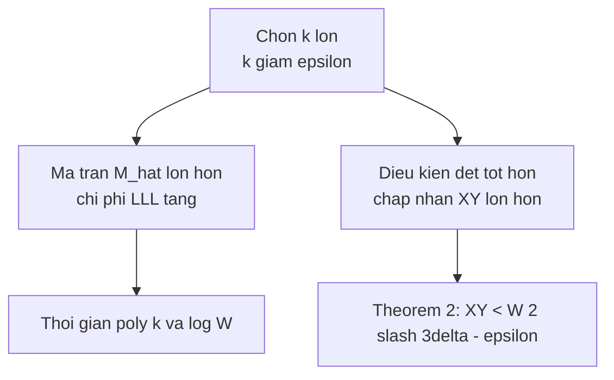

> **Prerequisites**: [[01-lattice-reduction-motivation|01. Lattice Reduction & Motivation]] (Lemma 1, 2); [[03-determinant-analysis-solution|03. Determinant Analysis & Solution]] (Theorem 1 — để đối chiếu)  
> 🔴 **Prerequisite references**: [LLL82] LLL algorithm; Lý thuyết resultant đa thức hai biến  
> **Lesson type**: Math Component  
> **Covers**: §10 (Bivariate Integer Case) — toàn bộ; Theorem 2, Corollary 2, Theorem 3, Lemma 3
>
> **Notation**:
> | Ký hiệu | Ý nghĩa | Ký hiệu trong paper |
> |---------|---------|---------------------|
> | $\delta$ | Bậc tối đa của $p(x,y)$ trong **mỗi biến** riêng lẻ | $\delta$ |
> | $X, Y$ | Cận trên của $\lvert x_0\rvert$, $\lvert y_0\rvert$ | $X, Y$ |
> | $\tilde{p}(x,y)$ | Đa thức scaled: $\tilde{p}(x,y) = p(xX, yY)$ | $\tilde{p}$ |
> | $\tilde{p}_{ij}$ | Hệ số của $\tilde{p}$: $\tilde{p}_{ij} = p_{ij} X^i Y^j$ | $\tilde{p}_{ij}$ |
> | $W$ | $\max_{ij} \lvert\tilde{p}_{ij}\rvert$ — "largest scaled coefficient" | $W$ |
> | $k$ | Tham số kích thước: $k > 2/(3\varepsilon)$ | $k$ |
> | $\gamma(g,h)$ | Chỉ số hàng/cột trái: $(k+\delta)g + h$ | $\gamma(g,h)$ |
> | $\beta(i,j)$ | Chỉ số cột phải: $(k+\delta)^2 + ki + j$ | $\beta(i,j)$ |
> | $Q(x)$ | Resultant của $C(x,y)$ và $p(x,y)$ theo $y$ | $Q(x)$ |

---

## 1. Bài toán và sự khác biệt với Univariate

**Bài toán**: Cho đa thức $p(x,y) = \sum_{0 \leq i,j \leq \delta} p_{ij} x^i y^j$ **không rút gọn được** trên $\mathbb{Z}$, tìm nghiệm nguyên $(x_0, y_0)$ với $\lvert x_0\rvert \leq X$, $\lvert y_0\rvert \leq Y$.

**Lưu ý quan trọng**: Đây là đa thức trên $\mathbb{Z}$ — **không modulo $N$**. Không có modulus; thay vào đó, giới hạn nghiệm được biểu diễn qua các hệ số của $p$.

### So sánh với univariate modular

| Khía cạnh | Univariate modular (§4–§6) | Bivariate integer (§10) |
|-----------|--------------------------|------------------------|
| Domain | $p(x) \equiv 0 \pmod{N}$ | $p(x,y) = 0$ trên $\mathbb{Z}$ |
| "Threshold" | $N$ (modulus) | $W$ (largest scaled coefficient) |
| Cận tìm được | $X < N^{1/\delta}$ | $XY < W^{2/(3\delta)}$ |
| Helper polynomials | $q_{ij} = x^i p(x)^j$ | $q_{ij} = x^i y^j p(x,y)$ (không có lũy thừa $p^j$) |
| Ma trận | Vuông | Chữ nhật ($k < n$) |
| Output từ LLL | Đa thức $C(x)$ trên $\mathbb{Z}$ → giải trực tiếp | Đa thức $C(x,y)$ → resultant với $p$ → giải |

**Tại sao không dùng $x^i y^j p^k$ như univariate?** Vì trong trường hợp integer (không có modulus), nhân thêm lũy thừa $p^k$ không đóng góp nhân tử $N^k$ nào vào det — không có lợi thế.

---

## 2. Xây dựng $W$ — "Scaled maximum coefficient"

Thực hiện phép thay $x \leftarrow xX$ và $y \leftarrow yY$:

$$
\tilde{p}(x,y) = p(xX, yY) = \sum_{i,j} p_{ij} X^i Y^j x^i y^j = \sum_{i,j} \tilde{p}_{ij} x^i y^j
$$

với $\tilde{p}_{ij} = p_{ij} X^i Y^j$.

Định nghĩa:

$$
W = \max_{i,j} \lvert\tilde{p}_{ij}\rvert = \max_{i,j} \lvert p_{ij}\rvert X^i Y^j
$$

**Ý nghĩa**: $W$ là "giá trị lớn nhất mà $p$ có thể đạt được trong vùng $\lvert x\rvert \leq X$, $\lvert y\rvert \leq Y$" (theo nghĩa worst-case term). Đây là analog của $N$ trong univariate case.

---

## 3. Xây ma trận $M_1$

Chọn tham số $k > 2/(3\varepsilon)$. Với mọi $(i,j)$, $0 \leq i < k$, $0 \leq j < k$, tính:

$$
q_{ij}(x,y) = x^i y^j p(x,y)
$$

**Đánh chỉ số**:

$$
\gamma(g,h) = (k+\delta)g + h, \quad 0 \leq g,h < k+\delta \quad \text{(chỉ số hàng/cột trái)}
$$

$$
\beta(i,j) = (k+\delta)^2 + ki + j, \quad 0 \leq i,j < k \quad \text{(chỉ số cột phải)}
$$

> [!note] Scheme 6.1 — Bivariate Matrix $M_1$
> **Type**: Bivariate Lattice Matrix Construction  
> **Setting**: $p(x,y)$ bậc $\delta$ mỗi biến; bounds $X, Y$; tham số $k$
>
> **$\mathsf{BuildBivariateMatrix}(p,\, X,\, Y,\, k)$**
> - Input: $p(x,y)$, $X$, $Y$, $k > 2/(3\varepsilon)$
> - Tính $q_{ij}(x,y) = x^i y^j p(x,y)$ cho mọi $0 \leq i,j < k$
> - Xây $M_1$ kích thước $\bigl((k+\delta)^2 + k^2\bigr) \times (k+\delta)^2$:
>   - **Left block** (diagonal, $(k+\delta)^2 \times (k+\delta)^2$): $(M_1)_{\gamma(g,h),\gamma(g,h)} = X^{-g}Y^{-h}$
>   - **Right block** $\bigl((k+\delta)^2 \times k^2\bigr)$: $(M_1)_{\gamma(g,h),\beta(i,j)} = [x^g y^h]\, q_{ij}(x,y)$
>   - Bên dưới right block: $k^2 \times k^2$ identity matrix (từ row reduction)
> - **Row reduce** $M_1$ → $M_2$: right block có $k^2 \times k^2$ identity ở dưới và zero ở trên
> - Lấy top $2k\delta + \delta^2$ hàng của $M_2$ → ma trận $\hat{M}$ (vuông, kích thước $2k\delta+\delta^2$)
> - Output: $\hat{M}$

**Tại sao row reduction khả thi?** Vì $p(x,y)$ không rút gọn được nên $\gcd$ của các hệ số bằng 1, đảm bảo tồn tại row operations tạo identity block.

---

## 4. Vector $\mathbf{r}$ và norm

Định nghĩa vector hàng $\mathbf{r}$ kích thước $(k+\delta)^2$:

$$
r_{\gamma(g,h)} = x_0^g y_0^h
$$

Tích $\mathbf{s} = \mathbf{r}M_1$:

$$
s_{\gamma(g,h)} = \left(\frac{x_0}{X}\right)^g \left(\frac{y_0}{Y}\right)^h, \quad \lvert s_{\gamma(g,h)}\rvert \leq 1
$$

$$
s_{\beta(i,j)} = q_{ij}(x_0,y_0) = x_0^i y_0^j p(x_0,y_0) = 0
$$

Norm: $\lvert\mathbf{s}\rvert < k + \delta$ (tổng $(k+\delta)^2$ hạng, mỗi hạng $\leq 1$).

---

## 5. Phân tích Determinant — Lemma 3

Phần khó nhất của §10 là ước lượng $\det(\hat{M})$. Không như univariate (det tính dễ từ tam giác trên), ở đây ma trận phức tạp hơn.

**Ý tưởng**: Định nghĩa $M_4 = \Lambda_1 M_1 \Lambda_2$ với $\Lambda_1$, $\Lambda_2$ là ma trận diagonal scale:
- $\Lambda_1$: nhân hàng $\gamma(g,h)$ với $X^g Y^h$
- $\Lambda_2$: nhân cột $\beta(i,j)$ với $X^{-i} Y^{-j}$

Kết quả: block trái của $M_4$ là identity; block phải là **Toeplitz matrix** — các cột là shifted versions của vector hệ số của $\tilde{p}(x,y)$:

$$
(M_4)_{\gamma(g,h),\beta(i,j)} = \tilde{p}_{g-i,\,h-j}
$$

Để bound $\det(\hat{M})$ từ dưới, cần bound $\det$ của một $k^2 \times k^2$ submatrix của block Toeplitz này:

> [!abstract] Lemma 3 — Nearly Orthogonal Toeplitz Columns
> Tồn tại một submatrix $k^2 \times k^2$ của block Toeplitz trên có:
>
> $$
> \lvert\det\rvert \geq W^{k^2} \cdot 2^{-6k^2\delta^2 - 2k^2}
> $$
>
> Nếu hệ số lớn nhất của $\tilde{p}$ là một trong $\tilde{p}_{00}$, $\tilde{p}_{0\delta}$, $\tilde{p}_{\delta 0}$, hoặc $\tilde{p}_{\delta\delta}$ (corner của Newton polygon), thì bound cải thiện thành $W^{k^2}$.

**Proof sketch** (xem `a0-toeplitz-columns-proof.md` cho proof đầy đủ):

Chọn chỉ số $(c,d)$ để maximize $8^{(c-a)^2+(d-b)^2}\lvert\tilde{p}_{cd}\rvert$ với $(a,b)$ là vị trí của $W$. Chọn submatrix $\tilde{M}$ với các hàng $\gamma(c+i, d+j)$, $0 \leq i,j < k$. Scale hàng $\mu(g,h)$ với $8^{2(c-a)g+2(d-b)h}$ và cột $\mu(i,j)$ với $8^{-2(c-a)i-2(d-b)j}$ — det không đổi.

Matrix mới $M_0$ **diagonal dominant**: diagonal entry $= \tilde{p}_{cd}$, off-diagonal entry $\leq \lvert\tilde{p}_{cd}\rvert \cdot 8^{-(g-i)^2-(h-j)^2}$. Tổng off-diagonal $< \frac{3}{4}\lvert\tilde{p}_{cd}\rvert$. Gershgorin: mọi eigenvalue $> \frac{1}{4}\lvert\tilde{p}_{cd}\rvert \geq \frac{1}{4} \cdot 8^{-2\delta^2} W$. Do đó $\det \geq (W/4 \cdot 8^{-2\delta^2})^{k^2} = W^{k^2} 2^{-6k^2\delta^2-2k^2}$. $\blacksquare$

---

## 6. Điều kiện áp dụng Lemma 1

Sau các tính toán của §10 (bỏ qua các bước đại số tedious), điều kiện $\lvert\mathbf{s}\rvert < \det(\hat{M})^{1/n} \cdot 2^{-(n-1)/4}$ với $n = 2k\delta + \delta^2$ dịch thành:

$$
XY \leq W^{2/(3\delta) - \varepsilon'} \cdot 2^{-(14\delta/3) - o(\delta)}, \quad \varepsilon' \approx \frac{2}{3k}\!\left(1 - \frac{2}{3\delta}\right)
$$

---

## 7. Hoàn thiện: Extract $(x_0, y_0)$

Sau LLL reduce $\hat{M}$ → Lemma 1 → siêu phẳng → đa thức $C(x,y)$ trên $\mathbb{Z}$:

$$
C(x_0, y_0) = \sum_{g,h} c_{gh} x_0^g y_0^h = 0
$$

**$C$ không phải bội số của $p$** (vì mọi bội $p$ có bậc $\geq \delta$ đã được dùng để định nghĩa sublattice $\hat{M}$). Vì $p$ không rút gọn được:

$$
Q(x) = \text{Res}_y\!\bigl(C(x,y),\; p(x,y)\bigr)
$$

là đa thức nguyên **không tầm thường** (non-trivial). Giải $Q(x) = 0$ → các ứng viên $x_0$. Với mỗi $x_0$, giải $p(x_0, y) = 0$ tìm $y_0$.

---

## 8. Các Theorem và Corollary

> [!abstract] Theorem 2 — Bivariate Integer (bậc $\delta$ mỗi biến)
> Cho $p(x,y)$ không rút gọn được trên $\mathbb{Z}$, bậc $\delta$ mỗi biến. Nếu
>
> $$
> XY < W^{2/(3\delta) - \varepsilon} \cdot 2^{-14\delta/3}
> $$
>
> thì tìm mọi $(x_0,y_0)$ với $p(x_0,y_0)=0$, $\lvert x_0\rvert < X$, $\lvert y_0\rvert < Y$ trong thời gian $\text{poly}(\log W, \delta, 1/\varepsilon)$.

**Proof sketch**: $\hat{M}$ có kích thước $2k\delta + \delta^2$ với $k = O(1/\varepsilon)$. LLL polynomial [LLL82]. $\blacksquare$

> [!abstract] Corollary 2 — Cận mở rộng đến $W^{2/(3\delta)}$
> Với $XY \leq W^{2/(3\delta)}$, tìm được trong thời gian $\text{poly}(\log W, 2^\delta)$.

**Proof**: Đặt $\varepsilon = 1/\log W$ và exhaustive search trên $O(\delta)$ bit cao của $x$.

> [!abstract] Theorem 3 — Bậc tổng (total degree) $\delta$
> Nếu $p(x,y)$ có **tổng bậc** $\delta$ (thay vì bậc $\delta$ mỗi biến), thì cận cải thiện thành:
>
> $$
> XY < W^{1/\delta} \cdot 2^{-13\delta/2}
> $$

**Proof sketch**: Dùng chỉ số $(i,j)$ với $i+j < k$ (tam giác) thay vì $i < k$ và $j < k$ (hình vuông). Tam giác cho det tốt hơn khi $p$ có ít hạng hơn. Tính toán det cho ra $XY < W^{(1/\delta)-\varepsilon}$ với $\varepsilon = O(1/k)$. $\blacksquare$

> [!tip] 💡 Agent note
> Theorem 2 vs. Theorem 3: Dùng Theorem 3 khi $p$ là đa thức **general** bậc $\delta$ (ít hạng hơn); dùng Theorem 2 khi $p$ có đầy đủ hạng bậc $\delta$ trong **mỗi biến** (ví dụ: $p = (P_0+x)(Q_0+y) - N$ ở §11 có $\delta=1$ nên Theorem 2 và 3 tương đương). Hình dạng Newton polygon của $p$ quyết định cái nào tốt hơn.

---

## 9. Tổng quan tham số và trực giác

**Trực giác về ngưỡng $XY < W^{2/(3\delta)}$**: Trong univariate, cận là $X < N^{1/\delta}$ tức $\log X < \frac{1}{\delta}\log N$. Trong bivariate integer, $\log X + \log Y < \frac{2}{3\delta}\log W$ — tổng log của hai cận nhỏ hơn $\frac{2}{3\delta}$ lần log của "effective modulus" $W$. Mẫu số $\frac{2}{3}$ phản ánh chi phí của chiều thứ hai: thêm một biến thu hẹp vùng chấp nhận được.

---

## Summary

- Bivariate integer case: $p(x,y) = 0$ trên $\mathbb{Z}$, không có modulus $N$; threshold là $W = \max\lvert p_{ij}\rvert X^i Y^j$.
- Helper polynomials $q_{ij} = x^i y^j p$ (không có lũy thừa $p^k$); ma trận $M_1$ chữ nhật.
- **Lemma 3** (Toeplitz near-orthogonality): $\det \geq W^{k^2} \cdot 2^{-6k^2\delta^2}$ — bound kỹ thuật cốt lõi.
- **Theorem 2**: $XY < W^{2/(3\delta)-\varepsilon}$ → poly time. **Theorem 3**: với total degree, cải thiện thành $XY < W^{1/\delta}$.
- Sau LLL: $C(x,y) = 0$ → resultant với $p$ → $Q(x) = 0$ → giải từng bước.

---

## References

- [Cop97] Coppersmith — *Small Solutions to Polynomial Equations*, §10, App. 2
- [LLL82] Lenstra, Lenstra, Lovász — *Factoring polynomials with rational coefficients*, 1982 (🔴 Prerequisite)
