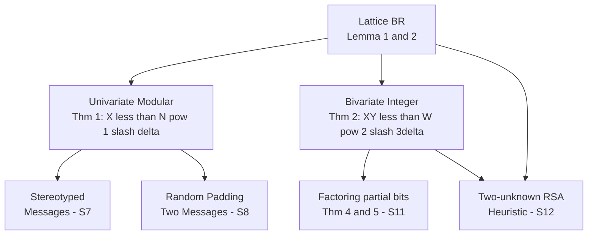

> **Prerequisites**: [[06-bivariate-integer-case|06. Bivariate Integer Case]] (Theorem 2, Lemma 2); [[07-factoring-partial-information|07. Factoring with Partial Info]] (Theorem 4, 5 — context ứng dụng)  
> 🔴 **Prerequisite references**: [LLL82] LLL algorithm  
> **Lesson type**: Deep Dive  
> **Covers**: §12 (Extension to More Variables), §13 (Conclusion and Open Problem)
>
> **Notation**:
> | Ký hiệu | Ý nghĩa | Ký hiệu trong paper |
> |---------|---------|---------------------|
> | $C_i(x,y,z)$ | Họ đa thức thu được từ LLL trên lattice nhiều biến | $C_i$ |
> | $n$ | Số biến của đa thức (§12 xét $n = 3$ và tổng quát) | $n$ |
> | $q_m$ | Tích các prime đầu tiên ($q_m = 2 \cdot 3 \cdots p_m$) | $n$ (paper dùng $n$, ta đổi để tránh nhầm) |
> | $3t$ | Tham số bậc trong ví dụ RSA-e3 bivariate modular ở §12 | $3t$ |

---

## 1. Tổng quan §12: Giới hạn của phương pháp

§12 giải quyết câu hỏi: **Phương pháp Coppersmith mở rộng được đến bao nhiêu biến?**

Câu trả lời là: mở rộng được nhưng **không có đảm bảo** — chỉ là heuristic có thể thất bại.

---

## 2. Chiến lược mở rộng — Heuristic

### 2.1 Ý tưởng cho ba biến

Xét $p(x, y, z) = 0$ trên $\mathbb{Z}$ (hoặc $p(x,y) \equiv 0 \pmod{N}$).

Nếu ranges $X, Y, Z$ đủ nhỏ, LLL trên lattice xây từ $q_{ijk} = x^i y^j z^k p$ sẽ cho ra **nhiều hơn một** bất đẳng thức ngắn. Từ Lemma 2 (Lesson 01), nếu đủ nhiều $\mathbf{b}_i^*$ vượt ngưỡng $\lvert\mathbf{s}\rvert$, ta có thể confine $\mathbf{s}$ vào không gian con codimension lớn hơn 1 — sinh ra nhiều đa thức $C_i(x,y,z) = 0$.

> [!note] Scheme 8.1 — Multi-Variable Heuristic
> **Type**: Heuristic Extension (không có đảm bảo)  
> **Setting**: $p(x,y,z)$ ba biến, ranges $X, Y, Z$
>
> **$\mathsf{MultiVarAttack}(p,\, X,\, Y,\, Z)$** *(heuristic)*
> - Input: $p(x,y,z)$, bounds $X, Y, Z$
> - **Bước 1**: Xây lattice từ $q_{ijk} = x^i y^j z^k p$ → LLL reduce
> - **Bước 2**: Xác định codimension $c$ của không gian chứa mọi vector ngắn → thu được $c$ đa thức $C_1, \ldots, C_c$ thỏa $C_\ell(x_0,y_0,z_0) = 0$
> - **Bước 3**: Tính resultant và gcd của các $C_\ell$ và $p$ → cố gắng rút về đa thức một biến $r(x) = 0$
> - **Bước 4**: Giải $r(x) = 0$ → các ứng viên $x_0$ → substitution ngược
> - Output: $(x_0, y_0, z_0)$ nếu heuristic thành công; **không có đảm bảo**

### 2.2 Hai trở ngại chính

> [!warning] Trở ngại 1 — Không đủ phương trình
> Codimension của không gian vector ngắn có thể nhỏ hơn số biến cần khử. Ta cần ít nhất $n-1$ phương trình độc lập để khử $n-1$ biến qua resultant — không đảm bảo có được số đó.

> [!warning] Trở ngại 2 — Phương trình phụ thuộc tuyến tính
> Các $C_i$ thu được có thể phụ thuộc: ví dụ $C_1(x,y,z) = x \cdot C_2(x,y,z)$. Trong trường hợp này resultant không cho thông tin mới.

---

## 3. Counterexample — Thuật toán phải thất bại

§12 trình bày một ví dụ cụ thể (từ Manders-Adleman [MA78]) chứng minh rằng không thể có đảm bảo tổng quát:

> [!info] 🟡 Manders-Adleman Counterexample (từ [MA78])
> Đặt $q_m = p_1 p_2 \cdots p_m$ là tích $m$ số nguyên tố lẻ đầu tiên. Khi đó $\log q_m \approx m \log m$.  
> Phương trình $x^2 \equiv 1 \pmod{q_m}$ có $2^m$ nghiệm (mỗi prime cho 2 nghiệm, CRT ghép lại).  
> Với $N = q_m^h$ ($h$ đủ lớn), xét:
>
> $$
> p(x,y) = x^2 - yn - 1 \equiv 0 \pmod{N}, \quad \lvert x\rvert < q_m = X, \quad \lvert y\rvert < q_m = Y
> $$
>
> Có **ít nhất $2^{m+1}$ cặp** $(x_0, y_0)$ thỏa điều kiện. Không thể liệt kê tất cả trong thời gian polynomial theo $\log N$ vì số nghiệm là exponential.  
> Nhưng với $h > 2/\varepsilon$, điều kiện $XY < N^\varepsilon$ của Theorem 1 được thỏa với $N = q_m^h$.
>
> *(Adapted từ [MA78]: Manders, Adleman — NP-complete decision problems for binary quadratics, 1978)*

**Hệ quả**: Không có thuật toán polynomial nào **đảm bảo** tìm tất cả nghiệm trong trường hợp hai biến modulo $N$ tổng quát — số nghiệm có thể exponential.

**Điều thuật toán Coppersmith sẽ làm** với input này: trả về phương trình $p(x,y) = x^2 - yn - 1 = 0$ (chuyển từ modular về integer) nhưng sau đó không thể tiếp tục nếu giữ $X = q_m$, vì điều kiện $XY < W^c$ không còn thỏa với bounds cần thiết. Nếu giảm $X$ xuống $q_m^{1/2}$, có thể proceed nhưng khi đó số nghiệm không còn exponential.

---

## 4. Ứng dụng: RSA-e3 với Hai Ẩn (§7 mở rộng)

§12 quay lại ví dụ từ §7 — message có hai phần ẩn:

$$
m = B + 2^k x + y, \quad c = m^3 \bmod N
$$

với $x = \texttt{"swordfish"}$ và $y = \texttt{"joe"}$ đều chưa biết.

Đây là đa thức bậc 3 hai biến **modulo** $N$ (không phải trên $\mathbb{Z}$). Paper phát triển construction riêng:

> [!note] Scheme 8.2 — RSA-e3 Two-Unknown Recovery (§12)
> **Type**: Bivariate Modular Attack (heuristic, §12)  
> **Setting**: $p(x,y) = c - (B + 2^k x + y)^3 \equiv 0 \pmod{N}$; tổng bậc $= 3$
>
> **$\mathsf{TwoUnknownRSA}(N,\, B,\, k,\, c,\, t)$**
> - Input: $N, B, k, c$ và tham số bậc $3t$
> - Xây monomials $x^g y^h$ với $g + h < 3t$ (tam giác, $(3t+1)(3t)/2$ monomials)
> - Xây đa thức $q_{ijk}(x,y) = x^i y^j p(x,y)^k \equiv 0 \pmod{N^k}$ với $j \leq 2$, $k \geq 1$, $i+j+3k < 3t$
> - LLL trên lattice → thu được $C(x,y) = 0$
> - Điều kiện thành công: $(XY)^{27t^3 - 1} < N^{9t^3 - 9t^2}$, tức là $XY < N^{1/3 - \varepsilon}$ với $\varepsilon \approx 1/(3t)$

**Phân tích det** (paper §12, tóm tắt):

Lũy thừa $N$ trong det: $\binom{4}{2} + \binom{7}{2} + \cdots + \binom{3t-2}{2} = \frac{3t^2(t-1)}{2}$

Lũy thừa $1/X$ (và $1/Y$): $\binom{1}{2} + \binom{2}{2} + \cdots + \binom{3t}{2} = \binom{3t+1}{3} = \frac{27t^3 - 1}{6}$

Yêu cầu: $(XY)^{(27t^3-1)/6} < N^{3t^2(t-1)/2}$ → $(XY) < N^{1/3 - \varepsilon}$

### 4.1 Thực nghiệm của Coppersmith

Paper ghi lại một thực nghiệm thu nhỏ (scaled-down):

> [!example] Thực nghiệm: bài toán bậc 2, $N \approx 2^{150}$
> Thay $p = (B_0 + 2^k x + y)^2 - c \pmod{N}$ với $N \approx 2^{150}$, $\lvert x_0 \rvert, \lvert y_0 \rvert \leq 2^{23}$.  
> Dùng monomials tổng bậc $\leq 5$ → 21 monomials, 10 phương trình, ma trận $21 \times 21$.  
> Điều kiện $(XY)^{35} < N^{13}$ thỏa: $2^{1610} < 2^{1950}$.  
>
> Kết quả LLL: mọi $\lvert\mathbf{b}_i^*\rvert \approx 10^{41} > \lvert\mathbf{s}\rvert \approx 10^{38}$ với $i \geq 2$ → $\mathbf{s}$ bị confine vào không gian 1 chiều → đọc được trực tiếp nghiệm!  
>
> **Chi phí thực tế**: LLL mất **45 giờ** trên ma trận $21 \times 21$. Paper thừa nhận cần thuật toán LLL tối ưu hơn.

---

## 5. §13 — Kết luận và Open Problem

### 5.1 Tóm tắt đóng góp

Paper Coppersmith 1997 đã:

1. **Giải hoàn toàn** bài toán univariate modular với đảm bảo: tìm mọi $x_0 < N^{1/\delta}$ (Theorem 1)
2. **Giải bivariate integer** với cận $XY < W^{2/(3\delta)}$ (Theorem 2) và cải thiện cho total degree (Theorem 3)
3. **Cải thiện factoring** với partial bits từ $1/3$ xuống $1/4 \log_2 N$ (Theorems 4, 5)
4. **Đưa ra đảm bảo** thay vì heuristic — đây là đổi mới kỹ thuật quan trọng

### 5.2 Open Problem

> [!question] Open Problem — Coppersmith 1997
> **Cận $X < N^{1/\delta}$ có phải là optimal không?**
>
> Tức là: liệu có thể tìm nghiệm nguyên $x_0$ của $p(x) \equiv 0 \pmod{N}$ với $x_0 > N^{1/\delta}$ trong polynomial time không?
>
> Tương tự cho bivariate: cận $XY < W^{2/(3\delta)}$ có optimal không?

Tính đến 1997, chưa ai chứng minh cận này tight hoặc cải thiện được. Paper conjecture $N^{1/\delta}$ là optimal cho univariate và $\frac{1}{4}\log_2 N$ là optimal cho factoring.

> [!tip] 💡 Agent note
> Từ sau 1997, nhiều công trình mở rộng phương pháp Coppersmith: Howgrave-Graham (1997) reformulation sạch hơn; Boneh-Durfee (1999) weak RSA private exponent; Blömer-May (2005) thêm equations; và nhiều ứng dụng ZK/lattice-based crypto hiện đại. Tuy nhiên cận $N^{1/\delta}$ vẫn chưa bị cải thiện về mặt asymptotic cho univariate.

---

## 6. Bức tranh tổng kết — Coverage Map

---

## Summary

- **§12**: Mở rộng $\geq 3$ biến là heuristic — không có đảm bảo tổng quát. Hai trở ngại: thiếu phương trình và phụ thuộc tuyến tính.
- **Counterexample** (Manders-Adleman [MA78]): $x^2 \equiv 1 \pmod{q_m}$ có $2^m$ nghiệm → không thể liệt kê trong poly time → không có đảm bảo tổng quát.
- **RSA-e3 hai ẩn** (§12): $XY < N^{1/3-\varepsilon}$ → tìm được (heuristic). Thực nghiệm 21×21 matrix mất 45 giờ.
- **§13**: Cận $N^{1/\delta}$ (univariate) và $\frac{1}{4}\log_2 N$ (factoring) conjectured optimal; signatures an toàn; OAEP là biện pháp đề xuất.

---

## References

- [Cop97] Coppersmith — *Small Solutions to Polynomial Equations*, §12–§13
- [MA78] Manders, Adleman — *NP-complete decision problems for binary quadratics*, J. Comput. System Sci. 16, 1978 (🟡 Integrated)
- [LLL82] Lenstra, Lenstra, Lovász — *Factoring polynomials with rational coefficients*, 1982 (🔴 Prerequisite)
