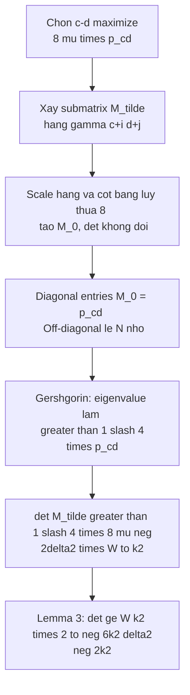

> **Prerequisites**: [[06-bivariate-integer-case|06. Bivariate Integer Case]] (statement Lemma 3, cấu trúc $M_4$)  
> 🔴 **Prerequisite references**: Gershgorin circle theorem (đại số tuyến tính); [LLL82]  
> **Lesson type**: Math Component (Appendix — proof kỹ thuật)  
> **Covers**: Appendix 2 (proof đầy đủ của Lemma 3)
>
> **Notation**:
> | Ký hiệu | Ý nghĩa | Ký hiệu trong paper |
> |---------|---------|---------------------|
> | $\tilde{p}(x,y)$ | Scaled polynomial $p(xX, yY)$ | $\tilde{p}$ |
> | $\tilde{p}_{ab}$ | Hệ số của $x^a y^b$ trong $\tilde{p}$ | $\tilde{p}_{ab}$ |
> | $W$ | $\max_{a,b}\lvert\tilde{p}_{ab}\rvert$ | $W$ |
> | $(a,b)$ | Chỉ số của $W$: $W = \lvert\tilde{p}_{ab}\rvert$ | $(a,b)$ |
> | $(c,d)$ | Chỉ số được chọn để maximize $8^{(c-a)^2+(d-b)^2}\lvert\tilde{p}_{cd}\rvert$ | $(c,d)$ |
> | $\mu(i,j)$ | Index function: $\mu(i,j) = ki + j$ | $\mu(i,j)$ |
> | $\tilde{M}$ | Submatrix $k^2 \times k^2$ với hàng $\gamma(c+i, d+j)$ | $\tilde{M}$ |
> | $M_0$ | $\tilde{M}$ sau khi scale hàng và cột | $M_0$ |

---

## Bối cảnh và Mục tiêu

Trong §10 (Lesson 06), ta xây ma trận $M_4 = \Lambda_1 M_1 \Lambda_2$ (với $\Lambda_i$ là diagonal scaling matrices). Block phải của $M_4$ là Toeplitz matrix: các cột là shifted versions của vector hệ số của $\tilde{p}(x,y)$.

Lemma 3 cần thiết để bound $\det(\hat{M})$ từ dưới, đảm bảo điều kiện Lemma 1 áp dụng được. Cụ thể cần tìm $k^2 \times k^2$ submatrix của block Toeplitz có $\det$ đủ lớn.

> [!abstract] Lemma 3 — Nearly Orthogonal Toeplitz Columns (phát biểu đầy đủ)
> Tồn tại $k^2 \times k^2$ submatrix của block phải của $M_4$ có
>
> $$
> \lvert\det\rvert \geq W^{k^2} \cdot 2^{-6k^2\delta^2 - 2k^2}
> $$
>
> Nếu $W = \lvert\tilde{p}_{ab}\rvert$ với $(a,b)$ là **corner của Newton polygon** — tức $(a,b) \in \{(0,0), (0,\delta), (\delta,0), (\delta,\delta)\}$ — thì:
>
> $$
> \lvert\det\rvert \geq W^{k^2}
> $$

---

## Proof của Lemma 3

### Bước 1 — Chọn chỉ số $(c,d)$

Chọn $(c,d)$ để **maximize** lượng:

$$
f(c,d) = 8^{(c-a)^2 + (d-b)^2} \lvert\tilde{p}_{cd}\rvert
$$

Từ định nghĩa $W = \lvert\tilde{p}_{ab}\rvert$ là maximum coefficient, với mọi $(g,h)$:

$$
8^{(g-a)^2+(h-b)^2} \lvert\tilde{p}_{gh}\rvert \leq 8^{(c-a)^2+(d-b)^2} \lvert\tilde{p}_{cd}\rvert
$$

Đây là điều kiện maximality được dùng trong Bước 3.

### Bước 2 — Chọn submatrix $\tilde{M}$

Chọn các hàng $\gamma(c+i, d+j)$ với $0 \leq i, j < k$ — tức là $k^2$ hàng tạo thành lưới $k \times k$ xung quanh $(c,d)$.

Dùng index function $\mu(i,j) = ki + j$ để đánh chỉ số $0, 1, \ldots, k^2-1$. Phần tử của $\tilde{M}$:

$$
\tilde{M}_{\mu(g,h),\, \mu(i,j)} = \tilde{p}_{g-i+c,\, h-j+d}
$$

(hệ số của $x^{c+g} y^{d+h}$ trong $x^i y^j \tilde{p}(x,y)$, tức là hệ số của $x^{g-i+c} y^{h-j+d}$ trong $\tilde{p}$).

### Bước 3 — Xây $M_0$ từ $\tilde{M}$ (scaling để diagonal dominant)

Scale:
- **Hàng** $\mu(g,h)$ của $\tilde{M}$ nhân với $8^{2(c-a)g + 2(d-b)h}$
- **Cột** $\mu(i,j)$ nhân với $8^{-2(c-a)i - 2(d-b)j}$

Phép scaling này **không thay đổi determinant** (row/column scaling có định thức tương ứng, và hai phép triệt tiêu nhau theo từng cặp hàng-cột).

Phần tử của $M_0$:

$$
(M_0)_{\mu(g,h),\, \mu(i,j)} = \tilde{p}_{g-i+c,\, h-j+d} \cdot 8^{2(c-a)(g-i) + 2(d-b)(h-j)}
$$

**Diagonal entries** ($g=i$, $h=j$): $(M_0)_{\mu(i,i),\mu(i,i)} = \tilde{p}_{cd}$ — hằng số.

**Off-diagonal entries** ($g \neq i$ hoặc $h \neq j$):

$$
\bigl\lvert(M_0)_{\mu(g,h),\mu(i,j)}\bigr\rvert = \lvert\tilde{p}_{g-i+c,\,h-j+d}\rvert \cdot 8^{2(c-a)(g-i)+2(d-b)(h-j)}
$$

### Bước 4 — Bound các off-diagonal entries

Từ maximality của $(c,d)$ (Bước 1): với mọi $(g-i+c, h-j+d)$:

$$
8^{(g-i+c-a)^2+(h-j+d-b)^2} \lvert\tilde{p}_{g-i+c,h-j+d}\rvert \leq 8^{(c-a)^2+(d-b)^2}\lvert\tilde{p}_{cd}\rvert
$$

Viết $u = g-i$, $v = h-j$ (không đều bằng 0 với off-diagonal). Bất đẳng thức trên biến đổi thành:

$$
\lvert\tilde{p}_{u+c,v+d}\rvert \cdot 8^{(u+c-a)^2+(v+d-b)^2} \leq \lvert\tilde{p}_{cd}\rvert \cdot 8^{(c-a)^2+(d-b)^2}
$$

Mở ngoặc $(u+c-a)^2 = u^2 + 2u(c-a) + (c-a)^2$:

$$
\lvert\tilde{p}_{u+c,v+d}\rvert \cdot 8^{2u(c-a)+2v(d-b)} \leq \lvert\tilde{p}_{cd}\rvert \cdot 8^{-u^2-v^2}
$$

Do đó:

$$
\bigl\lvert(M_0)_{\mu(g,h),\mu(i,j)}\bigr\rvert \leq \lvert\tilde{p}_{cd}\rvert \cdot 8^{-u^2-v^2} = \lvert\tilde{p}_{cd}\rvert \cdot 8^{-(g-i)^2-(h-j)^2}
$$

### Bước 5 — Diagonal dominance

Tổng **absolute value của off-diagonal entries** trong hàng $\mu(i,j)$ của $M_0$:

$$
\sum_{(g,h) \neq (i,j)} \bigl\lvert(M_0)_{\mu(g,h),\mu(i,j)}\bigr\rvert \leq \lvert\tilde{p}_{cd}\rvert \sum_{(u,v) \neq (0,0)} 8^{-u^2-v^2}
$$

Tính sum (tách thành tích hai sum 1D):

$$
\sum_{(u,v) \neq (0,0)} 8^{-u^2-v^2} = \left(\sum_{u \in \mathbb{Z}} 8^{-u^2}\right)^2 - 1
$$

Ước tính $\sum_{u \in \mathbb{Z}} 8^{-u^2}$: hạng $u=0$ là $1$; các hạng $\lvert u\rvert \geq 1$ tổng $\leq 2\sum_{u=1}^\infty 8^{-u^2} \leq 2\sum_{u=1}^\infty 8^{-u} = \frac{2}{7} < 0.29$. Do đó:

$$
\sum_{u \in \mathbb{Z}} 8^{-u^2} < 1.29
$$

$$
\left(\sum_{u \in \mathbb{Z}} 8^{-u^2}\right)^2 - 1 < 1.29^2 - 1 = 1.664 - 1 = 0.664 < \frac{3}{4}
$$

Vậy:

$$
\sum_{(g,h) \neq (i,j)} \bigl\lvert(M_0)_{\mu(g,h),\mu(i,j)}\bigr\rvert < \frac{3}{4} \lvert\tilde{p}_{cd}\rvert
$$

$M_0$ là **strictly diagonally dominant** (tổng off-diagonal $< $ diagonal $= \lvert\tilde{p}_{cd}\rvert$).

### Bước 6 — Bound eigenvalues bằng Gershgorin

**Gershgorin Circle Theorem**: mọi eigenvalue $\lambda$ của $M_0$ nằm trong ít nhất một đĩa Gershgorin:

$$
\lvert\lambda - \tilde{p}_{cd}\rvert \leq \sum_{(g,h)\neq(i,j)} \bigl\lvert(M_0)_{\mu(g,h),\mu(i,j)}\bigr\rvert < \frac{3}{4}\lvert\tilde{p}_{cd}\rvert
$$

Do đó $\lvert\lambda\rvert > \lvert\tilde{p}_{cd}\rvert - \frac{3}{4}\lvert\tilde{p}_{cd}\rvert = \frac{1}{4}\lvert\tilde{p}_{cd}\rvert$.

### Bước 7 — Bound determinant

$$
\lvert\det(M_0)\rvert = \prod_{\text{eigenvalues } \lambda} \lvert\lambda\rvert > \left(\frac{1}{4}\lvert\tilde{p}_{cd}\rvert\right)^{k^2}
$$

Từ maximality của $(c,d)$ và $W = \lvert\tilde{p}_{ab}\rvert$:

$$
8^{(c-a)^2+(d-b)^2} \lvert\tilde{p}_{cd}\rvert \geq 8^0 \lvert\tilde{p}_{ab}\rvert = W
$$

Với $(c,d) \neq (a,b)$: $(c-a)^2+(d-b)^2 \geq 1$, nên $\lvert\tilde{p}_{cd}\rvert$ có thể nhỏ hơn $W$. Worst case: $(c-a)^2+(d-b)^2$ tối đa là $(2\delta)^2 + (2\delta)^2 = 8\delta^2$ (vì $0 \leq c, a \leq \delta$ và $0 \leq d, b \leq \delta$):

$$
\lvert\tilde{p}_{cd}\rvert \geq 8^{-(c-a)^2-(d-b)^2} W \geq 8^{-2\delta^2} W
$$

Vậy:

$$
\lvert\det(M_0)\rvert > \left(\frac{1}{4} \cdot 8^{-2\delta^2} W\right)^{k^2} = W^{k^2} \cdot \left(\frac{1}{4}\right)^{k^2} \cdot 8^{-2k^2\delta^2}
$$

$$
= W^{k^2} \cdot 2^{-2k^2} \cdot 2^{-6k^2\delta^2} = W^{k^2} \cdot 2^{-6k^2\delta^2 - 2k^2}
$$

Vì $\det(M_0) = \det(\tilde{M})$ (scaling không thay đổi det), ta có $\lvert\det(\tilde{M})\rvert \geq W^{k^2} \cdot 2^{-6k^2\delta^2-2k^2}$. $\blacksquare$

---

## Trường hợp đặc biệt: Corner của Newton polygon

Nếu $W = \lvert\tilde{p}_{ab}\rvert$ với $(a,b)$ là corner — ví dụ $(a,b) = (0,0)$:

Chọn index function $\mu(i,j) = ki + j$ và hàng $\gamma(i,j)$ với $0 \leq i,j < k$. Phần tử $\tilde{M}_{\mu(g,h),\mu(i,j)} = \tilde{p}_{g-i,h-j}$.

Với $(a,b) = (0,0)$: $\tilde{p}_{g-i,h-j} = 0$ nếu $g < i$ hoặc $h < j$ (không có hạng bậc âm). Do đó $\tilde{M}$ là **tam giác** (upper triangular với ordering lexicographic trên $\mu$), diagonal entries = $\tilde{p}_{00} = W$.

$$
\lvert\det(\tilde{M})\rvert = W^{k^2}
$$

Tương tự với $(a,b) = (\delta,\delta)$: đảo thứ tự index cho tam giác ngược; với $(a,b) = (0,\delta)$ hoặc $(\delta,0)$: dùng $\mu(i,j) = ki + (k-1-j)$ hoặc $\mu(i,j) = k(k-1-i)+j$.

---

## Tóm tắt Proof

---

## References

- [Cop97] Coppersmith — *Small Solutions to Polynomial Equations*, Appendix 2
- [LLL82] Lenstra, Lenstra, Lovász — *Factoring polynomials with rational coefficients*, 1982 (🔴 Prerequisite)
