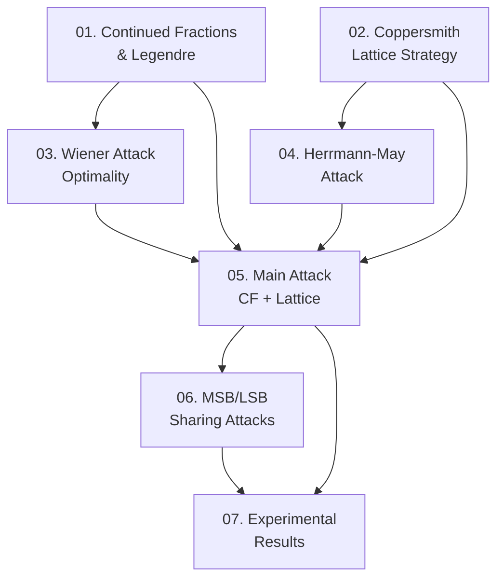

Paper này trình bày một tấn công mới vào RSA với private exponent nhỏ bằng cách kết hợp phân số liên tục (continued fractions) và kỹ thuật lattice của Coppersmith, đạt bound $d < N^{1-\alpha/3-\gamma/2}$ vượt trội Herrmann–May trong phần lớn các bộ tham số thực tế. Series này cover toàn bộ nội dung paper: nền tảng toán học, các attack cũ, main attack mới, ứng dụng, và thực nghiệm.

**Tài liệu gốc**: Improving RSA Cryptanalysis — ACISP 2025 (full version)  
**Kiến thức nền tảng yêu cầu** (🔴 Prerequisites): RSA cơ bản ($ed \equiv 1 \pmod{\varphi(N)}$), LLL algorithm & lattice reduction [LLL82], Coppersmith's method [Cop97], số học mô-đun cơ bản

---

## Lesson Overview

| # | Title | Type | Covers (sections) | File | Dependencies |
|---|-------|------|-------------------|------|-------------|
| 01 | Continued Fractions & Legendre's Theorem trong RSA | Math Component | §2.1, §3.1 (Lemmas 6, Theorems 2–3) | [[01-continued-fractions-rsa\|01. Continued Fractions & Legendre]] | — |
| 02 | Coppersmith's Lattice Strategy & Howgrave-Graham | Math Component | §2.2 (Lemmas 1–2, Assumption 1) | [[02-coppersmith-lattice-strategy\|02. Coppersmith Lattice Strategy]] | — |
| 03 | Wiener's Attack: Optimality và Giới Hạn | Attack | §3.1 (Theorems 2–4), Lemmas 3–4 | [[03-wiener-attack-optimality\|03. Wiener Attack — Optimality]] | 01 |
| 04 | Herrmann–May Attack: Lattice với Xấp Xỉ $p+q$ | Attack | §3.2 (Theorem 5) | [[04-herrmann-may-attack\|04. Herrmann–May Attack]] | 02 |
| 05 | Main Attack: Kết Hợp Continued Fractions và Lattice | Attack | §4.1 (Theorem 6), Remark 1 | [[05-main-attack-cf-lattice\|05. Main Attack — CF + Lattice]] | 01, 02, 03, 04 |
| 06 | Ứng Dụng: MSB/LSB Sharing của Primes | Attack | §4.2 (Theorems 7–8, Remark 2), Lemma 5 | [[06-msb-lsb-sharing-attacks\|06. MSB/LSB Sharing Attacks]] | 05 |
| 07 | Thực Nghiệm và Phân Tích Kết Quả | Deep Dive | §5 (Table 1, Example 1), §6 | [[07-experimental-results\|07. Experimental Results]] | 05, 06 |

**Lesson types**: Foundation · Math Component · Scheme · **Attack** · Protocol · Deep Dive · Specification · Survey

---

## Coverage Map

| Document section | Covered in lesson |
|------------------|-------------------|
| §1 Introduction | 03, 04 (context trong mỗi attack lesson) |
| §2.1 Continued Fractions (Theorem 1, Euler-Wallis, relation (2)) | 01 |
| §2.2 Coppersmith's Techniques (Lemmas 1–2, Assumption 1) | 02 |
| §3.1 CF-Based Attacks (Lemma 6, Theorems 2–4) | 01, 03 |
| §3.2 Lattice-Based Attacks (Lemma 3, Theorem 5) | 04 |
| §4.1 Main Attack (Theorem 6, Remark 1) | 05 |
| §4.2 MSB/LSB Applications (Lemmas 4–5, Theorems 7–8, Remark 2) | 06 |
| §5 Experimental Results (Table 1, Example 1) | 07 |
| §6 Concluding Remarks | 07 |

---

## Dependency Graph

---

## Progress

- [ ] [[01-continued-fractions-rsa\|01. Continued Fractions & Legendre]]
- [ ] [[02-coppersmith-lattice-strategy\|02. Coppersmith Lattice Strategy]]
- [ ] [[03-wiener-attack-optimality\|03. Wiener Attack — Optimality]]
- [ ] [[04-herrmann-may-attack\|04. Herrmann–May Attack]]
- [ ] [[05-main-attack-cf-lattice\|05. Main Attack — CF + Lattice]]
- [ ] [[06-msb-lsb-sharing-attacks\|06. MSB/LSB Sharing Attacks]]
- [ ] [[07-experimental-results\|07. Experimental Results]]

---

## 🟡 Integrated References

| Ref Key | Used in lesson | Nội dung tích hợp |
|---------|---------------|-------------------|
| [Legendre 1798] | 01 | Theorem 1 — điều kiện $\|{\xi - a/b}\| < 1/(2b^2)$ để $a/b$ là convergent |
| [Nitaj et al. 2014] | 01, 03, 04, 06 | Lemmas 3, 4, 5 — bounds trên $\varphi(N)$, $p+q$, cấu trúc LSB |
| [de Weger 2002] | 03, 06 | Lemma 4 — xấp xỉ $p+q \approx 2\sqrt{N}$ khi MSBs shared |
| [Wiener 1990] | 03 | Original Wiener attack — $d < \frac{1}{3}N^{1/4}$ |
| [Howgrave-Graham 1997] | 02, 04, 05 | Lemma 2 — nâng nghiệm mô-đun lên nghiệm nguyên |
| [Herrmann & May 2010] | 04 | Theorem 5 — bound $\delta_0 < 1 - \sqrt{\alpha\gamma}$, cấu trúc lattice |
| [Jochemsz & May 2006] | 05 | Lattice construction strategy dùng trong proof Theorem 6 |
| [Sun et al. 2008] | 06 | Bound cũ cho LSB sharing — so sánh trực tiếp với Theorem 8 |

---

## Notes

- **Thứ tự học**: Lessons 01 và 02 độc lập nhau — có thể học song song. Lesson 03 cần 01; Lesson 04 cần 02. Lesson 05 là trung tâm — cần cả 4 lessons trước.
- **Lesson 05 là nặng nhất** về kỹ thuật: proof Theorem 6 có ~5 bước phân tích (polynomial construction → lattice determinant → LLL condition → optimize τ → extract bound). Đọc kỹ §2.2 trước.
- **Lesson 07** bao gồm SageMath workflow từ Example 1 — hữu ích để hiểu gap thực nghiệm vs lý thuyết ($\delta \approx 0.07$ thực tế so với $\delta < 0.21$ lý thuyết).
- **Remark 2** (Lesson 06) là một quan sát thú vị về tính nhất quán giữa Theorems 7 và 8 — không nên bỏ qua.
