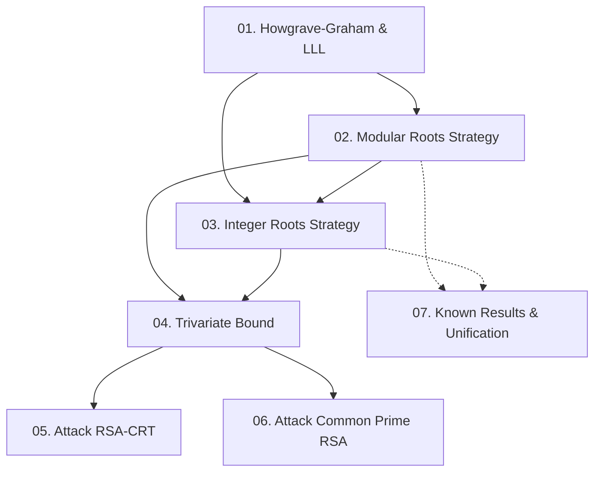

Paper đề xuất một chiến lược heuristic tổng quát để tìm nghiệm nhỏ của đa thức nhiều biến bằng kỹ thuật lattice của Coppersmith, sau đó áp dụng vào hai tấn công mới trên biến thể RSA. Course này cover toàn bộ nội dung paper từ nền tảng lý thuyết đến proof thực nghiệm.

**Tài liệu gốc**: Jochemsz & May — ASIACRYPT 2006, LNCS 4284, pp. 267–282  
**Kiến thức nền tảng yêu cầu** (🔴 Prerequisite):
- Coppersmith's method cho univariate modular equations [4, 5]
- LLL lattice basis reduction algorithm [13]
- Wiener attack on short RSA exponents [19]
- RSA-CRT decryption (Chinese Remainder Theorem)

---

## Lesson Overview

| # | Title | Type | Covers (sections) | File | Dependencies |
|---|-------|------|-------------------|------|-------------|
| 01 | Howgrave-Graham & LLL: Công cụ nền | math-component | §1 (intro), §2 (opening), Lemma 1, Fact 1 | [[01-howgrave-graham-lll\|01. Howgrave-Graham & LLL]] | — |
| 02 | Chiến lược tìm nghiệm Modular nhỏ | math-component | §2.1 Basic + Extended Strategy | [[02-modular-roots-strategy\|02. Modular Roots Strategy]] | 01 |
| 03 | Chiến lược tìm nghiệm Nguyên nhỏ | math-component | §2.2 Basic + Extended Strategy | [[03-integer-roots-strategy\|03. Integer Roots Strategy]] | 01, 02 |
| 04 | Bound cho đa thức ba biến | deep-dive | §3 (full bound derivation) | [[04-trivariate-bound\|04. Trivariate Bound]] | 02, 03 |
| 05 | Tấn công RSA-CRT với Known Difference | attack | §4.1, §4.2, experiments | [[05-attack-rsa-crt\|05. Attack RSA-CRT]] | 04 |
| 06 | Tấn công Common Prime RSA | attack | §5.1, §5.2, experiments | [[06-attack-common-prime-rsa\|06. Attack Common Prime RSA]] | 04 |
| 07 | Các kết quả đã biết như Special Cases | survey | Appendix A, Appendix B | [[07-known-results-unification\|07. Known Results & Unification]] | 02, 03 |

**Lesson types**: Foundation · Math Component · Scheme · Attack · Protocol · Deep Dive · Specification · Survey

---

## Coverage Map

| Document section | Covered in lesson |
|------------------|-------------------|
| §1 Introduction | 01 |
| §2 Finding Small Roots (opening) | 01 |
| §2.1 Basic Strategy (modular) | 02 |
| §2.1 Extended Strategy (modular) | 02 |
| §2.2 Basic Strategy (integer) | 03 |
| §2.2 Extended Strategy (integer) | 03 |
| §3 Bound for trivariate polynomial | 04 |
| §4.1 RSA-CRT with known difference | 05 |
| §4.2 New Attack description + experiments | 05 |
| §5.1 Common Prime RSA | 06 |
| §5.2 New Attack description + experiments | 06 |
| Appendix A Small Modular Roots, Known Results | 07 |
| Appendix B Small Integer Roots, Known Results | 07 |

---

## Dependency Graph

---

## Progress

- [ ] [[01-howgrave-graham-lll\|01. Howgrave-Graham & LLL: Công cụ nền]]
- [ ] [[02-modular-roots-strategy\|02. Chiến lược tìm nghiệm Modular nhỏ]]
- [ ] [[03-integer-roots-strategy\|03. Chiến lược tìm nghiệm Nguyên nhỏ]]
- [ ] [[04-trivariate-bound\|04. Bound cho đa thức ba biến]]
- [ ] [[05-attack-rsa-crt\|05. Tấn công RSA-CRT với Known Difference]]
- [ ] [[06-attack-common-prime-rsa\|06. Tấn công Common Prime RSA]]
- [ ] [[07-known-results-unification\|07. Các kết quả đã biết như Special Cases]]

---

## 🟡 Integrated References

| Ref Key | Authors (short) | Used in lesson | Nội dung tích hợp |
|---------|-----------------|----------------|-------------------|
| [1] Boneh-Durfee 2000 | Cryptanalysis RSA d < N^0.292 | 01, 02, 07 | Bound Y²⁺³τZ¹⁺³τ⁺³τ² < e¹⁺³τ; extended strategy Mₖ definition |
| [2] Blömer-May 2003 | Partial Key Exposure | 07 | Bound là special case của §2.1 extended strategy |
| [3] Blömer-May 2005 | Tool Kit Bivariate over Integers | 03, 07 | §2.2 là extension trực tiếp; upper/extended rectangle bounds |
| [6] Coppersmith 1997 | Small Solutions, Low Exponent | 07 | Generalized Rectangle + Lower Triangle bounds |
| [7] Coron 2004 | Small Roots Bivariate Revisited | 03 | Reformulation integer root via modulo R; f' = a₀⁻¹f mod R |
| [9] Hinek 2006 | Another Look at Small RSA Exponents | 06 | Common Prime RSA parameter analysis; previous bound δ < 2γ/5 |
| [10] Hinek-Stinson 2006 | Inequality Multivariate Polynomials | 03 | Corollary 5: norm lower bound cho multiples của f |
| [11] Howgrave-Graham 1997 | Small Roots of Univariate Modular | 01 | Lemma 1 lấy nguyên văn từ paper này |
| [17] Qiao-Lam 2000 | RSA Signature for Microcontroller | 05 | Sơ đồ RSA-CRT bị tấn công; tham số dp, dq = 128/96 bit |

---

## Notes

- **Thứ tự học khuyến nghị**: 01 → 02 → 03 → 04 → 05 → 06 → 07.
- Lesson 07 (Appendix A+B) có thể đọc sau lesson 02/03 nếu muốn xem unification ngay — nhưng hiểu §4, §5 trước sẽ giúp đánh giá ý nghĩa của unification tốt hơn.
- §2.1 và §2.2 có cấu trúc mirror nhau (Basic → Extended) — nên đọc cạnh nhau để so sánh.
- Kỹ thuật đếm lattice dimension trong §3 là phần kỹ thuật nặng nhất; lesson 04 sẽ trace từng bước counting để đảm bảo tái hiện được bound.
- Experiments trong §4 và §5 được tích hợp vào attack lessons tương ứng, không có lesson riêng.
